# Documento de Diseño - Keiko DApp

## Visión General

Keiko es una red social educativa descentralizada (DApp) construida como un monorepo que integra un backend desarrollado en Rust con contratos inteligentes en Cairo sobre Starknet y un frontend multiplataforma desarrollado en Flutter. Su propósito es convertir el aprendizaje en capital humano verificable e interoperable en tiempo real mediante Proof-of-Humanity con zkProofs. La plataforma permite a cualquier individuo construir y demostrar su Pasaporte de Aprendizaje de Vida (LifeLearningPassport) en blockchain, mediante interacciones de aprendizaje atómicas (LearningInteractions) compatibles con el estándar xAPI (Tin Can).

Keiko se basa en cuatro pilares fundamentales:

1. **Libertad económica de tutores y mentores**: Los educadores pueden escoger monetizar sesiones individuales o grupales sin intermediarios.
2. **Democracia participativa de los educandos**: Los aprendices califican la calidad del conocimiento adquirido y de sus pares.
3. **Descentralización de la gestión de calidad**: Las comunidades regulan sus propios estándares y métodos de validación.
4. **Auto-determinación de las comunidades**: Cada red o nodo puede establecer su propia gobernanza educativa.

### Arquitectura de Cinco Capas

La arquitectura del proyecto se organiza en cinco capas principales con estructura de carpetas correspondiente:

- **Keikochain Layer** (`appchain/`): Contratos Cairo en Keikochain (Starknet Appchain) para almacenamiento inmutable y consenso
- **gRPC Gateway Layer** (`grpc-gateway/`): Traductor Rust ↔ Cairo que comunica el backend modular con Keikochain (Starknet Appchain)
- **Backend Layer** (`backend/`): Aplicación monolítica modular en Rust con cache PostgreSQL local, y eventos Redis Streams
- **API Layer** (`api-gateway/`): API Gateway GraphQL que traduce queries del frontend a llamadas HTTP/REST y orquesta respuestas, con comunicación WSS para GraphQL subscriptions
- **Frontend Layer** (`frontend/`): Aplicación Flutter multiplataforma que se comunica exclusivamente via GraphQL

### Flujo de Datos Híbrido

- **Escritura**: Flutter → GraphQL (HTTPS) → HTTP/REST → Backend → gRPC Gateway → Keikochain Contract → Evento Redis → GraphQL Subscription (WSS)
- **Lectura**: Flutter → GraphQL (HTTPS) → HTTP/REST → Backend → Cache/DB local → (fallback) gRPC Gateway → Keikochain Contract
- **Tiempo Real**: Keikochain Contract → gRPC Gateway → Backend → Redis Streams → API Gateway → GraphQL Subscription (WSS) → Flutter
- **Autenticación**: Flutter → FIDO2 → JWT → WSS Headers → API Gateway → HTTP Headers → Backend
- **Importación**: LRS Externos → REST Webhooks → API Gateway → HTTP/REST → Backend → gRPC Gateway → Keikochain Contract

### Principios de Diseño

1. **Atomicidad**: Cada interacción de aprendizaje es una unidad indivisible y verificable
2. **Interoperabilidad**: Compatibilidad total con estándares xAPI y ecosistemas educativos existentes
3. **Descentralización**: Datos inmutables en blockchain con control de privacidad del usuario
4. **Escalabilidad**: Arquitectura modular que soporta crecimiento orgánico y permite extracción gradual a microservicios
5. **Experiencia de Usuario**: Interfaz intuitiva que abstrae la complejidad blockchain
6. **Resiliencia**: Tolerancia a fallos con aislamiento de servicios y recuperación automática
7. **Observabilidad**: Monitoreo completo con métricas, logs y trazas distribuidas
8. **Automatización**: CI/CD completamente automatizado con GitOps

## Arquitectura

### Evolución Arquitectónica: Monolito → Backend Modular

La arquitectura de Keiko evoluciona desde una parachain monolítica hacia una aplicación monolítica modular:

**Fase 1 (Completada)**: Migración de Polkadot parachain a Starknet appchain (Keikochain)
**Fase 2 (Actual)**: Implementación de arquitectura híbrida de cinco capas con backend modular
**Fase 3 (Futura)**: Extracción gradual de módulos a microservicios cuando sea necesario
**Fase 4 (Opcional)**: Microservicios cloud-native completamente independientes (si se requiere escalabilidad extrema)

### Estructura del Proyecto

Siguiendo los principios de arquitectura modular y la arquitectura de cinco capas, la estructura del proyecto se organiza de manera que cada capa tenga responsabilidades claras y esté desacoplada:

```
keiko/
├── appchain/                         # 🔗 Keikochain Layer (Starknet Appchain)
│   ├── contracts/                    # Contratos Cairo autocontenidos
│   │   ├── learning_interactions/    # xAPI statements con firma Ed25519
│   │   ├── life_learning_passport/   # Pasaportes de aprendizaje
│   │   ├── reputation_system/        # Sistema de reputación con expiración
│   │   ├── governance/               # Gobernanza comunitaria
│   │   ├── marketplace/              # Espacios de aprendizaje seguros
│   │   └── proof_of_humanity/        # Verificación de humanidad con STARKs
│   ├── tests/                        # Tests de integración de contratos
│   └── config/                       # Configuración de Keikochain
├── grpc-gateway/                     # 🌉 gRPC Gateway Layer
│   ├── client/                       # Cliente Starknet RPC
│   ├── proto/                        # Definiciones gRPC (Protocol Buffers)
│   ├── server/                       # Servidor gRPC Gateway
│   ├── translator/                   # Traductor Rust ↔ Cairo
│   └── config/                       # Configuración del gateway
├── backend/                          # 🔧 Backend Layer (Aplicación Monolítica Modular)
│   ├── modules/                      # Módulos organizados por dominio
│   │   ├── identity/                 # Autenticación y usuarios (Schema separado)
│   │   ├── learning/                 # Procesamiento xAPI (Schema separado)
│   │   ├── reputation/               # Cálculo de reputación (Schema separado)
│   │   ├── passport/                 # Agregación de pasaportes (Schema separado)
│   │   ├── governance/               # Herramientas de gobernanza (Schema separado)
│   │   ├── marketplace/              # Gestión de espacios (Schema separado)
│   │   └── selfstudy_guides/         # Guías de auto-estudio evaluadas por agente IA (Schema separado)
│   ├── shared/                       # Componentes compartidos del backend
│   └── main.rs                       # Punto de entrada monolítico
├── api-gateway/                      # 🌐 API Layer (API Gateway + Panel Admin)
│   ├── graphql_server/               # Servidor GraphQL principal
│   ├── rest_endpoints/               # Endpoints REST para LRS externos
│   └── admin_panel/                  # Panel admin Leptos (SSR/CSR)
├── frontend/                         # 📱 Frontend Layer (Flutter multiplataforma)
│   └── lib/                          # Aplicación Flutter
├── shared/                           # 🔄 Componentes compartidos (Cross-cutting concerns)
│   ├── types/                        # Tipos compartidos entre servicios
│   ├── proto/                        # Definiciones gRPC compartidas
│   ├── utils/                        # Utilidades comunes
│   ├── events/                       # Definiciones de eventos de dominio
│   └── observability/                # Observabilidad compartida (Logs, Metrics, Traces)
└── docs/                             # 📚 Documentación
    ├── api/                          # Documentación de APIs
    ├── deployment/                   # Guías de despliegue
    ├── architecture/                 # Diagramas y especificaciones
    └── migration/                    # Guías de migración
```

### Principios de Arquitectura Aplicados

Esta estructura sigue los principios fundamentales de arquitectura modular:

#### **1. Twelve-Factor App**
- **Base de Código Única**: Una sola aplicación con módulos organizados por dominio
- **Dependencias Explícitas**: Todas las dependencias declaradas en `Cargo.toml` principal
- **Configuración Externa**: Configuración gestionada via `config/` y variables de entorno
- **Servicios de Respaldo**: Base de datos PostgreSQL única y Redis como recursos adjuntos
- **Procesos sin Estado**: La aplicación es stateless, estado en PostgreSQL/Redis
- **Vinculación de Puertos**: Una sola aplicación expone un puerto HTTP
- **Escalado por Concurrencia**: Escalado horizontal agregando instancias de la aplicación
- **Disponibilidad Rápida**: Aplicación diseñada para startup/shutdown rápido
- **Paridad Dev/Prod**: Misma configuración en todos los entornos
- **Logs como Flujos**: Logs a stdout/stderr para agregación
- **Procesos Admin**: Tareas administrativas como comandos CLI integrados

#### **2. Arquitectura Modular (Monolítica)**
- **Responsabilidad Única**: Cada módulo maneja un dominio específico
- **Acoplamiento Flexible**: Módulos independientes con interfaces bien definidas
- **Tolerancia a Fallos**: Circuit breakers internos y retry policies implementados
- **Gestión de Datos Modular**: Base de datos única con schemas separados por módulo
- **Separación de Preocupaciones**: Cada capa tiene responsabilidades claras

#### **3. Patrones de Diseño**
- **API Gateway**: Punto único de entrada para clientes
- **Schema per Module**: Cada módulo tiene su propio schema en la base de datos única
- **Event-Driven**: Comunicación asíncrona entre módulos via Redis Streams
- **Circuit Breaker**: Resiliencia ante fallos internos de módulos
- **CQRS**: Separación de comandos y queries
- **Saga**: Transacciones distribuidas coordinadas entre módulos

### Arquitectura Híbrida de Cinco Capas


### Scripts de Desarrollo Automatizados con Make

#### Makefile Principal

El proyecto implementa un sistema de comandos `make` desde la raíz del repositorio para automatizar tareas de desarrollo y configuración:

```makefile
# Makefile principal en la raíz del repositorio
.PHONY: help appchain-setup grpc-gateway-setup services-setup poh-env dev-setup clean status

# Variables configurables
PROVIDER ?= auto
NON_INTERACTIVE ?= false
FORCE_RECREATE ?= false

help: ## Mostrar ayuda y comandos disponibles
	@echo "Comandos disponibles para Keiko DApp:"
	@echo ""
	@grep -E '^[a-zA-Z_-]+:.*?## .*$$' $(MAKEFILE_LIST) | sort | awk 'BEGIN {FS = ":.*?## "}; {printf "\033[36m%-20s\033[0m %s\n", $$1, $$2}'

appchain-setup: ## Configurar Keikochain local, compilar y desplegar contratos Cairo
	@echo "🔗 Configurando Keikochain..."
	@cd appchain && bash quick-start.sh \
		$(if $(filter true,$(NON_INTERACTIVE)),--non-interactive) \
		$(if $(filter true,$(FORCE_RECREATE)),--force-recreate) \
		$(if $(PROVIDER),--provider $(PROVIDER))

grpc-gateway-setup: ## Inicializar y levantar el gateway gRPC con dependencias
	@echo "🌉 Configurando gRPC Gateway..."
	@cd grpc-gateway && bash quick-start.sh

backend-setup: ## Preparar dependencias (PostgreSQL, Redis) y levantar backend modular
	@echo "🔧 Configurando backend modular..."
	@cd backend && bash quick-start.sh

poh-env: ## Crear entorno virtual con dependencias para biometría y Cairo
	@echo "🧬 Configurando entorno Proof-of-Humanity..."
	@python3 -m venv .venv
	@.venv/bin/pip install --upgrade pip
	@.venv/bin/pip install opencv-python biopython cairo-lang
	@echo "✅ Entorno PoH configurado. Activar con: source .venv/bin/activate"

poh-examples: ## Ejecutar ejemplos de procesamiento biométrico
	@echo "🧬 Ejecutando ejemplos de biometría..."
	@source .venv/bin/activate && python3 -c "import cv2, numpy as np; print('OpenCV OK')"
	@source .venv/bin/activate && python3 -c "from Bio import SeqIO; print('BioPython OK')"

poh-key-gen: ## Generar ejemplo de humanity_proof_key
	@echo "🔑 Generando ejemplo de humanity_proof_key..."
	@source .venv/bin/activate && python3 -c "import hashlib, os; print('humanity_proof_key:', hashlib.sha256(os.urandom(32)).hexdigest())"

dev-setup: appchain-setup grpc-gateway-setup services-setup poh-env ## Configuración completa de desarrollo
	@echo "✅ Configuración de desarrollo completada"
	@echo "📋 Próximos pasos:"
	@echo "   1. Activar entorno PoH: source .venv/bin/activate"
	@echo "   2. Verificar estado: make status"
	@echo "   3. Ejecutar ejemplos: make poh-examples"

status: ## Mostrar estado de todos los servicios
	@echo "📊 Estado del sistema:"
	@echo "🔗 Keikochain: $$(docker ps --filter 'name=keikochain' --format 'table {{.Status}}' 2>/dev/null || echo 'No disponible')"
	@echo "🌉 gRPC Gateway: $$(ps aux | grep grpc-gateway | grep -v grep | wc -l) procesos"
	@echo "🔧 Backend: $$(ps aux | grep -E 'keiko-backend' | grep -v grep | wc -l) procesos"
	@echo "🗄️ PostgreSQL: $$(pg_isready -h localhost -p 5432 >/dev/null 2>&1 && echo 'Activo' || echo 'Inactivo')"
	@echo "📡 Redis: $$(redis-cli ping 2>/dev/null || echo 'Inactivo')"

clean: ## Limpiar contenedores, volúmenes y archivos temporales
	@echo "🧹 Limpiando entorno de desarrollo..."
	@docker-compose down -v --remove-orphans 2>/dev/null || true
	@docker system prune -f
	@rm -rf .venv
	@echo "✅ Limpieza completada"

install-deps: ## Instalar dependencias del sistema
	@echo "📦 Instalando dependencias del sistema..."
	@curl --proto '=https' --tlsv1.2 -sSf https://sh.rustup.rs | sh -s -- -y
	@curl -sSf https://docs.swmansion.com/scarb/install.sh | sh
	@curl -sSf https://get.starknet.io | sh
	@echo "✅ Dependencias instaladas"

verify-setup: ## Verificar configuración del entorno
	@echo "🔍 Verificando configuración..."
	@command -v rustc >/dev/null 2>&1 && echo "✅ Rust instalado" || echo "❌ Rust no encontrado"
	@command -v scarb >/dev/null 2>&1 && echo "✅ Scarb instalado" || echo "❌ Scarb no encontrado"
	@command -v starknet >/dev/null 2>&1 && echo "✅ Starknet CLI instalado" || echo "❌ Starknet CLI no encontrado"
	@command -v docker >/dev/null 2>&1 && echo "✅ Docker instalado" || echo "❌ Docker no encontrado"
	@command -v flutter >/dev/null 2>&1 && echo "✅ Flutter instalado" || echo "❌ Flutter no encontrado"
```

#### Comandos de Desarrollo Específicos

```makefile
# Comandos específicos por capa
appchain-start: ## Iniciar Keikochain con opciones configurables
	@cd appchain && bash quick-start.sh \
		$(if $(filter true,$(NON_INTERACTIVE)),--non-interactive) \
		$(if $(filter true,$(FORCE_RECREATE)),--force-recreate) \
		$(if $(PROVIDER),--provider $(PROVIDER)) \
		$(if $(WAIT_BLOCKS),--wait-blocks $(WAIT_BLOCKS))

appchain-stop: ## Detener Keikochain
	@cd appchain && docker-compose down

grpc-gateway-start: ## Iniciar gRPC Gateway
	@cd grpc-gateway && cargo run

services-start: ## Iniciar todos los microservicios
	@cd services && docker-compose up -d

services-stop: ## Detener todos los microservicios
	@cd services && docker-compose down

db-setup: ## Configurar bases de datos PostgreSQL
	@echo "🗄️ Configurando PostgreSQL..."
	@createdb keiko_identity 2>/dev/null || true
	@createdb keiko_learning 2>/dev/null || true
	@createdb keiko_reputation 2>/dev/null || true
	@createdb keiko_passport 2>/dev/null || true
	@echo "✅ Bases de datos configuradas"

redis-setup: ## Configurar Redis para streams
	@echo "📡 Configurando Redis..."
	@redis-server --daemonize yes
	@echo "✅ Redis configurado"

infra-setup: db-setup redis-setup ## Configurar infraestructura completa
	@echo "✅ Infraestructura configurada"

quick-start: install-deps infra-setup dev-setup ## Configuración rápida completa
	@echo "🚀 Keiko DApp listo para desarrollo!"
```

#### Variables de Entorno Configurables

```bash
# .env.example
# Configuración de desarrollo
PROVIDER=auto                    # auto, docker, podman
NON_INTERACTIVE=false           # true para ejecución sin prompts
FORCE_RECREATE=false            # true para recrear contenedores
WAIT_BLOCKS=55                  # bloques a esperar en Keikochain

# Configuración de servicios
POSTGRES_HOST=localhost
POSTGRES_PORT=5432
REDIS_HOST=localhost
REDIS_PORT=6379

# Configuración de Keikochain
KEIKOCHAIN_RPC=wss://keikochain.karnot.xyz
GRPC_GATEWAY_PORT=50051

# Configuración de desarrollo
RUST_LOG=info
CARGO_TARGET_DIR=target
```

### Configuración Rápida de Desarrollo

#### Flujo de Configuración Automatizada

El sistema de configuración rápida permite a los desarrolladores configurar el entorno completo de Keiko en una sola operación:

```bash
# Configuración completa en un comando
make quick-start

# O paso a paso
make install-deps    # Instalar dependencias del sistema
make infra-setup     # Configurar PostgreSQL y Redis
make dev-setup       # Configurar todas las capas
make verify-setup    # Verificar configuración
```

#### Validación de Prerrequisitos

```bash
# Script de validación de prerrequisitos
#!/bin/bash
# scripts/validate-prerequisites.sh

echo "🔍 Validando prerrequisitos del sistema..."

# Verificar sistema operativo
if [[ "$OSTYPE" == "linux-gnu"* ]]; then
    echo "✅ Sistema operativo: Linux"
elif [[ "$OSTYPE" == "darwin"* ]]; then
    echo "✅ Sistema operativo: macOS"
else
    echo "❌ Sistema operativo no soportado: $OSTYPE"
    exit 1
fi

# Verificar memoria disponible
MEMORY_GB=$(free -g | awk '/^Mem:/{print $2}')
if [ "$MEMORY_GB" -lt 8 ]; then
    echo "⚠️  Memoria insuficiente: ${MEMORY_GB}GB (mínimo recomendado: 8GB)"
fi

# Verificar espacio en disco
DISK_GB=$(df -BG . | awk 'NR==2{print $4}' | sed 's/G//')
if [ "$DISK_GB" -lt 20 ]; then
    echo "⚠️  Espacio en disco insuficiente: ${DISK_GB}GB (mínimo recomendado: 20GB)"
fi

# Verificar conectividad de red
if ping -c 1 github.com >/dev/null 2>&1; then
    echo "✅ Conectividad de red: OK"
else
    echo "❌ Sin conectividad a GitHub"
    exit 1
fi

echo "✅ Validación de prerrequisitos completada"
```

#### Configuración de Entorno PoH (Proof-of-Humanity)

```bash
# scripts/setup-poh-environment.sh
#!/bin/bash

echo "🧬 Configurando entorno Proof-of-Humanity..."

# Crear entorno virtual Python
python3 -m venv .venv
source .venv/bin/activate

# Instalar dependencias de biometría
pip install --upgrade pip
pip install opencv-python==4.8.1.78
pip install biopython==1.81
pip install cairo-lang==2.0.0

# Instalar dependencias adicionales para procesamiento
pip install numpy==1.24.3
pip install scipy==1.11.1
pip install scikit-image==0.21.0

# Verificar instalación
echo "🔍 Verificando instalación..."
python3 -c "import cv2; print(f'OpenCV: {cv2.__version__}')"
python3 -c "import Bio; print(f'BioPython: {Bio.__version__}')"
python3 -c "import cairo_lang; print('Cairo-lang: OK')"

# Crear directorio de ejemplos
mkdir -p examples/biometric
cat > examples/biometric/iris_example.py << 'EOF'
import cv2
import numpy as np

def process_iris_example():
    # Simular procesamiento de iris con Gabor filters
    img = np.random.randint(0, 255, (128, 128), dtype=np.uint8)
    ksize = 21
    sigma = 5
    theta = 0
    lam = 10
    gamma = 0.5
    psi = 0
    kernel = cv2.getGaborKernel((ksize, ksize), sigma, theta, lam, gamma, psi, ktype=cv2.CV_32F)
    feat = cv2.filter2D(img, cv2.CV_32F, kernel)
    print(f'Iris feature mean/std: {feat.mean():.2f}, {feat.std():.2f}')

if __name__ == "__main__":
    process_iris_example()
EOF

cat > examples/biometric/genome_example.py << 'EOF'
from Bio import SeqIO
from io import StringIO

def process_genome_example():
    # Simular procesamiento de genoma
    fasta_data = ">seq\nACGTACGTACGT\n"
    handle = StringIO(fasta_data)
    records = list(SeqIO.parse(handle, 'fasta'))
    print(f'FASTA length: {len(records[0].seq)}')

if __name__ == "__main__":
    process_genome_example()
EOF

cat > examples/biometric/humanity_key_example.py << 'EOF'
import hashlib
import os

def generate_humanity_proof_key():
    # Simular generación de humanity_proof_key
    iris_hash = hashlib.sha256(os.urandom(32)).digest()
    genome_hash = hashlib.sha256(os.urandom(32)).digest()
    salt = os.urandom(16)
    
    composite = iris_hash + genome_hash + salt
    humanity_proof_key = hashlib.sha256(composite).hexdigest()
    print(f'humanity_proof_key: {humanity_proof_key}')

if __name__ == "__main__":
    generate_humanity_proof_key()
EOF

echo "✅ Entorno PoH configurado"
echo "📋 Para activar: source .venv/bin/activate"
echo "🧪 Para probar: python examples/biometric/iris_example.py"
```

#### Configuración de Bases de Datos

```bash
# scripts/setup-databases.sh
#!/bin/bash

echo "🗄️ Configurando bases de datos PostgreSQL..."

# Verificar si PostgreSQL está instalado
if ! command -v psql &> /dev/null; then
    echo "❌ PostgreSQL no está instalado"
    echo "📦 Instalando PostgreSQL..."
    
    if [[ "$OSTYPE" == "linux-gnu"* ]]; then
        sudo apt-get update
        sudo apt-get install -y postgresql postgresql-contrib
    elif [[ "$OSTYPE" == "darwin"* ]]; then
        brew install postgresql
        brew services start postgresql
    fi
fi

# Crear bases de datos por servicio
DB_NAMES=("keiko_identity" "keiko_learning" "keiko_reputation" "keiko_passport" "keiko_governance" "keiko_marketplace" "keiko_ai_tutor" "keiko_self_study")

for db_name in "${DB_NAMES[@]}"; do
    echo "📊 Creando base de datos: $db_name"
    createdb "$db_name" 2>/dev/null || echo "Base de datos $db_name ya existe"
done

# Crear esquemas por servicio
for db_name in "${DB_NAMES[@]}"; do
    schema_name=$(echo "$db_name" | sed 's/keiko_//')
    echo "📋 Creando esquema: $schema_name en $db_name"
    psql -d "$db_name" -c "CREATE SCHEMA IF NOT EXISTS $schema_name;" 2>/dev/null || true
done

echo "✅ Bases de datos configuradas"
```

#### Configuración de Redis

```bash
# scripts/setup-redis.sh
#!/bin/bash

echo "📡 Configurando Redis..."

# Verificar si Redis está instalado
if ! command -v redis-server &> /dev/null; then
    echo "📦 Instalando Redis..."
    
    if [[ "$OSTYPE" == "linux-gnu"* ]]; then
        sudo apt-get install -y redis-server
    elif [[ "$OSTYPE" == "darwin"* ]]; then
        brew install redis
    fi
fi

# Configurar Redis para desarrollo
cat > redis.conf << 'EOF'
# Configuración Redis para desarrollo
port 6379
bind 127.0.0.1
save 900 1
save 300 10
save 60 10000
maxmemory 256mb
maxmemory-policy allkeys-lru
EOF

# Iniciar Redis
redis-server redis.conf --daemonize yes

# Verificar conexión
if redis-cli ping | grep -q "PONG"; then
    echo "✅ Redis configurado y funcionando"
else
    echo "❌ Error al configurar Redis"
    exit 1
fi
```

#### Resumen de Configuración

```bash
# scripts/setup-summary.sh
#!/bin/bash

echo "📋 Resumen de configuración de Keiko DApp"
echo "=========================================="
echo ""

echo "🔧 Servicios configurados:"
echo "  - Keikochain (Starknet Appchain): $(docker ps --filter 'name=keikochain' --format '{{.Status}}' 2>/dev/null || echo 'No disponible')"
echo "  - gRPC Gateway: $(ps aux | grep grpc-gateway | grep -v grep | wc -l) procesos"
echo "  - PostgreSQL: $(pg_isready -h localhost -p 5432 >/dev/null 2>&1 && echo 'Activo' || echo 'Inactivo')"
echo "  - Redis: $(redis-cli ping 2>/dev/null || echo 'Inactivo')"
echo ""

echo "🧬 Entorno PoH:"
if [ -d ".venv" ]; then
    echo "  - Entorno virtual: ✅ Configurado"
    echo "  - OpenCV: $(source .venv/bin/activate && python -c 'import cv2; print(cv2.__version__)' 2>/dev/null || echo 'No disponible')"
    echo "  - BioPython: $(source .venv/bin/activate && python -c 'import Bio; print(Bio.__version__)' 2>/dev/null || echo 'No disponible')"
    echo "  - Cairo-lang: $(source .venv/bin/activate && python -c 'import cairo_lang; print("OK")' 2>/dev/null || echo 'No disponible')"
else
    echo "  - Entorno virtual: ❌ No configurado"
fi
echo ""

echo "📊 Bases de datos:"
for db in keiko_identity keiko_learning keiko_reputation keiko_passport keiko_governance keiko_marketplace keiko_ai_tutor keiko_self_study; do
    if psql -lqt | cut -d \| -f 1 | grep -qw "$db"; then
        echo "  - $db: ✅ Creada"
    else
        echo "  - $db: ❌ No encontrada"
    fi
done
echo ""

echo "🚀 Próximos pasos:"
echo "  1. Activar entorno PoH: source .venv/bin/activate"
echo "  2. Iniciar servicios: make services-start"
echo "  3. Verificar estado: make status"
echo "  4. Ejecutar ejemplos: make poh-examples"
echo ""

echo "📚 Comandos útiles:"
echo "  - make help          # Ver todos los comandos disponibles"
echo "  - make status        # Ver estado del sistema"
echo "  - make clean         # Limpiar entorno de desarrollo"
echo "  - make verify-setup  # Verificar configuración"
```

## Estrategia de Despliegue en OVHCloud Kubernetes

### Visión General del Despliegue

La estrategia de despliegue de Keiko está diseñada para aprovechar al máximo las capacidades de OVHCloud Managed Kubernetes, implementando una arquitectura cloud-native que evoluciona gradualmente desde un MVP hasta una solución completamente optimizada.

### Fases de Despliegue

#### **Fase 1: Backend Monolítico con PostgreSQL Managed**

**Objetivo**: Establecer la infraestructura base con la menor complejidad operacional.

```yaml
# Fase 1 - Estructura de Despliegue
namespace: keiko-prod
deployments:
  - name: backend
    replicas: 2
    resources:
      requests:
        cpu: 500m
        memory: 1Gi
      limits:
        cpu: 1000m
        memory: 2Gi
  - name: api-gateway
    replicas: 2
    resources:
      requests:
        cpu: 200m
        memory: 512Mi
      limits:
        cpu: 500m
        memory: 1Gi
  - name: grpc-gateway
    replicas: 1
    resources:
      requests:
        cpu: 300m
        memory: 512Mi
      limits:
        cpu: 500m
        memory: 1Gi

services:
  - name: backend-service
    type: ClusterIP
  - name: api-gateway-service
    type: LoadBalancer
  - name: grpc-gateway-service
    type: ClusterIP

external_dependencies:
  - name: postgresql-managed
    provider: OVHCloud
    plan: business
    version: "14"
  - name: redis-managed
    provider: OVHCloud
    plan: business
```

**Características de Fase 1:**
- **Base de Datos**: PostgreSQL Managed de OVHCloud (alta disponibilidad automática)
- **Redis**: Redis Managed para streams y cache
- **Escalado Manual**: Replicas fijas configuradas manualmente
- **Monitoreo Básico**: Logs nativos de Kubernetes
- **CI/CD**: Pipeline básico con GitHub Actions

#### **Fase 2: Agregar Observabilidad (Prometheus, Jaeger, OpenTelemetry)**

**Objetivo**: Implementar observabilidad completa para monitoreo y debugging.

```yaml
# Fase 2 - Observabilidad Stack
observability_stack:
  prometheus:
    deployment_type: StatefulSet
    storage_class: ceph-ssd
    retention: 30d
    scrape_configs:
      - job_name: 'backend'
        kubernetes_sd_configs:
          - role: endpoints
        relabel_configs:
          - source_labels: [__meta_kubernetes_service_name]
            action: keep
            regex: backend-service
      - job_name: 'api-gateway'
        kubernetes_sd_configs:
          - role: endpoints
        relabel_configs:
          - source_labels: [__meta_kubernetes_service_name]
            action: keep
            regex: api-gateway-service

  grafana:
    deployment_type: Deployment
    replicas: 2
    persistence:
      enabled: true
      storage_class: ceph-ssd
      size: 10Gi
    dashboards:
      - backend-performance
      - api-gateway-metrics
      - database-performance
      - business-metrics

  jaeger:
    deployment_type: StatefulSet
    storage_backend: elasticsearch
    elasticsearch:
      replicas: 3
      storage_class: ceph-ssd
      storage_size: 100Gi

  opentelemetry_collector:
    deployment_type: DaemonSet
    resources:
      requests:
        cpu: 100m
        memory: 256Mi
      limits:
        cpu: 500m
        memory: 512Mi
```

**Características de Fase 2:**
- **Métricas Granulares**: Cada módulo expone métricas específicas
- **Distributed Tracing**: Traces completos a través de todas las capas
- **Dashboards**: Visualización en tiempo real del estado del sistema
- **Alerting**: Alertas automáticas para problemas críticos

#### **Fase 3: Implementar CI/CD con GitOps (ArgoCD/Flux)**

**Objetivo**: Automatización completa del ciclo de vida de la aplicación.

```yaml
# Fase 3 - GitOps con ArgoCD
argocd:
  deployment:
    replicas: 2
    resources:
      requests:
        cpu: 200m
        memory: 256Mi
      limits:
        cpu: 500m
        memory: 512Mi
  
  applications:
    - name: keiko-backend
      source:
        repo: https://github.com/keikolatam/dapp-monorepo
        path: k8s/overlays/production
        target_revision: main
      destination:
        server: https://kubernetes.default.svc
        namespace: keiko-prod
      sync_policy:
        automated:
          prune: true
          self_heal: true
        sync_options:
          - CreateNamespace=true
          - PrunePropagationPolicy=foreground
          - PruneLast=true

    - name: keiko-observability
      source:
        repo: https://github.com/keikolatam/dapp-monorepo
        path: k8s/monitoring
        target_revision: main
      destination:
        server: https://kubernetes.default.svc
        namespace: monitoring

# Pipeline de CI/CD
github_actions:
  workflow_triggers:
    - push:
        branches: [main, develop]
    - pull_request:
        branches: [main]
  
  stages:
    - name: build
      jobs:
        - build-and-test-backend
        - build-and-test-api-gateway
        - build-and-test-grpc-gateway
        - security-scan
        - unit-tests
        - integration-tests
    
    - name: deploy
      jobs:
        - deploy-to-staging
        - run-e2e-tests
        - deploy-to-production
        - notify-teams
```

**Características de Fase 3:**
- **GitOps**: Estado deseado declarativo en Git
- **Automated Sync**: Despliegues automáticos desde Git
- **Multi-Environment**: Staging y Production con promotion automática
- **Security**: Scanning de vulnerabilidades en CI/CD
- **Rollback**: Rollback automático en caso de fallos

#### **Fase 4: Optimización de Recursos y Autoscaling**

**Objetivo**: Optimización automática de recursos y escalado dinámico con pod affinity y multi-environment.

```yaml
# Fase 4 - Autoscaling Avanzado
autoscaling:
  horizontal_pod_autoscaler:
    backend:
      min_replicas: 2
      max_replicas: 20
      target_cpu_utilization: 70
      target_memory_utilization: 80
      behavior:
        scale_up:
          stabilization_window_seconds: 60
          policies:
            - type: Percent
              value: 100
              period_seconds: 15
        scale_down:
          stabilization_window_seconds: 300
          policies:
            - type: Percent
              value: 10
              period_seconds: 60
    
    api_gateway:
      min_replicas: 2
      max_replicas: 15
      target_cpu_utilization: 60
      target_memory_utilization: 70
      custom_metrics:
        - type: Pods
          pods:
            metric:
              name: http_requests_per_second
            target:
              type: AverageValue
              averageValue: "100"

  vertical_pod_autoscaler:
    backend:
      update_mode: "Auto"
      resource_policy:
        container_policies:
          - container_name: backend
            min_allowed:
              cpu: 200m
              memory: 512Mi
            max_allowed:
              cpu: 2000m
              memory: 4Gi
            controlled_resources: ["cpu", "memory"]
            controlled_values: RequestsAndLimits
    
    api_gateway:
      update_mode: "Auto"
      resource_policy:
        container_policies:
          - container_name: api-gateway
            min_allowed:
              cpu: 100m
              memory: 256Mi
            max_allowed:
              cpu: 1000m
              memory: 2Gi

  cluster_autoscaler:
    enabled: true
    scale_down_delay_after_add: "10m"
    scale_down_unneeded_time: "10m"
    max_node_provision_time: "15m"
    node_groups:
      - name: applications
        min_nodes: 3
        max_nodes: 20
        machine_types:
          - b2-15
          - b2-30
          - c2-30

  custom_metrics:
    - name: learning_interactions_per_minute
      type: Pods
      selector:
        matchLabels:
          app: backend
      metric:
        name: learning_interactions_per_minute
      target:
        type: AverageValue
        averageValue: "50"
```

**Características de Fase 4:**
- **HPA**: Escalado horizontal basado en CPU, memoria y métricas custom
- **VPA**: Optimización automática de requests y limits
- **Cluster Autoscaler**: Escalado automático de nodos
- **Pod Affinity**: Distribución inteligente para alta disponibilidad
- **Multi-Environment**: 4 entornos (DEV, QA, STAGE, PROD) con promotion automática
- **Predictive Scaling**: Escalado predictivo basado en patrones históricos
- **Cost Optimization**: Optimización automática de costos

### Configuración de Recursos por Fase

```yaml
# Evolución de recursos por fase
resource_evolution:
  phase_1:
    backend:
      requests: { cpu: "500m", memory: "1Gi" }
      limits: { cpu: "1000m", memory: "2Gi" }
      replicas: 2
  
  phase_2:
    backend:
      requests: { cpu: "500m", memory: "1Gi" }
      limits: { cpu: "1000m", memory: "2Gi" }
      replicas: 2
    observability:
      prometheus: { cpu: "500m", memory: "2Gi", storage: "50Gi" }
      grafana: { cpu: "200m", memory: "512Mi", storage: "10Gi" }
      jaeger: { cpu: "300m", memory: "1Gi", storage: "100Gi" }
  
  phase_3:
    backend:
      requests: { cpu: "500m", memory: "1Gi" }
      limits: { cpu: "1000m", memory: "2Gi" }
      replicas: 2
    argocd:
      requests: { cpu: "200m", memory: "256Mi" }
      limits: { cpu: "500m", memory: "512Mi" }
      replicas: 2
  
  phase_4:
    backend:
      # VPA optimiza automáticamente
      min_allowed: { cpu: "200m", memory: "512Mi" }
      max_allowed: { cpu: "2000m", memory: "4Gi" }
      hpa: { min_replicas: 2, max_replicas: 20 }
```

### Métricas de Éxito por Fase

```yaml
success_metrics:
  phase_1:
    availability: "99.5%"
    response_time_p95: "< 500ms"
    deployment_time: "< 10 minutes"
    rollback_time: "< 5 minutes"
  
  phase_2:
    mttr: "< 5 minutes"  # Mean Time To Recovery
    mtbf: "> 720 hours"  # Mean Time Between Failures
    observability_coverage: "100%"
    alert_response_time: "< 2 minutes"
  
  phase_3:
    deployment_frequency: "Multiple per day"
    lead_time: "< 1 hour"
    change_failure_rate: "< 5%"
    recovery_time: "< 1 hour"
  
  phase_4:
    cost_efficiency: "20% reduction vs manual"
    resource_utilization: "> 70% average"
    scaling_response_time: "< 2 minutes"
    sla_compliance: "99.9%"
```

### Configuraciones de Pod Affinity y Multi-Environment

#### Pod Affinity para Alta Disponibilidad

```yaml
# Pod Affinity para Backend - Distribución anti-afinidad
apiVersion: apps/v1
kind: Deployment
metadata:
  name: backend
  namespace: keiko-prod
spec:
  replicas: 3
  template:
    spec:
      affinity:
        podAntiAffinity:
          preferredDuringSchedulingIgnoredDuringExecution:
          - weight: 100
            podAffinityTerm:
              labelSelector:
                matchExpressions:
                - key: app
                  operator: In
                  values:
                  - backend
              topologyKey: kubernetes.io/hostname
          requiredDuringSchedulingIgnoredDuringExecution:
          - labelSelector:
              matchExpressions:
              - key: app
                operator: In
                values:
                - backend
            topologyKey: topology.kubernetes.io/zone
        
        # Afinidad para colocar en nodos con recursos suficientes
        nodeAffinity:
          preferredDuringSchedulingIgnoredDuringExecution:
          - weight: 50
            preference:
              matchExpressions:
              - key: node-type
                operator: In
                values:
                - applications
          - weight: 30
            preference:
              matchExpressions:
              - key: workload-type
                operator: In
                values:
                - backend

---
# Pod Affinity para API Gateway - Distribución por zona
apiVersion: apps/v1
kind: Deployment
metadata:
  name: api-gateway
  namespace: keiko-prod
spec:
  replicas: 3
  template:
    spec:
      affinity:
        podAntiAffinity:
          requiredDuringSchedulingIgnoredDuringExecution:
          - labelSelector:
              matchExpressions:
              - key: app
                operator: In
                values:
                - api-gateway
            topologyKey: topology.kubernetes.io/zone
        
        # Afinidad para nodos con mejor conectividad de red
        nodeAffinity:
          preferredDuringSchedulingIgnoredDuringExecution:
          - weight: 80
            preference:
              matchExpressions:
              - key: network-tier
                operator: In
                values:
                - premium
```

#### Multi-Environment Strategy (4 Entornos)

```yaml
# Configuración de 4 entornos con promotion automática
environments:
  dev:
    namespace: keiko-dev
    replicas:
      backend: 1
      api-gateway: 1
      grpc-gateway: 1
    resources:
      backend:
        requests: { cpu: "200m", memory: "512Mi" }
        limits: { cpu: "500m", memory: "1Gi" }
    autoscaling:
      enabled: false
    monitoring:
      prometheus: false
      grafana: false
    database:
      postgresql: "dev-postgres"  # Instancia compartida
      redis: "dev-redis"
    branch: "develop"
    auto_deploy: true  # Auto-deploy desde develop branch

  qa:
    namespace: keiko-qa
    replicas:
      backend: 2
      api-gateway: 2
      grpc-gateway: 1
    resources:
      backend:
        requests: { cpu: "300m", memory: "768Mi" }
        limits: { cpu: "750m", memory: "1.5Gi" }
    autoscaling:
      enabled: false
    monitoring:
      prometheus: true
      grafana: true
    database:
      postgresql: "qa-postgres"
      redis: "qa-redis"
    branch: "qa"
    auto_deploy: true  # Auto-deploy desde qa branch

  stage:
    namespace: keiko-stage
    replicas:
      backend: 3
      api-gateway: 3
      grpc-gateway: 2
    resources:
      backend:
        requests: { cpu: "500m", memory: "1Gi" }
        limits: { cpu: "1000m", memory: "2Gi" }
    autoscaling:
      enabled: true
      hpa:
        backend:
          min_replicas: 2
          max_replicas: 10
          target_cpu: 70
    monitoring:
      prometheus: true
      grafana: true
      jaeger: true
    database:
      postgresql: "stage-postgres"
      redis: "stage-redis"
    branch: "staging"
    auto_deploy: true  # Auto-deploy desde staging branch

  prod:
    namespace: keiko-prod
    replicas:
      backend: 3
      api-gateway: 3
      grpc-gateway: 2
    resources:
      backend:
        requests: { cpu: "500m", memory: "1Gi" }
        limits: { cpu: "2000m", memory: "4Gi" }
    autoscaling:
      enabled: true
      hpa:
        backend:
          min_replicas: 2
          max_replicas: 20
          target_cpu: 70
          target_memory: 80
      vpa:
        backend:
          update_mode: "Auto"
    monitoring:
      prometheus: true
      grafana: true
      jaeger: true
      alerting: true
    database:
      postgresql: "prod-postgres"  # Alta disponibilidad
      redis: "prod-redis"
    branch: "main"
    auto_deploy: false  # Manual approval required
    approval_required: true
```

#### GitOps Multi-Environment con ArgoCD

```yaml
# ArgoCD App of Apps para Multi-Environment
apiVersion: argoproj.io/v1alpha1
kind: Application
metadata:
  name: keiko-environments
  namespace: argocd
spec:
  project: default
  source:
    repoURL: https://github.com/keikolatam/dapp-monorepo
    targetRevision: HEAD
    path: k8s/argocd/environments
  destination:
    server: https://kubernetes.default.svc
  syncPolicy:
    automated:
      prune: true
      selfHeal: true
    syncOptions:
      - CreateNamespace=true

---
# Aplicación DEV
apiVersion: argoproj.io/v1alpha1
kind: Application
metadata:
  name: keiko-dev
  namespace: argocd
spec:
  project: default
  source:
    repoURL: https://github.com/keikolatam/dapp-monorepo
    targetRevision: develop  # Branch específico
    path: k8s/overlays/dev
  destination:
    server: https://kubernetes.default.svc
    namespace: keiko-dev
  syncPolicy:
    automated:
      prune: true
      selfHeal: true

---
# Aplicación QA
apiVersion: argoproj.io/v1alpha1
kind: Application
metadata:
  name: keiko-qa
  namespace: argocd
spec:
  project: default
  source:
    repoURL: https://github.com/keikolatam/dapp-monorepo
    targetRevision: qa  # Branch específico
    path: k8s/overlays/qa
  destination:
    server: https://kubernetes.default.svc
    namespace: keiko-qa
  syncPolicy:
    automated:
      prune: true
      selfHeal: true

---
# Aplicación STAGE
apiVersion: argoproj.io/v1alpha1
kind: Application
metadata:
  name: keiko-stage
  namespace: argocd
spec:
  project: default
  source:
    repoURL: https://github.com/keikolatam/dapp-monorepo
    targetRevision: staging  # Branch específico
    path: k8s/overlays/stage
  destination:
    server: https://kubernetes.default.svc
    namespace: keiko-stage
  syncPolicy:
    automated:
      prune: true
      selfHeal: true

---
# Aplicación PROD
apiVersion: argoproj.io/v1alpha1
kind: Application
metadata:
  name: keiko-prod
  namespace: argocd
spec:
  project: default
  source:
    repoURL: https://github.com/keikolatam/dapp-monorepo
    targetRevision: main  # Branch específico
    path: k8s/overlays/prod
  destination:
    server: https://kubernetes.default.svc
    namespace: keiko-prod
  syncPolicy:
    # Sin automated sync - requiere aprobación manual
    syncOptions:
      - CreateNamespace=true
```

#### Pipeline CI/CD Multi-Environment

```yaml
# GitHub Actions Workflow para Multi-Environment
name: Multi-Environment Deployment

on:
  push:
    branches: [develop, qa, staging, main]
  pull_request:
    branches: [main]

env:
  REGISTRY: ghcr.io
  IMAGE_NAME: keikolatam/dapp-monorepo

jobs:
  # Job para DEV (auto-deploy desde develop)
  deploy-dev:
    if: github.ref == 'refs/heads/develop'
    runs-on: ubuntu-latest
    environment: dev
    steps:
    - uses: actions/checkout@v3
    
    - name: Build and Push
      run: |
        docker build -t $REGISTRY/$IMAGE_NAME:dev-${{ github.sha }} .
        docker push $REGISTRY/$IMAGE_NAME:dev-${{ github.sha }}
    
    - name: Update ArgoCD
      run: |
        # ArgoCD se sincroniza automáticamente desde develop branch
        echo "Deployment to DEV triggered via ArgoCD"

  # Job para QA (auto-deploy desde qa)
  deploy-qa:
    if: github.ref == 'refs/heads/qa'
    runs-on: ubuntu-latest
    environment: qa
    steps:
    - uses: actions/checkout@v3
    
    - name: Build and Push
      run: |
        docker build -t $REGISTRY/$IMAGE_NAME:qa-${{ github.sha }} .
        docker push $REGISTRY/$IMAGE_NAME:qa-${{ github.sha }}
    
    - name: Run QA Tests
      run: |
        # Ejecutar tests específicos de QA
        make test-qa
    
    - name: Update ArgoCD
      run: |
        echo "Deployment to QA triggered via ArgoCD"

  # Job para STAGE (auto-deploy desde staging)
  deploy-stage:
    if: github.ref == 'refs/heads/staging'
    runs-on: ubuntu-latest
    environment: stage
    steps:
    - uses: actions/checkout@v3
    
    - name: Build and Push
      run: |
        docker build -t $REGISTRY/$IMAGE_NAME:stage-${{ github.sha }} .
        docker push $REGISTRY/$IMAGE_NAME:stage-${{ github.sha }}
    
    - name: Run Integration Tests
      run: |
        # Ejecutar tests de integración completos
        make test-integration
    
    - name: Update ArgoCD
      run: |
        echo "Deployment to STAGE triggered via ArgoCD"

  # Job para PROD (requiere aprobación manual)
  deploy-prod:
    if: github.ref == 'refs/heads/main'
    runs-on: ubuntu-latest
    environment: 
      name: prod
      url: https://keiko-dapp.xyz
    steps:
    - uses: actions/checkout@v3
    
    - name: Build and Push
      run: |
        docker build -t $REGISTRY/$IMAGE_NAME:prod-${{ github.sha }} .
        docker push $REGISTRY/$IMAGE_NAME:prod-${{ github.sha }}
    
    - name: Run Production Tests
      run: |
        # Tests finales antes de producción
        make test-prod
    
    - name: Manual Approval Required
      run: |
        echo "Manual approval required for production deployment"
        # Este job se pausa hasta aprobación manual en GitHub
    
    - name: Update ArgoCD
      run: |
        echo "Deployment to PROD approved and triggered via ArgoCD"
```

#### Configuración de Branch Strategy

```yaml
# Git Branch Strategy para 4 entornos
branch_strategy:
  develop:
    purpose: "Desarrollo continuo y testing de features"
    auto_deploy: true
    environment: dev
    testing: "unit tests, basic integration"
    approval: "automated"
    
  qa:
    purpose: "Quality Assurance y testing de regresión"
    auto_deploy: true
    environment: qa
    testing: "comprehensive testing, performance tests"
    approval: "automated"
    promotion_from: "develop"
    
  staging:
    purpose: "User Acceptance Testing (UAT) y pre-producción"
    auto_deploy: true
    environment: stage
    testing: "end-to-end tests, load testing"
    approval: "automated"
    promotion_from: "qa"
    
  main:
    purpose: "Producción estable y confiable"
    auto_deploy: false
    environment: prod
    testing: "production readiness tests"
    approval: "manual"
    promotion_from: "staging"
    
promotion_workflow:
  steps:
    1. "Feature development in develop branch"
    2. "Merge to qa branch for QA testing"
    3. "Merge to staging branch for UAT"
    4. "Manual approval and merge to main for production"
    
automated_promotion:
  conditions:
    - "All tests passing"
    - "No critical security issues"
    - "Performance metrics within SLA"
    - "Manual approval for main branch"
```

### Configuraciones Detalladas de Autoscaling

#### Horizontal Pod Autoscaler (HPA) - Configuración Avanzada

```yaml
# HPA para Backend Monolítico
apiVersion: autoscaling/v2
kind: HorizontalPodAutoscaler
metadata:
  name: backend-hpa
  namespace: keiko-prod
spec:
  scaleTargetRef:
    apiVersion: apps/v1
    kind: Deployment
    name: backend
  minReplicas: 2
  maxReplicas: 20
  metrics:
  # Métricas de CPU
  - type: Resource
    resource:
      name: cpu
      target:
        type: Utilization
        averageUtilization: 70
  
  # Métricas de Memoria
  - type: Resource
    resource:
      name: memory
      target:
        type: Utilization
        averageUtilization: 80
  
  # Métricas personalizadas de negocio
  - type: Pods
    pods:
      metric:
        name: learning_interactions_per_second
      target:
        type: AverageValue
        averageValue: "100"
  
  # Métricas de Redis Streams
  - type: Pods
    pods:
      metric:
        name: redis_stream_queue_length
      target:
        type: AverageValue
        averageValue: "50"

  behavior:
    scaleUp:
      stabilizationWindowSeconds: 60
      policies:
      - type: Percent
        value: 100
        periodSeconds: 15
      - type: Pods
        value: 4
        periodSeconds: 15
      selectPolicy: Max
    scaleDown:
      stabilizationWindowSeconds: 300
      policies:
      - type: Percent
        value: 10
        periodSeconds: 60
      selectPolicy: Min

---
# HPA para API Gateway con métricas específicas
apiVersion: autoscaling/v2
kind: HorizontalPodAutoscaler
metadata:
  name: api-gateway-hpa
  namespace: keiko-prod
spec:
  scaleTargetRef:
    apiVersion: apps/v1
    kind: Deployment
    name: api-gateway
  minReplicas: 2
  maxReplicas: 15
  metrics:
  - type: Resource
    resource:
      name: cpu
      target:
        type: Utilization
        averageUtilization: 60
  - type: Pods
    pods:
      metric:
        name: graphql_requests_per_second
      target:
        type: AverageValue
        averageValue: "200"
  - type: Pods
    pods:
      metric:
        name: websocket_connections
      target:
        type: AverageValue
        averageValue: "1000"
```

#### Vertical Pod Autoscaler (VPA) - Configuración Detallada

```yaml
# VPA para Backend con políticas específicas
apiVersion: autoscaling.k8s.io/v1
kind: VerticalPodAutoscaler
metadata:
  name: backend-vpa
  namespace: keiko-prod
spec:
  targetRef:
    apiVersion: apps/v1
    kind: Deployment
    name: backend
  
  updatePolicy:
    updateMode: "Auto"  # Auto, Initial, Off
  
  resourcePolicy:
    containerPolicies:
    - containerName: backend
      minAllowed:
        cpu: 200m
        memory: 512Mi
      maxAllowed:
        cpu: 2000m
        memory: 4Gi
      controlledResources: ["cpu", "memory"]
      controlledValues: RequestsAndLimits
      # Política de escalado más conservadora para memoria
      memoryRequestsToLimitsRatio: 0.8
      cpuRequestsToLimitsRatio: 0.7

---
# VPA para gRPC Gateway
apiVersion: autoscaling.k8s.io/v1
kind: VerticalPodAutoscaler
metadata:
  name: grpc-gateway-vpa
  namespace: keiko-prod
spec:
  targetRef:
    apiVersion: apps/v1
    kind: Deployment
    name: grpc-gateway
  
  updatePolicy:
    updateMode: "Auto"
  
  resourcePolicy:
    containerPolicies:
    - containerName: grpc-gateway
      minAllowed:
        cpu: 100m
        memory: 256Mi
      maxAllowed:
        cpu: 1000m
        memory: 2Gi
      controlledResources: ["cpu", "memory"]
      controlledValues: RequestsAndLimits
```

#### Cluster Autoscaler - Configuración OVHCloud

```yaml
# Cluster Autoscaler para OVHCloud
apiVersion: v1
kind: ConfigMap
metadata:
  name: cluster-autoscaler-status
  namespace: kube-system
data:
  nodes.max: "20"
  nodes.min: "3"
  scale-down-delay-after-add: "10m"
  scale-down-unneeded-time: "10m"
  max-node-provision-time: "15m"
  expander: "priority"
  node-groups: |
    [
      {
        "name": "applications",
        "min_size": 3,
        "max_size": 20,
        "machine_types": ["b2-15", "b2-30", "c2-30"],
        "priority": 10
      },
      {
        "name": "system",
        "min_size": 3,
        "max_size": 5,
        "machine_types": ["b2-7", "b2-15"],
        "priority": 5
      }
    ]

---
apiVersion: apps/v1
kind: Deployment
metadata:
  name: cluster-autoscaler
  namespace: kube-system
spec:
  replicas: 1
  selector:
    matchLabels:
      app: cluster-autoscaler
  template:
    metadata:
      labels:
        app: cluster-autoscaler
    spec:
      serviceAccountName: cluster-autoscaler
      containers:
      - image: k8s.gcr.io/autoscaling/cluster-autoscaler:v1.21.0
        name: cluster-autoscaler
        resources:
          limits:
            cpu: 100m
            memory: 300Mi
          requests:
            cpu: 100m
            memory: 300Mi
        command:
        - ./cluster-autoscaler
        - --v=4
        - --stderrthreshold=info
        - --cloud-provider=ovhcloud
        - --skip-nodes-with-local-storage=false
        - --expander=priority
        - --node-group-auto-discovery=mig:name=applications,min=3,max=20
        env:
        - name: OVH_CLOUD_REGION
          value: "GRA"
        - name: OVH_CLOUD_PROJECT_ID
          valueFrom:
            secretKeyRef:
              name: ovhcloud-credentials
              key: project-id
```

#### Métricas Personalizadas para Autoscaling

```yaml
# Prometheus Adapter para métricas custom
apiVersion: v1
kind: ConfigMap
metadata:
  name: adapter-config
  namespace: monitoring
data:
  config.yaml: |
    rules:
    # Métricas de interacciones de aprendizaje
    - seriesQuery: 'learning_interactions_total{namespace!="",pod!=""}'
      resources:
        overrides:
          namespace: {resource: "namespace"}
          pod: {resource: "pod"}
      name:
        matches: "learning_interactions_total"
        as: "learning_interactions_per_second"
      metricsQuery: 'rate(<<.Series>>{<<.LabelMatchers>>}[1m])'
    
    # Métricas de conexiones WebSocket
    - seriesQuery: 'websocket_connections_active{namespace!="",pod!=""}'
      resources:
        overrides:
          namespace: {resource: "namespace"}
          pod: {resource: "pod"}
      name:
        matches: "websocket_connections_active"
        as: "websocket_connections"
      metricsQuery: '<<.Series>>{<<.LabelMatchers>>}'
    
    # Métricas de cola Redis
    - seriesQuery: 'redis_stream_length{namespace!="",pod!=""}'
      resources:
        overrides:
          namespace: {resource: "namespace"}
          pod: {resource: "pod"}
      name:
        matches: "redis_stream_length"
        as: "redis_stream_queue_length"
      metricsQuery: '<<.Series>>{<<.LabelMatchers>>}'

---
# ServiceMonitor para exponer métricas del backend
apiVersion: monitoring.coreos.com/v1
kind: ServiceMonitor
metadata:
  name: backend-metrics
  namespace: keiko-prod
spec:
  selector:
    matchLabels:
      app: backend
  endpoints:
  - port: metrics
    path: /metrics
    interval: 30s
```

#### Configuración de Alertas para Autoscaling

```yaml
# Alertas de Prometheus para autoscaling
apiVersion: v1
kind: ConfigMap
metadata:
  name: prometheus-alerts
  namespace: monitoring
data:
  autoscaling-alerts.yaml: |
    groups:
    - name: autoscaling.rules
      rules:
      # Alerta cuando HPA no puede escalar
      - alert: HPAUnableToScale
        expr: |
          kube_horizontalpodautoscaler_status_condition{
            condition="AbleToScale",
            status="false"
          } == 1
        for: 5m
        labels:
          severity: warning
        annotations:
          summary: "HPA {{ $labels.name }} unable to scale"
          description: "HPA {{ $labels.name }} is unable to scale: {{ $labels.reason }}"
      
      # Alerta cuando se alcanza el máximo de replicas
      - alert: HPAMaxReplicasReached
        expr: |
          kube_horizontalpodautoscaler_status_current_replicas == 
          kube_horizontalpodautoscaler_spec_max_replicas
        for: 2m
        labels:
          severity: critical
        annotations:
          summary: "HPA {{ $labels.name }} reached max replicas"
          description: "HPA {{ $labels.name }} has reached maximum replicas ({{ $value }})"
      
      # Alerta cuando VPA recomienda cambios significativos
      - alert: VPARecommendationSignificant
        expr: |
          (vpa_status_recommendation_cpu / vpa_spec_resource_policy_container_policies_cpu) > 1.5
        for: 5m
        labels:
          severity: warning
        annotations:
          summary: "VPA recommends significant CPU increase for {{ $labels.name }}"
          description: "VPA recommends {{ $value }}x more CPU for {{ $labels.name }}"
      
      # Alerta cuando Cluster Autoscaler no puede agregar nodos
      - alert: ClusterAutoscalerFailedToScale
        expr: |
          cluster_autoscaler_status_condition{
            condition="ScaleUp",
            status="false"
          } == 1
        for: 5m
        labels:
          severity: critical
        annotations:
          summary: "Cluster Autoscaler failed to scale up"
          description: "Cluster Autoscaler failed to add nodes: {{ $labels.reason }}"
```

### Scripts de Implementación por Fase

#### Script de Despliegue Fase 1

```bash
#!/bin/bash
# scripts/deploy-phase1.sh

set -e

echo "🚀 Iniciando despliegue Fase 1 - Backend Monolítico con PostgreSQL Managed"

# Verificar prerrequisitos
kubectl version --client
helm version --client

# Crear namespace
kubectl create namespace keiko-prod --dry-run=client -o yaml | kubectl apply -f -

# Desplegar PostgreSQL Managed (via Terraform)
cd terraform/environments/production
terraform init
terraform plan -var="environment=production"
terraform apply -auto-approve

# Esperar a que PostgreSQL esté disponible
echo "⏳ Esperando PostgreSQL Managed..."
kubectl wait --for=condition=ready --timeout=300s postgresql/keiko-postgres

# Desplegar aplicaciones
helm upgrade --install keiko-backend ./helm/keiko-backend \
  --namespace keiko-prod \
  --set image.tag=latest \
  --set database.host=$POSTGRES_HOST \
  --set database.password=$POSTGRES_PASSWORD \
  --set redis.host=$REDIS_HOST \
  --wait

helm upgrade --install keiko-api-gateway ./helm/keiko-api-gateway \
  --namespace keiko-prod \
  --set image.tag=latest \
  --set backend.host=keiko-backend-service \
  --wait

helm upgrade --install keiko-grpc-gateway ./helm/keiko-grpc-gateway \
  --namespace keiko-prod \
  --set image.tag=latest \
  --set keikochain.rpc=wss://keikochain.karnot.xyz \
  --wait

# Verificar despliegue
echo "✅ Verificando despliegue..."
kubectl get pods -n keiko-prod
kubectl get services -n keiko-prod

echo "🎉 Fase 1 desplegada exitosamente!"
```

#### Script de Migración a Fase 2

```bash
#!/bin/bash
# scripts/migrate-to-phase2.sh

set -e

echo "📊 Migrando a Fase 2 - Agregando Observabilidad"

# Desplegar Prometheus
helm upgrade --install prometheus prometheus-community/kube-prometheus-stack \
  --namespace monitoring \
  --create-namespace \
  --set prometheus.prometheusSpec.storageSpec.volumeClaimTemplate.spec.storageClassName=ceph-ssd \
  --set prometheus.prometheusSpec.retention=30d \
  --set grafana.persistence.enabled=true \
  --set grafana.persistence.storageClassName=ceph-ssd \
  --wait

# Desplegar Jaeger
helm upgrade --install jaeger jaegertracing/jaeger \
  --namespace monitoring \
  --set storage.type=elasticsearch \
  --set storage.elasticsearch.nodeCount=3 \
  --set storage.elasticsearch.storage.storageClassName=ceph-ssd \
  --set storage.elasticsearch.storage.size=100Gi \
  --wait

# Desplegar OpenTelemetry Collector
helm upgrade --install otel-collector open-telemetry/opentelemetry-collector \
  --namespace monitoring \
  --set mode=daemonset \
  --set config.exporters.jaeger.endpoint=jaeger-collector:14250 \
  --wait

# Actualizar aplicaciones para exponer métricas
helm upgrade keiko-backend ./helm/keiko-backend \
  --namespace keiko-prod \
  --set metrics.enabled=true \
  --set tracing.enabled=true \
  --wait

helm upgrade keiko-api-gateway ./helm/keiko-api-gateway \
  --namespace keiko-prod \
  --set metrics.enabled=true \
  --set tracing.enabled=true \
  --wait

echo "✅ Fase 2 - Observabilidad implementada!"
```

### Infraestructura como Código

#### Terraform para OVHCloud

Configuración de tres entornos Kubernetes:

```hcl
# terraform/environments/production/main.tf
module "kubernetes_cluster" {
  source = "../../modules/ovh-kubernetes"

  cluster_name = "keikolatam-production"
  region = "GRA"

  node_pools = {
    system = {
      flavor = "b2-7"
      desired_nodes = 3
      min_nodes = 3
      max_nodes = 5
    }
    applications = {
      flavor = "b2-15"
      desired_nodes = 5
      min_nodes = 3
      max_nodes = 10
    }
  }

  databases = {
    identity_db = {
      engine = "postgresql"
      version = "14"
      plan = "business"
    }
    learning_db = {
      engine = "postgresql"
      version = "14"
      plan = "business"
    }
    # ... otros servicios
  }
}

# Remote state en OVH Object Storage
terraform {
  backend "s3" {
    bucket = "keikolatam-terraform-state-prod"
    key = "infrastructure/terraform.tfstate"
    region = "gra"
    endpoint = "https://s3.gra.cloud.ovh.net"
  }
}
```

#### GitOps con ArgoCD

App of Apps pattern para gestión centralizada:

```yaml
# k8s/base/argocd/app-of-apps.yaml
apiVersion: argoproj.io/v1alpha1
kind: Application
metadata:
  name: keiko-apps
  namespace: argocd
spec:
  project: default
  source:
    repoURL: https://github.com/keikolatam/dapp-monorepo
    targetRevision: HEAD
    path: k8s/overlays/production
  destination:
    server: https://kubernetes.default.svc
  syncPolicy:
    automated:
      prune: true
      selfHeal: true
    syncOptions:
      - CreateNamespace=true
```

### Jerarquía Completa de Experiencias de Aprendizaje

```mermaid
graph TD
    subgraph "Nivel 1: Contenedores Educativos"
        Course[📚 Curso Completo<br/>ej: Matemáticas Avanzadas]
        IndependentClass[📖 Clase Independiente<br/>ej: Introducción a Python]
    end

    subgraph "Nivel 2: Sesiones Estructuradas"
        CourseClass[📝 Clase de Curso<br/>ej: Álgebra Lineal - Clase 3]
        TutorialSession[👨‍🏫 Sesión Tutorial<br/>ej: Tutoría Individual Álgebra]
        StudySession[📚 Sesión de Estudio Personal<br/>ej: Práctica con IA]
    end

    subgraph "Nivel 3: Interacciones Atómicas"
        Question[❓ Pregunta<br/>ej: ¿Qué es una matriz?]
        Answer[💡 Respuesta<br/>ej: Una matriz es...]
        Exercise[✏️ Ejercicio<br/>ej: Resolver sistema 3x3]
        Discussion[💬 Discusión<br/>ej: Debate sobre aplicaciones]
        Evaluation[📊 Evaluación<br/>ej: Quiz de 5 preguntas]
        Feedback[📋 Retroalimentación<br/>ej: Comentario del tutor]
    end

    Course --> CourseClass
    IndependentClass --> TutorialSession
    IndependentClass --> StudySession
    CourseClass --> TutorialSession
    CourseClass --> Question
    CourseClass --> Discussion
    CourseClass --> Evaluation

    TutorialSession --> Question
    TutorialSession --> Answer
    TutorialSession --> Exercise
    TutorialSession --> Feedback

    StudySession --> Question
    StudySession --> Answer
    StudySession --> Exercise

    style Course fill:#e1f5fe
    style IndependentClass fill:#e1f5fe
    style CourseClass fill:#f3e5f5
    style TutorialSession fill:#f3e5f5
    style StudySession fill:#f3e5f5
    style Question fill:#fff3e0
    style Answer fill:#fff3e0
    style Exercise fill:#fff3e0
    style Discussion fill:#fff3e0
    style Evaluation fill:#fff3e0
    style Feedback fill:#fff3e0
```



### Flujo de Datos Híbrido con Arquitectura de Cinco Capas

```mermaid
sequenceDiagram
    participant Student as 👨‍🎓 Estudiante
    participant Flutter as 📱 Flutter App
    participant APIGateway as 🌐 API Gateway
    participant LearningService as 🔧 Learning Service
    participant GRPCGateway as 🔄 gRPC Gateway
    participant Keikochain as ⛓️ Keikochain
    participant RedisStreams as 📡 Redis Streams
    participant WSS as 🔌 WSS Subscriptions

    Note over Student, WSS: Escritura: Crear interacción de aprendizaje

    Student->>Flutter: Crear interacción de aprendizaje
    Flutter->>APIGateway: GraphQL Mutation (HTTPS)
    APIGateway->>LearningService: gRPC call
    LearningService->>GRPCGateway: gRPC call
    GRPCGateway->>Keikochain: Cairo transaction
    Keikochain-->>GRPCGateway: Transaction hash
    GRPCGateway-->>LearningService: Success response
    LearningService->>RedisStreams: Publish event
    RedisStreams->>APIGateway: Event notification
    APIGateway->>WSS: GraphQL subscription update
    WSS-->>Flutter: Real-time update

    Note over Student, WSS: Lectura: Consultar pasaporte

    Student->>Flutter: Ver mi pasaporte
    Flutter->>APIGateway: GraphQL Query (HTTPS)
    APIGateway->>LearningService: gRPC call
    LearningService->>LearningService: Check local cache
    alt Cache hit
        LearningService-->>APIGateway: Cached data
    else Cache miss
        LearningService->>GRPCGateway: gRPC call
        GRPCGateway->>Keikochain: Cairo query
        Keikochain-->>GRPCGateway: Blockchain data
        GRPCGateway-->>LearningService: Converted data
        LearningService->>LearningService: Update cache
        LearningService-->>APIGateway: Fresh data
    end
    APIGateway-->>Flutter: GraphQL response
    Flutter-->>Student: Timeline visualizado

    Note over Student, WSS: Tiempo Real: Actualizaciones automáticas

    Keikochain->>GRPCGateway: Contract event
    GRPCGateway->>LearningService: Event notification
    LearningService->>RedisStreams: Publish domain event
    RedisStreams->>APIGateway: Stream event
    APIGateway->>WSS: GraphQL subscription
    WSS-->>Flutter: Real-time update
    Flutter-->>Student: UI actualizada automáticamente

    Note over Student, WSS: Autenticación: FIDO2 + zkProofs

    Student->>Flutter: Iniciar sesión
    Flutter->>APIGateway: FIDO2 authentication
    APIGateway->>APIGateway: Verify FIDO2 + generate JWT
    APIGateway-->>Flutter: JWT token
    Flutter->>Flutter: Store JWT for WSS headers
    
    Note over Student, WSS: Operación crítica requiere zkProofs
    
    Student->>Flutter: Firmar interacción crítica
    Flutter->>APIGateway: Request with JWT + zkProof
    APIGateway->>APIGateway: Verify JWT + zkProof
    APIGateway->>LearningService: gRPC with metadata
    LearningService->>GRPCGateway: gRPC with humanity proof
    GRPCGateway->>Keikochain: Cairo transaction with Ed25519 signature
    Keikochain-->>GRPCGateway: Verified transaction
    GRPCGateway-->>LearningService: Success
    LearningService-->>APIGateway: Success
    APIGateway-->>Flutter: Success response
```



### Módulos Independientes por Dominio

#### Identity Module

Gestiona autenticación, autorización y perfiles de usuario:

```rust
// backend/modules/identity/src/domain/user.rs
#[derive(Debug, Clone, Serialize, Deserialize)]
pub struct User {
    pub id: UserId,
    pub email: String,
    pub profile: UserProfile,
    pub roles: Vec<Role>,
    pub created_at: DateTime<Utc>,
    pub updated_at: DateTime<Utc>,
}

// API REST endpoints (expuestos via API Gateway)
// POST /api/v1/auth/login
// POST /api/v1/auth/register
// GET /api/v1/users/{id}
// PUT /api/v1/users/{id}/profile
```

#### Learning Module

Procesa xAPI statements y interacciones de aprendizaje:

```rust
// services/learning-service/src/domain/interaction.rs
#[derive(Debug, Clone, Serialize, Deserialize)]
pub struct LearningInteraction {
    pub id: InteractionId,
    pub user_id: UserId,
    pub xapi_statement: XAPIStatement,
    pub context: LearningContext,
    pub created_at: DateTime<Utc>,
}

// Event-driven communication
pub struct InteractionCreatedEvent {
    pub interaction_id: InteractionId,
    pub user_id: UserId,
    pub interaction_type: String,
    pub timestamp: DateTime<Utc>,
}
```

#### Reputation Service

Calcula y gestiona reputación con expiración:

```rust
// services/reputation-service/src/domain/rating.rs
#[derive(Debug, Clone, Serialize, Deserialize)]
pub struct Rating {
    pub id: RatingId,
    pub rater_id: UserId,
    pub rated_id: UserId,
    pub score: u8, // 1-5
    pub comment: String,
    pub expires_at: DateTime<Utc>, // 30 días
    pub created_at: DateTime<Utc>,
}

// Cálculo de reputación dinámica
impl ReputationCalculator {
    pub fn calculate_current_reputation(&self, ratings: &[Rating]) -> f64 {
        let recent_ratings: Vec<_> = ratings.iter()
            .filter(|r| r.expires_at > Utc::now())
            .collect();

        // Algoritmo que prioriza calificaciones recientes
        self.weighted_average(&recent_ratings)
    }
}
```

### Observabilidad y Monitoreo

#### Observabilidad con OpenTelemetry

Implementación unificada de observabilidad usando OpenTelemetry como estándar:

```rust
// shared/observability/src/lib.rs
use opentelemetry::{
    global,
    sdk::{
        trace::{self, RandomIdGenerator, Sampler},
        Resource,
    },
    KeyValue,
};
use opentelemetry_jaeger::new_agent_pipeline;
use tracing_subscriber::{layer::SubscriberExt, util::SubscriberInitExt};

pub fn init_observability(service_name: &str) -> Result<(), Box<dyn std::error::Error>> {
    // Configurar OpenTelemetry Tracing
    let tracer = new_agent_pipeline()
        .with_service_name(service_name)
        .with_trace_config(
            trace::config()
                .with_sampler(Sampler::AlwaysOn)
                .with_resource(Resource::new(vec![
                    KeyValue::new("service.name", service_name.to_string()),
                    KeyValue::new("service.namespace", "keiko"),
                ])),
        )
        .install_batch(opentelemetry::runtime::Tokio)?;

    // Configurar Tracing Subscriber con OpenTelemetry
    tracing_subscriber::registry()
        .with(tracing_subscriber::EnvFilter::new("info"))
        .with(tracing_subscriber::fmt::layer().json())
        .with(tracing_opentelemetry::layer().with_tracer(tracer))
        .init();

    Ok(())
}

// Instrumentación automática
#[tracing::instrument(
    skip(self),
    fields(
        service.name = %self.service_name,
        user.id = %request.user_id,
        operation = "create_interaction"
    )
)]
pub async fn create_interaction(&self, request: CreateInteractionRequest) -> Result<InteractionId> {
    let span = tracing::Span::current();
    span.set_attribute("interaction.type", request.interaction_type.clone());

    // Métricas personalizadas con OpenTelemetry
    let meter = global::meter("keiko-learning-service");
    let interaction_counter = meter
        .u64_counter("interactions_created_total")
        .init();

    // Lógica del servicio...
    let result = self.process_interaction(request).await?;

    interaction_counter.add(1, &[
        KeyValue::new("service", self.service_name.clone()),
        KeyValue::new("interaction_type", request.interaction_type),
    ]);

    Ok(result)
}
```

#### Integración con Observabilidad Avanzada

OpenTelemetry permite integración con múltiples backends de observabilidad, tales como IBM Instana:

- **Prometheus + Grafana**: Métricas y dashboards personalizados
- **Jaeger**: Trazado distribuido para debugging
- **ELK Stack**: Logging centralizado con Elasticsearch, Logstash y Kibana
- **OpenTelemetry Collector**: Agregación y procesamiento de telemetría
- **Alerting inteligente**: Alertas basadas en patrones y anomalías
- **Performance insights**: Recomendaciones automáticas de optimización

#### Métricas con Prometheus

Cada servicio expone métricas personalizadas:

```rust
use prometheus::{Counter, Histogram, register_counter, register_histogram};

lazy_static! {
    static ref INTERACTIONS_CREATED: Counter = register_counter!(
        "learning_interactions_created_total",
        "Total number of learning interactions created"
    ).unwrap();

    static ref INTERACTION_DURATION: Histogram = register_histogram!(
        "learning_interaction_duration_seconds",
        "Time spent processing learning interactions"
    ).unwrap();
}

// Health checks endpoints
// GET /health - Liveness probe
// GET /ready - Readiness probe
// GET /metrics - Prometheus metrics
```

#### Logging Centralizado

Structured logging con correlación de trazas:

```rust
use tracing::{info, error, warn};
use serde_json::json;

#[tracing::instrument]
pub async fn process_interaction(&self, interaction: LearningInteraction) -> Result<()> {
    info!(
        interaction_id = %interaction.id,
        user_id = %interaction.user_id,
        "Processing learning interaction"
    );

    match self.validate_interaction(&interaction).await {
        Ok(_) => {
            info!("Interaction validated successfully");
            self.store_interaction(interaction).await
        }
        Err(e) => {
            error!(
                error = %e,
                "Failed to validate interaction"
            );
            Err(e)
        }
    }
}
```

### Event-Driven Communication

#### Event Bus con NATS/Redis Streams

Comunicación asíncrona entre servicios:

```rust
// shared/events/src/learning_events.rs
#[derive(Debug, Clone, Serialize, Deserialize)]
pub enum LearningEvent {
    InteractionCreated {
        interaction_id: InteractionId,
        user_id: UserId,
        interaction_type: String,
        timestamp: DateTime<Utc>,
    },
    UserReputationUpdated {
        user_id: UserId,
        old_score: f64,
        new_score: f64,
        timestamp: DateTime<Utc>,
    },
    PassportUpdated {
        user_id: UserId,
        passport_id: PassportId,
        changes: Vec<PassportChange>,
        timestamp: DateTime<Utc>,
    },
}

// Event publisher
pub struct EventPublisher {
    client: redis::Client,
}

impl EventPublisher {
    pub async fn publish(&self, event: LearningEvent) -> Result<()> {
        let event_json = serde_json::to_string(&event)?;
        let stream_key = format!("events:{}", event.event_type());

        self.client.xadd(stream_key, "*", &[("data", event_json)]).await?;
        Ok(())
    }
}

// Event subscriber with dead letter queue
pub struct EventSubscriber {
    client: redis::Client,
    consumer_group: String,
    max_retries: u32,
}
```

### Resiliencia y Tolerancia a Fallos

#### Circuit Breaker Pattern

Prevención de cascading failures:

```rust
use circuit_breaker::{CircuitBreaker, CircuitBreakerConfig};

pub struct ResilientServiceClient {
    client: HttpClient,
    circuit_breaker: CircuitBreaker,
}

impl ResilientServiceClient {
    pub async fn call_service(&self, request: ServiceRequest) -> Result<ServiceResponse> {
        self.circuit_breaker.call(|| async {
            self.client.post("/api/endpoint")
                .json(&request)
                .send()
                .await?
                .json::<ServiceResponse>()
                .await
        }).await
    }
}
```

#### Retry Policies con Exponential Backoff

Manejo de errores transitorios:

```rust
use tokio_retry::{strategy::ExponentialBackoff, Retry};

pub async fn call_with_retry<F, T, E>(&self, operation: F) -> Result<T, E>
where
    F: Fn() -> futures::future::BoxFuture<'static, Result<T, E>>,
    E: std::fmt::Debug,
{
    let retry_strategy = ExponentialBackoff::from_millis(100)
        .max_delay(Duration::from_secs(30))
        .take(5);

    Retry::spawn(retry_strategy, operation).await
}
```

## Componentes y Interfaces

### 1. Proof-of-Humanity con zkProofs

#### Sistema de Verificación de Humanidad

Keiko implementa un sistema de Proof-of-Humanity que utiliza datos biométricos (iris y genoma) con pruebas de conocimiento cero (zkProofs) para garantizar que cada interacción de aprendizaje proviene de una persona humana real y única.

```mermaid
sequenceDiagram
    participant User as 👤 Usuario
    participant Flutter as 📱 Flutter App
    participant IdentityService as 🔐 Identity Service
    participant BiometricProcessor as 🧬 Biometric Processor
    participant Keikochain as ⛓️ Keikochain
    participant CairoContract as 📜 Cairo Contract

    Note over User, CairoContract: Registro inicial con Proof-of-Humanity

    User->>Flutter: Registro con datos biométricos
    Flutter->>IdentityService: Enviar datos biométricos
    IdentityService->>BiometricProcessor: Procesar iris + genoma
    
    Note over BiometricProcessor: Procesamiento off-chain seguro
    BiometricProcessor->>BiometricProcessor: Gabor filters (iris)
    BiometricProcessor->>BiometricProcessor: Análisis SNPs (genoma)
    BiometricProcessor->>BiometricProcessor: Generar humanity_proof_key
    
    BiometricProcessor->>IdentityService: humanity_proof_key + STARK proof
    IdentityService->>Keikochain: Registrar humanity_proof_key
    Keikochain->>CairoContract: Verificar STARK proof
    CairoContract-->>IdentityService: Confirmación de humanidad
    
    Note over User, CairoContract: Firma de interacciones de aprendizaje
    
    User->>Flutter: Crear interacción de aprendizaje
    Flutter->>IdentityService: Solicitar firma
    IdentityService->>IdentityService: Derivar Ed25519 de humanity_proof_key
    IdentityService->>Keikochain: Firmar interacción
    Keikochain->>CairoContract: Verificar firma Ed25519
    CairoContract-->>IdentityService: Confirmación de autenticidad
    IdentityService-->>Flutter: Interacción firmada
```



#### Procesamiento Off-Chain de Datos Biométricos

```rust
// services/identity-service/src/biometric_processor.rs
use opencv::prelude::*;
use bio::io::fasta;
use sha2::{Sha256, Digest};
use cairo_lang::starknet::cairo_runner::CairoRunner;

pub struct BiometricProcessor {
    iris_processor: IrisProcessor,
    genome_processor: GenomeProcessor,
    cairo_runner: CairoRunner,
}

impl BiometricProcessor {
    pub async fn process_biometric_data(
        &self,
        iris_data: Vec<u8>,
        genome_data: Vec<u8>,
        user_salt: [u8; 32],
    ) -> Result<HumanityProof, BiometricError> {
        // Procesar iris con Gabor filters
        let iris_hash = self.iris_processor.process_iris(iris_data).await?;
        
        // Procesar genoma con análisis de SNPs
        let genome_hash = self.genome_processor.process_genome(genome_data).await?;
        
        // Generar humanity_proof_key
        let humanity_proof_key = self.generate_humanity_proof_key(
            iris_hash,
            genome_hash,
            user_salt,
        )?;
        
        // Crear prueba STARK
        let stark_proof = self.cairo_runner.generate_proof(
            &humanity_proof_key,
            &iris_hash,
            &genome_hash,
            &user_salt,
        )?;
        
        // Eliminar datos biométricos originales
        self.secure_wipe(&iris_data);
        self.secure_wipe(&genome_data);
        
        Ok(HumanityProof {
            humanity_proof_key,
            stark_proof,
            created_at: Utc::now(),
        })
    }
    
    fn generate_humanity_proof_key(
        &self,
        iris_hash: [u8; 32],
        genome_hash: [u8; 32],
        salt: [u8; 32],
    ) -> Result<[u8; 32], BiometricError> {
        let mut hasher = Sha256::new();
        hasher.update(&iris_hash);
        hasher.update(&genome_hash);
        hasher.update(&salt);
        
        let result = hasher.finalize();
        Ok(result.into())
    }
}

pub struct IrisProcessor {
    gabor_filters: Vec<GaborFilter>,
}

impl IrisProcessor {
    pub async fn process_iris(&self, iris_data: Vec<u8>) -> Result<[u8; 32], BiometricError> {
        // Convertir datos a imagen OpenCV
        let img = opencv::imgcodecs::imdecode(
            &opencv::core::Vector::from_slice(&iris_data),
            opencv::imgcodecs::IMREAD_COLOR,
        )?;
        
        // Aplicar Gabor filters
        let mut features = Vec::new();
        for filter in &self.gabor_filters {
            let filtered = filter.apply(&img)?;
            features.extend(filtered.into_iter());
        }
        
        // Generar hash de características
        let mut hasher = Sha256::new();
        for feature in features {
            hasher.update(&feature.to_le_bytes());
        }
        
        let result = hasher.finalize();
        Ok(result.into())
    }
}

pub struct GenomeProcessor {
    snp_analyzer: SNPAnalyzer,
}

impl GenomeProcessor {
    pub async fn process_genome(&self, genome_data: Vec<u8>) -> Result<[u8; 32], BiometricError> {
        // Parsear archivo VCF/FASTA
        let reader = fasta::Reader::new(&genome_data[..]);
        let mut snps = Vec::new();
        
        for result in reader.records() {
            let record = result?;
            let snps_in_record = self.snp_analyzer.extract_snps(&record)?;
            snps.extend(snps_in_record);
        }
        
        // Generar hash de SNPs
        let mut hasher = Sha256::new();
        for snp in snps {
            hasher.update(&snp.to_bytes());
        }
        
        let result = hasher.finalize();
        Ok(result.into())
    }
}
```

#### Autenticación Híbrida FIDO2 + zkProofs

```rust
// services/identity-service/src/auth/hybrid_auth.rs
use webauthn_rs::prelude::*;
use jsonwebtoken::{encode, decode, Header, Algorithm, Validation};

pub struct HybridAuthService {
    webauthn: Webauthn,
    jwt_secret: String,
    humanity_verifier: HumanityVerifier,
}

impl HybridAuthService {
    pub async fn authenticate_user(
        &self,
        fido2_response: Fido2Response,
        humanity_proof: Option<HumanityProof>,
    ) -> Result<AuthResult, AuthError> {
        // Verificar FIDO2
        let fido2_result = self.webauthn.verify_authentication_response(
            &fido2_response,
            &self.get_challenge(&fido2_response.user_id).await?,
        ).await?;
        
        if !fido2_result.verified {
            return Err(AuthError::Fido2VerificationFailed);
        }
        
        // Generar JWT para sesión
        let jwt_token = self.generate_jwt(&fido2_result.user_id).await?;
        
        // Verificar humanidad si es requerida
        let humanity_verified = if let Some(proof) = humanity_proof {
            self.humanity_verifier.verify_proof(&proof).await?
        } else {
            false
        };
        
        Ok(AuthResult {
            jwt_token,
            user_id: fido2_result.user_id,
            humanity_verified,
            session_expires_at: Utc::now() + Duration::hours(24),
        })
    }
    
    pub async fn sign_learning_interaction(
        &self,
        interaction: LearningInteraction,
        user_id: UserId,
        humanity_proof: HumanityProof,
    ) -> Result<SignedInteraction, AuthError> {
        // Verificar JWT
        let jwt_claims = self.verify_jwt(&interaction.auth_token)?;
        
        // Verificar humanidad
        if !self.humanity_verifier.verify_proof(&humanity_proof).await? {
            return Err(AuthError::HumanityVerificationFailed);
        }
        
        // Derivar clave Ed25519 de humanity_proof_key
        let ed25519_key = self.derive_ed25519_key(&humanity_proof.humanity_proof_key)?;
        
        // Firmar interacción
        let signature = ed25519_key.sign(&interaction.to_bytes());
        
        Ok(SignedInteraction {
            interaction,
            signature,
            humanity_proof_key: humanity_proof.humanity_proof_key,
            signed_at: Utc::now(),
        })
    }
}
```

#### Contrato Cairo para Verificación de Pruebas STARK

```cairo
// appchain/contracts/proof_of_humanity.cairo
use starknet::ContractAddress;
use starknet::get_caller_address;
use starknet::get_block_timestamp;

#[storage]
struct Storage {
    humanity_proofs: Map<ContractAddress, felt252>,
    learning_passports: Map<ContractAddress, Vec<(felt252, u64, felt252)>>,
    interaction_count: Map<ContractAddress, u32>,
}

#[constructor]
fn constructor() {}

#[external(v0)]
fn register_humanity_proof(
    ref self: ContractState,
    humanity_proof_key: felt252,
    stark_proof: Array<felt252>
) -> bool {
    let caller = get_caller_address();
    
    // Verificar prueba STARK
    let is_valid_proof = verify_stark_proof(stark_proof, humanity_proof_key);
    assert(is_valid_proof, 'Invalid STARK proof');
    
    // Verificar unicidad
    let existing_proof = self.humanity_proofs.read(caller);
    assert(existing_proof == 0, 'Humanity proof already registered');
    
    // Registrar humanity_proof_key
    self.humanity_proofs.write(caller, humanity_proof_key);
    
    true
}

#[external(v0)]
fn sign_learning_interaction(
    ref self: ContractState,
    interaction_data: felt252,
    ed25519_signature: Array<felt252>
) -> bool {
    let caller = get_caller_address();
    
    // Verificar que el usuario tiene humanity_proof_key registrada
    let humanity_proof_key = self.humanity_proofs.read(caller);
    assert(humanity_proof_key != 0, 'No humanity proof registered');
    
    // Verificar firma Ed25519
    let is_valid_signature = verify_ed25519_signature(
        ed25519_signature,
        interaction_data,
        humanity_proof_key
    );
    assert(is_valid_signature, 'Invalid Ed25519 signature');
    
    // Almacenar interacción en pasaporte
    let timestamp = get_block_timestamp();
    let mut passport = self.learning_passports.read(caller);
    passport.append((interaction_data, timestamp, humanity_proof_key));
    self.learning_passports.write(caller, passport);
    
    // Incrementar contador
    let count = self.interaction_count.read(caller);
    self.interaction_count.write(caller, count + 1);
    
    true
}

#[external(v0)]
fn verify_humanity(
    ref self: ContractState,
    user_address: ContractAddress
) -> (bool, felt252) {
    let humanity_proof_key = self.humanity_proofs.read(user_address);
    let is_human = humanity_proof_key != 0;
    (is_human, humanity_proof_key)
}

#[external(v0)]
fn get_learning_passport(
    ref self: ContractState,
    user_address: ContractAddress
) -> Array<(felt252, u64, felt252)> {
    self.learning_passports.read(user_address)
}

fn verify_stark_proof(proof: Array<felt252>, public_input: felt252) -> bool {
    // Implementación de verificación STARK usando starknet-crypto
    // Esta función verificaría que la prueba demuestra conocimiento
    // de iris_hash, genoma_hash y salt sin exponerlos
    true // Placeholder - implementación real requeriría integración con starknet-crypto
}

fn verify_ed25519_signature(
    signature: Array<felt252>,
    message: felt252,
    public_key: felt252
) -> bool {
    // Implementación de verificación Ed25519
    // Esta función verificaría que la firma es válida para el mensaje
    // usando la clave pública derivada de humanity_proof_key
    true // Placeholder - implementación real requeriría integración con starknet-crypto
}
```

### 2. gRPC Gateway Layer

#### Traductor Rust ↔ Cairo

El gRPC Gateway Layer actúa como intermediario entre los microservicios Rust y Keikochain, traduciendo llamadas gRPC a transacciones Cairo y manejando la comunicación con Starknet.

```rust
// grpc-gateway/src/lib.rs
use tonic::{transport::Server, Request, Response, Status};
use starknet_rs::{
    core::types::{FieldElement, FunctionCall},
    providers::{Provider, JsonRpcClient},
    rpc::types::request::Call,
};
use tokio_tungstenite::{connect_async, tungstenite::Message};

pub struct GrpcGateway {
    starknet_client: JsonRpcClient<WebSocketConnector>,
    contract_addresses: HashMap<String, FieldElement>,
    circuit_breaker: CircuitBreaker,
}

impl GrpcGateway {
    pub async fn new() -> Result<Self, GatewayError> {
        let ws_url = "wss://keikochain.karnot.xyz";
        let (ws_stream, _) = connect_async(ws_url).await?;
        let client = JsonRpcClient::new(WebSocketConnector::new(ws_stream));
        
        Ok(Self {
            starknet_client: client,
            contract_addresses: Self::load_contract_addresses().await?,
            circuit_breaker: CircuitBreaker::new(5, Duration::from_secs(30)),
        })
    }
    
    pub async fn call_contract(
        &self,
        contract_name: &str,
        function_name: &str,
        calldata: Vec<FieldElement>,
    ) -> Result<Vec<FieldElement>, GatewayError> {
        self.circuit_breaker.call(|| async {
            let contract_address = self.contract_addresses
                .get(contract_name)
                .ok_or_else(|| GatewayError::ContractNotFound(contract_name.to_string()))?;
            
            let call = Call {
                contract_address: *contract_address,
                entry_point_selector: self.get_selector(function_name)?,
                calldata,
            };
            
            let result = self.starknet_client.call(call, None).await?;
            Ok(result.result)
        }).await
    }
    
    pub async fn invoke_contract(
        &self,
        contract_name: &str,
        function_name: &str,
        calldata: Vec<FieldElement>,
        max_fee: Option<FieldElement>,
    ) -> Result<FieldElement, GatewayError> {
        let contract_address = self.contract_addresses
            .get(contract_name)
            .ok_or_else(|| GatewayError::ContractNotFound(contract_name.to_string()))?;
        
        let invoke = InvokeTransactionV1 {
            sender_address: self.get_sender_address(),
            calldata: vec![
                *contract_address,
                self.get_selector(function_name)?,
                FieldElement::from(calldata.len()),
                ..calldata,
            ],
            max_fee: max_fee.unwrap_or(FieldElement::from(1000000u64)),
            signature: self.sign_transaction(&calldata)?,
            nonce: self.get_nonce().await?,
        };
        
        let result = self.starknet_client.add_invoke_transaction(invoke).await?;
        Ok(result.transaction_hash)
    }
}

// Implementación de servicios gRPC
#[tonic::async_trait]
impl LearningInteractionsService for GrpcGateway {
    async fn create_interaction(
        &self,
        request: Request<CreateInteractionRequest>,
    ) -> Result<Response<CreateInteractionResponse>, Status> {
        let req = request.into_inner();
        
        // Convertir tipos Rust a Cairo
        let calldata = self.convert_interaction_to_cairo(&req.interaction)?;
        
        // Invocar contrato Cairo
        let tx_hash = self.invoke_contract(
            "learning_interactions",
            "create_interaction",
            calldata,
            None,
        ).await?;
        
        Ok(Response::new(CreateInteractionResponse {
            interaction_id: req.interaction.id,
            transaction_hash: tx_hash.to_string(),
            status: "pending".to_string(),
        }))
    }
    
    async fn get_interactions(
        &self,
        request: Request<GetInteractionsRequest>,
    ) -> Result<Response<GetInteractionsResponse>, Status> {
        let req = request.into_inner();
        
        // Convertir parámetros a Cairo
        let calldata = vec![
            FieldElement::from_hex_be(&req.user_id)?,
            FieldElement::from(req.limit as u64),
            FieldElement::from(req.offset as u64),
        ];
        
        // Llamar contrato Cairo
        let result = self.call_contract(
            "learning_interactions",
            "get_interactions",
            calldata,
        ).await?;
        
        // Convertir respuesta de Cairo a Rust
        let interactions = self.convert_cairo_to_interactions(&result)?;
        
        Ok(Response::new(GetInteractionsResponse {
            interactions,
            total_count: interactions.len() as u32,
        }))
    }
}

// Conversión de tipos Rust ↔ Cairo
impl GrpcGateway {
    fn convert_interaction_to_cairo(
        &self,
        interaction: &LearningInteraction,
    ) -> Result<Vec<FieldElement>, GatewayError> {
        let mut calldata = Vec::new();
        
        // Convertir actor
        calldata.push(FieldElement::from_hex_be(&interaction.actor)?);
        
        // Convertir verb
        calldata.push(self.get_verb_selector(&interaction.verb)?);
        
        // Convertir object
        calldata.push(FieldElement::from_hex_be(&interaction.object.id)?);
        
        // Convertir result si existe
        if let Some(result) = &interaction.result {
            calldata.push(FieldElement::ONE); // flag de existencia
            calldata.push(FieldElement::from(result.score as u64));
            calldata.push(FieldElement::from(result.success as u64));
        } else {
            calldata.push(FieldElement::ZERO); // flag de no existencia
        }
        
        // Convertir context si existe
        if let Some(context) = &interaction.context {
            calldata.push(FieldElement::ONE); // flag de existencia
            calldata.extend(self.convert_context_to_cairo(context)?);
        } else {
            calldata.push(FieldElement::ZERO); // flag de no existencia
        }
        
        // Convertir timestamp
        calldata.push(FieldElement::from(interaction.timestamp.timestamp() as u64));
        
        Ok(calldata)
    }
    
    fn convert_cairo_to_interactions(
        &self,
        cairo_data: &[FieldElement],
    ) -> Result<Vec<LearningInteraction>, GatewayError> {
        let mut interactions = Vec::new();
        let mut offset = 0;
        
        while offset < cairo_data.len() {
            let interaction = LearningInteraction {
                id: cairo_data[offset].to_string(),
                actor: cairo_data[offset + 1].to_string(),
                verb: self.get_verb_from_selector(cairo_data[offset + 2])?,
                object: Object {
                    id: cairo_data[offset + 3].to_string(),
                    object_type: "Activity".to_string(),
                },
                result: if cairo_data[offset + 4] == FieldElement::ONE {
                    Some(Result {
                        score: cairo_data[offset + 5].to_string().parse()?,
                        success: cairo_data[offset + 6] == FieldElement::ONE,
                    })
                } else {
                    None
                },
                context: if cairo_data[offset + 7] == FieldElement::ONE {
                    Some(self.convert_cairo_to_context(&cairo_data[offset + 8..])?)
                } else {
                    None
                },
                timestamp: DateTime::from_timestamp(
                    cairo_data[offset + 8].to_string().parse()?,
                    0,
                )?,
                version: "1.0.3".to_string(),
            };
            
            interactions.push(interaction);
            offset += 9; // Ajustar según la estructura real
        }
        
        Ok(interactions)
    }
}

// Manejo de errores y resiliencia
impl GrpcGateway {
    async fn handle_starknet_error(
        &self,
        error: starknet_rs::core::errors::StarknetError,
    ) -> GatewayError {
        match error {
            starknet_rs::core::errors::StarknetError::NetworkError(_) => {
                GatewayError::NetworkError("Starknet network unavailable".to_string())
            }
            starknet_rs::core::errors::StarknetError::ProviderError(_) => {
                GatewayError::ProviderError("Starknet provider error".to_string())
            }
            starknet_rs::core::errors::StarknetError::ContractNotFound => {
                GatewayError::ContractNotFound("Contract not found".to_string())
            }
            _ => GatewayError::UnknownError(error.to_string()),
        }
    }
    
    async fn retry_with_backoff<F, T>(
        &self,
        operation: F,
        max_retries: u32,
    ) -> Result<T, GatewayError>
    where
        F: Fn() -> BoxFuture<'static, Result<T, GatewayError>>,
    {
        let mut retries = 0;
        let mut delay = Duration::from_millis(100);
        
        loop {
            match operation().await {
                Ok(result) => return Ok(result),
                Err(e) if retries >= max_retries => return Err(e),
                Err(e) => {
                    retries += 1;
                    tokio::time::sleep(delay).await;
                    delay = delay * 2; // Exponential backoff
                }
            }
        }
    }
}
```

#### Configuración y Despliegue

```rust
// grpc-gateway/src/main.rs
use tonic::transport::Server;
use grpc_gateway::GrpcGateway;

#[tokio::main]
async fn main() -> Result<(), Box<dyn std::error::Error>> {
    // Inicializar logging
    tracing_subscriber::fmt::init();
    
    // Crear instancia del gateway
    let gateway = GrpcGateway::new().await?;
    
    // Configurar servidor gRPC
    let addr = "0.0.0.0:50051".parse()?;
    
    Server::builder()
        .add_service(LearningInteractionsServiceServer::new(gateway.clone()))
        .add_service(PassportServiceServer::new(gateway.clone()))
        .add_service(ReputationServiceServer::new(gateway.clone()))
        .add_service(IdentityServiceServer::new(gateway.clone()))
        .serve(addr)
        .await?;
    
    Ok(())
}
```

### 3. API Gateway con WebSocket Secure (WSS)

#### GraphQL Subscriptions sobre WSS

El API Gateway implementa WebSocket Secure (WSS) para GraphQL subscriptions, proporcionando comunicación segura en tiempo real con autenticación JWT y protección de datos sensibles de Proof-of-Humanity.

```rust
// api-gateway/src/websocket/wss_server.rs
use tokio_tungstenite::{accept_async, WebSocketStream};
use tokio_tungstenite::tungstenite::Message;
use futures_util::{SinkExt, StreamExt};
use jsonwebtoken::{decode, DecodingKey, Validation, Algorithm};
use redis::AsyncCommands;
use serde_json::{json, Value};

pub struct WSSGraphQLServer {
    jwt_secret: String,
    redis_client: redis::Client,
    subscription_manager: SubscriptionManager,
}

impl WSSGraphQLServer {
    pub async fn new() -> Result<Self, WSSError> {
        let redis_client = redis::Client::open("redis://localhost:6379")?;
        let subscription_manager = SubscriptionManager::new().await?;
        
        Ok(Self {
            jwt_secret: std::env::var("JWT_SECRET")?,
            redis_client,
            subscription_manager,
        })
    }
    
    pub async fn handle_connection(
        &self,
        stream: WebSocketStream<TcpStream>,
        peer_addr: SocketAddr,
    ) -> Result<(), WSSError> {
        let mut ws_stream = stream;
        let mut authenticated = false;
        let mut user_id: Option<String> = None;
        
        // Enviar mensaje de bienvenida
        ws_stream.send(Message::Text(json!({
            "type": "connection_init",
            "payload": {
                "message": "WebSocket connection established. Please authenticate."
            }
        }).to_string())).await?;
        
        while let Some(msg) = ws_stream.next().await {
            match msg? {
                Message::Text(text) => {
                    let result = self.handle_text_message(
                        &text,
                        &mut ws_stream,
                        &mut authenticated,
                        &mut user_id,
                    ).await;
                    
                    if let Err(e) = result {
                        self.send_error(&mut ws_stream, &e.to_string()).await?;
                    }
                }
                Message::Close(_) => {
                    if let Some(uid) = user_id {
                        self.subscription_manager.unsubscribe_all(&uid).await?;
                    }
                    break;
                }
                Message::Ping(data) => {
                    ws_stream.send(Message::Pong(data)).await?;
                }
                _ => {}
            }
        }
        
        Ok(())
    }
}
```

### 4. Microservicios Cloud-Native

#### Servicio de Guías de Auto-Estudio

El servicio de guías de auto-estudio es un componente fundamental del ecosistema educativo de Keiko, diseñado para facilitar el aprendizaje autodirigido y complementar las sesiones tutoriales. Este servicio proporciona:

**Características Principales:**

1. **Creación de Guías Estructuradas**
   - Editor de contenido con soporte para Markdown y HTML
   - Generación automática de contenido con IA
   - Validación de prerrequisitos y objetivos de aprendizaje
   - Sistema de versionado y control de calidad

2. **Contenido Multimedia Rico**
   - Soporte para videos, imágenes, audio y documentos
   - Simulaciones interactivas y casos de estudio
   - Contenido adaptativo según el perfil de aprendizaje
   - Características de accesibilidad integradas

3. **Sistema de Evaluación Integrado**
   - Quizzes con diferentes tipos de preguntas
   - Ejercicios prácticos con retroalimentación inmediata
   - Checkpoints de aprendizaje distribuidos
   - Evaluación adaptativa basada en el rendimiento

4. **Seguimiento de Progreso Avanzado**
   - Métricas detalladas de tiempo y completitud
   - Análisis de patrones de aprendizaje
   - Recomendaciones personalizadas
   - Sistema de notas y bookmarks

5. **Integración con Blockchain**
   - Registro inmutable de progreso y logros
   - Verificación de completitud de guías
   - Sistema de certificación y badges
   - Interoperabilidad con otros servicios

**Flujo de Uso Típico:**

```mermaid
sequenceDiagram
    participant User as 👤 Usuario
    participant Flutter as 📱 Flutter App
    participant SelfStudyService as 📚 Self Study Service
    participant AI as 🤖 AI Service
    participant Keikochain as ⛓️ Keikochain

    Note over User, Keikochain: Descubrimiento y Recomendación

    User->>Flutter: Buscar guías de auto-estudio
    Flutter->>SelfStudyService: Solicitar recomendaciones
    SelfStudyService->>AI: Analizar perfil de aprendizaje
    AI-->>SelfStudyService: Guías recomendadas
    SelfStudyService-->>Flutter: Lista de guías personalizadas
    Flutter-->>User: Mostrar recomendaciones

    Note over User, Keikochain: Inicio de Guía

    User->>Flutter: Seleccionar guía
    Flutter->>SelfStudyService: Iniciar guía
    SelfStudyService->>SelfStudyService: Verificar prerrequisitos
    SelfStudyService->>Keikochain: Registrar inicio
    Keikochain-->>SelfStudyService: Confirmación
    SelfStudyService-->>Flutter: Progreso inicializado
    Flutter-->>User: Mostrar primera sección

    Note over User, Keikochain: Progreso y Evaluación

    User->>Flutter: Completar sección
    Flutter->>SelfStudyService: Marcar sección completada
    SelfStudyService->>Keikochain: Registrar progreso
    User->>Flutter: Tomar quiz
    Flutter->>SelfStudyService: Enviar respuestas
    SelfStudyService->>SelfStudyService: Calificar quiz
    SelfStudyService->>Keikochain: Registrar resultado
    Keikochain-->>SelfStudyService: Confirmación
    SelfStudyService-->>Flutter: Resultado y retroalimentación
    Flutter-->>User: Mostrar progreso actualizado
```



#### Arquitectura de Microservicios con Keikochain

**Contratos Cairo en Keikochain**

- Almacena interacciones de aprendizaje atómicas en formato xAPI
- Valida estructura y contenido de las interacciones
- Emite eventos para sistemas externos
- Maneja referencias a archivos adjuntos

```rust
// Estructura principal de datos
pub struct LearningInteraction {
    pub id: InteractionId,
    pub actor: AccountId,
    pub verb: Verb,
    pub object: Object,
    pub result: Option<Result>,
    pub context: Option<Context>,
    pub timestamp: Timestamp,
    pub authority: Option<Authority>,
    pub stored: Timestamp,
    pub version: Version,
}

// Jerarquía de contenedores
pub struct Course {
    pub id: CourseId,
    pub title: String,
    pub description: String,
    pub instructor: AccountId,
    pub classes: Vec<ClassId>,
    pub created_at: Timestamp,
}

pub struct Class {
    pub id: ClassId,
    pub course_id: Option<CourseId>,
    pub title: String,
    pub interactions: Vec<InteractionId>,
    pub tutorials: Vec<TutorialId>,
    pub created_at: Timestamp,
}

pub struct TutorialSession {
    pub id: TutorialId,
    pub class_id: Option<ClassId>,
    pub tutor: AccountId,
    pub student: AccountId,
    pub interactions: Vec<InteractionId>,
    pub session_type: SessionType, // Human, AI, Group
    pub started_at: Timestamp,
    pub ended_at: Option<Timestamp>,
}
```

**Pallet Life Learning Passport**

- Gestiona pasaportes de aprendizaje de usuarios
- Mantiene historial cronológico de interacciones
- Genera enlaces verificables para compartir
- Controla configuraciones de privacidad

```rust
pub struct LifeLearningPassport {
    pub owner: AccountId,
    pub interactions: Vec<InteractionId>,
    pub learning_profile: Option<LearningProfile>,
    pub privacy_settings: PrivacySettings,
    pub created_at: Timestamp,
    pub updated_at: Timestamp,
}

pub struct LearningProfile {
    pub learning_style: LearningStyle,
    pub preferences: Vec<Preference>,
    pub strengths: Vec<Skill>,
    pub areas_for_improvement: Vec<Skill>,
    pub last_assessment: Timestamp,
}
```

**Pallet Reputation System**

- Maneja calificaciones con expiración de 30 días
- Calcula reputación dinámica priorizando recientes
- Implementa sistema bidireccional (estudiante-tutor)
- Detecta patrones maliciosos

```rust
pub struct Rating {
    pub id: RatingId,
    pub rater: AccountId,
    pub rated: AccountId,
    pub score: u8, // 1-5
    pub comment: String,
    pub interaction_id: Option<InteractionId>,
    pub created_at: Timestamp,
    pub expires_at: Timestamp, // 30 días después
}

pub struct ReputationScore {
    pub user: AccountId,
    pub current_score: f64,
    pub historical_score: f64,
    pub total_ratings: u32,
    pub recent_ratings: u32, // últimos 30 días
    pub last_updated: Timestamp,
}
```

**Pallet Governance**

- Herramientas de gobernanza comunitaria personalizables
- Sistema de votaciones democráticas
- Registro de decisiones en blockchain
- Gestión de estándares y reglas de validación

**Pallet Marketplace**

- Gestión de espacios de aprendizaje seguros
- Verificación de credenciales de espacios
- Sistema de reservas y disponibilidad
- Calificaciones de espacios y tutores

```rust
pub struct LearningSpace {
    pub id: SpaceId,
    pub owner: AccountId,
    pub name: String,
    pub address: String,
    pub capacity: u32,
    pub amenities: Vec<Amenity>,
    pub safety_certifications: Vec<Certification>,
    pub accessibility_features: Vec<AccessibilityFeature>,
    pub hourly_rate: Balance,
    pub availability: Vec<TimeSlot>,
    pub ratings: Vec<SpaceRating>,
    pub verified: bool,
    pub child_safe: bool,
}

pub struct SpaceReservation {
    pub id: ReservationId,
    pub space_id: SpaceId,
    pub tutor: AccountId,
    pub student: AccountId,
    pub start_time: Timestamp,
    pub end_time: Timestamp,
    pub status: ReservationStatus,
    pub total_cost: Balance,
    pub safety_requirements: Vec<SafetyRequirement>,
}

pub struct SpaceRating {
    pub rater: AccountId,
    pub score: u8, // 1-5
    pub safety_score: u8, // 1-5
    pub cleanliness_score: u8, // 1-5
    pub accessibility_score: u8, // 1-5
    pub comment: String,
    pub created_at: Timestamp,
}
```

#### Integración con Polkadot

```rust
// Configuración de parachain
impl cumulus_pallet_parachain_system::Config for Runtime {
    type RuntimeEvent = RuntimeEvent;
    type OnSystemEvent = ();
    type SelfParaId = parachain_info::Pallet<Runtime>;
    type OutboundXcmpMessageSource = XcmpQueue;
    type DmpMessageHandler = DmpQueue;
    type ReservedDmpWeight = ReservedDmpWeight;
    type XcmpMessageHandler = XcmpQueue;
    type ReservedXcmpWeight = ReservedXcmpWeight;
    type CheckAssociatedRelayNumber = RelayNumberStrictlyIncreases;
}

// Configuración XCMP para comunicación entre parachains
impl cumulus_pallet_xcmp_queue::Config for Runtime {
    type RuntimeEvent = RuntimeEvent;
    type XcmExecutor = XcmExecutor<XcmConfig>;
    type ChannelInfo = ParachainSystem;
    type VersionWrapper = PolkadotXcm;
    type ExecuteOverweightOrigin = EnsureRoot<AccountId>;
    type ControllerOrigin = EnsureRoot<AccountId>;
    type ControllerOriginConverter = XcmOriginToTransactDispatchOrigin;
    type WeightInfo = ();
    type PriceForSiblingDelivery = NoPriceForSiblingDelivery<ParaId>;
}
```

### 2. Middleware - Servicios de Integración (Rust)

#### GraphQL Server (Juniper)

```rust
// Esquema GraphQL con Juniper
use juniper::{EmptySubscription, FieldResult, GraphQLObject, RootNode, graphql_object};

#[derive(GraphQLObject)]
pub struct User {
    pub id: String,
    pub name: String,
    pub passport_id: Option<String>,
}

#[derive(GraphQLObject)]
pub struct LearningInteraction {
    pub id: String,
    pub user_id: String,
    pub activity_type: String,
    pub content: String,
    pub timestamp: String,
}

pub struct Query;

#[graphql_object]
#[graphql(context = Context)]
impl Query {
    /// Get user by ID
    async fn user(context: &Context, id: String) -> FieldResult<Option<User>> {
        context.get_user(&id).await
    }

    /// Get learning interactions for a user
    async fn learning_interactions(
        context: &Context,
        user_id: String
    ) -> FieldResult<Vec<LearningInteraction>> {
        context.get_learning_interactions(&user_id).await
    }
}

pub struct Mutation;

#[graphql_object]
#[graphql(context = Context)]
impl Mutation {
    /// Create a new learning interaction
    async fn create_learning_interaction(
        context: &Context,
        user_id: String,
        activity_type: String,
        content: String,
    ) -> FieldResult<LearningInteraction> {
        context.create_learning_interaction(user_id, activity_type, content).await
    }
}

pub type Schema = RootNode<'static, Query, Mutation, EmptySubscription<Context>>;
```

#### Servicio de Integración LRS (Rust)

```rust
use serde::{Deserialize, Serialize};
use anyhow::Result;

#[derive(Debug, Serialize, Deserialize)]
pub struct XAPIStatement {
    pub actor: Actor,
    pub verb: Verb,
    pub object: Object,
    pub result: Option<Result>,
    pub context: Option<Context>,
    pub timestamp: chrono::DateTime<chrono::Utc>,
    pub authority: Option<Authority>,
    pub version: String,
}

pub struct LRSIntegrationService {
    blockchain_client: ParachainClient,
    validator: XAPIValidator,
}

impl LRSIntegrationService {
    pub async fn process_learning_locker_data(
        &self,
        data: Vec<LearningLockerStatement>
    ) -> Result<()> {
        for statement in data {
            let interaction = self.transform_to_xapi(statement).await?;
            self.validate_interaction(&interaction).await?;
            self.submit_to_blockchain(interaction).await?;
        }
        Ok(())
    }

    pub async fn transform_to_xapi(
        &self,
        statement: LearningLockerStatement
    ) -> Result<XAPIStatement> {
        Ok(XAPIStatement {
            actor: self.map_actor(statement.actor),
            verb: self.map_verb(statement.verb),
            object: self.map_object(statement.object),
            result: statement.result,
            context: statement.context,
            timestamp: statement.timestamp,
            authority: statement.authority,
            version: "1.0.3".to_string(),
        })
    }
}
```

#### Servicio de Tutores IA (Rust)

```rust
use reqwest::Client;
use serde::{Deserialize, Serialize};
use uuid::Uuid;

#[derive(Debug, Serialize, Deserialize)]
pub struct TutoringSession {
    pub session_id: Uuid,
    pub content: String,
    pub interactions: Vec<LearningInteraction>,
    pub adaptive_recommendations: Vec<Recommendation>,
}

#[derive(Debug, Serialize, Deserialize)]
pub struct AIResponse {
    pub content: String,
    pub assessment: Option<Assessment>,
    pub next_recommendations: Vec<Recommendation>,
}

pub struct AITutoringService {
    ai_client: Client,
    blockchain_client: ParachainClient,
}

impl AITutoringService {
    pub async fn generate_personalized_content(
        &self,
        user_id: String,
        topic: String,
        learning_profile: LearningProfile,
    ) -> Result<TutoringSession> {
        let content = self.ai_client
            .generate_content(GenerateContentRequest {
                topic,
                learning_style: learning_profile.learning_style,
                difficulty: self.calculate_difficulty(&learning_profile),
                preferences: learning_profile.preferences,
            })
            .await?;

        Ok(TutoringSession {
            session_id: Uuid::new_v4(),
            content,
            interactions: Vec::new(),
            adaptive_recommendations: self.generate_recommendations(&user_id, &topic).await?,
        })
    }

    pub async fn process_interaction(
        &self,
        session_id: Uuid,
        interaction: StudentInteraction,
    ) -> Result<AIResponse> {
        let response = self.ai_client.process_interaction(&interaction).await?;

        // Registrar interacción en blockchain
        self.register_learning_interaction(LearningInteraction {
            actor: interaction.user_id,
            verb: "experienced".to_string(),
            object: interaction.content,
            result: response.assessment.clone(),
            context: Some(Context {
                session_id: Some(session_id),
                tutor_type: Some("AI".to_string()),
            }),
        }).await?;

        Ok(response)
    }
}
```

#### Servicio de Guías de Auto-Estudio (Rust)

El servicio de guías de auto-estudio proporciona recursos estructurados para el aprendizaje autodirigido, complementando las sesiones tutoriales y facilitando el estudio independiente.

```rust
use serde::{Deserialize, Serialize};
use uuid::Uuid;
use chrono::{DateTime, Utc};
use std::collections::HashMap;

#[derive(Debug, Clone, Serialize, Deserialize)]
pub struct SelfStudyGuide {
    pub id: Uuid,
    pub title: String,
    pub description: String,
    pub subject: String,
    pub difficulty_level: DifficultyLevel,
    pub estimated_duration: u32, // minutos
    pub learning_objectives: Vec<LearningObjective>,
    pub prerequisites: Vec<String>,
    pub content_sections: Vec<ContentSection>,
    pub practice_exercises: Vec<PracticeExercise>,
    pub assessment_quizzes: Vec<AssessmentQuiz>,
    pub resources: Vec<LearningResource>,
    pub created_by: String, // UserId
    pub created_at: DateTime<Utc>,
    pub updated_at: DateTime<Utc>,
    pub version: String,
    pub tags: Vec<String>,
    pub language: String,
    pub accessibility_features: Vec<AccessibilityFeature>,
}

#[derive(Debug, Clone, Serialize, Deserialize)]
pub enum DifficultyLevel {
    Beginner,
    Intermediate,
    Advanced,
    Expert,
}

#[derive(Debug, Clone, Serialize, Deserialize)]
pub struct ContentSection {
    pub id: Uuid,
    pub title: String,
    pub order: u32,
    pub content_type: ContentType,
    pub content: String, // Markdown o HTML
    pub media_attachments: Vec<MediaAttachment>,
    pub estimated_reading_time: u32, // minutos
    pub learning_checkpoints: Vec<LearningCheckpoint>,
}

#[derive(Debug, Clone, Serialize, Deserialize)]
pub enum ContentType {
    Text,
    Video,
    Interactive,
    Simulation,
    CaseStudy,
    Tutorial,
    Reference,
}

#[derive(Debug, Clone, Serialize, Deserialize)]
pub struct MediaAttachment {
    pub id: Uuid,
    pub file_type: MediaType,
    pub url: String,
    pub alt_text: Option<String>,
    pub caption: Option<String>,
    pub duration: Option<u32>, // segundos para videos
    pub file_size: Option<u64>, // bytes
}

#[derive(Debug, Clone, Serialize, Deserialize)]
pub enum MediaType {
    Image,
    Video,
    Audio,
    Document,
    Interactive,
    Animation,
}

#[derive(Debug, Clone, Serialize, Deserialize)]
pub struct LearningCheckpoint {
    pub id: Uuid,
    pub question: String,
    pub question_type: QuestionType,
    pub options: Option<Vec<String>>,
    pub correct_answer: String,
    pub explanation: String,
    pub difficulty: u8, // 1-5
}

#[derive(Debug, Clone, Serialize, Deserialize)]
pub enum QuestionType {
    MultipleChoice,
    TrueFalse,
    FillInTheBlank,
    ShortAnswer,
    Essay,
    Interactive,
}

#[derive(Debug, Clone, Serialize, Deserialize)]
pub struct PracticeExercise {
    pub id: Uuid,
    pub title: String,
    pub description: String,
    pub exercise_type: ExerciseType,
    pub instructions: String,
    pub expected_output: Option<String>,
    pub hints: Vec<String>,
    pub solution: String,
    pub difficulty: u8, // 1-5
    pub estimated_time: u32, // minutos
    pub prerequisites: Vec<String>,
}

#[derive(Debug, Clone, Serialize, Deserialize)]
pub enum ExerciseType {
    Coding,
    ProblemSolving,
    Analysis,
    Design,
    Research,
    Creative,
    Simulation,
}

#[derive(Debug, Clone, Serialize, Deserialize)]
pub struct AssessmentQuiz {
    pub id: Uuid,
    pub title: String,
    pub description: String,
    pub questions: Vec<QuizQuestion>,
    pub passing_score: u8, // porcentaje
    pub time_limit: Option<u32>, // minutos
    pub attempts_allowed: u8,
    pub feedback_mode: FeedbackMode,
}

#[derive(Debug, Clone, Serialize, Deserialize)]
pub struct QuizQuestion {
    pub id: Uuid,
    pub question: String,
    pub question_type: QuestionType,
    pub options: Option<Vec<String>>,
    pub correct_answer: String,
    pub points: u8,
    pub explanation: String,
}

#[derive(Debug, Clone, Serialize, Deserialize)]
pub enum FeedbackMode {
    Immediate,
    AfterCompletion,
    AfterAttempts,
    None,
}

#[derive(Debug, Clone, Serialize, Deserialize)]
pub struct LearningResource {
    pub id: Uuid,
    pub title: String,
    pub resource_type: ResourceType,
    pub url: String,
    pub description: String,
    pub author: Option<String>,
    pub publication_date: Option<DateTime<Utc>>,
    pub language: String,
    pub cost: Option<f64>,
    pub rating: Option<f64>,
    pub tags: Vec<String>,
}

#[derive(Debug, Clone, Serialize, Deserialize)]
pub enum ResourceType {
    Book,
    Article,
    Video,
    Podcast,
    Website,
    Tool,
    Software,
    Dataset,
    Course,
    Tutorial,
}

#[derive(Debug, Clone, Serialize, Deserialize)]
pub struct AccessibilityFeature {
    pub feature_type: AccessibilityType,
    pub description: String,
    pub implementation: String,
}

#[derive(Debug, Clone, Serialize, Deserialize)]
pub enum AccessibilityType {
    ScreenReader,
    HighContrast,
    LargeText,
    KeyboardNavigation,
    AudioDescription,
    SignLanguage,
    Captions,
    AlternativeFormat,
}

#[derive(Debug, Clone, Serialize, Deserialize)]
pub struct SelfStudyProgress {
    pub user_id: String,
    pub guide_id: Uuid,
    pub current_section: Option<Uuid>,
    pub completed_sections: Vec<Uuid>,
    pub completed_exercises: Vec<Uuid>,
    pub completed_quizzes: Vec<QuizResult>,
    pub total_time_spent: u32, // minutos
    pub last_accessed: DateTime<Utc>,
    pub progress_percentage: f64,
    pub learning_notes: Vec<LearningNote>,
    pub bookmarks: Vec<Bookmark>,
}

#[derive(Debug, Clone, Serialize, Deserialize)]
pub struct QuizResult {
    pub quiz_id: Uuid,
    pub score: u8,
    pub max_score: u8,
    pub completed_at: DateTime<Utc>,
    pub time_taken: u32, // minutos
    pub answers: Vec<QuizAnswer>,
    pub passed: bool,
}

#[derive(Debug, Clone, Serialize, Deserialize)]
pub struct QuizAnswer {
    pub question_id: Uuid,
    pub answer: String,
    pub is_correct: bool,
    pub time_spent: u32, // segundos
}

#[derive(Debug, Clone, Serialize, Deserialize)]
pub struct LearningNote {
    pub id: Uuid,
    pub section_id: Uuid,
    pub content: String,
    pub created_at: DateTime<Utc>,
    pub updated_at: DateTime<Utc>,
    pub is_private: bool,
}

#[derive(Debug, Clone, Serialize, Deserialize)]
pub struct Bookmark {
    pub id: Uuid,
    pub section_id: Uuid,
    pub title: String,
    pub notes: Option<String>,
    pub created_at: DateTime<Utc>,
}

pub struct SelfStudyService {
    db_pool: sqlx::PgPool,
    ai_client: Client,
    blockchain_client: ParachainClient,
    content_generator: ContentGenerator,
}

impl SelfStudyService {
    pub async fn create_guide(
        &self,
        creator_id: String,
        guide_data: CreateGuideRequest,
    ) -> Result<SelfStudyGuide, SelfStudyError> {
        // Validar prerrequisitos del creador
        self.validate_creator_permissions(&creator_id, &guide_data.subject).await?;
        
        // Generar contenido con IA si es necesario
        let enhanced_content = if guide_data.auto_generate_content {
            self.content_generator.generate_guide_content(&guide_data).await?
        } else {
            guide_data.content_sections
        };
        
        // Crear guía
        let guide = SelfStudyGuide {
            id: Uuid::new_v4(),
            title: guide_data.title,
            description: guide_data.description,
            subject: guide_data.subject,
            difficulty_level: guide_data.difficulty_level,
            estimated_duration: guide_data.estimated_duration,
            learning_objectives: guide_data.learning_objectives,
            prerequisites: guide_data.prerequisites,
            content_sections: enhanced_content,
            practice_exercises: guide_data.practice_exercises,
            assessment_quizzes: guide_data.assessment_quizzes,
            resources: guide_data.resources,
            created_by: creator_id,
            created_at: Utc::now(),
            updated_at: Utc::now(),
            version: "1.0.0".to_string(),
            tags: guide_data.tags,
            language: guide_data.language,
            accessibility_features: guide_data.accessibility_features,
        };
        
        // Guardar en base de datos
        self.save_guide(&guide).await?;
        
        // Registrar en blockchain
        self.register_guide_in_blockchain(&guide).await?;
        
        Ok(guide)
    }
    
    pub async fn start_guide(
        &self,
        user_id: String,
        guide_id: Uuid,
    ) -> Result<SelfStudyProgress, SelfStudyError> {
        // Verificar que la guía existe
        let guide = self.get_guide(guide_id).await?;
        
        // Verificar prerrequisitos del usuario
        self.check_user_prerequisites(&user_id, &guide.prerequisites).await?;
        
        // Crear o actualizar progreso
        let progress = SelfStudyProgress {
            user_id: user_id.clone(),
            guide_id,
            current_section: guide.content_sections.first().map(|s| s.id),
            completed_sections: Vec::new(),
            completed_exercises: Vec::new(),
            completed_quizzes: Vec::new(),
            total_time_spent: 0,
            last_accessed: Utc::now(),
            progress_percentage: 0.0,
            learning_notes: Vec::new(),
            bookmarks: Vec::new(),
        };
        
        self.save_progress(&progress).await?;
        
        // Registrar inicio en blockchain
        self.record_learning_interaction(
            &user_id,
            "started",
            &format!("Self-study guide: {}", guide.title),
            None,
        ).await?;
        
        Ok(progress)
    }
    
    pub async fn complete_section(
        &self,
        user_id: String,
        guide_id: Uuid,
        section_id: Uuid,
        time_spent: u32,
    ) -> Result<(), SelfStudyError> {
        // Actualizar progreso
        let mut progress = self.get_progress(&user_id, guide_id).await?;
        
        if !progress.completed_sections.contains(&section_id) {
            progress.completed_sections.push(section_id);
            progress.total_time_spent += time_spent;
            progress.last_accessed = Utc::now();
            
            // Calcular porcentaje de progreso
            let guide = self.get_guide(guide_id).await?;
            progress.progress_percentage = 
                (progress.completed_sections.len() as f64 / guide.content_sections.len() as f64) * 100.0;
            
            self.save_progress(&progress).await?;
            
            // Registrar interacción en blockchain
            self.record_learning_interaction(
                &user_id,
                "completed",
                &format!("Section: {}", section_id),
                Some(time_spent),
            ).await?;
        }
        
        Ok(())
    }
    
    pub async fn submit_quiz(
        &self,
        user_id: String,
        guide_id: Uuid,
        quiz_id: Uuid,
        answers: Vec<QuizAnswer>,
        time_taken: u32,
    ) -> Result<QuizResult, SelfStudyError> {
        // Obtener quiz
        let guide = self.get_guide(guide_id).await?;
        let quiz = guide.assessment_quizzes
            .iter()
            .find(|q| q.id == quiz_id)
            .ok_or(SelfStudyError::QuizNotFound)?;
        
        // Calcular puntuación
        let mut score = 0;
        let mut max_score = 0;
        
        for (answer, question) in answers.iter().zip(quiz.questions.iter()) {
            max_score += question.points;
            if answer.is_correct {
                score += question.points;
            }
        }
        
        let percentage = (score as f64 / max_score as f64) * 100.0;
        let passed = percentage >= quiz.passing_score as f64;
        
        let result = QuizResult {
            quiz_id,
            score,
            max_score,
            completed_at: Utc::now(),
            time_taken,
            answers,
            passed,
        };
        
        // Actualizar progreso
        let mut progress = self.get_progress(&user_id, guide_id).await?;
        progress.completed_quizzes.push(result.clone());
        self.save_progress(&progress).await?;
        
        // Registrar en blockchain
        self.record_learning_interaction(
            &user_id,
            if passed { "passed_quiz" } else { "failed_quiz" },
            &format!("Quiz: {}", quiz.title),
            Some(time_taken),
        ).await?;
        
        Ok(result)
    }
    
    pub async fn get_recommended_guides(
        &self,
        user_id: String,
        limit: u32,
    ) -> Result<Vec<SelfStudyGuide>, SelfStudyError> {
        // Obtener perfil de aprendizaje del usuario
        let learning_profile = self.get_user_learning_profile(&user_id).await?;
        
        // Obtener historial de aprendizaje
        let learning_history = self.get_user_learning_history(&user_id).await?;
        
        // Generar recomendaciones usando IA
        let recommendations = self.ai_client
            .post("/recommendations/guides")
            .json(&RecommendationRequest {
                user_id: user_id.clone(),
                learning_profile,
                learning_history,
                preferences: self.get_user_preferences(&user_id).await?,
                limit,
            })
            .send()
            .await?
            .json::<Vec<GuideRecommendation>>()
            .await?;
        
        // Obtener guías recomendadas
        let mut guides = Vec::new();
        for rec in recommendations {
            if let Ok(guide) = self.get_guide(rec.guide_id).await {
                guides.push(guide);
            }
        }
        
        Ok(guides)
    }
    
    pub async fn add_learning_note(
        &self,
        user_id: String,
        guide_id: Uuid,
        section_id: Uuid,
        content: String,
    ) -> Result<LearningNote, SelfStudyError> {
        let note = LearningNote {
            id: Uuid::new_v4(),
            section_id,
            content,
            created_at: Utc::now(),
            updated_at: Utc::now(),
            is_private: true,
        };
        
        // Guardar nota
        self.save_learning_note(&user_id, guide_id, &note).await?;
        
        Ok(note)
    }
    
    pub async fn add_bookmark(
        &self,
        user_id: String,
        guide_id: Uuid,
        section_id: Uuid,
        title: String,
        notes: Option<String>,
    ) -> Result<Bookmark, SelfStudyError> {
        let bookmark = Bookmark {
            id: Uuid::new_v4(),
            section_id,
            title,
            notes,
            created_at: Utc::now(),
        };
        
        // Guardar bookmark
        self.save_bookmark(&user_id, guide_id, &bookmark).await?;
        
        Ok(bookmark)
    }
    
    pub async fn get_learning_analytics(
        &self,
        user_id: String,
        guide_id: Option<Uuid>,
    ) -> Result<LearningAnalytics, SelfStudyError> {
        let progress_records = if let Some(guide_id) = guide_id {
            vec![self.get_progress(&user_id, guide_id).await?]
        } else {
            self.get_all_user_progress(&user_id).await?
        };
        
        let analytics = LearningAnalytics {
            total_guides_started: progress_records.len(),
            total_guides_completed: progress_records.iter()
                .filter(|p| p.progress_percentage >= 100.0)
                .count(),
            average_progress: progress_records.iter()
                .map(|p| p.progress_percentage)
                .sum::<f64>() / progress_records.len() as f64,
            total_time_spent: progress_records.iter()
                .map(|p| p.total_time_spent)
                .sum(),
            strongest_subjects: self.calculate_strongest_subjects(&progress_records).await?,
            improvement_areas: self.calculate_improvement_areas(&progress_records).await?,
            learning_patterns: self.analyze_learning_patterns(&progress_records).await?,
        };
        
        Ok(analytics)
    }
}

#[derive(Debug, Clone, Serialize, Deserialize)]
pub struct CreateGuideRequest {
    pub title: String,
    pub description: String,
    pub subject: String,
    pub difficulty_level: DifficultyLevel,
    pub estimated_duration: u32,
    pub learning_objectives: Vec<LearningObjective>,
    pub prerequisites: Vec<String>,
    pub content_sections: Vec<ContentSection>,
    pub practice_exercises: Vec<PracticeExercise>,
    pub assessment_quizzes: Vec<AssessmentQuiz>,
    pub resources: Vec<LearningResource>,
    pub tags: Vec<String>,
    pub language: String,
    pub accessibility_features: Vec<AccessibilityFeature>,
    pub auto_generate_content: bool,
}

#[derive(Debug, Clone, Serialize, Deserialize)]
pub struct GuideRecommendation {
    pub guide_id: Uuid,
    pub relevance_score: f64,
    pub reasoning: String,
    pub estimated_difficulty: u8,
    pub estimated_duration: u32,
}

#[derive(Debug, Clone, Serialize, Deserialize)]
pub struct LearningAnalytics {
    pub total_guides_started: usize,
    pub total_guides_completed: usize,
    pub average_progress: f64,
    pub total_time_spent: u32,
    pub strongest_subjects: Vec<String>,
    pub improvement_areas: Vec<String>,
    pub learning_patterns: LearningPatterns,
}

#[derive(Debug, Clone, Serialize, Deserialize)]
pub struct LearningPatterns {
    pub preferred_learning_times: Vec<String>,
    pub average_session_duration: u32,
    pub completion_rate_by_difficulty: HashMap<String, f64>,
    pub most_effective_content_types: Vec<ContentType>,
}

#[derive(Debug, thiserror::Error)]
pub enum SelfStudyError {
    #[error("Guide not found: {0}")]
    GuideNotFound(Uuid),
    #[error("Quiz not found: {0}")]
    QuizNotFound(Uuid),
    #[error("Insufficient permissions")]
    InsufficientPermissions,
    #[error("Prerequisites not met: {0}")]
    PrerequisitesNotMet(String),
    #[error("Database error: {0}")]
    DatabaseError(#[from] sqlx::Error),
    #[error("Blockchain error: {0}")]
    BlockchainError(String),
    #[error("AI service error: {0}")]
    AIServiceError(String),
}
```

### 3. Frontend - Aplicación Flutter + Panel Admin Leptos

#### Aplicación Flutter (Principal)

```dart
// Estructura de carpetas Flutter
lib/
├── core/
│   ├── constants/
│   ├── errors/
│   ├── network/
│   │   └── graphql_client.dart  # Cliente GraphQL
│   └── utils/
├── features/
│   ├── authentication/
│   ├── passport/
│   │   ├── widgets/
│   │   │   ├── timeline_chart.dart      # Cristalyse timeline
│   │   │   └── progress_analytics.dart  # Cristalyse analytics
│   ├── interactions/
│   ├── tutorials/
│   ├── reputation/
│   │   └── widgets/
│   │       └── reputation_charts.dart   # Cristalyse reputation viz
│   ├── marketplace/
│   ├── self_study/                      # Guías de auto-estudio
│   │   ├── widgets/
│   │   │   ├── guide_card.dart
│   │   │   ├── progress_tracker.dart
│   │   │   ├── content_viewer.dart
│   │   │   ├── quiz_widget.dart
│   │   │   └── notes_widget.dart
│   │   ├── models/
│   │   │   ├── self_study_guide.dart
│   │   │   ├── content_section.dart
│   │   │   └── quiz_result.dart
│   │   └── services/
│   │       └── self_study_service.dart
│   └── analytics/                       # Dashboard con Cristalyse
│       ├── widgets/
│       │   ├── learning_metrics.dart
│       │   ├── performance_charts.dart
│       │   └── trend_analysis.dart
├── shared/
│   ├── widgets/
│   │   └── charts/                      # Componentes Cristalyse reutilizables
│   │       ├── base_chart.dart
│   │       ├── interactive_timeline.dart
│   │       └── educational_dashboard.dart
│   ├── models/
│   └── services/
└── main.dart
```

#### Panel Admin Leptos (CRUD/Validación)

```rust
// Estructura de módulos Leptos (Admin Panel)
middleware/admin_panel/src/
├── app.rs              # Componente principal del admin
├── components/         # Componentes administrativos
│   ├── user_management/
│   ├── interaction_validation/
│   ├── tutor_approval/
│   ├── guide_management/        # Gestión de guías de auto-estudio
│   └── system_monitoring/
├── pages/              # Páginas administrativas
│   ├── dashboard.rs
│   ├── users.rs
│   ├── interactions.rs
│   ├── guides.rs       # Gestión de guías de auto-estudio
│   └── reports.rs
├── services/           # Servicios para comunicación con GraphQL
│   ├── graphql_client.rs
│   └── admin_service.rs
└── main.rs             # Punto de entrada admin
```

#### Visualización de Datos con Flutter Charts

```dart
// Implementación de visualizaciones educativas con Flutter Charts
import 'package:fl_chart/fl_chart.dart';
import 'package:flutter/material.dart';

class LearningTimelineChart extends StatelessWidget {
  final List<LearningInteraction> interactions;

  @override
  Widget build(BuildContext context) {
    return LineChart(
      LineChartData(
        gridData: FlGridData(show: true),
        titlesData: FlTitlesData(show: true),
        borderData: FlBorderData(show: true),
        lineBarsData: _transformInteractionsToChartData(interactions),
        lineTouchData: LineTouchData(
          enabled: true,
          touchCallback: (event, response) => _showInteractionDetails(event),
        ),
      ),
    );
  }

  List<LineChartBarData> _transformInteractionsToChartData(
    List<LearningInteraction> interactions
  ) {
    return [
      LineChartBarData(
        spots: interactions.map((interaction) => FlSpot(
          interaction.timestamp.millisecondsSinceEpoch.toDouble(),
          interaction.result?.score?.toDouble() ?? 0.0,
        )).toList(),
        isCurved: true,
        color: Colors.blue,
        barWidth: 3,
        dotData: FlDotData(show: true),
      ),
    ];
  }
}

class ReputationAnalyticsChart extends StatelessWidget {
  final ReputationData reputationData;

  @override
  Widget build(BuildContext context) {
    return LineChart(
      LineChartData(
        gridData: FlGridData(show: true),
        titlesData: FlTitlesData(
          leftTitles: AxisTitles(
            sideTitles: SideTitles(
              showTitles: true,
              getTitlesWidget: (value, meta) => Text(value.toStringAsFixed(1)),
            ),
          ),
          bottomTitles: AxisTitles(
            sideTitles: SideTitles(
              showTitles: true,
              getTitlesWidget: (value, meta) => Text(
                DateTime.fromMillisecondsSinceEpoch(value.toInt()).toString().substring(0, 10),
              ),
            ),
          ),
        ),
        borderData: FlBorderData(show: true),
        lineBarsData: [
          LineChartBarData(
            spots: _buildReputationChartData(reputationData),
            isCurved: true,
            color: Colors.blue,
            barWidth: 3,
            dotData: FlDotData(show: true),
          ),
        ],
        lineTouchData: LineTouchData(enabled: true),
      ),
    );
  }
}

class LearningAnalyticsDashboard extends StatelessWidget {
  final LearningAnalyticsData analyticsData;

  @override
  Widget build(BuildContext context) {
    return Scaffold(
      appBar: AppBar(title: Text('Analytics de Aprendizaje')),
      body: GridView.count(
        crossAxisCount: 2,
        children: [
          Card(
            child: Padding(
              padding: EdgeInsets.all(16),
              child: Column(
                children: [
                  Text('Progreso de Aprendizaje', style: Theme.of(context).textTheme.titleMedium),
                  SizedBox(height: 16),
                  CircularProgressIndicator(
                    value: analyticsData.progressData,
                    strokeWidth: 8,
                  ),
                  SizedBox(height: 8),
                  Text('${(analyticsData.progressData * 100).toInt()}%'),
                ],
              ),
            ),
          ),
          Card(
            child: Padding(
              padding: EdgeInsets.all(16),
              child: Column(
                children: [
                  Text('Distribución de Actividades', style: Theme.of(context).textTheme.titleMedium),
                  SizedBox(height: 16),
                  PieChart(
                    PieChartData(
                      sections: _buildActivityDistribution(analyticsData.activityDistribution),
                      centerSpaceRadius: 40,
                    ),
                  ),
                ],
              ),
            ),
          ),
        ],
      ),
    );
  }
}
```

#### Arquitectura de la Aplicación Flutter

```rust
// Estructura de módulos Leptos
src/
├── app.rs              # Componente principal de la aplicación
├── components/         # Componentes reutilizables
│   ├── timeline/
│   ├── passport/
│   ├── tutoring/
│   ├── reputation/
│   └── marketplace/
├── pages/              # Páginas de la aplicación
│   ├── home.rs
│   ├── passport.rs
│   ├── tutoring.rs
│   └── marketplace.rs
├── services/           # Servicios para comunicación con GraphQL
│   ├── graphql_client.rs
│   ├── passport_service.rs
│   └── tutoring_service.rs
├── state/              # Gestión de estado global
│   ├── app_state.rs
│   └── user_state.rs
└── main.rs             # Punto de entrada (SSR/CSR)
```

#### Visualización de Línea de Tiempo (Leptos)

```rust
use leptos::*;
use leptos_router::*;

#[component]
pub fn TimelineView() -> impl IntoView {
    let (timeline_items, set_timeline_items) = create_signal(Vec::<TimelineItem>::new());
    let (expanded_items, set_expanded_items) = create_signal(std::collections::HashSet::<usize>::new());

    // Cargar datos del pasaporte
    create_effect(move |_| {
        spawn_local(async move {
            match fetch_passport_timeline().await {
                Ok(items) => set_timeline_items(items),
                Err(e) => log::error!("Error loading timeline: {:?}", e),
            }
        });
    });

    view! {
        <div class="container mx-auto p-4">
            <h1 class="text-4xl font-bold text-center mb-8">
                "Mi Pasaporte de Aprendizaje"
            </h1>

            <div class="timeline-container">
                <For
                    each=move || timeline_items.get().into_iter().enumerate()
                    key=|(index, _)| *index
                    children=move |(index, item)| {
                        let is_expanded = create_memo(move |_| {
                            expanded_items.get().contains(&index)
                        });

                        let toggle_expansion = move |_| {
                            set_expanded_items.update(|items| {
                                if items.contains(&index) {
                                    items.remove(&index);
                                } else {
                                    items.insert(index);
                                }
                            });
                        };

                        view! {
                            <TimelineItemComponent
                                item=item
                                is_expanded=is_expanded
                                on_toggle=toggle_expansion
                            />
                        }
                    }
                />
            </div>
        </div>
    }
}

#[component]
fn TimelineItemComponent(
    item: TimelineItem,
    is_expanded: Memo<bool>,
    on_toggle: impl Fn(ev::MouseEvent) + 'static,
) -> impl IntoView {
    let icon_class = match item.item_type {
        TimelineItemType::Course => "🎓",
        TimelineItemType::Class => "📚",
        TimelineItemType::Tutorial => "👨‍🏫",
        TimelineItemType::Interaction => "💬",
    };

    view! {
        <div class="bg-white rounded-lg shadow-md mb-4 p-4">
            <div
                class="flex items-center cursor-pointer"
                on:click=on_toggle
            >
                <span class="text-2xl mr-4">{icon_class}</span>
                <div class="flex-1">
                    <h3 class="text-lg font-semibold">{item.title}</h3>
                    <p class="text-gray-600">{format_date(&item.timestamp)}</p>
                </div>
                {item.parent_title.map(|parent| view! {
                    <span class="bg-gray-200 px-2 py-1 rounded text-sm">
                        {parent}
                    </span>
                })}
            </div>

            <Show when=move || is_expanded.get()>
                <div class="mt-4 pl-8 border-l-2 border-blue-200">
                    <ExpandedContent item=item.clone() />
                </div>
            </Show>
        </div>
    }
}

#[component]
fn ExpandedContent(item: TimelineItem) -> impl IntoView {
    view! {
        <div class="space-y-2">
            <p class="text-gray-700">{item.description}</p>

            <Show when=move || !item.interactions.is_empty()>
                <div class="mt-4">
                    <h4 class="font-medium mb-2">"Interacciones:"</h4>
                    <For
                        each=move || item.interactions.clone()
                        key=|interaction| interaction.id.clone()
                        children=move |interaction| view! {
                            <div class="bg-gray-50 p-2 rounded mb-2">
                                <span class="text-sm text-gray-600">
                                    {interaction.activity_type} " - " {interaction.content}
                                </span>
                            </div>
                        }
                    />
                </div>
            </Show>
        </div>
    }
}
```

#### Gestión de Estado (Leptos Signals)

```rust
use leptos::*;
use serde::{Deserialize, Serialize};

#[derive(Debug, Clone, Serialize, Deserialize)]
pub struct PassportState {
    pub timeline: Vec<TimelineItem>,
    pub loading: bool,
    pub error: Option<String>,
}

impl Default for PassportState {
    fn default() -> Self {
        Self {
            timeline: Vec::new(),
            loading: false,
            error: None,
        }
    }
}

// Hook personalizado para gestión de estado del pasaporte
pub fn use_passport_state() -> (
    ReadSignal<PassportState>,
    impl Fn() + Clone,
    impl Fn(String) + Clone,
    impl Fn(String) + Clone,
) {
    let (state, set_state) = create_signal(PassportState::default());

    let load_passport = {
        let set_state = set_state.clone();
        move || {
            set_state.update(|s| s.loading = true);

            spawn_local(async move {
                match fetch_passport_timeline().await {
                    Ok(timeline) => {
                        set_state.update(|s| {
                            s.timeline = build_timeline_hierarchy(timeline);
                            s.loading = false;
                            s.error = None;
                        });
                    }
                    Err(e) => {
                        set_state.update(|s| {
                            s.loading = false;
                            s.error = Some(e.to_string());
                        });
                    }
                }
            });
        }
    };

    let filter_passport = {
        let set_state = set_state.clone();
        move |filter: String| {
            spawn_local(async move {
                match fetch_filtered_timeline(&filter).await {
                    Ok(timeline) => {
                        set_state.update(|s| {
                            s.timeline = timeline;
                            s.error = None;
                        });
                    }
                    Err(e) => {
                        set_state.update(|s| {
                            s.error = Some(e.to_string());
                        });
                    }
                }
            });
        }
    };

    let share_passport = {
        move |passport_id: String| {
            spawn_local(async move {
                match generate_shareable_link(&passport_id).await {
                    Ok(link) => {
                        // Copiar al clipboard o mostrar modal
                        log::info!("Shareable link: {}", link);
                    }
                    Err(e) => {
                        log::error!("Error sharing passport: {:?}", e);
                    }
                }
            });
        }
    };

    (state, load_passport, filter_passport, share_passport)
}

fn build_timeline_hierarchy(passport: LifeLearningPassport) -> Vec<TimelineItem> {
    let mut items = Vec::new();

    // Construir jerarquía: Cursos -> Clases -> Tutorías -> Interacciones
    for course in passport.courses {
        items.push(TimelineItem::from_course(&course));

        for class in &course.classes {
            items.push(TimelineItem::from_class(class, &course.title));

            for tutorial in &class.tutorials {
                items.push(TimelineItem::from_tutorial(tutorial, &class.title));

                for interaction in &tutorial.interactions {
                    items.push(TimelineItem::from_interaction(interaction, &tutorial.title));
                }
            }

            // Interacciones directas de la clase
            for interaction in &class.direct_interactions {
                items.push(TimelineItem::from_interaction(interaction, &class.title));
            }
        }
    }

    // Ordenar cronológicamente (más reciente primero)
    items.sort_by(|a, b| b.timestamp.cmp(&a.timestamp));
    items
}
```

## Modelos de Datos

### Modelo de Interacción de Aprendizaje (xAPI)

```typescript
interface XAPIStatement {
  id?: string;
  actor: Actor;
  verb: Verb;
  object: Object;
  result?: Result;
  context?: Context;
  timestamp?: Date;
  stored?: Date;
  authority?: Authority;
  version: string;
}

interface Actor {
  objectType?: "Agent" | "Group";
  name?: string;
  mbox?: string;
  account?: Account;
}

interface Verb {
  id: string; // IRI
  display: LanguageMap;
}

interface Object {
  objectType?: "Activity" | "Agent" | "Group" | "SubStatement" | "StatementRef";
  id?: string;
  definition?: ActivityDefinition;
}
```

### Modelo de Sesión Tutorial

```typescript
interface TutorialSession {
  id: string;
  classId?: string;
  courseId?: string;
  tutor: {
    id: string;
    type: "human" | "ai";
    name: string;
    specialization?: string[];
  };
  student: {
    id: string;
    name: string;
    learningProfile?: LearningProfile;
  };
  interactions: LearningInteraction[];
  sessionType: "individual" | "group" | "self-study";
  location?: {
    type: "online" | "physical";
    address?: string;
    spaceId?: string;
  };
  startedAt: Date;
  endedAt?: Date;
  rating?: SessionRating;
  adaptiveRecommendations?: Recommendation[];
}
```

### Modelo de Perfil de Aprendizaje

```typescript
interface LearningProfile {
  userId: string;
  learningStyle: {
    visual: number; // 0-100
    auditory: number; // 0-100
    kinesthetic: number; // 0-100
    reading: number; // 0-100
  };
  preferences: {
    pacePreference: "slow" | "moderate" | "fast";
    interactionStyle: "collaborative" | "independent" | "mixed";
    feedbackFrequency: "immediate" | "periodic" | "final";
    difficultyProgression: "gradual" | "moderate" | "challenging";
  };
  strengths: Skill[];
  areasForImprovement: Skill[];
  lastAssessment: Date;
  adaptiveHistory: AdaptiveAction[];
}

interface Skill {
  domain: string;
  level: number; // 0-100
  confidence: number; // 0-100
  lastUpdated: Date;
}

interface AdaptiveAction {
  timestamp: Date;
  trigger: string; // "low_engagement", "difficulty_spike", "interest_shift"
  action: string; // "content_adjustment", "pace_change", "method_switch"
  effectiveness: number; // 0-100
}
```

### Sistema de Evaluación Pedagógica Inicial

```typescript
interface PedagogicalAssessment {
  assessmentId: string;
  userId: string;
  assessmentType: "initial" | "periodic" | "adaptive";
  questions: AssessmentQuestion[];
  results: AssessmentResults;
  completedAt: Date;
}

interface AssessmentQuestion {
  id: string;
  type: "multiple_choice" | "scenario" | "preference_scale" | "behavioral";
  question: string;
  options?: string[];
  category: "learning_style" | "motivation" | "preferences" | "background";
}

interface AssessmentResults {
  learningStyleScores: {
    visual: number;
    auditory: number;
    kinesthetic: number;
    reading: number;
  };
  motivationFactors: string[];
  preferredPace: string;
  backgroundKnowledge: Record<string, number>;
  confidence: number;
}
```

### Sistema de Planes Adaptativos

```typescript
interface AdaptiveLearningPlan {
  planId: string;
  userId: string;
  currentObjectives: LearningObjective[];
  completedObjectives: LearningObjective[];
  recommendedNext: Recommendation[];
  adaptationHistory: AdaptationEvent[];
  lastUpdated: Date;
}

interface LearningObjective {
  id: string;
  title: string;
  description: string;
  domain: string;
  difficulty: number; // 1-10
  estimatedTime: number; // minutes
  prerequisites: string[];
  resources: LearningResource[];
  progress: number; // 0-100
}

interface Recommendation {
  id: string;
  type: "content" | "activity" | "tutor" | "break";
  priority: number; // 1-10
  reasoning: string;
  resource: LearningResource;
  adaptedFor: string[]; // learning style adaptations
}

interface AdaptationEvent {
  timestamp: Date;
  trigger: string;
  previousState: any;
  newState: any;
  reasoning: string;
  userFeedback?: number; // 1-5 rating of adaptation
}
```

## Manejo de Errores

### Estrategia de Manejo de Errores

```typescript
// Jerarquía de errores personalizada
abstract class KeikoError extends Error {
  abstract readonly code: string;
  abstract readonly severity: "low" | "medium" | "high" | "critical";
}

class BlockchainError extends KeikoError {
  readonly code = "BLOCKCHAIN_ERROR";
  readonly severity = "high";

  constructor(
    message: string,
    public readonly extrinsicHash?: string,
    public readonly blockNumber?: number
  ) {
    super(message);
  }
}

class ValidationError extends KeikoError {
  readonly code = "VALIDATION_ERROR";
  readonly severity = "medium";

  constructor(
    message: string,
    public readonly field: string,
    public readonly value: any
  ) {
    super(message);
  }
}

class IntegrationError extends KeikoError {
  readonly code = "INTEGRATION_ERROR";
  readonly severity = "medium";

  constructor(
    message: string,
    public readonly service: string,
    public readonly retryable: boolean = true
  ) {
    super(message);
  }
}
```

### Mecanismos de Recuperación

```typescript
class ErrorRecoveryService {
  async handleBlockchainError(error: BlockchainError): Promise<void> {
    // Implementar cola de reintentos para transacciones fallidas
    await this.queueForRetry(error.extrinsicHash);

    // Notificar al usuario sobre el estado de la transacción
    await this.notifyUser({
      type: "transaction_pending",
      message:
        "Tu transacción está siendo procesada. Te notificaremos cuando se complete.",
    });
  }

  async handleIntegrationError(error: IntegrationError): Promise<void> {
    if (error.retryable) {
      // Implementar backoff exponencial
      await this.scheduleRetry(error.service, this.calculateBackoff());
    } else {
      // Almacenar en cola de errores para revisión manual
      await this.logForManualReview(error);
    }
  }
}
```

## Estrategia de Testing

### Testing de Backend (Rust)

```rust
#[cfg(test)]
mod tests {
    use super::*;
    use frame_support::{assert_ok, assert_noop, impl_outer_origin, parameter_types};

    #[test]
    fn create_learning_interaction_works() {
        new_test_ext().execute_with(|| {
            let interaction = LearningInteraction {
                actor: 1,
                verb: Verb::Experienced,
                object: Object::Activity("test-activity".to_string()),
                result: None,
                context: None,
                timestamp: 12345,
                authority: None,
                stored: 12345,
                version: "1.0.3".to_string(),
            };

            assert_ok!(LearningInteractions::create_interaction(
                Origin::signed(1),
                interaction
            ));

            // Verificar que la interacción se almacenó correctamente
            assert_eq!(LearningInteractions::interactions_count(), 1);
        });
    }

    #[test]
    fn rating_expires_after_30_days() {
        new_test_ext().execute_with(|| {
            // Crear rating
            assert_ok!(ReputationSystem::create_rating(
                Origin::signed(1),
                2, // rated user
                5, // score
                "Excellent tutor".to_string()
            ));

            // Avanzar tiempo 31 días
            System::set_block_number(31 * 24 * 60 * 60 / 6); // 31 días en bloques

            // Verificar que el rating ha expirado
            let reputation = ReputationSystem::reputation_score(2);
            assert_eq!(reputation.recent_ratings, 0);
        });
    }
}
```

### Testing de Frontend (Flutter)

```dart
void main() {
  group('TimelineView Tests', () {
    testWidgets('displays learning interactions chronologically', (tester) async {
      final mockPassport = MockLifeLearningPassport();
      when(mockPassport.getTimeline()).thenReturn([
        TimelineItemData(
          id: '1',
          title: 'Matemáticas Básicas',
          type: TimelineItemType.course,
          timestamp: DateTime.now().subtract(Duration(days: 1)),
        ),
        TimelineItemData(
          id: '2',
          title: 'Pregunta sobre álgebra',
          type: TimelineItemType.interaction,
          timestamp: DateTime.now(),
        ),
      ]);

      await tester.pumpWidget(
        MaterialApp(
          home: TimelineView(passport: mockPassport),
        ),
      );

      // Verificar que los elementos aparecen en orden cronológico
      expect(find.text('Pregunta sobre álgebra'), findsOneWidget);
      expect(find.text('Matemáticas Básicas'), findsOneWidget);

      // Verificar orden cronológico (más reciente primero)
      final timeline = tester.widget<ListView>(find.byType(ListView));
      // Implementar verificación de orden
    });

    testWidgets('expands tutorial sessions to show interactions', (tester) async {
      // Test de expansión de sesiones tutoriales
      await tester.pumpWidget(
        MaterialApp(home: TimelineView(passport: mockPassport)),
      );

      await tester.tap(find.text('Sesión de Tutoría - Álgebra'));
      await tester.pumpAndSettle();

      expect(find.text('Pregunta 1: ¿Qué es una variable?'), findsOneWidget);
      expect(find.text('Respuesta: Una variable es...'), findsOneWidget);
    });
  });

  group('AI Tutoring Tests', () {
    testWidgets('adapts content based on learning profile', (tester) async {
      final mockProfile = LearningProfile(
        learningStyle: LearningStyle(visual: 80, auditory: 20),
        preferences: LearningPreferences(pacePreference: 'moderate'),
      );

      await tester.pumpWidget(
        MaterialApp(
          home: AITutoringView(learningProfile: mockProfile),
        ),
      );

      // Verificar que se muestran elementos visuales
      expect(find.byType(Image), findsWidgets);
      expect(find.byType(Diagram), findsWidgets);
    });
  });
}
```

### Testing de Integración

```typescript
describe("LRS Integration", () => {
  it("should transform Learning Locker statements to xAPI format", async () => {
    const learningLockerStatement = {
      actor: { name: "John Doe", mbox: "mailto:john@example.com" },
      verb: { id: "http://adlnet.gov/expapi/verbs/experienced" },
      object: { id: "http://example.com/course/algebra" },
      timestamp: "2023-01-01T10:00:00Z",
    };

    const xapiStatement = await lrsService.transformToXAPI(
      learningLockerStatement
    );

    expect(xapiStatement.version).toBe("1.0.3");
    expect(xapiStatement.actor.name).toBe("John Doe");
    expect(xapiStatement.verb.id).toBe(
      "http://adlnet.gov/expapi/verbs/experienced"
    );
  });

  it("should handle blockchain submission failures gracefully", async () => {
    const mockStatement = createMockXAPIStatement();

    // Simular falla de blockchain
    jest
      .spyOn(blockchainService, "submitExtrinsic")
      .mockRejectedValue(new Error("Network error"));

    await expect(
      lrsService.processStatement(mockStatement)
    ).resolves.not.toThrow();

    // Verificar que se almacenó en cola de reintentos
    expect(retryQueue.size()).toBe(1);
  });
});
```

## Arquitectura de Infraestructura OVHCloud

### Diagrama de Arquitectura General


### Configuración de Clusters Kubernetes

#### Especificaciones por Entorno

```hcl
# Development Environment
dev_cluster = {
  name = "keikolatam-dev"
  region = "GRA"
  node_pools = {
    system = {
      flavor = "b2-7"    # 2 vCPU, 7GB RAM
      desired_nodes = 2
      min_nodes = 2
      max_nodes = 3
    }
    applications = {
      flavor = "b2-15"   # 4 vCPU, 15GB RAM
      desired_nodes = 2
      min_nodes = 2
      max_nodes = 5
    }
  }
}

# QA Environment
qa_cluster = {
  name = "keikolatam-qa"
  region = "GRA"
  node_pools = {
    system = {
      flavor = "b2-15"   # 4 vCPU, 15GB RAM
      desired_nodes = 2
      min_nodes = 2
      max_nodes = 4
    }
    applications = {
      flavor = "b2-30"   # 8 vCPU, 30GB RAM
      desired_nodes = 2
      min_nodes = 2
      max_nodes = 6
    }
  }
}

# Staging Environment
staging_cluster = {
  name = "keikolatam-staging"
  region = "GRA"
  node_pools = {
    system = {
      flavor = "b2-15"   # 4 vCPU, 15GB RAM
      desired_nodes = 3
      min_nodes = 3
      max_nodes = 5
    }
    applications = {
      flavor = "b2-30"   # 8 vCPU, 30GB RAM
      desired_nodes = 3
      min_nodes = 3
      max_nodes = 8
    }
  }
}

# Production Environment
production_cluster = {
  name = "keikolatam-production"
  region = "GRA"
  node_pools = {
    system = {
      flavor = "b2-30"   # 8 vCPU, 30GB RAM
      desired_nodes = 3
      min_nodes = 3
      max_nodes = 5
    }
    applications = {
      flavor = "b2-60"   # 16 vCPU, 60GB RAM
      desired_nodes = 5
      min_nodes = 3
      max_nodes = 15
    }
  }
}
```

## GitOps con ArgoCD

### App of Apps Pattern

```yaml
# argocd/app-of-apps.yaml
apiVersion: argoproj.io/v1alpha1
kind: Application
metadata:
  name: keiko-apps
  namespace: argocd
spec:
  project: default
  source:
    repoURL: https://github.com/keikolatam/keiko-dapp
    targetRevision: HEAD
    path: k8s/overlays/production
  destination:
    server: https://kubernetes.default.svc
  syncPolicy:
    automated:
      prune: true
      selfHeal: true
    syncOptions:
    - CreateNamespace=true
```

### Estructura de Manifiestos Kubernetes

```
k8s/
├── base/                           # Configuración base
│   ├── backend/
│   │   ├── deployment.yaml
│   │   ├── service.yaml
│   │   ├── configmap.yaml
│   │   └── kustomization.yaml
│   ├── api-gateway/
│   ├── grpc-gateway/
│   └── observability/
│       ├── prometheus/
│       ├── grafana/
│       ├── jaeger/
│       └── opentelemetry/
└── overlays/                       # Overlays por entorno
    ├── dev/
    │   ├── kustomization.yaml
    │   ├── backend-patch.yaml
    │   └── configmap-patch.yaml
    ├── qa/
    ├── staging/
    └── production/
```

## CI/CD Pipeline Automatizado

### GitHub Actions Workflow

```yaml
# .github/workflows/backend-deploy.yml
name: Backend Deploy

on:
  push:
    branches: [develop, qa, staging, main]
    paths:
      - 'backend/**'

jobs:
  detect-changes:
    runs-on: ubuntu-latest
    outputs:
      components: ${{ steps.changes.outputs.components }}
    steps:
      - uses: actions/checkout@v3
      - uses: dorny/paths-filter@v2
        id: changes
        with:
          filters: |
            backend:
              - 'backend/**'
            api-gateway:
              - 'api-gateway/**'
            grpc-gateway:
              - 'grpc-gateway/**'

  build-and-deploy:
    needs: detect-changes
    runs-on: ubuntu-latest
    strategy:
      matrix:
        component: ${{ fromJSON(needs.detect-changes.outputs.components) }}
    steps:
      - uses: actions/checkout@v3
      
      - name: Set up Docker Buildx
        uses: docker/setup-buildx-action@v2
      
      - name: Login to OVH Container Registry
        uses: docker/login-action@v2
        with:
          registry: registry.gra.cloud.ovh.net
          username: ${{ secrets.OVH_REGISTRY_USERNAME }}
          password: ${{ secrets.OVH_REGISTRY_PASSWORD }}
      
      - name: Build and push Docker image
        uses: docker/build-push-action@v4
        with:
          context: ./${{ matrix.component }}
          push: true
          tags: |
            registry.gra.cloud.ovh.net/keikolatam/${{ matrix.component }}:${{ github.sha }}
            registry.gra.cloud.ovh.net/keikolatam/${{ matrix.component }}:latest
          cache-from: type=gha
          cache-to: type=gha,mode=max
      
      - name: Update Kubernetes manifests
        run: |
          # Determinar entorno basado en branch
          if [[ "${{ github.ref }}" == "refs/heads/develop" ]]; then
            ENVIRONMENT="dev"
          elif [[ "${{ github.ref }}" == "refs/heads/qa" ]]; then
            ENVIRONMENT="qa"
          elif [[ "${{ github.ref }}" == "refs/heads/staging" ]]; then
            ENVIRONMENT="staging"
          elif [[ "${{ github.ref }}" == "refs/heads/main" ]]; then
            ENVIRONMENT="production"
          fi
          
          # Usar kustomize para actualizar la imagen
          cd k8s/overlays/$ENVIRONMENT
          kustomize edit set image ${{ matrix.component }}=registry.gra.cloud.ovh.net/keikolatam/${{ matrix.component }}:${{ github.sha }}
          
          # Commit y push de cambios
          git config --local user.email "action@github.com"
          git config --local user.name "GitHub Action"
          git add .
          git commit -m "Update ${{ matrix.component }} image to ${{ github.sha }} in $ENVIRONMENT"
          git push
```

## Observabilidad con OpenTelemetry

### Arquitectura de Observabilidad

```mermaid
graph TB
    subgraph "Backend Modular"
        Backend[Backend Monolítico]
        APIGateway[API Gateway]
        GRPCGateway[gRPC Gateway]
    end

    subgraph "OpenTelemetry Stack"
        OTelCollector[OpenTelemetry Collector]
        OTelSDK[OpenTelemetry SDK]
    end

    subgraph "Observability Backends"
        Jaeger[Jaeger - Tracing]
        Prometheus[Prometheus - Metrics]
        Grafana[Grafana - Dashboards]
    end

    Backend --> OTelSDK
    APIGateway --> OTelSDK
    GRPCGateway --> OTelSDK

    OTelSDK --> OTelCollector
    OTelCollector --> Jaeger
    OTelCollector --> Prometheus
    Prometheus --> Grafana
```



### Configuración OpenTelemetry Collector

```yaml
# k8s/base/observability/otel-collector.yaml
apiVersion: v1
kind: ConfigMap
metadata:
  name: otel-collector-config
data:
  config.yaml: |
    receivers:
      otlp:
        protocols:
          grpc:
            endpoint: 0.0.0.0:4317
          http:
            endpoint: 0.0.0.0:4318
      prometheus:
        config:
          scrape_configs:
            - job_name: 'kubernetes-pods'
              kubernetes_sd_configs:
                - role: pod

    processors:
      batch:
        timeout: 1s
        send_batch_size: 1024
      memory_limiter:
        limit_mib: 512

    exporters:
      jaeger:
        endpoint: jaeger-collector:14250
        tls:
          insecure: true
      prometheus:
        endpoint: "0.0.0.0:8889"

    service:
      pipelines:
        traces:
          receivers: [otlp]
          processors: [memory_limiter, batch]
          exporters: [jaeger]
        metrics:
          receivers: [otlp, prometheus]
          processors: [memory_limiter, batch]
          exporters: [prometheus]
```

## Seguridad y Configuración

### External Secrets Operator con OVHCloud Secret Manager

```yaml
# k8s/base/security/external-secrets-ovh.yaml
apiVersion: external-secrets.io/v1beta1
kind: SecretStore
metadata:
  name: ovh-secret-store
  namespace: keiko-system
spec:
  provider:
    ovhcloud:
      endpoint: "https://api.ovh.com"
      region: "eu-west-par"
      auth:
        credentials:
          accessKeyId:
            name: ovh-credentials
            key: access-key-id
          secretAccessKey:
            name: ovh-credentials
            key: secret-access-key
          consumerKey:
            name: ovh-credentials
            key: consumer-key

---
apiVersion: external-secrets.io/v1beta1
kind: ExternalSecret
metadata:
  name: database-credentials
  namespace: keiko-system
spec:
  refreshInterval: 1h
  secretStoreRef:
    name: ovh-secret-store
    kind: SecretStore
  target:
    name: database-secret
    creationPolicy: Owner
  data:
  - secretKey: username
    remoteRef:
      key: keiko-db-credentials
      property: username
  - secretKey: password
    remoteRef:
      key: keiko-db-credentials
      property: password
  - secretKey: host
    remoteRef:
      key: keiko-db-credentials
      property: host
```

### Configuración de Secretos Específicos para Keiko

```yaml
# Configuración de secretos por entorno
apiVersion: external-secrets.io/v1beta1
kind: ExternalSecret
metadata:
  name: keiko-app-secrets
  namespace: keiko-system
spec:
  refreshInterval: 30m
  secretStoreRef:
    name: ovh-secret-store
    kind: SecretStore
  target:
    name: keiko-app-secret
    creationPolicy: Owner
  data:
  # JWT Secrets
  - secretKey: jwt-secret
    remoteRef:
      key: keiko-jwt-secrets
      property: secret-key
  # Redis Credentials
  - secretKey: redis-password
    remoteRef:
      key: keiko-redis-credentials
      property: password
  # gRPC Gateway Secrets
  - secretKey: grpc-tls-cert
    remoteRef:
      key: keiko-grpc-tls
      property: cert
  - secretKey: grpc-tls-key
    remoteRef:
      key: keiko-grpc-tls
      property: key
  # Proof-of-Humanity Secrets
  - secretKey: humanity-proof-salt
    remoteRef:
      key: keiko-poh-secrets
      property: salt
```

### Rotación Automática de Secretos

```yaml
# Rotación automática de secretos críticos
apiVersion: external-secrets.io/v1beta1
kind: ExternalSecret
metadata:
  name: rotating-secrets
  namespace: keiko-system
spec:
  refreshInterval: 24h  # Rotación diaria
  secretStoreRef:
    name: ovh-secret-store
    kind: SecretStore
  target:
    name: rotating-secrets
    creationPolicy: Owner
  data:
  - secretKey: api-key
    remoteRef:
      key: keiko-api-keys
      property: current-key
  - secretKey: encryption-key
    remoteRef:
      key: keiko-encryption
      property: current-key
```

### Network Policies

```yaml
# k8s/base/security/network-policies.yaml
apiVersion: networking.k8s.io/v1
kind: NetworkPolicy
metadata:
  name: keiko-network-policy
spec:
  podSelector:
    matchLabels:
      app.kubernetes.io/part-of: keiko
  policyTypes:
  - Ingress
  - Egress
  ingress:
  - from:
    - podSelector:
        matchLabels:
          app.kubernetes.io/part-of: keiko
    - namespaceSelector:
        matchLabels:
          name: ingress-nginx
  egress:
  - to:
    - podSelector:
        matchLabels:
          app.kubernetes.io/part-of: keiko
  - to: []
    ports:
    - protocol: TCP
      port: 5432  # PostgreSQL
    - protocol: TCP
      port: 6379  # Redis
    - protocol: TCP
      port: 53    # DNS
    - protocol: UDP
      port: 53    # DNS
```

## Backup y Disaster Recovery

### Configuración de Backups

```yaml
# k8s/base/backup/postgres-backup.yaml
apiVersion: batch/v1
kind: CronJob
metadata:
  name: postgres-backup
spec:
  schedule: "0 */6 * * *"  # Cada 6 horas
  jobTemplate:
    spec:
      template:
        spec:
          containers:
          - name: postgres-backup
            image: postgres:14
            env:
            - name: PGPASSWORD
              valueFrom:
                secretKeyRef:
                  name: database-secret
                  key: password
            command:
            - /bin/bash
            - -c
            - |
              TIMESTAMP=$(date +%Y%m%d_%H%M%S)
              pg_dump -h postgres-service -U postgres keiko_db > /backup/keiko_backup_$TIMESTAMP.sql
              # Upload to OVH Object Storage
              aws s3 cp /backup/keiko_backup_$TIMESTAMP.sql s3://keikolatam-backups/postgres/
            volumeMounts:
            - name: backup-storage
              mountPath: /backup
          volumes:
          - name: backup-storage
            emptyDir: {}
          restartPolicy: OnFailure
```

## Flujo de Deployment

### Promoción entre Entornos


### Rollback Strategy

1. **Automatic Rollback**: Si los health checks fallan después del deployment
2. **Manual Rollback**: Via ArgoCD UI o CLI
3. **Database Rollback**: Scripts de migración reversible
4. **Traffic Rollback**: Blue-green deployment con Istio

## Decisiones de Diseño y Justificaciones

### 1. Jerarquía de Datos de Aprendizaje

**Decisión**: Implementar una jerarquía completa (Curso → Clase → Sesión Tutorial → Interacción Atómica)

**Justificación**:

- Permite granularidad máxima para análisis de aprendizaje
- Facilita la navegación y organización del contenido
- Mantiene compatibilidad con sistemas educativos tradicionales
- Soporta diferentes modalidades de aprendizaje (formal, informal, autodirigido)

### 2. Gestión de Secretos con OVHCloud Secret Manager

**Decisión**: Usar OVHCloud Secret Manager como servicio principal de gestión de secretos con External Secrets Operator como integración con Kubernetes.

**Justificación**:

- **Integración Nativa**: Perfecta integración con el ecosistema OVHCloud y IAM
- **Costo-Efectivo**: Servicio gestionado más económico que mantener HashiCorp Vault
- **Compliance**: Integración automática con GDPR y auditoría completa
- **Simplicidad Operacional**: Sin overhead de mantenimiento de infraestructura adicional
- **Escalabilidad**: Servicio gestionado que escala automáticamente con las necesidades

**Alternativas Consideradas**:

- **HashiCorp Vault**: Descartado por complejidad operacional y costos
- **Kubernetes Secrets nativos**: Insuficiente para gestión centralizada y rotación
- **Cloud Provider Secrets**: OVHCloud Secret Manager es la opción nativa más adecuada

### 3. Expiración de Calificaciones (30 días)

**Decisión**: Las calificaciones pierden peso gradualmente hasta expirar completamente a los 30 días

**Justificación**:

- Mantiene la reputación actualizada y relevante
- Incentiva la mejora continua
- Evita que errores pasados afecten permanentemente la reputación
- Refleja la naturaleza dinámica del aprendizaje y la enseñanza

### 3. Arquitectura de Parachain

**Decisión**: Implementar Keiko como parachain de Polkadot en lugar de blockchain independiente

**Justificación**:

- Seguridad compartida del ecosistema Polkadot
- Interoperabilidad nativa con otras parachains
- Escalabilidad mejorada
- Acceso a la comunidad y herramientas del ecosistema Polkadot
- Costos de operación reducidos

### 4. Tutores IA Integrados

**Decisión**: Integrar tutores IA como ciudadanos de primera clase en el ecosistema

**Justificación**:

- Democratiza el acceso a la educación personalizada
- Reduce costos para estudiantes
- Proporciona disponibilidad 24/7
- Complementa (no reemplaza) a educadores humanos
- Genera datos valiosos para mejorar la experiencia de aprendizaje

### 5. Visualización de Línea de Tiempo Vertical

**Decisión**: Implementar visualización cronológica vertical optimizada para móviles

**Justificación**:

- Interfaz familiar para usuarios de redes sociales
- Optimizada para scroll en dispositivos móviles
- Permite navegación intuitiva por el historial de aprendizaje
- Facilita la identificación de patrones y progreso
- Soporta diferentes niveles de detalle (expandible/colapsible)

### 6. Middleware como Capa de Abstracción

**Decisión**: Implementar middleware robusto entre frontend y blockchain

**Justificación**:

- Abstrae la complejidad blockchain del frontend
- Facilita integraciones con sistemas externos
- Permite optimizaciones de rendimiento (caching, batching)
- Proporciona punto único para autenticación y autorización
- Simplifica el mantenimiento y actualizaciones

### 7. Compatibilidad Total con xAPI

**Decisión**: Adherirse estrictamente al estándar xAPI para todas las interacciones

**Justificación**:

- Interoperabilidad máxima con sistemas educativos existentes
- Estándar maduro y ampliamente adoptado
- Facilita migraciones desde LRS existentes
- Permite análisis avanzado de datos de aprendizaje
- Asegura longevidad y portabilidad de los datos
