# Documento de Diseño - Keiko DApp

## Visión General

Keiko es una red social educativa descentralizada (DApp) construida como un monorepo que integra un backend desarrollado en Rust con contratos inteligentes en Cairo sobre Starknet y un frontend multiplataforma desarrollado en Flutter. Su propósito es convertir el aprendizaje en capital humano verificable e interoperable en tiempo real mediante Proof-of-Humanity con zkProofs. La plataforma permite a cualquier individuo construir y demostrar su Pasaporte de Aprendizaje de Vida (LifeLearningPassport) en blockchain, mediante interacciones de aprendizaje atómicas (LearningInteractions) compatibles con el estándar xAPI (Tin Can).

### Arquitectura de Cinco Capas

La arquitectura del proyecto se organiza en cinco capas principales con estructura de carpetas correspondiente:

- **Keikochain Layer** (`appchain/`): Contratos Cairo en Keikochain (Starknet Appchain) para almacenamiento inmutable y consenso
- **gRPC Gateway Layer** (`grpc-gateway/`): Traductor Rust ↔ Cairo que comunica microservicios con Keikochain (Starknet Appchain)
- **Service Layer** (`services/`): Microservicios Rust con comunicación gRPC, cache PostgreSQL local, y eventos Redis Streams
- **API Layer** (`api-gateway/`): API Gateway GraphQL que traduce queries del frontend a llamadas gRPC y orquesta respuestas, con comunicación WSS para GraphQL subscriptions
- **Frontend Layer** (`frontend/`): Aplicación Flutter multiplataforma que se comunica exclusivamente via GraphQL

### Flujo de Datos Híbrido

- **Escritura**: Flutter → GraphQL (HTTPS) → Microservicio → gRPC Gateway → Keikochain Contract → Evento Redis → GraphQL Subscription (WSS)
- **Lectura**: Flutter → GraphQL (HTTPS) → Microservicio → Cache/DB local → (fallback) gRPC Gateway → Keikochain Contract
- **Tiempo Real**: Keikochain Contract → gRPC Gateway → Microservicio → Redis Streams → API Gateway → GraphQL Subscription (WSS) → Flutter
- **Autenticación**: Flutter → FIDO2 → JWT → WSS Headers → API Gateway → gRPC Metadata → Microservicios

### Principios de Diseño

1. **Atomicidad**: Cada interacción de aprendizaje es una unidad indivisible y verificable
2. **Interoperabilidad**: Compatibilidad total con estándares xAPI y ecosistemas educativos existentes
3. **Descentralización**: Datos inmutables en blockchain con control de privacidad del usuario
4. **Escalabilidad**: Arquitectura de microservicios que soporta crecimiento orgánico
5. **Experiencia de Usuario**: Interfaz intuitiva que abstrae la complejidad blockchain
6. **Resiliencia**: Tolerancia a fallos con aislamiento de servicios y recuperación automática
7. **Observabilidad**: Monitoreo completo con métricas, logs y trazas distribuidas
8. **Automatización**: CI/CD completamente automatizado con GitOps

## Arquitectura

### Evolución Arquitectónica: Monolito → Microservicios

La arquitectura de Keiko evoluciona desde una parachain monolítica hacia microservicios cloud-native:

**Fase 1 (Completada)**: Migración de Polkadot parachain a Starknet appchain (Keikochain)
**Fase 2 (Actual)**: Implementación de arquitectura híbrida de cinco capas
**Fase 3 (En Progreso)**: Descomposición gradual usando Strangler Fig Pattern
**Fase 4 (Objetivo)**: Microservicios cloud-native completamente independientes

### Estructura del Proyecto

Siguiendo los principios de microservicios y la arquitectura de cinco capas, la estructura del proyecto se organiza de manera que cada capa tenga responsabilidades claras y esté desacoplada:

```
keiko/
├── appchain/                         # 🔗 Keikochain Layer (Starknet Appchain)
│   ├── contracts/                    # Contratos Cairo autocontenidos
│   │   ├── learning_interactions/    # xAPI statements con firma Ed25519
│   │   ├── life_learning_passport/   # Pasaportes de aprendizaje
│   │   ├── reputation_system/        # Sistema de reputación con expiración
│   │   ├── governance/               # Gobernanza comunitaria
│   │   ├── marketplace/              # Espacios de aprendizaje seguros
│   │   └── proof_of_humanity/        # Verificación de humanidad con STARKs
│   ├── tests/                        # Tests de integración de contratos
│   └── config/                       # Configuración de Keikochain
├── grpc-gateway/                     # 🌉 gRPC Gateway Layer
│   ├── client/                       # Cliente Starknet RPC
│   ├── proto/                        # Definiciones gRPC (Protocol Buffers)
│   ├── server/                       # Servidor gRPC Gateway
│   ├── translator/                   # Traductor Rust ↔ Cairo
│   └── config/                       # Configuración del gateway
├── services/                         # 🔧 Service Layer (Microservicios independientes)
│   ├── identity_service/             # Autenticación y usuarios (Database per Service)
│   ├── learning_service/             # Procesamiento xAPI (Database per Service)
│   ├── reputation_service/           # Cálculo de reputación (Database per Service)
│   ├── passport_service/             # Agregación de pasaportes (Database per Service)
│   ├── governance_service/           # Herramientas de gobernanza (Database per Service)
│   ├── marketplace_service/          # Gestión de espacios (Database per Service)
│   └── ai_tutor_service/             # Tutores IA especializados (Database per Service)
├── api-gateway/                      # 🌐 API Layer (API Gateway + Panel Admin)
│   ├── graphql_server/               # Servidor GraphQL principal
│   ├── rest_endpoints/               # Endpoints REST para LRS externos
│   └── admin_panel/                  # Panel admin Leptos (SSR/CSR)
├── frontend/                         # 📱 Frontend Layer (Flutter multiplataforma)
│   └── lib/                          # Aplicación Flutter
├── shared/                           # 🔄 Componentes compartidos (Cross-cutting concerns)
│   ├── types/                        # Tipos compartidos entre servicios
│   ├── proto/                        # Definiciones gRPC compartidas
│   ├── utils/                        # Utilidades comunes
│   ├── events/                       # Definiciones de eventos de dominio
│   └── observability/                # Observabilidad compartida (Logs, Metrics, Traces)
└── docs/                             # 📚 Documentación
    ├── api/                          # Documentación de APIs
    ├── deployment/                   # Guías de despliegue
    ├── architecture/                 # Diagramas y especificaciones
    └── migration/                    # Guías de migración
```

### Principios de Arquitectura Aplicados

Esta estructura sigue los principios fundamentales de microservicios:

#### **1. Twelve-Factor App**
- **Base de Código Única**: Cada servicio tiene su propio directorio y repositorio
- **Dependencias Explícitas**: Cada servicio declara sus dependencias en `Cargo.toml`
- **Configuración Externa**: Configuración gestionada via `config/` y variables de entorno
- **Servicios de Respaldo**: Bases de datos y Redis como recursos adjuntos
- **Procesos sin Estado**: Cada servicio es stateless, estado en PostgreSQL/Redis
- **Vinculación de Puertos**: Cada servicio expone su propio puerto
- **Escalado por Concurrencia**: Escalado horizontal agregando instancias
- **Disponibilidad Rápida**: Servicios diseñados para startup/shutdown rápido
- **Paridad Dev/Prod**: Misma configuración en todos los entornos
- **Logs como Flujos**: Logs a stdout/stderr para agregación
- **Procesos Admin**: Tareas administrativas como Jobs de Kubernetes

#### **2. Microservicios (Autocontenidos)**
- **Responsabilidad Única**: Cada servicio maneja un dominio específico
- **Acoplamiento Flexible**: Servicios independientes con APIs bien definidas
- **Tolerancia a Fallos**: Circuit breakers y retry policies implementados
- **Gestión de Datos Descentralizada**: Database per Service con schemas separados
- **Separación de Preocupaciones**: Cada capa tiene responsabilidades claras

#### **3. Patrones de Diseño**
- **API Gateway**: Punto único de entrada para clientes
- **Database per Service**: Cada servicio tiene su propia base de datos
- **Event-Driven**: Comunicación asíncrona via Redis Streams
- **Circuit Breaker**: Resiliencia ante fallos de servicios
- **CQRS**: Separación de comandos y queries
- **Saga**: Transacciones distribuidas coordinadas

### Arquitectura Híbrida de Cinco Capas

```mermaid
graph TB
    subgraph "Frontend Layer"
        FlutterApp[Flutter App<br/>Multiplataforma]
        AdminPanel[Admin Panel<br/>Leptos Web]
    end

    subgraph "API Gateway Layer"
        APIGateway[API Gateway<br/>GraphQL + WSS]
        LoadBalancer[Load Balancer]
    end

    subgraph "Service Layer"
        IdentityService[Identity Service<br/>gRPC]
        LearningService[Learning Service<br/>gRPC]
        ReputationService[Reputation Service<br/>gRPC]
        PassportService[Passport Service<br/>gRPC]
        GovernanceService[Governance Service<br/>gRPC]
        MarketplaceService[Marketplace Service<br/>gRPC]
        AITutorService[AI Tutor Service<br/>gRPC]
    end

    subgraph "gRPC Gateway Layer"
        GRPCGateway[gRPC Gateway<br/>Rust ↔ Cairo Translator]
        StarknetRPC[Starknet RPC<br/>wss://keikochain.karnot.xyz]
    end

    subgraph "Keikochain Layer"
        Keikochain[Keikochain<br/>Starknet Appchain]
        CairoContracts[Cairo Smart Contracts<br/>Proof-of-Humanity<br/>Learning Interactions<br/>Life Learning Passport]
    end

    subgraph "Data & Events Layer"
        IdentityDB[(Identity DB<br/>PostgreSQL)]
        LearningDB[(Learning DB<br/>PostgreSQL)]
        ReputationDB[(Reputation DB<br/>PostgreSQL)]
        PassportDB[(Passport DB<br/>PostgreSQL)]
        RedisStreams[(Redis Streams<br/>Event Bus)]
        RedisCache[(Redis Cache<br/>Session Store)]
    end

    subgraph "External Systems"
        LearningLocker[Learning Locker<br/>LRS]
        SCORMCloud[SCORM Cloud]
        MoodleLMS[Moodle LMS]
        CanvasLMS[Canvas LMS]
        StarknetMainnet[Starknet Mainnet]
        EthereumMainnet[Ethereum Mainnet]
    end

    subgraph "Observability Stack"
        Prometheus[Prometheus<br/>Metrics]
        Grafana[Grafana<br/>Dashboards]
        Jaeger[Jaeger<br/>Tracing]
        ELK[ELK Stack<br/>Logging]
    end

    %% Frontend to API Gateway
    FlutterApp -->|GraphQL HTTPS| LoadBalancer
    AdminPanel -->|GraphQL HTTPS| LoadBalancer
    LoadBalancer --> APIGateway

    %% API Gateway to Services
    APIGateway -->|GraphQL → gRPC| IdentityService
    APIGateway -->|GraphQL → gRPC| LearningService
    APIGateway -->|GraphQL → gRPC| ReputationService
    APIGateway -->|GraphQL → gRPC| PassportService
    APIGateway -->|GraphQL → gRPC| GovernanceService
    APIGateway -->|GraphQL → gRPC| MarketplaceService
    APIGateway -->|GraphQL → gRPC| AITutorService

    %% Services to gRPC Gateway
    IdentityService -->|gRPC| GRPCGateway
    LearningService -->|gRPC| GRPCGateway
    ReputationService -->|gRPC| GRPCGateway
    PassportService -->|gRPC| GRPCGateway
    GovernanceService -->|gRPC| GRPCGateway
    MarketplaceService -->|gRPC| GRPCGateway
    AITutorService -->|gRPC| GRPCGateway

    %% gRPC Gateway to Keikochain
    GRPCGateway -->|Starknet RPC| StarknetRPC
    StarknetRPC --> Keikochain
    Keikochain --> CairoContracts

    %% Services to Data Layer
    IdentityService --> IdentityDB
    LearningService --> LearningDB
    ReputationService --> ReputationDB
    PassportService --> PassportDB

    %% Event Communication
    LearningService -->|Events| RedisStreams
    ReputationService -->|Events| RedisStreams
    PassportService -->|Events| RedisStreams
    RedisStreams -->|Real-time Updates| APIGateway
    APIGateway -->|WSS Subscriptions| FlutterApp

    %% Cache Layer
    AITutorService --> RedisCache
    APIGateway --> RedisCache

    %% External Integrations
    LearningService --> LearningLocker
    LearningService --> SCORMCloud
    LearningService --> MoodleLMS
    LearningService --> CanvasLMS

    %% Blockchain Bridges
    Keikochain -->|Bridge| StarknetMainnet
    StarknetMainnet -->|Bridge| EthereumMainnet

    %% Observability
    APIGateway --> Prometheus
    IdentityService --> Prometheus
    LearningService --> Prometheus
    ReputationService --> Prometheus
    PassportService --> Prometheus
    GovernanceService --> Prometheus
    MarketplaceService --> Prometheus
    AITutorService --> Prometheus
    GRPCGateway --> Prometheus

    Prometheus --> Grafana
    APIGateway --> Jaeger
    IdentityService --> Jaeger
    LearningService --> Jaeger
    ReputationService --> Jaeger
    PassportService --> Jaeger
    GovernanceService --> Jaeger
    MarketplaceService --> Jaeger
    AITutorService --> Jaeger
    GRPCGateway --> Jaeger

    APIGateway --> ELK
    IdentityService --> ELK
    LearningService --> ELK
    ReputationService --> ELK
    PassportService --> ELK
    GovernanceService --> ELK
    MarketplaceService --> ELK
    AITutorService --> ELK
    GRPCGateway --> ELK
```



### Patrones de Migración Gradual

#### Strangler Fig Pattern

La migración del monolito hacia microservicios sigue el patrón Strangler Fig:


#### Branch by Abstraction Pattern

Permite implementaciones duales durante la transición:

```rust
// Abstracción para permitir implementaciones duales
pub trait LearningInteractionService {
    async fn create_interaction(&self, interaction: LearningInteraction) -> Result<InteractionId>;
    async fn get_interactions(&self, user_id: AccountId) -> Result<Vec<LearningInteraction>>;
}

// Implementación legacy (parachain)
pub struct ParachainLearningService {
    client: ParachainClient,
}

// Nueva implementación (microservicio)
pub struct MicroserviceLearningService {
    client: HttpClient,
    endpoint: String,
}

// Router que decide qué implementación usar
pub struct LearningServiceRouter {
    legacy_service: ParachainLearningService,
    new_service: MicroserviceLearningService,
    migration_config: MigrationConfig,
}
```

### Infraestructura como Código

#### Terraform para OVHCloud

Configuración de tres entornos Kubernetes:

```hcl
# terraform/environments/production/main.tf
module "kubernetes_cluster" {
  source = "../../modules/ovh-kubernetes"

  cluster_name = "keikolatam-production"
  region = "GRA"

  node_pools = {
    system = {
      flavor = "b2-7"
      desired_nodes = 3
      min_nodes = 3
      max_nodes = 5
    }
    applications = {
      flavor = "b2-15"
      desired_nodes = 5
      min_nodes = 3
      max_nodes = 10
    }
  }

  databases = {
    identity_db = {
      engine = "postgresql"
      version = "14"
      plan = "business"
    }
    learning_db = {
      engine = "postgresql"
      version = "14"
      plan = "business"
    }
    # ... otros servicios
  }
}

# Remote state en OVH Object Storage
terraform {
  backend "s3" {
    bucket = "keikolatam-terraform-state-prod"
    key = "infrastructure/terraform.tfstate"
    region = "gra"
    endpoint = "https://s3.gra.cloud.ovh.net"
  }
}
```

#### GitOps con ArgoCD

App of Apps pattern para gestión centralizada:

```yaml
# k8s/base/argocd/app-of-apps.yaml
apiVersion: argoproj.io/v1alpha1
kind: Application
metadata:
  name: keiko-apps
  namespace: argocd
spec:
  project: default
  source:
    repoURL: https://github.com/keikolatam/dapp-monorepo
    targetRevision: HEAD
    path: k8s/overlays/production
  destination:
    server: https://kubernetes.default.svc
  syncPolicy:
    automated:
      prune: true
      selfHeal: true
    syncOptions:
      - CreateNamespace=true
```

### Jerarquía Completa de Experiencias de Aprendizaje

```mermaid
graph TD
    subgraph "Nivel 1: Contenedores Educativos"
        Course[📚 Curso Completo<br/>ej: Matemáticas Avanzadas]
        IndependentClass[📖 Clase Independiente<br/>ej: Introducción a Python]
    end

    subgraph "Nivel 2: Sesiones Estructuradas"
        CourseClass[📝 Clase de Curso<br/>ej: Álgebra Lineal - Clase 3]
        TutorialSession[👨‍🏫 Sesión Tutorial<br/>ej: Tutoría Individual Álgebra]
        StudySession[📚 Sesión de Estudio Personal<br/>ej: Práctica con IA]
    end

    subgraph "Nivel 3: Interacciones Atómicas"
        Question[❓ Pregunta<br/>ej: ¿Qué es una matriz?]
        Answer[💡 Respuesta<br/>ej: Una matriz es...]
        Exercise[✏️ Ejercicio<br/>ej: Resolver sistema 3x3]
        Discussion[💬 Discusión<br/>ej: Debate sobre aplicaciones]
        Evaluation[📊 Evaluación<br/>ej: Quiz de 5 preguntas]
        Feedback[📋 Retroalimentación<br/>ej: Comentario del tutor]
    end

    Course --> CourseClass
    IndependentClass --> TutorialSession
    IndependentClass --> StudySession
    CourseClass --> TutorialSession
    CourseClass --> Question
    CourseClass --> Discussion
    CourseClass --> Evaluation

    TutorialSession --> Question
    TutorialSession --> Answer
    TutorialSession --> Exercise
    TutorialSession --> Feedback

    StudySession --> Question
    StudySession --> Answer
    StudySession --> Exercise

    style Course fill:#e1f5fe
    style IndependentClass fill:#e1f5fe
    style CourseClass fill:#f3e5f5
    style TutorialSession fill:#f3e5f5
    style StudySession fill:#f3e5f5
    style Question fill:#fff3e0
    style Answer fill:#fff3e0
    style Exercise fill:#fff3e0
    style Discussion fill:#fff3e0
    style Evaluation fill:#fff3e0
    style Feedback fill:#fff3e0
```



### Flujo de Datos Híbrido con Arquitectura de Cinco Capas

```mermaid
sequenceDiagram
    participant Student as 👨‍🎓 Estudiante
    participant Flutter as 📱 Flutter App
    participant APIGateway as 🌐 API Gateway
    participant LearningService as 🔧 Learning Service
    participant GRPCGateway as 🔄 gRPC Gateway
    participant Keikochain as ⛓️ Keikochain
    participant RedisStreams as 📡 Redis Streams
    participant WSS as 🔌 WSS Subscriptions

    Note over Student, WSS: Escritura: Crear interacción de aprendizaje

    Student->>Flutter: Crear interacción de aprendizaje
    Flutter->>APIGateway: GraphQL Mutation (HTTPS)
    APIGateway->>LearningService: gRPC call
    LearningService->>GRPCGateway: gRPC call
    GRPCGateway->>Keikochain: Cairo transaction
    Keikochain-->>GRPCGateway: Transaction hash
    GRPCGateway-->>LearningService: Success response
    LearningService->>RedisStreams: Publish event
    RedisStreams->>APIGateway: Event notification
    APIGateway->>WSS: GraphQL subscription update
    WSS-->>Flutter: Real-time update

    Note over Student, WSS: Lectura: Consultar pasaporte

    Student->>Flutter: Ver mi pasaporte
    Flutter->>APIGateway: GraphQL Query (HTTPS)
    APIGateway->>LearningService: gRPC call
    LearningService->>LearningService: Check local cache
    alt Cache hit
        LearningService-->>APIGateway: Cached data
    else Cache miss
        LearningService->>GRPCGateway: gRPC call
        GRPCGateway->>Keikochain: Cairo query
        Keikochain-->>GRPCGateway: Blockchain data
        GRPCGateway-->>LearningService: Converted data
        LearningService->>LearningService: Update cache
        LearningService-->>APIGateway: Fresh data
    end
    APIGateway-->>Flutter: GraphQL response
    Flutter-->>Student: Timeline visualizado

    Note over Student, WSS: Tiempo Real: Actualizaciones automáticas

    Keikochain->>GRPCGateway: Contract event
    GRPCGateway->>LearningService: Event notification
    LearningService->>RedisStreams: Publish domain event
    RedisStreams->>APIGateway: Stream event
    APIGateway->>WSS: GraphQL subscription
    WSS-->>Flutter: Real-time update
    Flutter-->>Student: UI actualizada automáticamente

    Note over Student, WSS: Autenticación: FIDO2 + zkProofs

    Student->>Flutter: Iniciar sesión
    Flutter->>APIGateway: FIDO2 authentication
    APIGateway->>APIGateway: Verify FIDO2 + generate JWT
    APIGateway-->>Flutter: JWT token
    Flutter->>Flutter: Store JWT for WSS headers
    
    Note over Student, WSS: Operación crítica requiere zkProofs
    
    Student->>Flutter: Firmar interacción crítica
    Flutter->>APIGateway: Request with JWT + zkProof
    APIGateway->>APIGateway: Verify JWT + zkProof
    APIGateway->>LearningService: gRPC with metadata
    LearningService->>GRPCGateway: gRPC with humanity proof
    GRPCGateway->>Keikochain: Cairo transaction with Ed25519 signature
    Keikochain-->>GRPCGateway: Verified transaction
    GRPCGateway-->>LearningService: Success
    LearningService-->>APIGateway: Success
    APIGateway-->>Flutter: Success response
```



### Microservicios Independientes por Dominio

#### Identity Service

Gestiona autenticación, autorización y perfiles de usuario:

```rust
// services/identity-service/src/domain/user.rs
#[derive(Debug, Clone, Serialize, Deserialize)]
pub struct User {
    pub id: UserId,
    pub email: String,
    pub profile: UserProfile,
    pub roles: Vec<Role>,
    pub created_at: DateTime<Utc>,
    pub updated_at: DateTime<Utc>,
}

// API REST endpoints
// POST /api/v1/auth/login
// POST /api/v1/auth/register
// GET /api/v1/users/{id}
// PUT /api/v1/users/{id}/profile
```

#### Learning Service

Procesa xAPI statements y interacciones de aprendizaje:

```rust
// services/learning-service/src/domain/interaction.rs
#[derive(Debug, Clone, Serialize, Deserialize)]
pub struct LearningInteraction {
    pub id: InteractionId,
    pub user_id: UserId,
    pub xapi_statement: XAPIStatement,
    pub context: LearningContext,
    pub created_at: DateTime<Utc>,
}

// Event-driven communication
pub struct InteractionCreatedEvent {
    pub interaction_id: InteractionId,
    pub user_id: UserId,
    pub interaction_type: String,
    pub timestamp: DateTime<Utc>,
}
```

#### Reputation Service

Calcula y gestiona reputación con expiración:

```rust
// services/reputation-service/src/domain/rating.rs
#[derive(Debug, Clone, Serialize, Deserialize)]
pub struct Rating {
    pub id: RatingId,
    pub rater_id: UserId,
    pub rated_id: UserId,
    pub score: u8, // 1-5
    pub comment: String,
    pub expires_at: DateTime<Utc>, // 30 días
    pub created_at: DateTime<Utc>,
}

// Cálculo de reputación dinámica
impl ReputationCalculator {
    pub fn calculate_current_reputation(&self, ratings: &[Rating]) -> f64 {
        let recent_ratings: Vec<_> = ratings.iter()
            .filter(|r| r.expires_at > Utc::now())
            .collect();

        // Algoritmo que prioriza calificaciones recientes
        self.weighted_average(&recent_ratings)
    }
}
```

### Observabilidad y Monitoreo

#### Observabilidad con OpenTelemetry

Implementación unificada de observabilidad usando OpenTelemetry como estándar:

```rust
// shared/observability/src/lib.rs
use opentelemetry::{
    global,
    sdk::{
        trace::{self, RandomIdGenerator, Sampler},
        Resource,
    },
    KeyValue,
};
use opentelemetry_jaeger::new_agent_pipeline;
use tracing_subscriber::{layer::SubscriberExt, util::SubscriberInitExt};

pub fn init_observability(service_name: &str) -> Result<(), Box<dyn std::error::Error>> {
    // Configurar OpenTelemetry Tracing
    let tracer = new_agent_pipeline()
        .with_service_name(service_name)
        .with_trace_config(
            trace::config()
                .with_sampler(Sampler::AlwaysOn)
                .with_resource(Resource::new(vec![
                    KeyValue::new("service.name", service_name.to_string()),
                    KeyValue::new("service.namespace", "keiko"),
                ])),
        )
        .install_batch(opentelemetry::runtime::Tokio)?;

    // Configurar Tracing Subscriber con OpenTelemetry
    tracing_subscriber::registry()
        .with(tracing_subscriber::EnvFilter::new("info"))
        .with(tracing_subscriber::fmt::layer().json())
        .with(tracing_opentelemetry::layer().with_tracer(tracer))
        .init();

    Ok(())
}

// Instrumentación automática
#[tracing::instrument(
    skip(self),
    fields(
        service.name = %self.service_name,
        user.id = %request.user_id,
        operation = "create_interaction"
    )
)]
pub async fn create_interaction(&self, request: CreateInteractionRequest) -> Result<InteractionId> {
    let span = tracing::Span::current();
    span.set_attribute("interaction.type", request.interaction_type.clone());

    // Métricas personalizadas con OpenTelemetry
    let meter = global::meter("keiko-learning-service");
    let interaction_counter = meter
        .u64_counter("interactions_created_total")
        .init();

    // Lógica del servicio...
    let result = self.process_interaction(request).await?;

    interaction_counter.add(1, &[
        KeyValue::new("service", self.service_name.clone()),
        KeyValue::new("interaction_type", request.interaction_type),
    ]);

    Ok(result)
}
```

#### Integración con IBM Instana (Futuro)

OpenTelemetry permite integración futura con IBM Instana como backend de APM:

- **Auto-discovery**: Descubrimiento automático de servicios y dependencias
- **Análisis de causa raíz**: ML-powered root cause analysis
- **Dashboards de negocio**: Correlación de métricas técnicas con KPIs
- **Alerting inteligente**: Alertas basadas en patrones y anomalías
- **Performance insights**: Recomendaciones automáticas de optimización

#### Métricas con Prometheus

Cada servicio expone métricas personalizadas:

```rust
use prometheus::{Counter, Histogram, register_counter, register_histogram};

lazy_static! {
    static ref INTERACTIONS_CREATED: Counter = register_counter!(
        "learning_interactions_created_total",
        "Total number of learning interactions created"
    ).unwrap();

    static ref INTERACTION_DURATION: Histogram = register_histogram!(
        "learning_interaction_duration_seconds",
        "Time spent processing learning interactions"
    ).unwrap();
}

// Health checks endpoints
// GET /health - Liveness probe
// GET /ready - Readiness probe
// GET /metrics - Prometheus metrics
```

#### Logging Centralizado

Structured logging con correlación de trazas:

```rust
use tracing::{info, error, warn};
use serde_json::json;

#[tracing::instrument]
pub async fn process_interaction(&self, interaction: LearningInteraction) -> Result<()> {
    info!(
        interaction_id = %interaction.id,
        user_id = %interaction.user_id,
        "Processing learning interaction"
    );

    match self.validate_interaction(&interaction).await {
        Ok(_) => {
            info!("Interaction validated successfully");
            self.store_interaction(interaction).await
        }
        Err(e) => {
            error!(
                error = %e,
                "Failed to validate interaction"
            );
            Err(e)
        }
    }
}
```

### Event-Driven Communication

#### Event Bus con NATS/Redis Streams

Comunicación asíncrona entre servicios:

```rust
// shared/events/src/learning_events.rs
#[derive(Debug, Clone, Serialize, Deserialize)]
pub enum LearningEvent {
    InteractionCreated {
        interaction_id: InteractionId,
        user_id: UserId,
        interaction_type: String,
        timestamp: DateTime<Utc>,
    },
    UserReputationUpdated {
        user_id: UserId,
        old_score: f64,
        new_score: f64,
        timestamp: DateTime<Utc>,
    },
    PassportUpdated {
        user_id: UserId,
        passport_id: PassportId,
        changes: Vec<PassportChange>,
        timestamp: DateTime<Utc>,
    },
}

// Event publisher
pub struct EventPublisher {
    client: redis::Client,
}

impl EventPublisher {
    pub async fn publish(&self, event: LearningEvent) -> Result<()> {
        let event_json = serde_json::to_string(&event)?;
        let stream_key = format!("events:{}", event.event_type());

        self.client.xadd(stream_key, "*", &[("data", event_json)]).await?;
        Ok(())
    }
}

// Event subscriber with dead letter queue
pub struct EventSubscriber {
    client: redis::Client,
    consumer_group: String,
    max_retries: u32,
}
```

### Resiliencia y Tolerancia a Fallos

#### Circuit Breaker Pattern

Prevención de cascading failures:

```rust
use circuit_breaker::{CircuitBreaker, CircuitBreakerConfig};

pub struct ResilientServiceClient {
    client: HttpClient,
    circuit_breaker: CircuitBreaker,
}

impl ResilientServiceClient {
    pub async fn call_service(&self, request: ServiceRequest) -> Result<ServiceResponse> {
        self.circuit_breaker.call(|| async {
            self.client.post("/api/endpoint")
                .json(&request)
                .send()
                .await?
                .json::<ServiceResponse>()
                .await
        }).await
    }
}
```

#### Retry Policies con Exponential Backoff

Manejo de errores transitorios:

```rust
use tokio_retry::{strategy::ExponentialBackoff, Retry};

pub async fn call_with_retry<F, T, E>(&self, operation: F) -> Result<T, E>
where
    F: Fn() -> futures::future::BoxFuture<'static, Result<T, E>>,
    E: std::fmt::Debug,
{
    let retry_strategy = ExponentialBackoff::from_millis(100)
        .max_delay(Duration::from_secs(30))
        .take(5);

    Retry::spawn(retry_strategy, operation).await
}
```

## Componentes y Interfaces

### 1. Proof-of-Humanity con zkProofs

#### Sistema de Verificación de Humanidad

Keiko implementa un sistema de Proof-of-Humanity que utiliza datos biométricos (iris y genoma) con pruebas de conocimiento cero (zkProofs) para garantizar que cada interacción de aprendizaje proviene de una persona humana real y única.

```mermaid
sequenceDiagram
    participant User as 👤 Usuario
    participant Flutter as 📱 Flutter App
    participant IdentityService as 🔐 Identity Service
    participant BiometricProcessor as 🧬 Biometric Processor
    participant Keikochain as ⛓️ Keikochain
    participant CairoContract as 📜 Cairo Contract

    Note over User, CairoContract: Registro inicial con Proof-of-Humanity

    User->>Flutter: Registro con datos biométricos
    Flutter->>IdentityService: Enviar datos biométricos
    IdentityService->>BiometricProcessor: Procesar iris + genoma
    
    Note over BiometricProcessor: Procesamiento off-chain seguro
    BiometricProcessor->>BiometricProcessor: Gabor filters (iris)
    BiometricProcessor->>BiometricProcessor: Análisis SNPs (genoma)
    BiometricProcessor->>BiometricProcessor: Generar humanity_proof_key
    
    BiometricProcessor->>IdentityService: humanity_proof_key + STARK proof
    IdentityService->>Keikochain: Registrar humanity_proof_key
    Keikochain->>CairoContract: Verificar STARK proof
    CairoContract-->>IdentityService: Confirmación de humanidad
    
    Note over User, CairoContract: Firma de interacciones de aprendizaje
    
    User->>Flutter: Crear interacción de aprendizaje
    Flutter->>IdentityService: Solicitar firma
    IdentityService->>IdentityService: Derivar Ed25519 de humanity_proof_key
    IdentityService->>Keikochain: Firmar interacción
    Keikochain->>CairoContract: Verificar firma Ed25519
    CairoContract-->>IdentityService: Confirmación de autenticidad
    IdentityService-->>Flutter: Interacción firmada
```



#### Procesamiento Off-Chain de Datos Biométricos

```rust
// services/identity-service/src/biometric_processor.rs
use opencv::prelude::*;
use bio::io::fasta;
use sha2::{Sha256, Digest};
use cairo_lang::starknet::cairo_runner::CairoRunner;

pub struct BiometricProcessor {
    iris_processor: IrisProcessor,
    genome_processor: GenomeProcessor,
    cairo_runner: CairoRunner,
}

impl BiometricProcessor {
    pub async fn process_biometric_data(
        &self,
        iris_data: Vec<u8>,
        genome_data: Vec<u8>,
        user_salt: [u8; 32],
    ) -> Result<HumanityProof, BiometricError> {
        // Procesar iris con Gabor filters
        let iris_hash = self.iris_processor.process_iris(iris_data).await?;
        
        // Procesar genoma con análisis de SNPs
        let genome_hash = self.genome_processor.process_genome(genome_data).await?;
        
        // Generar humanity_proof_key
        let humanity_proof_key = self.generate_humanity_proof_key(
            iris_hash,
            genome_hash,
            user_salt,
        )?;
        
        // Crear prueba STARK
        let stark_proof = self.cairo_runner.generate_proof(
            &humanity_proof_key,
            &iris_hash,
            &genome_hash,
            &user_salt,
        )?;
        
        // Eliminar datos biométricos originales
        self.secure_wipe(&iris_data);
        self.secure_wipe(&genome_data);
        
        Ok(HumanityProof {
            humanity_proof_key,
            stark_proof,
            created_at: Utc::now(),
        })
    }
    
    fn generate_humanity_proof_key(
        &self,
        iris_hash: [u8; 32],
        genome_hash: [u8; 32],
        salt: [u8; 32],
    ) -> Result<[u8; 32], BiometricError> {
        let mut hasher = Sha256::new();
        hasher.update(&iris_hash);
        hasher.update(&genome_hash);
        hasher.update(&salt);
        
        let result = hasher.finalize();
        Ok(result.into())
    }
}

pub struct IrisProcessor {
    gabor_filters: Vec<GaborFilter>,
}

impl IrisProcessor {
    pub async fn process_iris(&self, iris_data: Vec<u8>) -> Result<[u8; 32], BiometricError> {
        // Convertir datos a imagen OpenCV
        let img = opencv::imgcodecs::imdecode(
            &opencv::core::Vector::from_slice(&iris_data),
            opencv::imgcodecs::IMREAD_COLOR,
        )?;
        
        // Aplicar Gabor filters
        let mut features = Vec::new();
        for filter in &self.gabor_filters {
            let filtered = filter.apply(&img)?;
            features.extend(filtered.into_iter());
        }
        
        // Generar hash de características
        let mut hasher = Sha256::new();
        for feature in features {
            hasher.update(&feature.to_le_bytes());
        }
        
        let result = hasher.finalize();
        Ok(result.into())
    }
}

pub struct GenomeProcessor {
    snp_analyzer: SNPAnalyzer,
}

impl GenomeProcessor {
    pub async fn process_genome(&self, genome_data: Vec<u8>) -> Result<[u8; 32], BiometricError> {
        // Parsear archivo VCF/FASTA
        let reader = fasta::Reader::new(&genome_data[..]);
        let mut snps = Vec::new();
        
        for result in reader.records() {
            let record = result?;
            let snps_in_record = self.snp_analyzer.extract_snps(&record)?;
            snps.extend(snps_in_record);
        }
        
        // Generar hash de SNPs
        let mut hasher = Sha256::new();
        for snp in snps {
            hasher.update(&snp.to_bytes());
        }
        
        let result = hasher.finalize();
        Ok(result.into())
    }
}
```

#### Autenticación Híbrida FIDO2 + zkProofs

```rust
// services/identity-service/src/auth/hybrid_auth.rs
use webauthn_rs::prelude::*;
use jsonwebtoken::{encode, decode, Header, Algorithm, Validation};

pub struct HybridAuthService {
    webauthn: Webauthn,
    jwt_secret: String,
    humanity_verifier: HumanityVerifier,
}

impl HybridAuthService {
    pub async fn authenticate_user(
        &self,
        fido2_response: Fido2Response,
        humanity_proof: Option<HumanityProof>,
    ) -> Result<AuthResult, AuthError> {
        // Verificar FIDO2
        let fido2_result = self.webauthn.verify_authentication_response(
            &fido2_response,
            &self.get_challenge(&fido2_response.user_id).await?,
        ).await?;
        
        if !fido2_result.verified {
            return Err(AuthError::Fido2VerificationFailed);
        }
        
        // Generar JWT para sesión
        let jwt_token = self.generate_jwt(&fido2_result.user_id).await?;
        
        // Verificar humanidad si es requerida
        let humanity_verified = if let Some(proof) = humanity_proof {
            self.humanity_verifier.verify_proof(&proof).await?
        } else {
            false
        };
        
        Ok(AuthResult {
            jwt_token,
            user_id: fido2_result.user_id,
            humanity_verified,
            session_expires_at: Utc::now() + Duration::hours(24),
        })
    }
    
    pub async fn sign_learning_interaction(
        &self,
        interaction: LearningInteraction,
        user_id: UserId,
        humanity_proof: HumanityProof,
    ) -> Result<SignedInteraction, AuthError> {
        // Verificar JWT
        let jwt_claims = self.verify_jwt(&interaction.auth_token)?;
        
        // Verificar humanidad
        if !self.humanity_verifier.verify_proof(&humanity_proof).await? {
            return Err(AuthError::HumanityVerificationFailed);
        }
        
        // Derivar clave Ed25519 de humanity_proof_key
        let ed25519_key = self.derive_ed25519_key(&humanity_proof.humanity_proof_key)?;
        
        // Firmar interacción
        let signature = ed25519_key.sign(&interaction.to_bytes());
        
        Ok(SignedInteraction {
            interaction,
            signature,
            humanity_proof_key: humanity_proof.humanity_proof_key,
            signed_at: Utc::now(),
        })
    }
}
```

#### Contrato Cairo para Verificación de Pruebas STARK

```cairo
// appchain/contracts/proof_of_humanity.cairo
use starknet::ContractAddress;
use starknet::get_caller_address;
use starknet::get_block_timestamp;

#[storage]
struct Storage {
    humanity_proofs: Map<ContractAddress, felt252>,
    learning_passports: Map<ContractAddress, Vec<(felt252, u64, felt252)>>,
    interaction_count: Map<ContractAddress, u32>,
}

#[constructor]
fn constructor() {}

#[external(v0)]
fn register_humanity_proof(
    ref self: ContractState,
    humanity_proof_key: felt252,
    stark_proof: Array<felt252>
) -> bool {
    let caller = get_caller_address();
    
    // Verificar prueba STARK
    let is_valid_proof = verify_stark_proof(stark_proof, humanity_proof_key);
    assert(is_valid_proof, 'Invalid STARK proof');
    
    // Verificar unicidad
    let existing_proof = self.humanity_proofs.read(caller);
    assert(existing_proof == 0, 'Humanity proof already registered');
    
    // Registrar humanity_proof_key
    self.humanity_proofs.write(caller, humanity_proof_key);
    
    true
}

#[external(v0)]
fn sign_learning_interaction(
    ref self: ContractState,
    interaction_data: felt252,
    ed25519_signature: Array<felt252>
) -> bool {
    let caller = get_caller_address();
    
    // Verificar que el usuario tiene humanity_proof_key registrada
    let humanity_proof_key = self.humanity_proofs.read(caller);
    assert(humanity_proof_key != 0, 'No humanity proof registered');
    
    // Verificar firma Ed25519
    let is_valid_signature = verify_ed25519_signature(
        ed25519_signature,
        interaction_data,
        humanity_proof_key
    );
    assert(is_valid_signature, 'Invalid Ed25519 signature');
    
    // Almacenar interacción en pasaporte
    let timestamp = get_block_timestamp();
    let mut passport = self.learning_passports.read(caller);
    passport.append((interaction_data, timestamp, humanity_proof_key));
    self.learning_passports.write(caller, passport);
    
    // Incrementar contador
    let count = self.interaction_count.read(caller);
    self.interaction_count.write(caller, count + 1);
    
    true
}

#[external(v0)]
fn verify_humanity(
    ref self: ContractState,
    user_address: ContractAddress
) -> (bool, felt252) {
    let humanity_proof_key = self.humanity_proofs.read(user_address);
    let is_human = humanity_proof_key != 0;
    (is_human, humanity_proof_key)
}

#[external(v0)]
fn get_learning_passport(
    ref self: ContractState,
    user_address: ContractAddress
) -> Array<(felt252, u64, felt252)> {
    self.learning_passports.read(user_address)
}

fn verify_stark_proof(proof: Array<felt252>, public_input: felt252) -> bool {
    // Implementación de verificación STARK usando starknet-crypto
    // Esta función verificaría que la prueba demuestra conocimiento
    // de iris_hash, genoma_hash y salt sin exponerlos
    true // Placeholder - implementación real requeriría integración con starknet-crypto
}

fn verify_ed25519_signature(
    signature: Array<felt252>,
    message: felt252,
    public_key: felt252
) -> bool {
    // Implementación de verificación Ed25519
    // Esta función verificaría que la firma es válida para el mensaje
    // usando la clave pública derivada de humanity_proof_key
    true // Placeholder - implementación real requeriría integración con starknet-crypto
}
```

### 2. gRPC Gateway Layer

#### Traductor Rust ↔ Cairo

El gRPC Gateway Layer actúa como intermediario entre los microservicios Rust y Keikochain, traduciendo llamadas gRPC a transacciones Cairo y manejando la comunicación con Starknet.

```rust
// grpc-gateway/src/lib.rs
use tonic::{transport::Server, Request, Response, Status};
use starknet_rs::{
    core::types::{FieldElement, FunctionCall},
    providers::{Provider, JsonRpcClient},
    rpc::types::request::Call,
};
use tokio_tungstenite::{connect_async, tungstenite::Message};

pub struct GrpcGateway {
    starknet_client: JsonRpcClient<WebSocketConnector>,
    contract_addresses: HashMap<String, FieldElement>,
    circuit_breaker: CircuitBreaker,
}

impl GrpcGateway {
    pub async fn new() -> Result<Self, GatewayError> {
        let ws_url = "wss://keikochain.karnot.xyz";
        let (ws_stream, _) = connect_async(ws_url).await?;
        let client = JsonRpcClient::new(WebSocketConnector::new(ws_stream));
        
        Ok(Self {
            starknet_client: client,
            contract_addresses: Self::load_contract_addresses().await?,
            circuit_breaker: CircuitBreaker::new(5, Duration::from_secs(30)),
        })
    }
    
    pub async fn call_contract(
        &self,
        contract_name: &str,
        function_name: &str,
        calldata: Vec<FieldElement>,
    ) -> Result<Vec<FieldElement>, GatewayError> {
        self.circuit_breaker.call(|| async {
            let contract_address = self.contract_addresses
                .get(contract_name)
                .ok_or_else(|| GatewayError::ContractNotFound(contract_name.to_string()))?;
            
            let call = Call {
                contract_address: *contract_address,
                entry_point_selector: self.get_selector(function_name)?,
                calldata,
            };
            
            let result = self.starknet_client.call(call, None).await?;
            Ok(result.result)
        }).await
    }
    
    pub async fn invoke_contract(
        &self,
        contract_name: &str,
        function_name: &str,
        calldata: Vec<FieldElement>,
        max_fee: Option<FieldElement>,
    ) -> Result<FieldElement, GatewayError> {
        let contract_address = self.contract_addresses
            .get(contract_name)
            .ok_or_else(|| GatewayError::ContractNotFound(contract_name.to_string()))?;
        
        let invoke = InvokeTransactionV1 {
            sender_address: self.get_sender_address(),
            calldata: vec![
                *contract_address,
                self.get_selector(function_name)?,
                FieldElement::from(calldata.len()),
                ..calldata,
            ],
            max_fee: max_fee.unwrap_or(FieldElement::from(1000000u64)),
            signature: self.sign_transaction(&calldata)?,
            nonce: self.get_nonce().await?,
        };
        
        let result = self.starknet_client.add_invoke_transaction(invoke).await?;
        Ok(result.transaction_hash)
    }
}

// Implementación de servicios gRPC
#[tonic::async_trait]
impl LearningInteractionsService for GrpcGateway {
    async fn create_interaction(
        &self,
        request: Request<CreateInteractionRequest>,
    ) -> Result<Response<CreateInteractionResponse>, Status> {
        let req = request.into_inner();
        
        // Convertir tipos Rust a Cairo
        let calldata = self.convert_interaction_to_cairo(&req.interaction)?;
        
        // Invocar contrato Cairo
        let tx_hash = self.invoke_contract(
            "learning_interactions",
            "create_interaction",
            calldata,
            None,
        ).await?;
        
        Ok(Response::new(CreateInteractionResponse {
            interaction_id: req.interaction.id,
            transaction_hash: tx_hash.to_string(),
            status: "pending".to_string(),
        }))
    }
    
    async fn get_interactions(
        &self,
        request: Request<GetInteractionsRequest>,
    ) -> Result<Response<GetInteractionsResponse>, Status> {
        let req = request.into_inner();
        
        // Convertir parámetros a Cairo
        let calldata = vec![
            FieldElement::from_hex_be(&req.user_id)?,
            FieldElement::from(req.limit as u64),
            FieldElement::from(req.offset as u64),
        ];
        
        // Llamar contrato Cairo
        let result = self.call_contract(
            "learning_interactions",
            "get_interactions",
            calldata,
        ).await?;
        
        // Convertir respuesta de Cairo a Rust
        let interactions = self.convert_cairo_to_interactions(&result)?;
        
        Ok(Response::new(GetInteractionsResponse {
            interactions,
            total_count: interactions.len() as u32,
        }))
    }
}

// Conversión de tipos Rust ↔ Cairo
impl GrpcGateway {
    fn convert_interaction_to_cairo(
        &self,
        interaction: &LearningInteraction,
    ) -> Result<Vec<FieldElement>, GatewayError> {
        let mut calldata = Vec::new();
        
        // Convertir actor
        calldata.push(FieldElement::from_hex_be(&interaction.actor)?);
        
        // Convertir verb
        calldata.push(self.get_verb_selector(&interaction.verb)?);
        
        // Convertir object
        calldata.push(FieldElement::from_hex_be(&interaction.object.id)?);
        
        // Convertir result si existe
        if let Some(result) = &interaction.result {
            calldata.push(FieldElement::ONE); // flag de existencia
            calldata.push(FieldElement::from(result.score as u64));
            calldata.push(FieldElement::from(result.success as u64));
        } else {
            calldata.push(FieldElement::ZERO); // flag de no existencia
        }
        
        // Convertir context si existe
        if let Some(context) = &interaction.context {
            calldata.push(FieldElement::ONE); // flag de existencia
            calldata.extend(self.convert_context_to_cairo(context)?);
        } else {
            calldata.push(FieldElement::ZERO); // flag de no existencia
        }
        
        // Convertir timestamp
        calldata.push(FieldElement::from(interaction.timestamp.timestamp() as u64));
        
        Ok(calldata)
    }
    
    fn convert_cairo_to_interactions(
        &self,
        cairo_data: &[FieldElement],
    ) -> Result<Vec<LearningInteraction>, GatewayError> {
        let mut interactions = Vec::new();
        let mut offset = 0;
        
        while offset < cairo_data.len() {
            let interaction = LearningInteraction {
                id: cairo_data[offset].to_string(),
                actor: cairo_data[offset + 1].to_string(),
                verb: self.get_verb_from_selector(cairo_data[offset + 2])?,
                object: Object {
                    id: cairo_data[offset + 3].to_string(),
                    object_type: "Activity".to_string(),
                },
                result: if cairo_data[offset + 4] == FieldElement::ONE {
                    Some(Result {
                        score: cairo_data[offset + 5].to_string().parse()?,
                        success: cairo_data[offset + 6] == FieldElement::ONE,
                    })
                } else {
                    None
                },
                context: if cairo_data[offset + 7] == FieldElement::ONE {
                    Some(self.convert_cairo_to_context(&cairo_data[offset + 8..])?)
                } else {
                    None
                },
                timestamp: DateTime::from_timestamp(
                    cairo_data[offset + 8].to_string().parse()?,
                    0,
                )?,
                version: "1.0.3".to_string(),
            };
            
            interactions.push(interaction);
            offset += 9; // Ajustar según la estructura real
        }
        
        Ok(interactions)
    }
}

// Manejo de errores y resiliencia
impl GrpcGateway {
    async fn handle_starknet_error(
        &self,
        error: starknet_rs::core::errors::StarknetError,
    ) -> GatewayError {
        match error {
            starknet_rs::core::errors::StarknetError::NetworkError(_) => {
                GatewayError::NetworkError("Starknet network unavailable".to_string())
            }
            starknet_rs::core::errors::StarknetError::ProviderError(_) => {
                GatewayError::ProviderError("Starknet provider error".to_string())
            }
            starknet_rs::core::errors::StarknetError::ContractNotFound => {
                GatewayError::ContractNotFound("Contract not found".to_string())
            }
            _ => GatewayError::UnknownError(error.to_string()),
        }
    }
    
    async fn retry_with_backoff<F, T>(
        &self,
        operation: F,
        max_retries: u32,
    ) -> Result<T, GatewayError>
    where
        F: Fn() -> BoxFuture<'static, Result<T, GatewayError>>,
    {
        let mut retries = 0;
        let mut delay = Duration::from_millis(100);
        
        loop {
            match operation().await {
                Ok(result) => return Ok(result),
                Err(e) if retries >= max_retries => return Err(e),
                Err(e) => {
                    retries += 1;
                    tokio::time::sleep(delay).await;
                    delay = delay * 2; // Exponential backoff
                }
            }
        }
    }
}
```

#### Configuración y Despliegue

```rust
// grpc-gateway/src/main.rs
use tonic::transport::Server;
use grpc_gateway::GrpcGateway;

#[tokio::main]
async fn main() -> Result<(), Box<dyn std::error::Error>> {
    // Inicializar logging
    tracing_subscriber::fmt::init();
    
    // Crear instancia del gateway
    let gateway = GrpcGateway::new().await?;
    
    // Configurar servidor gRPC
    let addr = "0.0.0.0:50051".parse()?;
    
    Server::builder()
        .add_service(LearningInteractionsServiceServer::new(gateway.clone()))
        .add_service(PassportServiceServer::new(gateway.clone()))
        .add_service(ReputationServiceServer::new(gateway.clone()))
        .add_service(IdentityServiceServer::new(gateway.clone()))
        .serve(addr)
        .await?;
    
    Ok(())
}
```

### 3. API Gateway con WebSocket Secure (WSS)

#### GraphQL Subscriptions sobre WSS

El API Gateway implementa WebSocket Secure (WSS) para GraphQL subscriptions, proporcionando comunicación segura en tiempo real con autenticación JWT y protección de datos sensibles de Proof-of-Humanity.

```rust
// api-gateway/src/websocket/wss_server.rs
use tokio_tungstenite::{accept_async, WebSocketStream};
use tokio_tungstenite::tungstenite::Message;
use futures_util::{SinkExt, StreamExt};
use jsonwebtoken::{decode, DecodingKey, Validation, Algorithm};
use redis::AsyncCommands;
use serde_json::{json, Value};

pub struct WSSGraphQLServer {
    jwt_secret: String,
    redis_client: redis::Client,
    subscription_manager: SubscriptionManager,
}

impl WSSGraphQLServer {
    pub async fn new() -> Result<Self, WSSError> {
        let redis_client = redis::Client::open("redis://localhost:6379")?;
        let subscription_manager = SubscriptionManager::new().await?;
        
        Ok(Self {
            jwt_secret: std::env::var("JWT_SECRET")?,
            redis_client,
            subscription_manager,
        })
    }
    
    pub async fn handle_connection(
        &self,
        stream: WebSocketStream<TcpStream>,
        peer_addr: SocketAddr,
    ) -> Result<(), WSSError> {
        let mut ws_stream = stream;
        let mut authenticated = false;
        let mut user_id: Option<String> = None;
        
        // Enviar mensaje de bienvenida
        ws_stream.send(Message::Text(json!({
            "type": "connection_init",
            "payload": {
                "message": "WebSocket connection established. Please authenticate."
            }
        }).to_string())).await?;
        
        while let Some(msg) = ws_stream.next().await {
            match msg? {
                Message::Text(text) => {
                    let result = self.handle_text_message(
                        &text,
                        &mut ws_stream,
                        &mut authenticated,
                        &mut user_id,
                    ).await;
                    
                    if let Err(e) = result {
                        self.send_error(&mut ws_stream, &e.to_string()).await?;
                    }
                }
                Message::Close(_) => {
                    if let Some(uid) = user_id {
                        self.subscription_manager.unsubscribe_all(&uid).await?;
                    }
                    break;
                }
                Message::Ping(data) => {
                    ws_stream.send(Message::Pong(data)).await?;
                }
                _ => {}
            }
        }
        
        Ok(())
    }
}
```

### 4. Microservicios Cloud-Native

#### Arquitectura de Microservicios con Keikochain

**Contratos Cairo en Keikochain**

- Almacena interacciones de aprendizaje atómicas en formato xAPI
- Valida estructura y contenido de las interacciones
- Emite eventos para sistemas externos
- Maneja referencias a archivos adjuntos

```rust
// Estructura principal de datos
pub struct LearningInteraction {
    pub id: InteractionId,
    pub actor: AccountId,
    pub verb: Verb,
    pub object: Object,
    pub result: Option<Result>,
    pub context: Option<Context>,
    pub timestamp: Timestamp,
    pub authority: Option<Authority>,
    pub stored: Timestamp,
    pub version: Version,
}

// Jerarquía de contenedores
pub struct Course {
    pub id: CourseId,
    pub title: String,
    pub description: String,
    pub instructor: AccountId,
    pub classes: Vec<ClassId>,
    pub created_at: Timestamp,
}

pub struct Class {
    pub id: ClassId,
    pub course_id: Option<CourseId>,
    pub title: String,
    pub interactions: Vec<InteractionId>,
    pub tutorials: Vec<TutorialId>,
    pub created_at: Timestamp,
}

pub struct TutorialSession {
    pub id: TutorialId,
    pub class_id: Option<ClassId>,
    pub tutor: AccountId,
    pub student: AccountId,
    pub interactions: Vec<InteractionId>,
    pub session_type: SessionType, // Human, AI, Group
    pub started_at: Timestamp,
    pub ended_at: Option<Timestamp>,
}
```

**Pallet Life Learning Passport**

- Gestiona pasaportes de aprendizaje de usuarios
- Mantiene historial cronológico de interacciones
- Genera enlaces verificables para compartir
- Controla configuraciones de privacidad

```rust
pub struct LifeLearningPassport {
    pub owner: AccountId,
    pub interactions: Vec<InteractionId>,
    pub learning_profile: Option<LearningProfile>,
    pub privacy_settings: PrivacySettings,
    pub created_at: Timestamp,
    pub updated_at: Timestamp,
}

pub struct LearningProfile {
    pub learning_style: LearningStyle,
    pub preferences: Vec<Preference>,
    pub strengths: Vec<Skill>,
    pub areas_for_improvement: Vec<Skill>,
    pub last_assessment: Timestamp,
}
```

**Pallet Reputation System**

- Maneja calificaciones con expiración de 30 días
- Calcula reputación dinámica priorizando recientes
- Implementa sistema bidireccional (estudiante-tutor)
- Detecta patrones maliciosos

```rust
pub struct Rating {
    pub id: RatingId,
    pub rater: AccountId,
    pub rated: AccountId,
    pub score: u8, // 1-5
    pub comment: String,
    pub interaction_id: Option<InteractionId>,
    pub created_at: Timestamp,
    pub expires_at: Timestamp, // 30 días después
}

pub struct ReputationScore {
    pub user: AccountId,
    pub current_score: f64,
    pub historical_score: f64,
    pub total_ratings: u32,
    pub recent_ratings: u32, // últimos 30 días
    pub last_updated: Timestamp,
}
```

**Pallet Governance**

- Herramientas de gobernanza comunitaria personalizables
- Sistema de votaciones democráticas
- Registro de decisiones en blockchain
- Gestión de estándares y reglas de validación

**Pallet Marketplace**

- Gestión de espacios de aprendizaje seguros
- Verificación de credenciales de espacios
- Sistema de reservas y disponibilidad
- Calificaciones de espacios y tutores

```rust
pub struct LearningSpace {
    pub id: SpaceId,
    pub owner: AccountId,
    pub name: String,
    pub address: String,
    pub capacity: u32,
    pub amenities: Vec<Amenity>,
    pub safety_certifications: Vec<Certification>,
    pub accessibility_features: Vec<AccessibilityFeature>,
    pub hourly_rate: Balance,
    pub availability: Vec<TimeSlot>,
    pub ratings: Vec<SpaceRating>,
    pub verified: bool,
    pub child_safe: bool,
}

pub struct SpaceReservation {
    pub id: ReservationId,
    pub space_id: SpaceId,
    pub tutor: AccountId,
    pub student: AccountId,
    pub start_time: Timestamp,
    pub end_time: Timestamp,
    pub status: ReservationStatus,
    pub total_cost: Balance,
    pub safety_requirements: Vec<SafetyRequirement>,
}

pub struct SpaceRating {
    pub rater: AccountId,
    pub score: u8, // 1-5
    pub safety_score: u8, // 1-5
    pub cleanliness_score: u8, // 1-5
    pub accessibility_score: u8, // 1-5
    pub comment: String,
    pub created_at: Timestamp,
}
```

#### Integración con Polkadot

```rust
// Configuración de parachain
impl cumulus_pallet_parachain_system::Config for Runtime {
    type RuntimeEvent = RuntimeEvent;
    type OnSystemEvent = ();
    type SelfParaId = parachain_info::Pallet<Runtime>;
    type OutboundXcmpMessageSource = XcmpQueue;
    type DmpMessageHandler = DmpQueue;
    type ReservedDmpWeight = ReservedDmpWeight;
    type XcmpMessageHandler = XcmpQueue;
    type ReservedXcmpWeight = ReservedXcmpWeight;
    type CheckAssociatedRelayNumber = RelayNumberStrictlyIncreases;
}

// Configuración XCMP para comunicación entre parachains
impl cumulus_pallet_xcmp_queue::Config for Runtime {
    type RuntimeEvent = RuntimeEvent;
    type XcmExecutor = XcmExecutor<XcmConfig>;
    type ChannelInfo = ParachainSystem;
    type VersionWrapper = PolkadotXcm;
    type ExecuteOverweightOrigin = EnsureRoot<AccountId>;
    type ControllerOrigin = EnsureRoot<AccountId>;
    type ControllerOriginConverter = XcmOriginToTransactDispatchOrigin;
    type WeightInfo = ();
    type PriceForSiblingDelivery = NoPriceForSiblingDelivery<ParaId>;
}
```

### 2. Middleware - Servicios de Integración (Rust)

#### GraphQL Server (Juniper)

```rust
// Esquema GraphQL con Juniper
use juniper::{EmptySubscription, FieldResult, GraphQLObject, RootNode, graphql_object};

#[derive(GraphQLObject)]
pub struct User {
    pub id: String,
    pub name: String,
    pub passport_id: Option<String>,
}

#[derive(GraphQLObject)]
pub struct LearningInteraction {
    pub id: String,
    pub user_id: String,
    pub activity_type: String,
    pub content: String,
    pub timestamp: String,
}

pub struct Query;

#[graphql_object]
#[graphql(context = Context)]
impl Query {
    /// Get user by ID
    async fn user(context: &Context, id: String) -> FieldResult<Option<User>> {
        context.get_user(&id).await
    }

    /// Get learning interactions for a user
    async fn learning_interactions(
        context: &Context,
        user_id: String
    ) -> FieldResult<Vec<LearningInteraction>> {
        context.get_learning_interactions(&user_id).await
    }
}

pub struct Mutation;

#[graphql_object]
#[graphql(context = Context)]
impl Mutation {
    /// Create a new learning interaction
    async fn create_learning_interaction(
        context: &Context,
        user_id: String,
        activity_type: String,
        content: String,
    ) -> FieldResult<LearningInteraction> {
        context.create_learning_interaction(user_id, activity_type, content).await
    }
}

pub type Schema = RootNode<'static, Query, Mutation, EmptySubscription<Context>>;
```

#### Servicio de Integración LRS (Rust)

```rust
use serde::{Deserialize, Serialize};
use anyhow::Result;

#[derive(Debug, Serialize, Deserialize)]
pub struct XAPIStatement {
    pub actor: Actor,
    pub verb: Verb,
    pub object: Object,
    pub result: Option<Result>,
    pub context: Option<Context>,
    pub timestamp: chrono::DateTime<chrono::Utc>,
    pub authority: Option<Authority>,
    pub version: String,
}

pub struct LRSIntegrationService {
    blockchain_client: ParachainClient,
    validator: XAPIValidator,
}

impl LRSIntegrationService {
    pub async fn process_learning_locker_data(
        &self,
        data: Vec<LearningLockerStatement>
    ) -> Result<()> {
        for statement in data {
            let interaction = self.transform_to_xapi(statement).await?;
            self.validate_interaction(&interaction).await?;
            self.submit_to_blockchain(interaction).await?;
        }
        Ok(())
    }

    pub async fn transform_to_xapi(
        &self,
        statement: LearningLockerStatement
    ) -> Result<XAPIStatement> {
        Ok(XAPIStatement {
            actor: self.map_actor(statement.actor),
            verb: self.map_verb(statement.verb),
            object: self.map_object(statement.object),
            result: statement.result,
            context: statement.context,
            timestamp: statement.timestamp,
            authority: statement.authority,
            version: "1.0.3".to_string(),
        })
    }
}
```

#### Servicio de Tutores IA (Rust)

```rust
use reqwest::Client;
use serde::{Deserialize, Serialize};
use uuid::Uuid;

#[derive(Debug, Serialize, Deserialize)]
pub struct TutoringSession {
    pub session_id: Uuid,
    pub content: String,
    pub interactions: Vec<LearningInteraction>,
    pub adaptive_recommendations: Vec<Recommendation>,
}

#[derive(Debug, Serialize, Deserialize)]
pub struct AIResponse {
    pub content: String,
    pub assessment: Option<Assessment>,
    pub next_recommendations: Vec<Recommendation>,
}

pub struct AITutoringService {
    ai_client: Client,
    blockchain_client: ParachainClient,
}

impl AITutoringService {
    pub async fn generate_personalized_content(
        &self,
        user_id: String,
        topic: String,
        learning_profile: LearningProfile,
    ) -> Result<TutoringSession> {
        let content = self.ai_client
            .generate_content(GenerateContentRequest {
                topic,
                learning_style: learning_profile.learning_style,
                difficulty: self.calculate_difficulty(&learning_profile),
                preferences: learning_profile.preferences,
            })
            .await?;

        Ok(TutoringSession {
            session_id: Uuid::new_v4(),
            content,
            interactions: Vec::new(),
            adaptive_recommendations: self.generate_recommendations(&user_id, &topic).await?,
        })
    }

    pub async fn process_interaction(
        &self,
        session_id: Uuid,
        interaction: StudentInteraction,
    ) -> Result<AIResponse> {
        let response = self.ai_client.process_interaction(&interaction).await?;

        // Registrar interacción en blockchain
        self.register_learning_interaction(LearningInteraction {
            actor: interaction.user_id,
            verb: "experienced".to_string(),
            object: interaction.content,
            result: response.assessment.clone(),
            context: Some(Context {
                session_id: Some(session_id),
                tutor_type: Some("AI".to_string()),
            }),
        }).await?;

        Ok(response)
    }
}
```

### 3. Frontend - Aplicación Flutter + Panel Admin Leptos

#### Aplicación Flutter (Principal)

```dart
// Estructura de carpetas Flutter
lib/
├── core/
│   ├── constants/
│   ├── errors/
│   ├── network/
│   │   └── graphql_client.dart  # Cliente GraphQL
│   └── utils/
├── features/
│   ├── authentication/
│   ├── passport/
│   │   ├── widgets/
│   │   │   ├── timeline_chart.dart      # Cristalyse timeline
│   │   │   └── progress_analytics.dart  # Cristalyse analytics
│   ├── interactions/
│   ├── tutorials/
│   ├── reputation/
│   │   └── widgets/
│   │       └── reputation_charts.dart   # Cristalyse reputation viz
│   ├── marketplace/
│   └── analytics/                       # Dashboard con Cristalyse
│       ├── widgets/
│       │   ├── learning_metrics.dart
│       │   ├── performance_charts.dart
│       │   └── trend_analysis.dart
├── shared/
│   ├── widgets/
│   │   └── charts/                      # Componentes Cristalyse reutilizables
│   │       ├── base_chart.dart
│   │       ├── interactive_timeline.dart
│   │       └── educational_dashboard.dart
│   ├── models/
│   └── services/
└── main.dart
```

#### Panel Admin Leptos (CRUD/Validación)

```rust
// Estructura de módulos Leptos (Admin Panel)
middleware/admin_panel/src/
├── app.rs              # Componente principal del admin
├── components/         # Componentes administrativos
│   ├── user_management/
│   ├── interaction_validation/
│   ├── tutor_approval/
│   └── system_monitoring/
├── pages/              # Páginas administrativas
│   ├── dashboard.rs
│   ├── users.rs
│   ├── interactions.rs
│   └── reports.rs
├── services/           # Servicios para comunicación con GraphQL
│   ├── graphql_client.rs
│   └── admin_service.rs
└── main.rs             # Punto de entrada admin
```

#### Visualización de Datos con Cristalyse

```dart
// Implementación de visualizaciones educativas con Cristalyse
import 'package:cristalyse/cristalyse.dart';

class LearningTimelineChart extends StatelessWidget {
  final List<LearningInteraction> interactions;

  @override
  Widget build(BuildContext context) {
    return CristalyseChart(
      type: ChartType.timeline,
      data: _transformInteractionsToChartData(interactions),
      config: TimelineConfig(
        showProgress: true,
        interactiveNodes: true,
        hierarchicalView: true,
        colorScheme: EducationalColorScheme.learning,
      ),
      onNodeTap: (interaction) => _showInteractionDetails(interaction),
    );
  }

  List<TimelineNode> _transformInteractionsToChartData(
    List<LearningInteraction> interactions
  ) {
    return interactions.map((interaction) => TimelineNode(
      id: interaction.id,
      title: interaction.title,
      timestamp: interaction.timestamp,
      type: _mapInteractionType(interaction.type),
      metadata: {
        'course': interaction.courseId,
        'tutor': interaction.tutorId,
        'result': interaction.result,
      },
    )).toList();
  }
}

class ReputationAnalyticsChart extends StatelessWidget {
  final ReputationData reputationData;

  @override
  Widget build(BuildContext context) {
    return CristalyseChart(
      type: ChartType.multiSeries,
      data: _buildReputationChartData(reputationData),
      config: MultiSeriesConfig(
        series: [
          SeriesConfig(
            name: 'Reputación Actual',
            type: SeriesType.line,
            color: Colors.blue,
          ),
          SeriesConfig(
            name: 'Reputación Histórica',
            type: SeriesType.area,
            color: Colors.blue.withOpacity(0.3),
          ),
          SeriesConfig(
            name: 'Calificaciones Recientes',
            type: SeriesType.scatter,
            color: Colors.green,
          ),
        ],
        xAxis: AxisConfig(
          title: 'Tiempo',
          type: AxisType.datetime,
        ),
        yAxis: AxisConfig(
          title: 'Puntuación de Reputación',
          min: 0,
          max: 5,
        ),
        interactive: true,
        zoomEnabled: true,
      ),
    );
  }
}

class LearningAnalyticsDashboard extends StatelessWidget {
  final LearningAnalyticsData analyticsData;

  @override
  Widget build(BuildContext context) {
    return CristalyseDashboard(
      title: 'Analytics de Aprendizaje',
      widgets: [
        DashboardWidget(
          title: 'Progreso de Aprendizaje',
          chart: CristalyseChart(
            type: ChartType.radialProgress,
            data: analyticsData.progressData,
            config: RadialProgressConfig(
              showPercentage: true,
              animationDuration: Duration(milliseconds: 1500),
            ),
          ),
        ),
        DashboardWidget(
          title: 'Distribución de Actividades',
          chart: CristalyseChart(
            type: ChartType.donut,
            data: analyticsData.activityDistribution,
            config: DonutConfig(
              showLabels: true,
              interactive: true,
              colorScheme: EducationalColorScheme.activities,
            ),
          ),
        ),
        DashboardWidget(
          title: 'Tendencias de Aprendizaje',
          chart: CristalyseChart(
            type: ChartType.heatmap,
            data: analyticsData.learningTrends,
            config: HeatmapConfig(
              xAxis: 'Días de la Semana',
              yAxis: 'Horas del Día',
              colorGradient: [Colors.blue[100]!, Colors.blue[900]!],
            ),
          ),
        ),
      ],
      layout: DashboardLayout.responsive,
    );
  }
}
```

#### Arquitectura de la Aplicación Flutter

```rust
// Estructura de módulos Leptos
src/
├── app.rs              # Componente principal de la aplicación
├── components/         # Componentes reutilizables
│   ├── timeline/
│   ├── passport/
│   ├── tutoring/
│   ├── reputation/
│   └── marketplace/
├── pages/              # Páginas de la aplicación
│   ├── home.rs
│   ├── passport.rs
│   ├── tutoring.rs
│   └── marketplace.rs
├── services/           # Servicios para comunicación con GraphQL
│   ├── graphql_client.rs
│   ├── passport_service.rs
│   └── tutoring_service.rs
├── state/              # Gestión de estado global
│   ├── app_state.rs
│   └── user_state.rs
└── main.rs             # Punto de entrada (SSR/CSR)
```

#### Visualización de Línea de Tiempo (Leptos)

```rust
use leptos::*;
use leptos_router::*;

#[component]
pub fn TimelineView() -> impl IntoView {
    let (timeline_items, set_timeline_items) = create_signal(Vec::<TimelineItem>::new());
    let (expanded_items, set_expanded_items) = create_signal(std::collections::HashSet::<usize>::new());

    // Cargar datos del pasaporte
    create_effect(move |_| {
        spawn_local(async move {
            match fetch_passport_timeline().await {
                Ok(items) => set_timeline_items(items),
                Err(e) => log::error!("Error loading timeline: {:?}", e),
            }
        });
    });

    view! {
        <div class="container mx-auto p-4">
            <h1 class="text-4xl font-bold text-center mb-8">
                "Mi Pasaporte de Aprendizaje"
            </h1>

            <div class="timeline-container">
                <For
                    each=move || timeline_items.get().into_iter().enumerate()
                    key=|(index, _)| *index
                    children=move |(index, item)| {
                        let is_expanded = create_memo(move |_| {
                            expanded_items.get().contains(&index)
                        });

                        let toggle_expansion = move |_| {
                            set_expanded_items.update(|items| {
                                if items.contains(&index) {
                                    items.remove(&index);
                                } else {
                                    items.insert(index);
                                }
                            });
                        };

                        view! {
                            <TimelineItemComponent
                                item=item
                                is_expanded=is_expanded
                                on_toggle=toggle_expansion
                            />
                        }
                    }
                />
            </div>
        </div>
    }
}

#[component]
fn TimelineItemComponent(
    item: TimelineItem,
    is_expanded: Memo<bool>,
    on_toggle: impl Fn(ev::MouseEvent) + 'static,
) -> impl IntoView {
    let icon_class = match item.item_type {
        TimelineItemType::Course => "🎓",
        TimelineItemType::Class => "📚",
        TimelineItemType::Tutorial => "👨‍🏫",
        TimelineItemType::Interaction => "💬",
    };

    view! {
        <div class="bg-white rounded-lg shadow-md mb-4 p-4">
            <div
                class="flex items-center cursor-pointer"
                on:click=on_toggle
            >
                <span class="text-2xl mr-4">{icon_class}</span>
                <div class="flex-1">
                    <h3 class="text-lg font-semibold">{item.title}</h3>
                    <p class="text-gray-600">{format_date(&item.timestamp)}</p>
                </div>
                {item.parent_title.map(|parent| view! {
                    <span class="bg-gray-200 px-2 py-1 rounded text-sm">
                        {parent}
                    </span>
                })}
            </div>

            <Show when=move || is_expanded.get()>
                <div class="mt-4 pl-8 border-l-2 border-blue-200">
                    <ExpandedContent item=item.clone() />
                </div>
            </Show>
        </div>
    }
}

#[component]
fn ExpandedContent(item: TimelineItem) -> impl IntoView {
    view! {
        <div class="space-y-2">
            <p class="text-gray-700">{item.description}</p>

            <Show when=move || !item.interactions.is_empty()>
                <div class="mt-4">
                    <h4 class="font-medium mb-2">"Interacciones:"</h4>
                    <For
                        each=move || item.interactions.clone()
                        key=|interaction| interaction.id.clone()
                        children=move |interaction| view! {
                            <div class="bg-gray-50 p-2 rounded mb-2">
                                <span class="text-sm text-gray-600">
                                    {interaction.activity_type} " - " {interaction.content}
                                </span>
                            </div>
                        }
                    />
                </div>
            </Show>
        </div>
    }
}
```

#### Gestión de Estado (Leptos Signals)

```rust
use leptos::*;
use serde::{Deserialize, Serialize};

#[derive(Debug, Clone, Serialize, Deserialize)]
pub struct PassportState {
    pub timeline: Vec<TimelineItem>,
    pub loading: bool,
    pub error: Option<String>,
}

impl Default for PassportState {
    fn default() -> Self {
        Self {
            timeline: Vec::new(),
            loading: false,
            error: None,
        }
    }
}

// Hook personalizado para gestión de estado del pasaporte
pub fn use_passport_state() -> (
    ReadSignal<PassportState>,
    impl Fn() + Clone,
    impl Fn(String) + Clone,
    impl Fn(String) + Clone,
) {
    let (state, set_state) = create_signal(PassportState::default());

    let load_passport = {
        let set_state = set_state.clone();
        move || {
            set_state.update(|s| s.loading = true);

            spawn_local(async move {
                match fetch_passport_timeline().await {
                    Ok(timeline) => {
                        set_state.update(|s| {
                            s.timeline = build_timeline_hierarchy(timeline);
                            s.loading = false;
                            s.error = None;
                        });
                    }
                    Err(e) => {
                        set_state.update(|s| {
                            s.loading = false;
                            s.error = Some(e.to_string());
                        });
                    }
                }
            });
        }
    };

    let filter_passport = {
        let set_state = set_state.clone();
        move |filter: String| {
            spawn_local(async move {
                match fetch_filtered_timeline(&filter).await {
                    Ok(timeline) => {
                        set_state.update(|s| {
                            s.timeline = timeline;
                            s.error = None;
                        });
                    }
                    Err(e) => {
                        set_state.update(|s| {
                            s.error = Some(e.to_string());
                        });
                    }
                }
            });
        }
    };

    let share_passport = {
        move |passport_id: String| {
            spawn_local(async move {
                match generate_shareable_link(&passport_id).await {
                    Ok(link) => {
                        // Copiar al clipboard o mostrar modal
                        log::info!("Shareable link: {}", link);
                    }
                    Err(e) => {
                        log::error!("Error sharing passport: {:?}", e);
                    }
                }
            });
        }
    };

    (state, load_passport, filter_passport, share_passport)
}

fn build_timeline_hierarchy(passport: LifeLearningPassport) -> Vec<TimelineItem> {
    let mut items = Vec::new();

    // Construir jerarquía: Cursos -> Clases -> Tutorías -> Interacciones
    for course in passport.courses {
        items.push(TimelineItem::from_course(&course));

        for class in &course.classes {
            items.push(TimelineItem::from_class(class, &course.title));

            for tutorial in &class.tutorials {
                items.push(TimelineItem::from_tutorial(tutorial, &class.title));

                for interaction in &tutorial.interactions {
                    items.push(TimelineItem::from_interaction(interaction, &tutorial.title));
                }
            }

            // Interacciones directas de la clase
            for interaction in &class.direct_interactions {
                items.push(TimelineItem::from_interaction(interaction, &class.title));
            }
        }
    }

    // Ordenar cronológicamente (más reciente primero)
    items.sort_by(|a, b| b.timestamp.cmp(&a.timestamp));
    items
}
```

## Modelos de Datos

### Modelo de Interacción de Aprendizaje (xAPI)

```typescript
interface XAPIStatement {
  id?: string;
  actor: Actor;
  verb: Verb;
  object: Object;
  result?: Result;
  context?: Context;
  timestamp?: Date;
  stored?: Date;
  authority?: Authority;
  version: string;
}

interface Actor {
  objectType?: "Agent" | "Group";
  name?: string;
  mbox?: string;
  account?: Account;
}

interface Verb {
  id: string; // IRI
  display: LanguageMap;
}

interface Object {
  objectType?: "Activity" | "Agent" | "Group" | "SubStatement" | "StatementRef";
  id?: string;
  definition?: ActivityDefinition;
}
```

### Modelo de Sesión Tutorial

```typescript
interface TutorialSession {
  id: string;
  classId?: string;
  courseId?: string;
  tutor: {
    id: string;
    type: "human" | "ai";
    name: string;
    specialization?: string[];
  };
  student: {
    id: string;
    name: string;
    learningProfile?: LearningProfile;
  };
  interactions: LearningInteraction[];
  sessionType: "individual" | "group" | "self-study";
  location?: {
    type: "online" | "physical";
    address?: string;
    spaceId?: string;
  };
  startedAt: Date;
  endedAt?: Date;
  rating?: SessionRating;
  adaptiveRecommendations?: Recommendation[];
}
```

### Modelo de Perfil de Aprendizaje

```typescript
interface LearningProfile {
  userId: string;
  learningStyle: {
    visual: number; // 0-100
    auditory: number; // 0-100
    kinesthetic: number; // 0-100
    reading: number; // 0-100
  };
  preferences: {
    pacePreference: "slow" | "moderate" | "fast";
    interactionStyle: "collaborative" | "independent" | "mixed";
    feedbackFrequency: "immediate" | "periodic" | "final";
    difficultyProgression: "gradual" | "moderate" | "challenging";
  };
  strengths: Skill[];
  areasForImprovement: Skill[];
  lastAssessment: Date;
  adaptiveHistory: AdaptiveAction[];
}

interface Skill {
  domain: string;
  level: number; // 0-100
  confidence: number; // 0-100
  lastUpdated: Date;
}

interface AdaptiveAction {
  timestamp: Date;
  trigger: string; // "low_engagement", "difficulty_spike", "interest_shift"
  action: string; // "content_adjustment", "pace_change", "method_switch"
  effectiveness: number; // 0-100
}
```

### Sistema de Evaluación Pedagógica Inicial

```typescript
interface PedagogicalAssessment {
  assessmentId: string;
  userId: string;
  assessmentType: "initial" | "periodic" | "adaptive";
  questions: AssessmentQuestion[];
  results: AssessmentResults;
  completedAt: Date;
}

interface AssessmentQuestion {
  id: string;
  type: "multiple_choice" | "scenario" | "preference_scale" | "behavioral";
  question: string;
  options?: string[];
  category: "learning_style" | "motivation" | "preferences" | "background";
}

interface AssessmentResults {
  learningStyleScores: {
    visual: number;
    auditory: number;
    kinesthetic: number;
    reading: number;
  };
  motivationFactors: string[];
  preferredPace: string;
  backgroundKnowledge: Record<string, number>;
  confidence: number;
}
```

### Sistema de Planes Adaptativos

```typescript
interface AdaptiveLearningPlan {
  planId: string;
  userId: string;
  currentObjectives: LearningObjective[];
  completedObjectives: LearningObjective[];
  recommendedNext: Recommendation[];
  adaptationHistory: AdaptationEvent[];
  lastUpdated: Date;
}

interface LearningObjective {
  id: string;
  title: string;
  description: string;
  domain: string;
  difficulty: number; // 1-10
  estimatedTime: number; // minutes
  prerequisites: string[];
  resources: LearningResource[];
  progress: number; // 0-100
}

interface Recommendation {
  id: string;
  type: "content" | "activity" | "tutor" | "break";
  priority: number; // 1-10
  reasoning: string;
  resource: LearningResource;
  adaptedFor: string[]; // learning style adaptations
}

interface AdaptationEvent {
  timestamp: Date;
  trigger: string;
  previousState: any;
  newState: any;
  reasoning: string;
  userFeedback?: number; // 1-5 rating of adaptation
}
```

## Manejo de Errores

### Estrategia de Manejo de Errores

```typescript
// Jerarquía de errores personalizada
abstract class KeikoError extends Error {
  abstract readonly code: string;
  abstract readonly severity: "low" | "medium" | "high" | "critical";
}

class BlockchainError extends KeikoError {
  readonly code = "BLOCKCHAIN_ERROR";
  readonly severity = "high";

  constructor(
    message: string,
    public readonly extrinsicHash?: string,
    public readonly blockNumber?: number
  ) {
    super(message);
  }
}

class ValidationError extends KeikoError {
  readonly code = "VALIDATION_ERROR";
  readonly severity = "medium";

  constructor(
    message: string,
    public readonly field: string,
    public readonly value: any
  ) {
    super(message);
  }
}

class IntegrationError extends KeikoError {
  readonly code = "INTEGRATION_ERROR";
  readonly severity = "medium";

  constructor(
    message: string,
    public readonly service: string,
    public readonly retryable: boolean = true
  ) {
    super(message);
  }
}
```

### Mecanismos de Recuperación

```typescript
class ErrorRecoveryService {
  async handleBlockchainError(error: BlockchainError): Promise<void> {
    // Implementar cola de reintentos para transacciones fallidas
    await this.queueForRetry(error.extrinsicHash);

    // Notificar al usuario sobre el estado de la transacción
    await this.notifyUser({
      type: "transaction_pending",
      message:
        "Tu transacción está siendo procesada. Te notificaremos cuando se complete.",
    });
  }

  async handleIntegrationError(error: IntegrationError): Promise<void> {
    if (error.retryable) {
      // Implementar backoff exponencial
      await this.scheduleRetry(error.service, this.calculateBackoff());
    } else {
      // Almacenar en cola de errores para revisión manual
      await this.logForManualReview(error);
    }
  }
}
```

## Estrategia de Testing

### Testing de Backend (Rust)

```rust
#[cfg(test)]
mod tests {
    use super::*;
    use frame_support::{assert_ok, assert_noop, impl_outer_origin, parameter_types};

    #[test]
    fn create_learning_interaction_works() {
        new_test_ext().execute_with(|| {
            let interaction = LearningInteraction {
                actor: 1,
                verb: Verb::Experienced,
                object: Object::Activity("test-activity".to_string()),
                result: None,
                context: None,
                timestamp: 12345,
                authority: None,
                stored: 12345,
                version: "1.0.3".to_string(),
            };

            assert_ok!(LearningInteractions::create_interaction(
                Origin::signed(1),
                interaction
            ));

            // Verificar que la interacción se almacenó correctamente
            assert_eq!(LearningInteractions::interactions_count(), 1);
        });
    }

    #[test]
    fn rating_expires_after_30_days() {
        new_test_ext().execute_with(|| {
            // Crear rating
            assert_ok!(ReputationSystem::create_rating(
                Origin::signed(1),
                2, // rated user
                5, // score
                "Excellent tutor".to_string()
            ));

            // Avanzar tiempo 31 días
            System::set_block_number(31 * 24 * 60 * 60 / 6); // 31 días en bloques

            // Verificar que el rating ha expirado
            let reputation = ReputationSystem::reputation_score(2);
            assert_eq!(reputation.recent_ratings, 0);
        });
    }
}
```

### Testing de Frontend (Flutter)

```dart
void main() {
  group('TimelineView Tests', () {
    testWidgets('displays learning interactions chronologically', (tester) async {
      final mockPassport = MockLifeLearningPassport();
      when(mockPassport.getTimeline()).thenReturn([
        TimelineItemData(
          id: '1',
          title: 'Matemáticas Básicas',
          type: TimelineItemType.course,
          timestamp: DateTime.now().subtract(Duration(days: 1)),
        ),
        TimelineItemData(
          id: '2',
          title: 'Pregunta sobre álgebra',
          type: TimelineItemType.interaction,
          timestamp: DateTime.now(),
        ),
      ]);

      await tester.pumpWidget(
        MaterialApp(
          home: TimelineView(passport: mockPassport),
        ),
      );

      // Verificar que los elementos aparecen en orden cronológico
      expect(find.text('Pregunta sobre álgebra'), findsOneWidget);
      expect(find.text('Matemáticas Básicas'), findsOneWidget);

      // Verificar orden cronológico (más reciente primero)
      final timeline = tester.widget<ListView>(find.byType(ListView));
      // Implementar verificación de orden
    });

    testWidgets('expands tutorial sessions to show interactions', (tester) async {
      // Test de expansión de sesiones tutoriales
      await tester.pumpWidget(
        MaterialApp(home: TimelineView(passport: mockPassport)),
      );

      await tester.tap(find.text('Sesión de Tutoría - Álgebra'));
      await tester.pumpAndSettle();

      expect(find.text('Pregunta 1: ¿Qué es una variable?'), findsOneWidget);
      expect(find.text('Respuesta: Una variable es...'), findsOneWidget);
    });
  });

  group('AI Tutoring Tests', () {
    testWidgets('adapts content based on learning profile', (tester) async {
      final mockProfile = LearningProfile(
        learningStyle: LearningStyle(visual: 80, auditory: 20),
        preferences: LearningPreferences(pacePreference: 'moderate'),
      );

      await tester.pumpWidget(
        MaterialApp(
          home: AITutoringView(learningProfile: mockProfile),
        ),
      );

      // Verificar que se muestran elementos visuales
      expect(find.byType(Image), findsWidgets);
      expect(find.byType(Diagram), findsWidgets);
    });
  });
}
```

### Testing de Integración

```typescript
describe("LRS Integration", () => {
  it("should transform Learning Locker statements to xAPI format", async () => {
    const learningLockerStatement = {
      actor: { name: "John Doe", mbox: "mailto:john@example.com" },
      verb: { id: "http://adlnet.gov/expapi/verbs/experienced" },
      object: { id: "http://example.com/course/algebra" },
      timestamp: "2023-01-01T10:00:00Z",
    };

    const xapiStatement = await lrsService.transformToXAPI(
      learningLockerStatement
    );

    expect(xapiStatement.version).toBe("1.0.3");
    expect(xapiStatement.actor.name).toBe("John Doe");
    expect(xapiStatement.verb.id).toBe(
      "http://adlnet.gov/expapi/verbs/experienced"
    );
  });

  it("should handle blockchain submission failures gracefully", async () => {
    const mockStatement = createMockXAPIStatement();

    // Simular falla de blockchain
    jest
      .spyOn(blockchainService, "submitExtrinsic")
      .mockRejectedValue(new Error("Network error"));

    await expect(
      lrsService.processStatement(mockStatement)
    ).resolves.not.toThrow();

    // Verificar que se almacenó en cola de reintentos
    expect(retryQueue.size()).toBe(1);
  });
});
```

## Decisiones de Diseño y Justificaciones

### 1. Jerarquía de Datos de Aprendizaje

**Decisión**: Implementar una jerarquía completa (Curso → Clase → Sesión Tutorial → Interacción Atómica)

**Justificación**:

- Permite granularidad máxima para análisis de aprendizaje
- Facilita la navegación y organización del contenido
- Mantiene compatibilidad con sistemas educativos tradicionales
- Soporta diferentes modalidades de aprendizaje (formal, informal, autodirigido)

### 2. Expiración de Calificaciones (30 días)

**Decisión**: Las calificaciones pierden peso gradualmente hasta expirar completamente a los 30 días

**Justificación**:

- Mantiene la reputación actualizada y relevante
- Incentiva la mejora continua
- Evita que errores pasados afecten permanentemente la reputación
- Refleja la naturaleza dinámica del aprendizaje y la enseñanza

### 3. Arquitectura de Parachain

**Decisión**: Implementar Keiko como parachain de Polkadot en lugar de blockchain independiente

**Justificación**:

- Seguridad compartida del ecosistema Polkadot
- Interoperabilidad nativa con otras parachains
- Escalabilidad mejorada
- Acceso a la comunidad y herramientas del ecosistema Polkadot
- Costos de operación reducidos

### 4. Tutores IA Integrados

**Decisión**: Integrar tutores IA como ciudadanos de primera clase en el ecosistema

**Justificación**:

- Democratiza el acceso a la educación personalizada
- Reduce costos para estudiantes
- Proporciona disponibilidad 24/7
- Complementa (no reemplaza) a educadores humanos
- Genera datos valiosos para mejorar la experiencia de aprendizaje

### 5. Visualización de Línea de Tiempo Vertical

**Decisión**: Implementar visualización cronológica vertical optimizada para móviles

**Justificación**:

- Interfaz familiar para usuarios de redes sociales
- Optimizada para scroll en dispositivos móviles
- Permite navegación intuitiva por el historial de aprendizaje
- Facilita la identificación de patrones y progreso
- Soporta diferentes niveles de detalle (expandible/colapsible)

### 6. Middleware como Capa de Abstracción

**Decisión**: Implementar middleware robusto entre frontend y blockchain

**Justificación**:

- Abstrae la complejidad blockchain del frontend
- Facilita integraciones con sistemas externos
- Permite optimizaciones de rendimiento (caching, batching)
- Proporciona punto único para autenticación y autorización
- Simplifica el mantenimiento y actualizaciones

### 7. Compatibilidad Total con xAPI

**Decisión**: Adherirse estrictamente al estándar xAPI para todas las interacciones

**Justificación**:

- Interoperabilidad máxima con sistemas educativos existentes
- Estándar maduro y ampliamente adoptado
- Facilita migraciones desde LRS existentes
- Permite análisis avanzado de datos de aprendizaje
- Asegura longevidad y portabilidad de los datos
