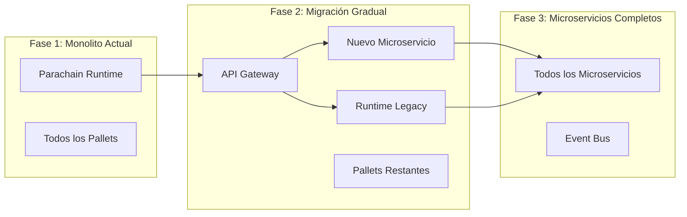
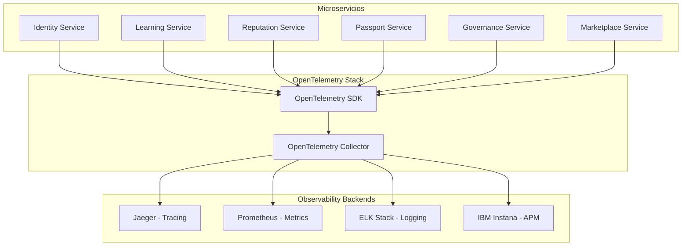

# Documento de Diseño - Migración a Microservicios Cloud-Native

## Visión General

Este documento define el diseño para la migración del backend monolítico de Keiko (Substrate parachain) hacia una arquitectura de microservicios cloud-native desplegada en OVHCloud Managed Kubernetes. La migración incluye la implementación de CI/CD automatizado usando GitOps con Terraform para infraestructura y ArgoCD para aplicaciones.

## Arquitectura de Migración

### Estrategia de Migración Gradual

La migración sigue el patrón **Strangler Fig** para una transición controlada:



### Infraestructura como Código con Terraform

#### Configuración de Clusters OVHCloud

```hcl
# terraform/environments/production/main.tf
module "kubernetes_cluster" {
  source = "../../modules/ovh-kubernetes"
  
  cluster_name = "keikolatam-production"
  region = "GRA"
  
  node_pools = {
    system = {
      flavor = "b2-7"
      desired_nodes = 3
      min_nodes = 3
      max_nodes = 5
    }
    applications = {
      flavor = "b2-15"
      desired_nodes = 5
      min_nodes = 3
      max_nodes = 10
    }
  }
  
  databases = {
    identity_db = {
      engine = "postgresql"
      version = "14"
      plan = "business"
    }
    learning_db = {
      engine = "postgresql"
      version = "14"
      plan = "business"
    }
    reputation_db = {
      engine = "postgresql"
      version = "14"
      plan = "business"
    }
    passport_db = {
      engine = "postgresql"
      version = "14"
      plan = "business"
    }
    governance_db = {
      engine = "postgresql"
      version = "14"
      plan = "business"
    }
    marketplace_db = {
      engine = "postgresql"
      version = "14"
      plan = "business"
    }
  }
}

# Remote state en OVH Object Storage
terraform {
  backend "s3" {
    bucket = "keikolatam-terraform-state-prod"
    key = "infrastructure/terraform.tfstate"
    region = "gra"
    endpoint = "https://s3.gra.cloud.ovh.net"
  }
}
```

### GitOps con ArgoCD

#### App of Apps Pattern

```yaml
# k8s/base/argocd/app-of-apps.yaml
apiVersion: argoproj.io/v1alpha1
kind: Application
metadata:
  name: keiko-apps
  namespace: argocd
spec:
  project: default
  source:
    repoURL: https://github.com/keikolatam/keiko-dapp
    targetRevision: HEAD
    path: k8s/overlays/production
  destination:
    server: https://kubernetes.default.svc
  syncPolicy:
    automated:
      prune: true
      selfHeal: true
    syncOptions:
    - CreateNamespace=true
```

#### Estructura de Manifiestos Kubernetes

```
k8s/
├── base/                      # Configuración base
│   ├── identity-service/
│   ├── learning-service/
│   ├── reputation-service/
│   ├── passport-service/
│   ├── governance-service/
│   ├── marketplace-service/
│   ├── api-gateway/
│   └── observability/
│       ├── prometheus/
│       ├── grafana/
│       ├── jaeger/
│       └── elk/
└── overlays/                  # Overlays por entorno
    ├── dev/
    ├── staging/
    └── production/
```

## Observabilidad con OpenTelemetry

### Arquitectura de Observabilidad



### Implementación OpenTelemetry en Rust

```rust
// shared/observability/src/lib.rs
use opentelemetry::{
    global,
    sdk::{
        trace::{self, RandomIdGenerator, Sampler},
        Resource,
    },
    KeyValue,
};
use opentelemetry_jaeger::new_agent_pipeline;
use opentelemetry_prometheus::PrometheusExporter;
use tracing_subscriber::{layer::SubscriberExt, util::SubscriberInitExt};

pub fn init_observability(service_name: &str, service_version: &str) -> Result<(), Box<dyn std::error::Error>> {
    // Configurar OpenTelemetry Tracing
    let tracer = new_agent_pipeline()
        .with_service_name(service_name)
        .with_trace_config(
            trace::config()
                .with_sampler(Sampler::AlwaysOn)
                .with_id_generator(RandomIdGenerator::default())
                .with_resource(Resource::new(vec![
                    KeyValue::new("service.name", service_name.to_string()),
                    KeyValue::new("service.version", service_version.to_string()),
                    KeyValue::new("service.namespace", "keiko"),
                ])),
        )
        .install_batch(opentelemetry::runtime::Tokio)?;

    // Configurar OpenTelemetry Metrics
    let prometheus_exporter = PrometheusExporter::builder()
        .with_resource(Resource::new(vec![
            KeyValue::new("service.name", service_name.to_string()),
            KeyValue::new("service.version", service_version.to_string()),
        ]))
        .init();

    global::set_meter_provider(prometheus_exporter.meter_provider().unwrap());

    // Configurar Tracing Subscriber con OpenTelemetry
    tracing_subscriber::registry()
        .with(tracing_subscriber::EnvFilter::new("info"))
        .with(tracing_subscriber::fmt::layer().json())
        .with(tracing_opentelemetry::layer().with_tracer(tracer))
        .init();

    Ok(())
}

// Instrumentación automática para servicios
#[tracing::instrument(
    skip(self),
    fields(
        service.name = %self.service_name,
        user.id = %request.user_id,
        operation = "create_interaction"
    )
)]
pub async fn create_interaction(&self, request: CreateInteractionRequest) -> Result<InteractionId> {
    let span = tracing::Span::current();
    
    // Agregar atributos personalizados
    span.set_attribute("interaction.type", request.interaction_type.clone());
    span.set_attribute("interaction.size", request.content.len() as i64);
    
    // Métricas personalizadas
    let meter = global::meter("keiko-learning-service");
    let interaction_counter = meter
        .u64_counter("interactions_created_total")
        .with_description("Total number of learning interactions created")
        .init();
    
    let interaction_duration = meter
        .f64_histogram("interaction_processing_duration_seconds")
        .with_description("Time spent processing learning interactions")
        .init();
    
    let start_time = std::time::Instant::now();
    
    // Lógica del servicio...
    let result = self.process_interaction(request).await?;
    
    // Registrar métricas
    interaction_counter.add(1, &[
        KeyValue::new("service", self.service_name.clone()),
        KeyValue::new("interaction_type", request.interaction_type),
    ]);
    
    interaction_duration.record(
        start_time.elapsed().as_secs_f64(),
        &[KeyValue::new("service", self.service_name.clone())],
    );
    
    Ok(result)
}
```

### Integración con IBM Instana (Futuro)

IBM Instana se integra nativamente con OpenTelemetry como backend de APM:

```yaml
# k8s/base/observability/instana/instana-agent.yaml
apiVersion: apps/v1
kind: DaemonSet
metadata:
  name: instana-agent
  namespace: instana-agent
spec:
  selector:
    matchLabels:
      app.kubernetes.io/name: instana-agent
  template:
    metadata:
      labels:
        app.kubernetes.io/name: instana-agent
    spec:
      containers:
      - name: instana-agent
        image: instana/agent
        env:
        - name: INSTANA_AGENT_KEY
          valueFrom:
            secretKeyRef:
              name: instana-agent
              key: key
        - name: INSTANA_AGENT_ENDPOINT
          valueFrom:
            secretKeyRef:
              name: instana-agent
              key: endpoint
        - name: INSTANA_AGENT_ZONE
          value: "keiko-production"
        # Configuración OpenTelemetry
        - name: INSTANA_AGENT_OTEL_ENABLED
          value: "true"
        - name: INSTANA_AGENT_OTEL_GRPC_ENDPOINT
          value: "http://otel-collector:4317"
```

**Beneficios de IBM Instana:**
- **Auto-discovery**: Descubrimiento automático de servicios y dependencias
- **Análisis de dependencias**: Mapa automático de servicios y sus relaciones
- **Alerting inteligente**: Alertas basadas en ML y análisis de patrones
- **Dashboards de negocio**: Métricas técnicas correlacionadas con KPIs de negocio
- **Root cause analysis**: Análisis automático de causa raíz de problemas
- **Performance insights**: Recomendaciones automáticas de optimización

## CI/CD Pipeline Automatizado

### GitHub Actions Workflow

```yaml
# .github/workflows/microservice-deploy.yml
name: Microservice Deploy

on:
  push:
    branches: [develop, staging, main]
    paths:
      - 'services/**'

jobs:
  detect-changes:
    runs-on: ubuntu-latest
    outputs:
      services: ${{ steps.changes.outputs.services }}
    steps:
      - uses: actions/checkout@v3
      - uses: dorny/paths-filter@v2
        id: changes
        with:
          filters: |
            identity-service:
              - 'services/identity-service/**'
            learning-service:
              - 'services/learning-service/**'
            reputation-service:
              - 'services/reputation-service/**'
            passport-service:
              - 'services/passport-service/**'
            governance-service:
              - 'services/governance-service/**'
            marketplace-service:
              - 'services/marketplace-service/**'

  build-and-deploy:
    needs: detect-changes
    runs-on: ubuntu-latest
    strategy:
      matrix:
        service: ${{ fromJSON(needs.detect-changes.outputs.services) }}
    steps:
      - uses: actions/checkout@v3
      
      - name: Set up Docker Buildx
        uses: docker/setup-buildx-action@v2
      
      - name: Login to OVH Container Registry
        uses: docker/login-action@v2
        with:
          registry: registry.gra.cloud.ovh.net
          username: ${{ secrets.OVH_REGISTRY_USERNAME }}
          password: ${{ secrets.OVH_REGISTRY_PASSWORD }}
      
      - name: Build and push Docker image
        uses: docker/build-push-action@v4
        with:
          context: ./services/${{ matrix.service }}
          push: true
          tags: |
            registry.gra.cloud.ovh.net/keikolatam/${{ matrix.service }}:${{ github.sha }}
            registry.gra.cloud.ovh.net/keikolatam/${{ matrix.service }}:latest
          cache-from: type=gha
          cache-to: type=gha,mode=max
      
      - name: Update Kubernetes manifests
        run: |
          # Actualizar imagen en manifiestos según el branch
          if [[ "${{ github.ref }}" == "refs/heads/develop" ]]; then
            ENVIRONMENT="dev"
          elif [[ "${{ github.ref }}" == "refs/heads/staging" ]]; then
            ENVIRONMENT="staging"
          elif [[ "${{ github.ref }}" == "refs/heads/main" ]]; then
            ENVIRONMENT="production"
          fi
          
          # Usar kustomize para actualizar la imagen
          cd k8s/overlays/$ENVIRONMENT
          kustomize edit set image ${{ matrix.service }}=registry.gra.cloud.ovh.net/keikolatam/${{ matrix.service }}:${{ github.sha }}
          
          # Commit y push de cambios
          git config --local user.email "action@github.com"
          git config --local user.name "GitHub Action"
          git add .
          git commit -m "Update ${{ matrix.service }} image to ${{ github.sha }} in $ENVIRONMENT"
          git push
```

## Resiliencia y Tolerancia a Fallos

### Circuit Breaker Pattern

```rust
// shared/resilience/src/circuit_breaker.rs
use std::sync::Arc;
use tokio::sync::RwLock;
use std::time::{Duration, Instant};

#[derive(Debug, Clone)]
pub enum CircuitState {
    Closed,
    Open,
    HalfOpen,
}

pub struct CircuitBreaker {
    state: Arc<RwLock<CircuitState>>,
    failure_count: Arc<RwLock<u32>>,
    last_failure_time: Arc<RwLock<Option<Instant>>>,
    failure_threshold: u32,
    recovery_timeout: Duration,
    success_threshold: u32,
}

impl CircuitBreaker {
    pub fn new(failure_threshold: u32, recovery_timeout: Duration) -> Self {
        Self {
            state: Arc::new(RwLock::new(CircuitState::Closed)),
            failure_count: Arc::new(RwLock::new(0)),
            last_failure_time: Arc::new(RwLock::new(None)),
            failure_threshold,
            recovery_timeout,
            success_threshold: 3,
        }
    }

    pub async fn call<F, T, E>(&self, operation: F) -> Result<T, CircuitBreakerError<E>>
    where
        F: FnOnce() -> Result<T, E>,
        E: std::fmt::Debug,
    {
        // Verificar estado del circuit breaker
        let state = self.state.read().await.clone();
        
        match state {
            CircuitState::Open => {
                // Verificar si es tiempo de intentar recovery
                let last_failure = self.last_failure_time.read().await;
                if let Some(last_failure_time) = *last_failure {
                    if last_failure_time.elapsed() > self.recovery_timeout {
                        // Cambiar a half-open para intentar recovery
                        *self.state.write().await = CircuitState::HalfOpen;
                    } else {
                        return Err(CircuitBreakerError::CircuitOpen);
                    }
                }
            }
            CircuitState::HalfOpen => {
                // En half-open, permitir una llamada para probar
            }
            CircuitState::Closed => {
                // Funcionamiento normal
            }
        }

        // Ejecutar operación
        match operation() {
            Ok(result) => {
                self.on_success().await;
                Ok(result)
            }
            Err(error) => {
                self.on_failure().await;
                Err(CircuitBreakerError::OperationFailed(error))
            }
        }
    }

    async fn on_success(&self) {
        let mut state = self.state.write().await;
        match *state {
            CircuitState::HalfOpen => {
                // Reset y cerrar circuit
                *self.failure_count.write().await = 0;
                *state = CircuitState::Closed;
            }
            _ => {}
        }
    }

    async fn on_failure(&self) {
        let mut failure_count = self.failure_count.write().await;
        *failure_count += 1;
        *self.last_failure_time.write().await = Some(Instant::now());

        if *failure_count >= self.failure_threshold {
            *self.state.write().await = CircuitState::Open;
        }
    }
}

#[derive(Debug)]
pub enum CircuitBreakerError<E> {
    CircuitOpen,
    OperationFailed(E),
}
```

### Event-Driven Communication

```rust
// shared/events/src/event_bus.rs
use serde::{Deserialize, Serialize};
use redis::streams::{StreamReadOptions, StreamReadReply};
use std::collections::HashMap;

#[derive(Debug, Clone, Serialize, Deserialize)]
pub struct DomainEvent {
    pub event_id: String,
    pub event_type: String,
    pub aggregate_id: String,
    pub aggregate_type: String,
    pub event_version: u32,
    pub occurred_at: chrono::DateTime<chrono::Utc>,
    pub data: serde_json::Value,
    pub metadata: HashMap<String, String>,
}

pub struct EventBus {
    redis_client: redis::Client,
    consumer_group: String,
    consumer_name: String,
}

impl EventBus {
    pub async fn publish(&self, event: DomainEvent) -> Result<(), EventBusError> {
        let mut conn = self.redis_client.get_async_connection().await?;
        let stream_key = format!("events:{}", event.aggregate_type);
        
        let event_data = serde_json::to_string(&event)?;
        
        redis::cmd("XADD")
            .arg(&stream_key)
            .arg("*")
            .arg("event")
            .arg(event_data)
            .query_async(&mut conn)
            .await?;
        
        Ok(())
    }

    pub async fn subscribe<F>(&self, event_types: Vec<String>, handler: F) -> Result<(), EventBusError>
    where
        F: Fn(DomainEvent) -> Result<(), Box<dyn std::error::Error>> + Send + Sync + 'static,
    {
        let mut conn = self.redis_client.get_async_connection().await?;
        
        // Crear consumer group si no existe
        for event_type in &event_types {
            let stream_key = format!("events:{}", event_type);
            let _: Result<(), redis::RedisError> = redis::cmd("XGROUP")
                .arg("CREATE")
                .arg(&stream_key)
                .arg(&self.consumer_group)
                .arg("0")
                .arg("MKSTREAM")
                .query_async(&mut conn)
                .await;
        }

        // Loop de procesamiento de eventos
        loop {
            let streams: Vec<String> = event_types
                .iter()
                .map(|et| format!("events:{}", et))
                .collect();

            let opts = StreamReadOptions::default()
                .group(&self.consumer_group, &self.consumer_name)
                .count(10)
                .block(1000);

            let results: StreamReadReply = conn
                .xread_options(&streams, &[">"; streams.len()], &opts)
                .await?;

            for stream_key in results.keys {
                for stream_id in stream_key.ids {
                    if let Some(event_data) = stream_id.map.get("event") {
                        if let Ok(event) = serde_json::from_str::<DomainEvent>(event_data) {
                            match handler(event.clone()) {
                                Ok(_) => {
                                    // ACK el mensaje
                                    let _: () = redis::cmd("XACK")
                                        .arg(&stream_key.key)
                                        .arg(&self.consumer_group)
                                        .arg(&stream_id.id)
                                        .query_async(&mut conn)
                                        .await?;
                                }
                                Err(e) => {
                                    // Log error y enviar a dead letter queue
                                    tracing::error!(
                                        event_id = %event.event_id,
                                        error = %e,
                                        "Failed to process event"
                                    );
                                    
                                    self.send_to_dlq(event, e.to_string()).await?;
                                }
                            }
                        }
                    }
                }
            }
        }
    }

    async fn send_to_dlq(&self, event: DomainEvent, error: String) -> Result<(), EventBusError> {
        let mut conn = self.redis_client.get_async_connection().await?;
        let dlq_key = format!("dlq:events:{}", event.aggregate_type);
        
        let dlq_event = serde_json::json!({
            "original_event": event,
            "error": error,
            "failed_at": chrono::Utc::now(),
            "retry_count": 0
        });
        
        redis::cmd("XADD")
            .arg(dlq_key)
            .arg("*")
            .arg("event")
            .arg(dlq_event.to_string())
            .query_async(&mut conn)
            .await?;
        
        Ok(())
    }
}

#[derive(Debug, thiserror::Error)]
pub enum EventBusError {
    #[error("Redis error: {0}")]
    Redis(#[from] redis::RedisError),
    #[error("Serialization error: {0}")]
    Serialization(#[from] serde_json::Error),
}
```

## Seguridad y Configuración

### Service-to-Service Authentication con JWT

```rust
// shared/auth/src/service_auth.rs
use jsonwebtoken::{decode, encode, Algorithm, DecodingKey, EncodingKey, Header, Validation};
use serde::{Deserialize, Serialize};
use std::time::{SystemTime, UNIX_EPOCH};

#[derive(Debug, Serialize, Deserialize)]
pub struct ServiceClaims {
    pub sub: String,        // Service name
    pub iss: String,        // Issuer (keiko-platform)
    pub aud: String,        // Audience (target service)
    pub exp: usize,         // Expiration time
    pub iat: usize,         // Issued at
    pub service_type: String,
    pub permissions: Vec<String>,
}

pub struct ServiceAuthenticator {
    encoding_key: EncodingKey,
    decoding_key: DecodingKey,
    issuer: String,
}

impl ServiceAuthenticator {
    pub fn new(secret: &[u8], issuer: String) -> Self {
        Self {
            encoding_key: EncodingKey::from_secret(secret),
            decoding_key: DecodingKey::from_secret(secret),
            issuer,
        }
    }

    pub fn generate_service_token(
        &self,
        service_name: &str,
        target_service: &str,
        permissions: Vec<String>,
        expires_in_seconds: u64,
    ) -> Result<String, ServiceAuthError> {
        let now = SystemTime::now()
            .duration_since(UNIX_EPOCH)
            .unwrap()
            .as_secs() as usize;

        let claims = ServiceClaims {
            sub: service_name.to_string(),
            iss: self.issuer.clone(),
            aud: target_service.to_string(),
            exp: now + expires_in_seconds as usize,
            iat: now,
            service_type: "microservice".to_string(),
            permissions,
        };

        encode(&Header::default(), &claims, &self.encoding_key)
            .map_err(ServiceAuthError::TokenGeneration)
    }

    pub fn validate_service_token(
        &self,
        token: &str,
        expected_audience: &str,
    ) -> Result<ServiceClaims, ServiceAuthError> {
        let mut validation = Validation::new(Algorithm::HS256);
        validation.set_audience(&[expected_audience]);
        validation.set_issuer(&[&self.issuer]);

        decode::<ServiceClaims>(token, &self.decoding_key, &validation)
            .map(|token_data| token_data.claims)
            .map_err(ServiceAuthError::TokenValidation)
    }
}

#[derive(Debug, thiserror::Error)]
pub enum ServiceAuthError {
    #[error("Token generation failed: {0}")]
    TokenGeneration(#[from] jsonwebtoken::errors::Error),
    #[error("Token validation failed: {0}")]
    TokenValidation(jsonwebtoken::errors::Error),
}
```

### Configuración con ConfigMaps y Secrets

```yaml
# k8s/base/identity-service/configmap.yaml
apiVersion: v1
kind: ConfigMap
metadata:
  name: identity-service-config
data:
  DATABASE_URL: "postgresql://identity_user@identity-db:5432/identity_db"
  REDIS_URL: "redis://redis:6379"
  LOG_LEVEL: "info"
  OTEL_SERVICE_NAME: "identity-service"
  OTEL_SERVICE_VERSION: "1.0.0"
  OTEL_EXPORTER_JAEGER_ENDPOINT: "http://jaeger-collector:14268/api/traces"
  OTEL_EXPORTER_PROMETHEUS_ENDPOINT: "http://prometheus:9090"

---
apiVersion: v1
kind: Secret
metadata:
  name: identity-service-secrets
type: Opaque
data:
  DATABASE_PASSWORD: <base64-encoded-password>
  JWT_SECRET: <base64-encoded-jwt-secret>
  SERVICE_AUTH_SECRET: <base64-encoded-service-auth-secret>
```

## Decisiones de Diseño

### 1. OpenTelemetry como Estándar de Observabilidad

**Decisión**: Usar OpenTelemetry como capa de instrumentación unificada

**Justificación**:
- Estándar CNCF vendor-neutral
- Instrumentación automática y manual
- Compatibilidad con múltiples backends (Jaeger, Prometheus, IBM Instana)
- Correlación automática entre trazas, métricas y logs
- Futuro-proof para cambios de herramientas de observabilidad

### 2. IBM Instana como APM Complementario

**Decisión**: Integrar IBM Instana como backend de APM avanzado

**Justificación**:
- Auto-discovery de servicios y dependencias
- Análisis de causa raíz automático con ML
- Dashboards de negocio correlacionados con métricas técnicas
- Alerting inteligente basado en patrones
- Integración nativa con OpenTelemetry

### 3. Database per Service Pattern

**Decisión**: Cada microservicio tiene su propia base de datos PostgreSQL

**Justificación**:
- Aislamiento completo de datos
- Escalabilidad independiente
- Tecnología específica por dominio
- Fault isolation
- Desarrollo paralelo por equipos

### 4. Event-Driven Architecture con Redis Streams

**Decisión**: Usar Redis Streams para comunicación asíncrona

**Justificación**:
- At-least-once delivery garantizado
- Consumer groups para escalabilidad
- Dead letter queues nativas
- Persistencia y replay de eventos
- Menor complejidad que Kafka para el tamaño inicial

### 5. Strangler Fig Pattern para Migración

**Decisión**: Migración gradual usando Strangler Fig Pattern

**Justificación**:
- Migración sin interrupciones de servicio
- Rollback fácil en caso de problemas
- Validación incremental de nuevos servicios
- Reducción de riesgo
- Aprendizaje continuo durante la migración