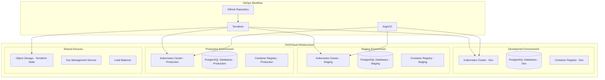
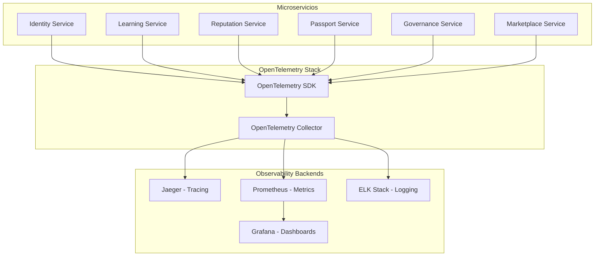
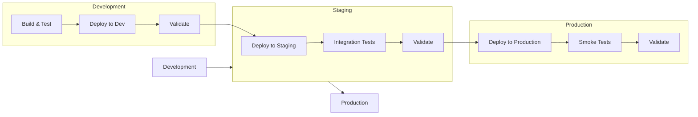

# Documento de Diseño - GitOps y CI/CD

## Visión General

Este documento define el diseño de la infraestructura como código (IaC) y CI/CD automatizado para el proyecto Keiko. La solución implementa una plataforma cloud-native completa en OVHCloud Managed Kubernetes usando GitOps con Terraform para infraestructura y ArgoCD para aplicaciones.

## Arquitectura de Infraestructura

### Diagrama de Arquitectura General



### Configuración de Clusters Kubernetes

#### Especificaciones por Entorno

```hcl
# Development Environment
dev_cluster = {
  name = "keikolatam-dev"
  region = "GRA"
  node_pools = {
    system = {
      flavor = "b2-7"    # 2 vCPU, 7GB RAM
      desired_nodes = 2
      min_nodes = 2
      max_nodes = 3
    }
    applications = {
      flavor = "b2-15"   # 4 vCPU, 15GB RAM
      desired_nodes = 2
      min_nodes = 2
      max_nodes = 5
    }
  }
}

# Staging Environment
staging_cluster = {
  name = "keikolatam-staging"
  region = "GRA"
  node_pools = {
    system = {
      flavor = "b2-15"   # 4 vCPU, 15GB RAM
      desired_nodes = 3
      min_nodes = 3
      max_nodes = 5
    }
    applications = {
      flavor = "b2-30"   # 8 vCPU, 30GB RAM
      desired_nodes = 3
      min_nodes = 3
      max_nodes = 8
    }
  }
}

# Production Environment
production_cluster = {
  name = "keikolatam-production"
  region = "GRA"
  node_pools = {
    system = {
      flavor = "b2-30"   # 8 vCPU, 30GB RAM
      desired_nodes = 3
      min_nodes = 3
      max_nodes = 5
    }
    applications = {
      flavor = "b2-60"   # 16 vCPU, 60GB RAM
      desired_nodes = 5
      min_nodes = 3
      max_nodes = 15
    }
  }
}
```

## GitOps con ArgoCD

### App of Apps Pattern

```yaml
# argocd/app-of-apps.yaml
apiVersion: argoproj.io/v1alpha1
kind: Application
metadata:
  name: keiko-apps
  namespace: argocd
spec:
  project: default
  source:
    repoURL: https://github.com/keikolatam/keiko-dapp
    targetRevision: HEAD
    path: k8s/overlays/production
  destination:
    server: https://kubernetes.default.svc
  syncPolicy:
    automated:
      prune: true
      selfHeal: true
    syncOptions:
    - CreateNamespace=true
```

### Estructura de Manifiestos Kubernetes

```
k8s/
├── base/                           # Configuración base
│   ├── identity-service/
│   │   ├── deployment.yaml
│   │   ├── service.yaml
│   │   ├── configmap.yaml
│   │   └── kustomization.yaml
│   ├── learning-service/
│   ├── reputation-service/
│   ├── passport-service/
│   ├── governance-service/
│   ├── marketplace-service/
│   ├── api-gateway/
│   └── observability/
│       ├── prometheus/
│       ├── grafana/
│       ├── jaeger/
│       └── elk/
└── overlays/                       # Overlays por entorno
    ├── dev/
    │   ├── kustomization.yaml
    │   ├── identity-service-patch.yaml
    │   └── configmap-patch.yaml
    ├── staging/
    └── production/
```

## CI/CD Pipeline Automatizado

### GitHub Actions Workflow

```yaml
# .github/workflows/microservice-deploy.yml
name: Microservice Deploy

on:
  push:
    branches: [develop, staging, main]
    paths:
      - 'services/**'

jobs:
  detect-changes:
    runs-on: ubuntu-latest
    outputs:
      services: ${{ steps.changes.outputs.services }}
    steps:
      - uses: actions/checkout@v3
      - uses: dorny/paths-filter@v2
        id: changes
        with:
          filters: |
            identity-service:
              - 'services/identity-service/**'
            learning-service:
              - 'services/learning-service/**'
            reputation-service:
              - 'services/reputation-service/**'
            passport-service:
              - 'services/passport-service/**'
            governance-service:
              - 'services/governance-service/**'
            marketplace-service:
              - 'services/marketplace-service/**'

  build-and-deploy:
    needs: detect-changes
    runs-on: ubuntu-latest
    strategy:
      matrix:
        service: ${{ fromJSON(needs.detect-changes.outputs.services) }}
    steps:
      - uses: actions/checkout@v3
      
      - name: Set up Docker Buildx
        uses: docker/setup-buildx-action@v2
      
      - name: Login to OVH Container Registry
        uses: docker/login-action@v2
        with:
          registry: registry.gra.cloud.ovh.net
          username: ${{ secrets.OVH_REGISTRY_USERNAME }}
          password: ${{ secrets.OVH_REGISTRY_PASSWORD }}
      
      - name: Build and push Docker image
        uses: docker/build-push-action@v4
        with:
          context: ./services/${{ matrix.service }}
          push: true
          tags: |
            registry.gra.cloud.ovh.net/keikolatam/${{ matrix.service }}:${{ github.sha }}
            registry.gra.cloud.ovh.net/keikolatam/${{ matrix.service }}:latest
          cache-from: type=gha
          cache-to: type=gha,mode=max
      
      - name: Update Kubernetes manifests
        run: |
          # Determinar entorno basado en branch
          if [[ "${{ github.ref }}" == "refs/heads/develop" ]]; then
            ENVIRONMENT="dev"
          elif [[ "${{ github.ref }}" == "refs/heads/staging" ]]; then
            ENVIRONMENT="staging"
          elif [[ "${{ github.ref }}" == "refs/heads/main" ]]; then
            ENVIRONMENT="production"
          fi
          
          # Usar kustomize para actualizar la imagen
          cd k8s/overlays/$ENVIRONMENT
          kustomize edit set image ${{ matrix.service }}=registry.gra.cloud.ovh.net/keikolatam/${{ matrix.service }}:${{ github.sha }}
          
          # Commit y push de cambios
          git config --local user.email "action@github.com"
          git config --local user.name "GitHub Action"
          git add .
          git commit -m "Update ${{ matrix.service }} image to ${{ github.sha }} in $ENVIRONMENT"
          git push
```

## Observabilidad con OpenTelemetry

### Arquitectura de Observabilidad



### Configuración OpenTelemetry Collector

```yaml
# k8s/base/observability/otel-collector.yaml
apiVersion: v1
kind: ConfigMap
metadata:
  name: otel-collector-config
data:
  config.yaml: |
    receivers:
      otlp:
        protocols:
          grpc:
            endpoint: 0.0.0.0:4317
          http:
            endpoint: 0.0.0.0:4318
      prometheus:
        config:
          scrape_configs:
            - job_name: 'kubernetes-pods'
              kubernetes_sd_configs:
                - role: pod

    processors:
      batch:
        timeout: 1s
        send_batch_size: 1024
      memory_limiter:
        limit_mib: 512

    exporters:
      jaeger:
        endpoint: jaeger-collector:14250
        tls:
          insecure: true
      prometheus:
        endpoint: "0.0.0.0:8889"
      elasticsearch:
        endpoints: ["http://elasticsearch:9200"]
        index: "otel-logs"

    service:
      pipelines:
        traces:
          receivers: [otlp]
          processors: [memory_limiter, batch]
          exporters: [jaeger]
        metrics:
          receivers: [otlp, prometheus]
          processors: [memory_limiter, batch]
          exporters: [prometheus]
        logs:
          receivers: [otlp]
          processors: [memory_limiter, batch]
          exporters: [elasticsearch]
```

## Seguridad y Configuración

### External Secrets Operator

```yaml
# k8s/base/security/external-secrets.yaml
apiVersion: external-secrets.io/v1beta1
kind: SecretStore
metadata:
  name: ovh-secret-store
spec:
  provider:
    vault:
      server: "https://vault.ovh.net"
      path: "secret"
      version: "v2"
      auth:
        kubernetes:
          mountPath: "kubernetes"
          role: "keiko-role"

---
apiVersion: external-secrets.io/v1beta1
kind: ExternalSecret
metadata:
  name: database-credentials
spec:
  refreshInterval: 1h
  secretStoreRef:
    name: ovh-secret-store
    kind: SecretStore
  target:
    name: database-secret
    creationPolicy: Owner
  data:
  - secretKey: username
    remoteRef:
      key: database
      property: username
  - secretKey: password
    remoteRef:
      key: database
      property: password
```

### Network Policies

```yaml
# k8s/base/security/network-policies.yaml
apiVersion: networking.k8s.io/v1
kind: NetworkPolicy
metadata:
  name: microservices-network-policy
spec:
  podSelector:
    matchLabels:
      app.kubernetes.io/part-of: keiko
  policyTypes:
  - Ingress
  - Egress
  ingress:
  - from:
    - podSelector:
        matchLabels:
          app.kubernetes.io/part-of: keiko
    - namespaceSelector:
        matchLabels:
          name: ingress-nginx
  egress:
  - to:
    - podSelector:
        matchLabels:
          app.kubernetes.io/part-of: keiko
  - to: []
    ports:
    - protocol: TCP
      port: 5432  # PostgreSQL
    - protocol: TCP
      port: 6379  # Redis
    - protocol: TCP
      port: 53    # DNS
    - protocol: UDP
      port: 53    # DNS
```

## Backup y Disaster Recovery

### Configuración de Backups

```yaml
# k8s/base/backup/postgres-backup.yaml
apiVersion: batch/v1
kind: CronJob
metadata:
  name: postgres-backup
spec:
  schedule: "0 */6 * * *"  # Cada 6 horas
  jobTemplate:
    spec:
      template:
        spec:
          containers:
          - name: postgres-backup
            image: postgres:14
            env:
            - name: PGPASSWORD
              valueFrom:
                secretKeyRef:
                  name: database-secret
                  key: password
            command:
            - /bin/bash
            - -c
            - |
              TIMESTAMP=$(date +%Y%m%d_%H%M%S)
              pg_dump -h postgres-service -U postgres keiko_db > /backup/keiko_backup_$TIMESTAMP.sql
              # Upload to OVH Object Storage
              aws s3 cp /backup/keiko_backup_$TIMESTAMP.sql s3://keikolatam-backups/postgres/
            volumeMounts:
            - name: backup-storage
              mountPath: /backup
          volumes:
          - name: backup-storage
            emptyDir: {}
          restartPolicy: OnFailure
```

## Decisiones de Diseño

### 1. OVHCloud como Proveedor de Nube

**Decisión**: Usar OVHCloud Managed Kubernetes como plataforma principal

**Justificación**:
- Cumplimiento con GDPR europeo
- Costos competitivos vs AWS/Azure
- Managed Kubernetes reduce overhead operacional
- Integración nativa con servicios OVH (Object Storage, Databases)

### 2. Terraform para IaC

**Decisión**: Usar Terraform como herramienta principal de IaC

**Justificación**:
- Declarativo y reproducible
- Soporte nativo para OVHCloud
- State management robusto
- Ecosistema maduro de módulos

### 3. ArgoCD para GitOps

**Decisión**: Usar ArgoCD como herramienta de GitOps

**Justificación**:
- Nativo de Kubernetes
- App of Apps pattern para gestión escalable
- Auto-sync y self-healing
- UI intuitiva para visualización

### 4. OpenTelemetry para Observabilidad

**Decisión**: Usar OpenTelemetry como estándar de instrumentación

**Justificación**:
- Vendor-neutral y futuro-proof
- Instrumentación automática para Rust
- Correlación automática entre traces, metrics y logs
- Compatibilidad con múltiples backends

### 5. External Secrets Operator

**Decisión**: Usar External Secrets Operator para gestión de secretos

**Justificación**:
- Sincronización automática desde sistemas externos
- Rotación automática de credenciales
- Separación de secretos del código
- Integración con OVH Key Management Service

## Flujo de Deployment

### Promoción entre Entornos



### Rollback Strategy

1. **Automatic Rollback**: Si los health checks fallan después del deployment
2. **Manual Rollback**: Via ArgoCD UI o CLI
3. **Database Rollback**: Scripts de migración reversible
4. **Traffic Rollback**: Blue-green deployment con Istio

Esta arquitectura proporciona una base sólida para el desarrollo y operación de microservicios en un entorno cloud-native completamente automatizado.