# Documento de Diseño - Keiko DApp

## Visión General

Keiko es una red social educativa descentralizada que transforma el aprendizaje en capital humano verificable mediante blockchain. La arquitectura se basa en un monorepo que integra tres componentes principales:

- **Backend**: Parachain personalizada en Rust usando Substrate
- **Frontend**: Aplicación Flutter multiplataforma (web y móvil)
- **Middleware**: Servicios de integración y APIs

### Principios de Diseño

1. **Atomicidad**: Cada interacción de aprendizaje es una unidad indivisible y verificable
2. **Interoperabilidad**: Compatibilidad total con estándares xAPI y ecosistemas educativos existentes
3. **Descentralización**: Datos inmutables en blockchain con control de privacidad del usuario
4. **Escalabilidad**: Arquitectura modular que soporta crecimiento orgánico
5. **Experiencia de Usuario**: Interfaz intuitiva que abstrae la complejidad blockchain

## Arquitectura

### Estructura del Monorepo

```
keiko-dapp/
├── backend/                    # Parachain Substrate en Rust
│   ├── node/                  # Configuración del nodo
│   ├── runtime/               # Runtime de la parachain
│   ├── pallets/               # Pallets personalizados
│   │   ├── learning-interactions/
│   │   ├── life-learning-passport/
│   │   ├── reputation-system/
│   │   ├── governance/
│   │   └── marketplace/
│   └── tests/                 # Tests de integración
├── frontend/                   # Aplicación Flutter
│   ├── lib/
│   │   ├── core/              # Configuración base
│   │   ├── features/          # Módulos por funcionalidad
│   │   └── shared/            # Componentes compartidos
│   ├── web/                   # Configuración web
│   ├── android/               # Configuración Android
│   ├── ios/                   # Configuración iOS
│   └── test/                  # Tests Flutter
├── middleware/                 # Servicios de integración
│   ├── api-gateway/           # Gateway principal
│   ├── lrs-integration/       # Integración con LRS
│   ├── ai-tutoring/           # Servicios de IA
│   └── parachain-bridge/      # Puente con parachain
├── shared/                     # Código compartido
│   ├── types/                 # Definiciones de tipos
│   ├── schemas/               # Esquemas xAPI
│   └── utils/                 # Utilidades comunes
└── docs/                      # Documentación
    ├── api/                   # Documentación de APIs
    ├── deployment/            # Guías de despliegue
    └── architecture/          # Diagramas y especificaciones
```

### Arquitectura Técnica General


### Jerarquía Completa de Experiencias de Aprendizaje

```mermaid
graph TD
    subgraph "Nivel 1: Contenedores Educativos"
        Course[📚 Curso Completo<br/>ej: Matemáticas Avanzadas]
        IndependentClass[📖 Clase Independiente<br/>ej: Introducción a Python]
    end
    
    subgraph "Nivel 2: Sesiones Estructuradas"
        CourseClass[📝 Clase de Curso<br/>ej: Álgebra Lineal - Clase 3]
        TutorialSession[👨‍🏫 Sesión Tutorial<br/>ej: Tutoría Individual Álgebra]
        StudySession[📚 Sesión de Estudio Personal<br/>ej: Práctica con IA]
    end
    
    subgraph "Nivel 3: Interacciones Atómicas"
        Question[❓ Pregunta<br/>ej: ¿Qué es una matriz?]
        Answer[💡 Respuesta<br/>ej: Una matriz es...]
        Exercise[✏️ Ejercicio<br/>ej: Resolver sistema 3x3]
        Discussion[💬 Discusión<br/>ej: Debate sobre aplicaciones]
        Evaluation[📊 Evaluación<br/>ej: Quiz de 5 preguntas]
        Feedback[📋 Retroalimentación<br/>ej: Comentario del tutor]
    end
    
    Course --> CourseClass
    IndependentClass --> TutorialSession
    IndependentClass --> StudySession
    CourseClass --> TutorialSession
    CourseClass --> Question
    CourseClass --> Discussion
    CourseClass --> Evaluation
    
    TutorialSession --> Question
    TutorialSession --> Answer
    TutorialSession --> Exercise
    TutorialSession --> Feedback
    
    StudySession --> Question
    StudySession --> Answer
    StudySession --> Exercise
    
    style Course fill:#e1f5fe
    style IndependentClass fill:#e1f5fe
    style CourseClass fill:#f3e5f5
    style TutorialSession fill:#f3e5f5
    style StudySession fill:#f3e5f5
    style Question fill:#fff3e0
    style Answer fill:#fff3e0
    style Exercise fill:#fff3e0
    style Discussion fill:#fff3e0
    style Evaluation fill:#fff3e0
    style Feedback fill:#fff3e0
```



### Flujo de Datos en la Jerarquía

```mermaid
sequenceDiagram
    participant Student as 👨‍🎓 Estudiante
    participant Frontend as 📱 Flutter App
    participant API as 🌐 API Gateway
    participant Blockchain as ⛓️ Parachain
    participant Passport as 📜 Life Learning Passport
    
    Note over Student, Passport: Ejemplo: Estudiante toma curso de Matemáticas
    
    Student->>Frontend: Inicia curso "Matemáticas Avanzadas"
    Frontend->>API: POST /courses/create
    API->>Blockchain: Extrinsic: create_course()
    Blockchain->>Passport: Actualizar con nuevo curso
    
    Note over Student, Passport: Estudiante asiste a clase dentro del curso
    
    Student->>Frontend: Asiste a "Clase 1: Álgebra"
    Frontend->>API: POST /classes/create
    API->>Blockchain: Extrinsic: create_class(course_id)
    Blockchain->>Passport: Vincular clase al curso
    
    Note over Student, Passport: Durante la clase, múltiples interacciones
    
    Student->>Frontend: Hace pregunta sobre matrices
    Frontend->>API: POST /interactions/create
    API->>Blockchain: Extrinsic: create_interaction(class_id, type: "question")
    Blockchain->>Passport: Registrar interacción atómica
    
    Student->>Frontend: Recibe respuesta del profesor
    Frontend->>API: POST /interactions/create
    API->>Blockchain: Extrinsic: create_interaction(class_id, type: "answer")
    Blockchain->>Passport: Registrar interacción atómica
    
    Student->>Frontend: Completa ejercicio práctico
    Frontend->>API: POST /interactions/create
    API->>Blockchain: Extrinsic: create_interaction(class_id, type: "exercise")
    Blockchain->>Passport: Registrar interacción atómica
    
    Note over Student, Passport: Visualización en timeline
    
    Student->>Frontend: Ver mi pasaporte
    Frontend->>API: GET /passport/timeline
    API->>Blockchain: Query: get_user_timeline()
    Blockchain-->>API: Jerarquía completa de datos
    API-->>Frontend: Timeline estructurado
    Frontend-->>Student: Vista cronológica con jerarquía
```



## Componentes y Interfaces

### 1. Backend - Parachain de Substrate

#### Pallets Personalizados

**Pallet Learning Interactions**
- Almacena interacciones de aprendizaje atómicas en formato xAPI
- Valida estructura y contenido de las interacciones
- Emite eventos para sistemas externos
- Maneja referencias a archivos adjuntos

```rust
// Estructura principal de datos
pub struct LearningInteraction {
    pub id: InteractionId,
    pub actor: AccountId,
    pub verb: Verb,
    pub object: Object,
    pub result: Option<Result>,
    pub context: Option<Context>,
    pub timestamp: Timestamp,
    pub authority: Option<Authority>,
    pub stored: Timestamp,
    pub version: Version,
}

// Jerarquía de contenedores
pub struct Course {
    pub id: CourseId,
    pub title: String,
    pub description: String,
    pub instructor: AccountId,
    pub classes: Vec<ClassId>,
    pub created_at: Timestamp,
}

pub struct Class {
    pub id: ClassId,
    pub course_id: Option<CourseId>,
    pub title: String,
    pub interactions: Vec<InteractionId>,
    pub tutorials: Vec<TutorialId>,
    pub created_at: Timestamp,
}

pub struct TutorialSession {
    pub id: TutorialId,
    pub class_id: Option<ClassId>,
    pub tutor: AccountId,
    pub student: AccountId,
    pub interactions: Vec<InteractionId>,
    pub session_type: SessionType, // Human, AI, Group
    pub started_at: Timestamp,
    pub ended_at: Option<Timestamp>,
}
```

**Pallet Life Learning Passport**
- Gestiona pasaportes de aprendizaje de usuarios
- Mantiene historial cronológico de interacciones
- Genera enlaces verificables para compartir
- Controla configuraciones de privacidad

```rust
pub struct LifeLearningPassport {
    pub owner: AccountId,
    pub interactions: Vec<InteractionId>,
    pub learning_profile: Option<LearningProfile>,
    pub privacy_settings: PrivacySettings,
    pub created_at: Timestamp,
    pub updated_at: Timestamp,
}

pub struct LearningProfile {
    pub learning_style: LearningStyle,
    pub preferences: Vec<Preference>,
    pub strengths: Vec<Skill>,
    pub areas_for_improvement: Vec<Skill>,
    pub last_assessment: Timestamp,
}
```

**Pallet Reputation System**
- Maneja calificaciones con expiración de 30 días
- Calcula reputación dinámica priorizando recientes
- Implementa sistema bidireccional (estudiante-tutor)
- Detecta patrones maliciosos

```rust
pub struct Rating {
    pub id: RatingId,
    pub rater: AccountId,
    pub rated: AccountId,
    pub score: u8, // 1-5
    pub comment: String,
    pub interaction_id: Option<InteractionId>,
    pub created_at: Timestamp,
    pub expires_at: Timestamp, // 30 días después
}

pub struct ReputationScore {
    pub user: AccountId,
    pub current_score: f64,
    pub historical_score: f64,
    pub total_ratings: u32,
    pub recent_ratings: u32, // últimos 30 días
    pub last_updated: Timestamp,
}
```

**Pallet Governance**
- Herramientas de gobernanza comunitaria personalizables
- Sistema de votaciones democráticas
- Registro de decisiones en blockchain
- Gestión de estándares y reglas de validación

**Pallet Marketplace**
- Gestión de espacios de aprendizaje seguros
- Verificación de credenciales de espacios
- Sistema de reservas y disponibilidad
- Calificaciones de espacios y tutores

```rust
pub struct LearningSpace {
    pub id: SpaceId,
    pub owner: AccountId,
    pub name: String,
    pub address: String,
    pub capacity: u32,
    pub amenities: Vec<Amenity>,
    pub safety_certifications: Vec<Certification>,
    pub accessibility_features: Vec<AccessibilityFeature>,
    pub hourly_rate: Balance,
    pub availability: Vec<TimeSlot>,
    pub ratings: Vec<SpaceRating>,
    pub verified: bool,
    pub child_safe: bool,
}

pub struct SpaceReservation {
    pub id: ReservationId,
    pub space_id: SpaceId,
    pub tutor: AccountId,
    pub student: AccountId,
    pub start_time: Timestamp,
    pub end_time: Timestamp,
    pub status: ReservationStatus,
    pub total_cost: Balance,
    pub safety_requirements: Vec<SafetyRequirement>,
}

pub struct SpaceRating {
    pub rater: AccountId,
    pub score: u8, // 1-5
    pub safety_score: u8, // 1-5
    pub cleanliness_score: u8, // 1-5
    pub accessibility_score: u8, // 1-5
    pub comment: String,
    pub created_at: Timestamp,
}
```

#### Integración con Polkadot

```rust
// Configuración de parachain
impl cumulus_pallet_parachain_system::Config for Runtime {
    type RuntimeEvent = RuntimeEvent;
    type OnSystemEvent = ();
    type SelfParaId = parachain_info::Pallet<Runtime>;
    type OutboundXcmpMessageSource = XcmpQueue;
    type DmpMessageHandler = DmpQueue;
    type ReservedDmpWeight = ReservedDmpWeight;
    type XcmpMessageHandler = XcmpQueue;
    type ReservedXcmpWeight = ReservedXcmpWeight;
    type CheckAssociatedRelayNumber = RelayNumberStrictlyIncreases;
}

// Configuración XCMP para comunicación entre parachains
impl cumulus_pallet_xcmp_queue::Config for Runtime {
    type RuntimeEvent = RuntimeEvent;
    type XcmExecutor = XcmExecutor<XcmConfig>;
    type ChannelInfo = ParachainSystem;
    type VersionWrapper = PolkadotXcm;
    type ExecuteOverweightOrigin = EnsureRoot<AccountId>;
    type ControllerOrigin = EnsureRoot<AccountId>;
    type ControllerOriginConverter = XcmOriginToTransactDispatchOrigin;
    type WeightInfo = ();
    type PriceForSiblingDelivery = NoPriceForSiblingDelivery<ParaId>;
}
```

### 2. Middleware - Servicios de Integración

#### API Gateway

```typescript
// Estructura de APIs REST/GraphQL
interface APIEndpoints {
  // Gestión de usuarios
  '/api/users': {
    POST: CreateUser,
    GET: GetUser,
    PUT: UpdateUser
  },
  
  // Interacciones de aprendizaje
  '/api/interactions': {
    POST: CreateInteraction,
    GET: GetInteractions,
    PUT: UpdateInteraction
  },
  
  // Pasaportes de aprendizaje
  '/api/passports': {
    GET: GetPassport,
    POST: SharePassport
  },
  
  // Sistema de reputación
  '/api/ratings': {
    POST: CreateRating,
    GET: GetRatings
  },
  
  // Tutorías y sesiones
  '/api/tutorials': {
    POST: CreateTutorialSession,
    GET: GetTutorialSessions,
    PUT: UpdateTutorialSession
  }
}
```

#### Servicio de Integración LRS

```typescript
class LRSIntegrationService {
  async processLearningLockerData(data: LearningLockerStatement[]): Promise<void> {
    for (const statement of data) {
      const interaction = this.transformToXAPI(statement);
      await this.validateInteraction(interaction);
      await this.submitToBlockchain(interaction);
    }
  }
  
  async transformToXAPI(statement: any): Promise<XAPIStatement> {
    return {
      actor: this.mapActor(statement.actor),
      verb: this.mapVerb(statement.verb),
      object: this.mapObject(statement.object),
      result: statement.result,
      context: statement.context,
      timestamp: new Date(statement.timestamp),
      authority: statement.authority,
      version: "1.0.3"
    };
  }
}
```

#### Servicio de Tutores IA

```typescript
class AITutoringService {
  async generatePersonalizedContent(
    userId: string, 
    topic: string, 
    learningProfile: LearningProfile
  ): Promise<TutoringSession> {
    const content = await this.aiEngine.generateContent({
      topic,
      learningStyle: learningProfile.learning_style,
      difficulty: this.calculateDifficulty(learningProfile),
      preferences: learningProfile.preferences
    });
    
    return {
      sessionId: generateId(),
      content,
      interactions: [],
      adaptiveRecommendations: await this.generateRecommendations(userId, topic)
    };
  }
  
  async processInteraction(
    sessionId: string, 
    interaction: StudentInteraction
  ): Promise<AIResponse> {
    const response = await this.aiEngine.processInteraction(interaction);
    
    // Registrar interacción en blockchain
    await this.registerLearningInteraction({
      actor: interaction.userId,
      verb: "experienced",
      object: interaction.content,
      result: response.assessment,
      context: { sessionId, tutorType: "AI" }
    });
    
    return response;
  }
}
```

### 3. Frontend - Aplicación Flutter

#### Arquitectura de la Aplicación

```dart
// Estructura de carpetas
lib/
├── core/
│   ├── constants/
│   ├── errors/
│   ├── network/
│   └── utils/
├── features/
│   ├── authentication/
│   ├── passport/
│   ├── interactions/
│   ├── tutorials/
│   ├── reputation/
│   └── marketplace/
├── shared/
│   ├── widgets/
│   ├── models/
│   └── services/
└── main.dart
```

#### Visualización de Línea de Tiempo

```dart
class TimelineView extends StatelessWidget {
  @override
  Widget build(BuildContext context) {
    return CustomScrollView(
      slivers: [
        SliverAppBar(
          title: Text('Mi Pasaporte de Aprendizaje'),
          floating: true,
        ),
        SliverList(
          delegate: SliverChildBuilderDelegate(
            (context, index) => TimelineItem(
              item: timelineItems[index],
              isExpanded: expandedItems.contains(index),
              onTap: () => toggleExpansion(index),
            ),
            childCount: timelineItems.length,
          ),
        ),
      ],
    );
  }
}

class TimelineItem extends StatelessWidget {
  final TimelineItemData item;
  final bool isExpanded;
  final VoidCallback onTap;
  
  @override
  Widget build(BuildContext context) {
    return Card(
      child: Column(
        children: [
          ListTile(
            leading: _buildIcon(),
            title: Text(item.title),
            subtitle: Text(_formatDate(item.timestamp)),
            trailing: _buildHierarchyBadge(),
            onTap: onTap,
          ),
          if (isExpanded) _buildExpandedContent(),
        ],
      ),
    );
  }
  
  Widget _buildIcon() {
    switch (item.type) {
      case TimelineItemType.course:
        return Icon(Icons.school, color: Colors.blue);
      case TimelineItemType.class:
        return Icon(Icons.class_, color: Colors.green);
      case TimelineItemType.tutorial:
        return Icon(Icons.person, color: Colors.orange);
      case TimelineItemType.interaction:
        return Icon(Icons.chat, color: Colors.purple);
      default:
        return Icon(Icons.help);
    }
  }
  
  Widget _buildHierarchyBadge() {
    if (item.parentTitle != null) {
      return Chip(
        label: Text(item.parentTitle!),
        backgroundColor: Colors.grey[200],
      );
    }
    return SizedBox.shrink();
  }
}
```

#### Gestión de Estado

```dart
// Usando Bloc para gestión de estado
class PassportBloc extends Bloc<PassportEvent, PassportState> {
  final PassportRepository repository;
  
  PassportBloc({required this.repository}) : super(PassportInitial()) {
    on<LoadPassport>(_onLoadPassport);
    on<FilterPassport>(_onFilterPassport);
    on<SharePassport>(_onSharePassport);
  }
  
  Future<void> _onLoadPassport(
    LoadPassport event,
    Emitter<PassportState> emit,
  ) async {
    emit(PassportLoading());
    try {
      final passport = await repository.getPassport(event.userId);
      final timeline = await _buildTimeline(passport);
      emit(PassportLoaded(timeline: timeline));
    } catch (e) {
      emit(PassportError(message: e.toString()));
    }
  }
  
  Future<List<TimelineItemData>> _buildTimeline(
    LifeLearningPassport passport
  ) async {
    final items = <TimelineItemData>[];
    
    // Construir jerarquía: Cursos -> Clases -> Tutorías -> Interacciones
    for (final course in passport.courses) {
      items.add(TimelineItemData.fromCourse(course));
      
      for (final class_ in course.classes) {
        items.add(TimelineItemData.fromClass(class_, course.title));
        
        for (final tutorial in class_.tutorials) {
          items.add(TimelineItemData.fromTutorial(tutorial, class_.title));
          
          for (final interaction in tutorial.interactions) {
            items.add(TimelineItemData.fromInteraction(interaction, tutorial.title));
          }
        }
        
        // Interacciones directas de la clase
        for (final interaction in class_.directInteractions) {
          items.add(TimelineItemData.fromInteraction(interaction, class_.title));
        }
      }
    }
    
    // Ordenar cronológicamente
    items.sort((a, b) => b.timestamp.compareTo(a.timestamp));
    return items;
  }
}
```

## Modelos de Datos

### Modelo de Interacción de Aprendizaje (xAPI)

```typescript
interface XAPIStatement {
  id?: string;
  actor: Actor;
  verb: Verb;
  object: Object;
  result?: Result;
  context?: Context;
  timestamp?: Date;
  stored?: Date;
  authority?: Authority;
  version: string;
}

interface Actor {
  objectType?: "Agent" | "Group";
  name?: string;
  mbox?: string;
  account?: Account;
}

interface Verb {
  id: string; // IRI
  display: LanguageMap;
}

interface Object {
  objectType?: "Activity" | "Agent" | "Group" | "SubStatement" | "StatementRef";
  id?: string;
  definition?: ActivityDefinition;
}
```

### Modelo de Sesión Tutorial

```typescript
interface TutorialSession {
  id: string;
  classId?: string;
  courseId?: string;
  tutor: {
    id: string;
    type: "human" | "ai";
    name: string;
    specialization?: string[];
  };
  student: {
    id: string;
    name: string;
    learningProfile?: LearningProfile;
  };
  interactions: LearningInteraction[];
  sessionType: "individual" | "group" | "self-study";
  location?: {
    type: "online" | "physical";
    address?: string;
    spaceId?: string;
  };
  startedAt: Date;
  endedAt?: Date;
  rating?: SessionRating;
  adaptiveRecommendations?: Recommendation[];
}
```

### Modelo de Perfil de Aprendizaje

```typescript
interface LearningProfile {
  userId: string;
  learningStyle: {
    visual: number;    // 0-100
    auditory: number;  // 0-100
    kinesthetic: number; // 0-100
    reading: number;   // 0-100
  };
  preferences: {
    pacePreference: "slow" | "moderate" | "fast";
    interactionStyle: "collaborative" | "independent" | "mixed";
    feedbackFrequency: "immediate" | "periodic" | "final";
    difficultyProgression: "gradual" | "moderate" | "challenging";
  };
  strengths: Skill[];
  areasForImprovement: Skill[];
  lastAssessment: Date;
  adaptiveHistory: AdaptiveAction[];
}

interface Skill {
  domain: string;
  level: number; // 0-100
  confidence: number; // 0-100
  lastUpdated: Date;
}

interface AdaptiveAction {
  timestamp: Date;
  trigger: string; // "low_engagement", "difficulty_spike", "interest_shift"
  action: string; // "content_adjustment", "pace_change", "method_switch"
  effectiveness: number; // 0-100
}
```

### Sistema de Evaluación Pedagógica Inicial

```typescript
interface PedagogicalAssessment {
  assessmentId: string;
  userId: string;
  assessmentType: "initial" | "periodic" | "adaptive";
  questions: AssessmentQuestion[];
  results: AssessmentResults;
  completedAt: Date;
}

interface AssessmentQuestion {
  id: string;
  type: "multiple_choice" | "scenario" | "preference_scale" | "behavioral";
  question: string;
  options?: string[];
  category: "learning_style" | "motivation" | "preferences" | "background";
}

interface AssessmentResults {
  learningStyleScores: {
    visual: number;
    auditory: number;
    kinesthetic: number;
    reading: number;
  };
  motivationFactors: string[];
  preferredPace: string;
  backgroundKnowledge: Record<string, number>;
  confidence: number;
}
```

### Sistema de Planes Adaptativos

```typescript
interface AdaptiveLearningPlan {
  planId: string;
  userId: string;
  currentObjectives: LearningObjective[];
  completedObjectives: LearningObjective[];
  recommendedNext: Recommendation[];
  adaptationHistory: AdaptationEvent[];
  lastUpdated: Date;
}

interface LearningObjective {
  id: string;
  title: string;
  description: string;
  domain: string;
  difficulty: number; // 1-10
  estimatedTime: number; // minutes
  prerequisites: string[];
  resources: LearningResource[];
  progress: number; // 0-100
}

interface Recommendation {
  id: string;
  type: "content" | "activity" | "tutor" | "break";
  priority: number; // 1-10
  reasoning: string;
  resource: LearningResource;
  adaptedFor: string[]; // learning style adaptations
}

interface AdaptationEvent {
  timestamp: Date;
  trigger: string;
  previousState: any;
  newState: any;
  reasoning: string;
  userFeedback?: number; // 1-5 rating of adaptation
}
```

## Manejo de Errores

### Estrategia de Manejo de Errores

```typescript
// Jerarquía de errores personalizada
abstract class KeikoError extends Error {
  abstract readonly code: string;
  abstract readonly severity: "low" | "medium" | "high" | "critical";
}

class BlockchainError extends KeikoError {
  readonly code = "BLOCKCHAIN_ERROR";
  readonly severity = "high";
  
  constructor(
    message: string,
    public readonly extrinsicHash?: string,
    public readonly blockNumber?: number
  ) {
    super(message);
  }
}

class ValidationError extends KeikoError {
  readonly code = "VALIDATION_ERROR";
  readonly severity = "medium";
  
  constructor(
    message: string,
    public readonly field: string,
    public readonly value: any
  ) {
    super(message);
  }
}

class IntegrationError extends KeikoError {
  readonly code = "INTEGRATION_ERROR";
  readonly severity = "medium";
  
  constructor(
    message: string,
    public readonly service: string,
    public readonly retryable: boolean = true
  ) {
    super(message);
  }
}
```

### Mecanismos de Recuperación

```typescript
class ErrorRecoveryService {
  async handleBlockchainError(error: BlockchainError): Promise<void> {
    // Implementar cola de reintentos para transacciones fallidas
    await this.queueForRetry(error.extrinsicHash);
    
    // Notificar al usuario sobre el estado de la transacción
    await this.notifyUser({
      type: "transaction_pending",
      message: "Tu transacción está siendo procesada. Te notificaremos cuando se complete."
    });
  }
  
  async handleIntegrationError(error: IntegrationError): Promise<void> {
    if (error.retryable) {
      // Implementar backoff exponencial
      await this.scheduleRetry(error.service, this.calculateBackoff());
    } else {
      // Almacenar en cola de errores para revisión manual
      await this.logForManualReview(error);
    }
  }
}
```

## Estrategia de Testing

### Testing de Backend (Rust)

```rust
#[cfg(test)]
mod tests {
    use super::*;
    use frame_support::{assert_ok, assert_noop, impl_outer_origin, parameter_types};
    
    #[test]
    fn create_learning_interaction_works() {
        new_test_ext().execute_with(|| {
            let interaction = LearningInteraction {
                actor: 1,
                verb: Verb::Experienced,
                object: Object::Activity("test-activity".to_string()),
                result: None,
                context: None,
                timestamp: 12345,
                authority: None,
                stored: 12345,
                version: "1.0.3".to_string(),
            };
            
            assert_ok!(LearningInteractions::create_interaction(
                Origin::signed(1),
                interaction
            ));
            
            // Verificar que la interacción se almacenó correctamente
            assert_eq!(LearningInteractions::interactions_count(), 1);
        });
    }
    
    #[test]
    fn rating_expires_after_30_days() {
        new_test_ext().execute_with(|| {
            // Crear rating
            assert_ok!(ReputationSystem::create_rating(
                Origin::signed(1),
                2, // rated user
                5, // score
                "Excellent tutor".to_string()
            ));
            
            // Avanzar tiempo 31 días
            System::set_block_number(31 * 24 * 60 * 60 / 6); // 31 días en bloques
            
            // Verificar que el rating ha expirado
            let reputation = ReputationSystem::reputation_score(2);
            assert_eq!(reputation.recent_ratings, 0);
        });
    }
}
```

### Testing de Frontend (Flutter)

```dart
void main() {
  group('TimelineView Tests', () {
    testWidgets('displays learning interactions chronologically', (tester) async {
      final mockPassport = MockLifeLearningPassport();
      when(mockPassport.getTimeline()).thenReturn([
        TimelineItemData(
          id: '1',
          title: 'Matemáticas Básicas',
          type: TimelineItemType.course,
          timestamp: DateTime.now().subtract(Duration(days: 1)),
        ),
        TimelineItemData(
          id: '2',
          title: 'Pregunta sobre álgebra',
          type: TimelineItemType.interaction,
          timestamp: DateTime.now(),
        ),
      ]);
      
      await tester.pumpWidget(
        MaterialApp(
          home: TimelineView(passport: mockPassport),
        ),
      );
      
      // Verificar que los elementos aparecen en orden cronológico
      expect(find.text('Pregunta sobre álgebra'), findsOneWidget);
      expect(find.text('Matemáticas Básicas'), findsOneWidget);
      
      // Verificar orden cronológico (más reciente primero)
      final timeline = tester.widget<ListView>(find.byType(ListView));
      // Implementar verificación de orden
    });
    
    testWidgets('expands tutorial sessions to show interactions', (tester) async {
      // Test de expansión de sesiones tutoriales
      await tester.pumpWidget(
        MaterialApp(home: TimelineView(passport: mockPassport)),
      );
      
      await tester.tap(find.text('Sesión de Tutoría - Álgebra'));
      await tester.pumpAndSettle();
      
      expect(find.text('Pregunta 1: ¿Qué es una variable?'), findsOneWidget);
      expect(find.text('Respuesta: Una variable es...'), findsOneWidget);
    });
  });
  
  group('AI Tutoring Tests', () {
    testWidgets('adapts content based on learning profile', (tester) async {
      final mockProfile = LearningProfile(
        learningStyle: LearningStyle(visual: 80, auditory: 20),
        preferences: LearningPreferences(pacePreference: 'moderate'),
      );
      
      await tester.pumpWidget(
        MaterialApp(
          home: AITutoringView(learningProfile: mockProfile),
        ),
      );
      
      // Verificar que se muestran elementos visuales
      expect(find.byType(Image), findsWidgets);
      expect(find.byType(Diagram), findsWidgets);
    });
  });
}
```

### Testing de Integración

```typescript
describe('LRS Integration', () => {
  it('should transform Learning Locker statements to xAPI format', async () => {
    const learningLockerStatement = {
      actor: { name: 'John Doe', mbox: 'mailto:john@example.com' },
      verb: { id: 'http://adlnet.gov/expapi/verbs/experienced' },
      object: { id: 'http://example.com/course/algebra' },
      timestamp: '2023-01-01T10:00:00Z'
    };
    
    const xapiStatement = await lrsService.transformToXAPI(learningLockerStatement);
    
    expect(xapiStatement.version).toBe('1.0.3');
    expect(xapiStatement.actor.name).toBe('John Doe');
    expect(xapiStatement.verb.id).toBe('http://adlnet.gov/expapi/verbs/experienced');
  });
  
  it('should handle blockchain submission failures gracefully', async () => {
    const mockStatement = createMockXAPIStatement();
    
    // Simular falla de blockchain
    jest.spyOn(blockchainService, 'submitExtrinsic').mockRejectedValue(
      new Error('Network error')
    );
    
    await expect(lrsService.processStatement(mockStatement)).resolves.not.toThrow();
    
    // Verificar que se almacenó en cola de reintentos
    expect(retryQueue.size()).toBe(1);
  });
});
```

## Decisiones de Diseño y Justificaciones

### 1. Jerarquía de Datos de Aprendizaje

**Decisión**: Implementar una jerarquía completa (Curso → Clase → Sesión Tutorial → Interacción Atómica)

**Justificación**: 
- Permite granularidad máxima para análisis de aprendizaje
- Facilita la navegación y organización del contenido
- Mantiene compatibilidad con sistemas educativos tradicionales
- Soporta diferentes modalidades de aprendizaje (formal, informal, autodirigido)

### 2. Expiración de Calificaciones (30 días)

**Decisión**: Las calificaciones pierden peso gradualmente hasta expirar completamente a los 30 días

**Justificación**:
- Mantiene la reputación actualizada y relevante
- Incentiva la mejora continua
- Evita que errores pasados afecten permanentemente la reputación
- Refleja la naturaleza dinámica del aprendizaje y la enseñanza

### 3. Arquitectura de Parachain

**Decisión**: Implementar Keiko como parachain de Polkadot en lugar de blockchain independiente

**Justificación**:
- Seguridad compartida del ecosistema Polkadot
- Interoperabilidad nativa con otras parachains
- Escalabilidad mejorada
- Acceso a la comunidad y herramientas del ecosistema Polkadot
- Costos de operación reducidos

### 4. Tutores IA Integrados

**Decisión**: Integrar tutores IA como ciudadanos de primera clase en el ecosistema

**Justificación**:
- Democratiza el acceso a la educación personalizada
- Reduce costos para estudiantes
- Proporciona disponibilidad 24/7
- Complementa (no reemplaza) a educadores humanos
- Genera datos valiosos para mejorar la experiencia de aprendizaje

### 5. Visualización de Línea de Tiempo Vertical

**Decisión**: Implementar visualización cronológica vertical optimizada para móviles

**Justificación**:
- Interfaz familiar para usuarios de redes sociales
- Optimizada para scroll en dispositivos móviles
- Permite navegación intuitiva por el historial de aprendizaje
- Facilita la identificación de patrones y progreso
- Soporta diferentes niveles de detalle (expandible/colapsible)

### 6. Middleware como Capa de Abstracción

**Decisión**: Implementar middleware robusto entre frontend y blockchain

**Justificación**:
- Abstrae la complejidad blockchain del frontend
- Facilita integraciones con sistemas externos
- Permite optimizaciones de rendimiento (caching, batching)
- Proporciona punto único para autenticación y autorización
- Simplifica el mantenimiento y actualizaciones

### 7. Compatibilidad Total con xAPI

**Decisión**: Adherirse estrictamente al estándar xAPI para todas las interacciones

**Justificación**:
- Interoperabilidad máxima con sistemas educativos existentes
- Estándar maduro y ampliamente adoptado
- Facilita migraciones desde LRS existentes
- Permite análisis avanzado de datos de aprendizaje
- Asegura longevidad y portabilidad de los datos
