# Keiko

**Keiko** es una red social educativa descentralizada (DApp) construida sobre **Substrate**, el framework modular para crear blockchains personalizadas en **Rust**. Su propósito es convertir el aprendizaje en capital humano verificable e interoperable en tiempo real, a través de **interacciones de aprendizaje** registradas en una cadena de bloques pública.

## ¿Qué es Keiko?

Keiko permite a cualquier individuo construir y demostrar su **Pasaporte de Aprendizaje de Vida (LifeLearningPassport)** en blockchain, mediante una sucesión de **interacciones de aprendizaje atómicas (LearningInteractions)** compatibles con el estándar [xAPI (Tin Can)](https://xapi.com/).

La plataforma funciona como un **LRS (Learning Record Store) descentralizado y verificable** que reemplaza sistemas centralizados como Learning Locker. Las instituciones educativas pueden migrar sus datos históricos desde LRS existentes o enviar nuevas interacciones directamente a la parachain de Keiko mediante un **middleware de integración**.

El objetivo principal de Keiko es reemplazar las certificaciones tradicionales con evidencia infalsificable de aprendizaje, evaluada por múltiples actores y almacenada de forma descentralizada.

## Principios pedagógicos y políticos

Keiko se basa en cuatro pilares fundamentales inspirados en la base ideológica de 2019:

1. **Libertad económica de tutores y mentores**: Los educadores pueden monetizar sesiones individuales o grupales sin intermediarios, utilizando keikoins como medio de intercambio descentralizado.
2. **Democracia participativa de los educandos**: Los aprendices califican la calidad del conocimiento adquirido y de sus pares, influyendo en la reputación y valor de los educadores.
3. **Descentralización de la gestión de calidad**: Las comunidades regulan sus propios estándares y métodos de validación, sin imposición de una entidad central.
4. **Auto-determinación de las comunidades**: Cada red o nodo puede establecer su propia gobernanza educativa, eligiendo libremente metodologías como Aprendizaje Cooperativo, Montessori, Neuroeducación, etc.

### Sistema Económico Descentralizado

Tal como se planteó en 2019, Keiko implementa una **economía educativa** que recompensa tanto a educadores como a "mineros" (validadores de la red), garantizando igualdad de oportunidades educativas sin restricciones de acceso. El sistema permite que cualquier individuo pueda enseñar y aprender sin necesidad de acreditaciones tradicionales, validando conocimientos directamente en la cadena de bloques.

## Keikoins: Economía de Aprendizaje Descentralizada

Los **keikoins** son el token nativo de la parachain Keiko, diseñados para crear una economía educativa independiente de monedas fiat. Funcionan como un sistema de intercambio cerrado similar al modelo de Starbucks, pero descentralizado y enfocado en el aprendizaje.

### ¿Qué son los keikoins?

- **Token utilitario**: Medio de intercambio exclusivo para servicios educativos dentro del ecosistema Keiko
- **Desacoplamiento fiat**: Las tutorías se valoran en keikoins, no en dólares o colones, creando estabilidad interna
- **Incentivo de participación**: Se obtienen por enseñar, aprender, validar interacciones y contribuir al ecosistema

### Casos de uso de keikoins

- **Pago de tutorías**: Sesiones con educadores humanos (presenciales y virtuales)
- **Acceso a tutores IA**: Interacciones avanzadas con agentes especializados
- **Reserva de espacios**: Alquiler de espacios seguros para tutorías presenciales
- **Certificaciones**: Emisión de credenciales verificables
- **Gobernanza**: Participación en decisiones comunitarias (voting power)
- **Recompensas**: Incentivos por calificar, enseñar y mantener la red
- **Tutorías inclusivas**: Sesiones especializadas en lengua de señas (LESCO, ASL, etc.)

### Distribución y obtención

Los usuarios pueden obtener keikoins mediante:

1. **Compra directa**: Paquetes de keikoins como en videojuegos (Riot Points, V-Bucks)
2. **Enseñanza**: Recibir pagos por impartir tutorías
3. **Aprendizaje activo**: Recompensas por completar objetivos educativos
4. **Validación**: Participar en la validación de interacciones de aprendizaje
5. **Contribución comunitaria**: Moderar, calificar y mejorar el ecosistema

### Modelo de Paquetes de Keikoins (Gaming-Style)

Similar a League of Legends, Fortnite o Genshin Impact:

- **Paquete Básico**: 100 keikoins - $5 USD
- **Paquete Estudiante**: 500 keikoins - $20 USD (5% bonus)
- **Paquete Semestral**: 1,200 keikoins - $45 USD (12% bonus)
- **Paquete Anual**: 2,500 keikoins - $85 USD (18% bonus)

**Ventajas del modelo gaming:**

- **Familiar**: Los estudiantes ya conocen este sistema
- **Psicológico**: Reduce la fricción de "gastar dinero real"
- **Planificación**: Los padres pueden controlar el gasto educativo
- **Incentivos**: Bonificaciones por compras más grandes

### Sistema de Cuentas por Edad y Trazabilidad Parental

#### Sistema de Perfiles Familiares (Modelo Nintendo)

### Cuenta de Núcleo Familiar (Adulto Responsable/Tutor Legal)

**Perfil del Administrador del Núcleo Familiar:**

- **Dashboard central**: Vista de todas las cuentas de menores bajo su tutela legal
- **Gestión de keikoins**: Compra paquetes y distribuye entre los menores a su cargo
- **Controles de supervisión**: Configuración de límites, horarios y restricciones
- **Historial completo**: Acceso a todas las transacciones de los menores
- **Alertas personalizadas**: Notificaciones por actividades específicas
- **Gestión de tutores**: Aprobación/bloqueo de tutores específicos
- **Sistema de denuncias**: Reportes directos a autoridades por comportamientos ilegales

**Vista del Dashboard del Núcleo Familiar:**

```
┌─────────────────────────────────────────┐
│  👨‍👩‍👧‍👦 Núcleo Familiar - Juan Pérez       │
├─────────────────────────────────────────┤
│  💰 Balance del núcleo: 500 keikoins    │
│                                         │
│  👧 María (15 años) - 50 keikoins       │
│  👦 Carlos (13 años) - 30 keikoins      │
│                                         │
│  📊 Actividad reciente:                 │
│  • María: Tutoría Matemáticas (10 KC)   │
│  • Carlos: Inglés con Ana López (15 KC) │
│                                         │
│  ⚙️ Configuraciones                      │
│  🛡️ Controles de supervisión            │
│  📈 Reportes de progreso                │
│  🚨 Sistema de denuncias                │
└─────────────────────────────────────────┘
```

### Cuenta de Menor (13-17 años)

**Perfil del Estudiante:**

- **Interfaz simplificada**: Diseño gaming-friendly, colorido y atractivo
- **Balance personal**: Keikoins asignados por los padres
- **LifeLearningPassport**: Su línea de tiempo de aprendizaje personal
- **Marketplace de tutores**: Catálogo filtrado según restricciones parentales
- **Logros y badges**: Gamificación del progreso educativo
- **Chat supervisado**: Comunicación con tutores bajo monitoreo parental

**Vista del Estudiante:**

```
┌─────────────────────────────────────────┐
│  🎮 ¡Hola María! Nivel 15 🌟            │
├─────────────────────────────────────────┤
│  💎 Tus keikoins: 50 KC                 │
│  🏆 Racha de aprendizaje: 7 días        │
│                                         │
│  📚 Próximas tutorías:                  │
│  • Matemáticas - Hoy 4:00 PM (10 KC)   │
│  • Inglés - Mañana 3:00 PM (15 KC)     │
│                                         │
│  🎯 Logros recientes:                   │
│  • ✅ Completaste 5 sesiones de álgebra │
│  • 🌟 Calificación perfecta en quiz     │
│                                         │
│  🛒 Explorar tutores                    │
│  📖 Mi pasaporte de aprendizaje         │
└─────────────────────────────────────────┘
```

### Controles Parentales Específicos

**Configuraciones disponibles para administradores del núcleo familiar:**

1. **Límites de gasto:**

   - Máximo de keikoins por día/semana/mes
   - Aprobación requerida para gastos grandes
   - Límite por tipo de tutoría

2. **Restricciones de tutores:**

   - Lista blanca de tutores aprobados
   - Bloqueo de tutores específicos
   - Requerimiento de verificación adicional para tutores nuevos

3. **Horarios permitidos:**

   - Ventanas de tiempo para tutorías
   - Restricciones por días de la semana
   - Límite de horas de tutoría por día

4. **Supervisión de contenido:**

   - Materias permitidas/restringidas
   - Nivel de dificultad apropiado
   - Filtros de contenido por edad

5. **Comunicación:**
   - Monitoreo de chats con tutores
   - Grabación opcional de sesiones
   - Reportes automáticos de conversaciones

### Transición Gradual de Permisos

**Sistema de "Niveles de Confianza":**

- **Nivel 1 (13-14 años)**: Supervisión máxima, tutores pre-aprobados
- **Nivel 2 (15-16 años)**: Más autonomía, límites más flexibles
- **Nivel 3 (17 años)**: Preparación para independencia, controles mínimos
- **Nivel 4 (18+ años)**: Cuenta independiente completa

### Notificaciones y Reportes

**Para administradores del núcleo familiar:**

- Resumen semanal de actividades
- Alertas por transacciones inusuales
- Reportes de progreso académico
- Notificaciones de nuevos tutores contactados
- Alertas de seguridad por comportamientos sospechosos
- Confirmación de denuncias presentadas

**Para estudiantes:**

- Confirmación de compras
- Recordatorios de tutorías
- Celebración de logros
- Sugerencias de aprendizaje

#### Transición a Mayoría de Edad (18+ años)

Cuando un estudiante cumple 18 años, el sistema ofrece:

1. **Graduación de cuenta**: Migración automática a cuenta adulta independiente
2. **Exportación de claves**: Opción de descargar claves privadas para control total
3. **Historial preservado**: Todo el LifeLearningPassport se mantiene intacto
4. **Independencia parental**: Los padres pierden acceso automáticamente
5. **Opciones de privacidad**: El usuario decide qué información mantener pública

#### Accesibilidad e Inclusión

**Tutorías Virtuales Inclusivas:**

- **Soporte para lengua de señas**: Integración nativa con tutores especializados en LESCO, ASL, LSM y otras lenguas de señas
- **Filtros de accesibilidad**: Búsqueda específica por tipo de discapacidad y especialización del tutor
- **Videollamadas de alta calidad**: Integración con plataformas optimizadas para comunicación visual
- **Subtítulos automáticos**: Transcripción en tiempo real para estudiantes con discapacidad auditiva
- **Grabaciones accesibles**: Almacenamiento de sesiones con múltiples formatos de accesibilidad

**Categorías de Tutores Inclusivos:**

- **Tutores sordos nativos**: Miembros de la comunidad sorda que enseñan en su lengua natural
- **Tutores oyentes certificados**: Educadores con certificación oficial en lengua de señas
- **Intérpretes educativos**: Profesionales que facilitan comunicación entre tutor oyente y estudiante sordo
- **Tutores con discapacidades**: Educadores con diversas discapacidades que aportan perspectivas únicas

**Plataformas de Videollamada Integradas:**

- **Jitsi Meet**: Plataforma open-source con SDK para Flutter, ideal para privacidad y control total
- **Agora.io**: SDK especializado en videollamadas de alta calidad con soporte nativo para Flutter
- **WebRTC nativo**: Implementación directa para máximo control y personalización
- **Zoom SDK**: Integración empresarial con funciones avanzadas de accesibilidad
- **Google Meet API**: Integración con ecosistema Google para usuarios familiares con la plataforma

#### Seguridad y Prevención de Abusos

**Para menores:**

- **Registro de tutores**: Verificación de identidad obligatoria para tutores
- **Sistema de reportes**: Mecanismo fácil para reportar comportamientos inapropiados
- **Moderación comunitaria**: Revisión de tutores por la comunidad
- **Espacios seguros**: Priorización de tutorías en espacios públicos autorizados
- **Grabaciones opcionales**: Posibilidad de grabar sesiones (con consentimiento)
- **Grabaciones accesibles**: Sesiones grabadas con subtítulos y transcripciones para revisión parental

**Sistema de Denuncias Legales:**

- **Reportes directos**: Los administradores del núcleo familiar pueden reportar tutores directamente a autoridades
- **Evidencia blockchain**: Todas las interacciones quedan registradas como evidencia inmutable
- **Integración legal**: Conexión directa con sistemas de denuncia de cada país/jurisdicción
- **Protección de identidad**: Anonimización de menores en reportes oficiales
- **Seguimiento de casos**: Tracking del estado de denuncias presentadas
- **Bloqueo automático**: Suspensión inmediata de tutores bajo investigación
- **Cooperación con autoridades**: Acceso facilitado para investigaciones oficiales

**Trazabilidad blockchain:**

- **Inmutable**: Todas las transacciones quedan registradas permanentemente
- **Auditable**: Autoridades pueden rastrear actividades si es necesario
- **Transparente**: Los padres ven exactamente dónde va cada keikoin
- **Verificable**: Las calificaciones y reportes no pueden ser alterados

### Pools de Liquidez Comunitarios y Aprendizaje Colaborativo

#### Bancas Estudiantiles (Menores de edad)

**Sistema de "Banca" para Tutorías Grupales:**

- **Pool supervisado**: Los administradores del núcleo familiar deben aprobar la participación
- **Contribuciones limitadas**: Cada menor puede aportar máximo según límites parentales
- **Transparencia total**: Todos los padres/tutores ven las contribuciones y gastos
- **Gestión rotativa**: Un adulto responsable supervisa cada pool estudiantil
- **Propósito educativo**: Solo para tutorías grupales, no para otros fines
- **Votación estudiantil**: Los estudiantes eligen centros de estudio por ranking democrático
- **Aprobación parental**: Los padres aprueban la opción más votada por los estudiantes

**Proceso de Selección de Centro de Estudios:**

1. **Votación Estudiantil**: Los estudiantes del pool votan y rankean centros autorizados
2. **Ranking Democrático**: Se genera un ranking basado en las preferencias estudiantiles
3. **Revisión Parental**: Los padres revisan la opción #1 del ranking estudiantil
4. **Aprobación Mayoritaria**: Si la mayoría de padres aprueban, se confirma el centro
5. **Plan B Automático**: Si se rechaza, se evalúa automáticamente la opción #2 del ranking

**Ejemplo de Banca Estudiantil con Votación:**

```
┌─────────────────────────────────────────┐
│  🎓 Banca "Matemáticas 10mo Grado"      │
├─────────────────────────────────────────┤
│  💰 Pool total: 150 keikoins            │
│  👥 Participantes: 5 estudiantes        │
│                                         │
│  📊 Contribuciones:                     │
│  • María (15): 30 KC ✅ Aprobado        │
│  • Carlos (16): 30 KC ✅ Aprobado       │
│  • Ana (15): 30 KC ✅ Aprobado          │
│  • Luis (16): 30 KC ✅ Aprobado         │
│  • Sofia (15): 30 KC ✅ Aprobado        │
│                                         │
│  🗳️ Votación de Centro (ACTIVA):        │
│  1. 🥇 Centro StudyHub (3 votos)        │
│  2. 🥈 Biblioteca Central (2 votos)     │
│  3. 🥉 Coworking EduSpace (0 votos)     │
│                                         │
│  👨‍👩‍👧‍👦 Aprobación Parental (3/5):        │
│  • Padre de María: ✅ Aprueba StudyHub  │
│  • Madre de Carlos: ✅ Aprueba StudyHub │
│  • Padre de Ana: ⏳ Revisando           │
│  • Madre de Luis: ✅ Aprueba StudyHub   │
│  • Padre de Sofia: ⏳ Revisando         │
│                                         │
│  🎯 Objetivo: Tutoría grupal álgebra    │
│  👨‍🏫 Tutor: Prof. González (⭐⭐⭐⭐⭐)    │
│  📍 Centro: StudyHub (Pendiente aprob.) │
└─────────────────────────────────────────┘
```

#### Crowdfunding Universitario (Adultos)

**Pools de Aprendizaje Autónomos:**

- **Gestión independiente**: Los estudiantes adultos controlan completamente sus pools
- **Crowdfunding híbrido**: Pueden recaudar tanto keikoins como dinero fiat
- **Conversión automática**: El dinero fiat se convierte automáticamente a keikoins
- **Objetivos flexibles**: Desde tutorías hasta certificaciones especializadas
- **Gobernanza grupal**: Votación democrática para decisiones del pool

**Tipos de Crowdfunding Educativo:**

1. **Pool de Tutoría Especializada:**

   - Objetivo: Contratar experto en tema específico
   - Contribución: Keikoins + dinero fiat
   - Duración: Curso completo o sesiones múltiples

2. **Pool de Certificación:**

   - Objetivo: Obtener certificaciones profesionales costosas
   - Contribución: Principalmente dinero fiat → keikoins
   - Beneficio: Certificación grupal con descuento

3. **Pool de Investigación:**
   - Objetivo: Financiar proyecto de investigación grupal
   - Contribución: Mixta (tiempo + keikoins + fiat)
   - Retorno: Conocimiento compartido + posibles ganancias

**Ejemplo de Crowdfunding Universitario:**

```
┌─────────────────────────────────────────┐
│  🎓 "Bootcamp IA - Grupo Universidad"   │
├─────────────────────────────────────────┤
│  🎯 Meta: 2,000 keikoins ($400 USD)     │
│  📊 Progreso: 1,650 KC (82.5%)          │
│  ⏰ Tiempo restante: 5 días             │
│                                         │
│  💰 Contribuciones:                     │
│  • 1,200 KC (de keikoins existentes)    │
│  • $100 USD → 450 KC (conversión auto)  │
│                                         │
│  👥 Contribuyentes: 8 estudiantes       │
│  🏆 Beneficio: Bootcamp 4 semanas       │
│  👨‍💻 Instructor: Dr. AI Expert          │
│                                         │
│  🗳️ Decisiones pendientes:              │
│  • Horario de clases (Votación activa)  │
│  • Modalidad presencial/virtual         │
└─────────────────────────────────────────┘
```

#### Mecánicas de Pool Inteligentes

**Para Menores (Supervisado):**

- **Aprobación parental**: Cada contribución requiere autorización
- **Límites automáticos**: No pueden exceder sus límites individuales
- **Reembolso garantizado**: Si el pool no se completa, reembolso automático
- **Tutor pre-aprobado**: Solo tutores en lista blanca familiar
- **Democracia estudiantil**: Votación para elegir centros de estudio
- **Veto parental**: Los padres pueden rechazar opciones por seguridad

#### Sistema de Votación Democrática para Centros de Estudio

**Proceso Detallado:**

**Fase 1: Propuesta Estudiantil**

- Los estudiantes del pool pueden proponer centros de estudio autorizados
- Solo centros con certificación de seguridad pueden ser propuestos
- Cada estudiante puede proponer máximo 2 opciones

**Fase 2: Votación Estudiantil**

- Votación secreta con sistema de ranking (1ra, 2da, 3ra opción)
- Cada voto tiene peso igual independientemente de la contribución económica
- Duración: 48 horas para votar
- Sistema de puntos: 1ra opción = 3 puntos, 2da = 2 puntos, 3ra = 1 punto

**Fase 3: Revisión Parental**

- Los padres reciben el ranking estudiantil con información detallada de cada centro
- Información incluye: ubicación, medidas de seguridad, horarios, políticas
- Los padres votan SÍ/NO sobre la opción #1 del ranking estudiantil
- Plazo: 72 horas para decidir

**Fase 4: Resolución**

- **Si mayoría de padres aprueba**: Se confirma el centro elegido por estudiantes
- **Si mayoría rechaza**: Se evalúa automáticamente la opción #2 del ranking
- **Si todas las opciones son rechazadas**: Los padres proponen alternativas
- **Empate**: El supervisor del pool (adulto rotativo) tiene voto de desempate

**Ejemplo de Flujo Democrático:**

```
👥 Estudiantes proponen:
   • StudyHub, Biblioteca Central, EduSpace

🗳️ Votación estudiantil:
   • StudyHub: 12 puntos (1ro)
   • Biblioteca Central: 8 puntos (2do)
   • EduSpace: 5 puntos (3ro)

👨‍👩‍👧‍👦 Revisión parental de StudyHub:
   • 4 padres aprueban ✅
   • 1 padre rechaza ❌
   • Resultado: APROBADO (mayoría)

✅ Centro confirmado: StudyHub
```

**Para Adultos (Autónomo):**

- **Contratos inteligentes**: Automatización de contribuciones y reembolsos
- **Votación ponderada**: Poder de voto según contribución
- **Escalabilidad**: Desde 2 personas hasta grupos grandes
- **Integración fiat**: Pasarelas de pago tradicionales

#### Casos de Uso Avanzados

**Pools Híbridos Intergeneracionales:**

- Estudiantes universitarios mentorean a estudiantes de secundaria
- Los menores aportan keikoins, los universitarios aportan tiempo/conocimiento
- Supervisión parental para menores, autonomía para adultos

**Pools de Intercambio de Conocimiento:**

- "Yo te enseño programación, tú me enseñas francés"
- Valoración en keikoins para equilibrar intercambios desiguales
- Sistema de créditos por tiempo invertido

**Pools de Emergencia Educativa:**

- Fondos comunitarios para estudiantes en situación vulnerable
- Contribuciones voluntarias de la comunidad
- Acceso a tutorías gratuitas para quienes lo necesiten

### Ventajas del modelo keikoin

- **Estabilidad interna**: Los precios se mantienen estables dentro del ecosistema educativo
- **Accesibilidad global**: Elimina barreras de cambio de divisas internacionales
- **Incentivos alineados**: Recompensa la participación educativa genuina
- **Resistencia a especulación**: El valor se basa en utilidad educativa real, no en trading
- **Seguridad familiar**: Trazabilidad completa para protección de menores
- **Experiencia gaming**: Interfaz familiar para la generación digital nativa
- **Colaboración natural**: Facilita el aprendizaje grupal y la ayuda mutua
- **Flexibilidad financiera**: Múltiples formas de contribuir y participar

## ¿Por qué "Keiko" (稽古)?

El nombre **Keiko** significa "practicar para adquirir conocimiento" y también "pensar y estudiar el pasado", un concepto que refleja la idea de digitalizar y conservar la historia del aprendizaje de cada persona en una cadena de bloques, garantizando la validez y trazabilidad de ese conocimiento. Más sobre este concepto en [Lexicon Keiko – Renshinjuku](http://www.renshinjuku.nl/2012/10/lexicon-keiko/).

Además, la organización que aloja este repositorio en GitHub se llama **Keiko (稽古)**, inspirada en la filosofía del **Aikido**, donde _Keiko_ es la práctica disciplinada y consciente, que busca no solo la perfección técnica, sino el crecimiento personal y la armonía entre mente y cuerpo. Esta visión del aprendizaje constante y reflexivo es fundamental para el proyecto. Más información sobre el término y su vínculo con el Aikido en [aikido-argentina.com.ar](https://aikido-argentina.com.ar/tag/keiko/).

En suma, el nombre Keiko simboliza la importancia de practicar y reflexionar sobre el aprendizaje a lo largo del tiempo, lo cual se materializa en la plataforma como un pasaporte digital de vida y aprendizaje, descentralizado e infalsificable.

## Jerarquía de Experiencias de Aprendizaje

Keiko modela las experiencias educativas en una estructura jerárquica que permite registrar y visualizar el aprendizaje en diferentes niveles de granularidad:

```mermaid
graph TD
    A[📚 LifeLearningPassport<br/>Pasaporte Completo] --> B[📖 Curso: Matemáticas<br/>20 clases • 45 interacciones]
    A --> C[👨‍🏫 Tutoría Individual<br/>Sesión con tutor humano • 3 interacciones]
    A --> D[🤖 Sesión de Estudio Personal<br/>Interacción con IA • 2 interacciones]

    B --> E[📝 Clase 1: Álgebra Básica<br/>3 interacciones de aprendizaje]
    B --> F[📝 Clase 2: Ecuaciones<br/>5 interacciones de aprendizaje]
    B --> G[📝 Clase N: Examen Final<br/>10 interacciones de aprendizaje]

    C --> H[❓ Pregunta sobre derivadas<br/>Interacción xAPI]
    C --> I[💡 Explicación del tutor<br/>Interacción xAPI]
    C --> J[✅ Quiz de verificación<br/>3 interacciones xAPI]

    D --> K[🤖 Pregunta a Tutor IA<br/>Interacción xAPI]
    D --> L[💬 Respuesta de IA<br/>Interacción xAPI]

    J --> J1[❓ Pregunta 1 del quiz<br/>Interacción xAPI]
    J --> J2[❓ Pregunta 2 del quiz<br/>Interacción xAPI]
    J --> J3[❓ Pregunta 3 del quiz<br/>Interacción xAPI]

    E --> M[❓ Pregunta en clase<br/>Interacción xAPI]
    E --> N[💡 Respuesta del profesor<br/>Interacción xAPI]
    E --> O[📊 Ejercicio práctico<br/>Interacción xAPI]

    F --> P[👥 Discusión grupal<br/>Interacción xAPI]
    F --> Q[📋 Presentación<br/>Interacción xAPI]
    F --> R[⭐ Evaluación<br/>Interacción xAPI]
    F --> S[📝 Feedback del profesor<br/>Interacción xAPI]
    F --> T[🔍 Autoevaluación<br/>Interacción xAPI]

    style A fill:#e1f5fe,stroke:#01579b,stroke-width:3px
    style B fill:#f3e5f5,stroke:#4a148c,stroke-width:2px
    style C fill:#e8f5e8,stroke:#1b5e20,stroke-width:2px
    style D fill:#fff3e0,stroke:#e65100,stroke-width:2px
    style E fill:#f3e5f5,stroke:#4a148c
    style F fill:#f3e5f5,stroke:#4a148c
    style G fill:#f3e5f5,stroke:#4a148c

    G --> U[📋 Pregunta 1: Selección múltiple<br/>Interacción xAPI]
    G --> V[📝 Pregunta 2: Respuesta corta<br/>Interacción xAPI]
    G --> W[📊 Pregunta 3: Problema matemático<br/>Interacción xAPI]
    G --> X[📄 Pregunta 4: Ensayo<br/>Interacción xAPI]
    G --> Y[...otras preguntas del examen]
```



**Niveles de la jerarquía:**

- **📚 LifeLearningPassport**: Contenedor principal de todo el aprendizaje del usuario
- **📖 Curso**: Conjunto estructurado de clases con un plan de estudios definido
- **📝 Clase**: Sesión educativa individual dentro de un curso
- **👨‍🏫 Tutoría**: Sesión educativa personalizada con un tutor humano
- **🤖 Sesión de Estudio Personal**: Aprendizaje autodirigido con tutores IA
- **Interacción de Aprendizaje**: Unidad atómica de aprendizaje (pregunta, respuesta, ejercicio, etc.) compatible con xAPI

## Estructura del Monorepo

```
keiko/
├── README.md
├── LICENSE.md
├── .gitignore
├── docker-compose.yml
├── Cargo.toml                    # Workspace principal de Rust
│
├── backend/                      # 🦀 Parachain Substrate
│   ├── Cargo.toml
│   ├── node/                     # Nodo de la blockchain
│   │   ├── Cargo.toml
│   │   └── src/
│   │       ├── main.rs
│   │       ├── chain_spec.rs
│   │       └── service.rs
│   ├── runtime/                  # Runtime de la parachain
│   │   ├── Cargo.toml
│   │   └── src/
│   │       ├── lib.rs
│   │       └── weights/
│   ├── pallets/                  # Pallets personalizados
│   │   ├── learning_interactions/    # Datos centrales de aprendizaje
│   │   │   ├── Cargo.toml
│   │   │   └── src/
│   │   │       ├── lib.rs
│   │   │       ├── types.rs
│   │   │       └── weights.rs
│   │   ├── life_learning_passport/   # Perfiles de aprendizaje de usuarios
│   │   ├── reputation_system/        # Reputación de tutores/estudiantes
│   │   ├── governance/               # Gobernanza educativa comunitaria
│   │   └── marketplace/              # Marketplace de espacios seguros
│   └── scripts/                  # Scripts de deployment
│
├── frontend/                     # 📱 Aplicación Flutter (Clean Architecture)
│   ├── pubspec.yaml
│   ├── lib/
│   │   ├── main.dart
│   │   ├── core/                 # Núcleo de la aplicación
│   │   │   ├── constants/
│   │   │   │   ├── app_constants.dart
│   │   │   │   └── api_constants.dart
│   │   │   ├── errors/
│   │   │   │   ├── failures.dart
│   │   │   │   └── exceptions.dart
│   │   │   ├── network/
│   │   │   │   ├── network_info.dart
│   │   │   │   └── dio_client.dart
│   │   │   ├── usecases/
│   │   │   │   └── usecase.dart
│   │   │   └── utils/
│   │   │       ├── input_converter.dart
│   │   │       └── validators.dart
│   │   ├── features/             # Características por dominio
│   │   │   ├── passport/         # Pasaporte de Aprendizaje de Vida
│   │   │   │   ├── domain/
│   │   │   │   │   ├── entities/
│   │   │   │   │   │   ├── life_learning_passport.dart
│   │   │   │   │   │   └── learning_interaction.dart
│   │   │   │   │   ├── repositories/
│   │   │   │   │   │   └── passport_repository.dart
│   │   │   │   │   └── usecases/
│   │   │   │   │       ├── get_passport.dart
│   │   │   │   │       └── add_interaction.dart
│   │   │   │   ├── data/
│   │   │   │   │   ├── models/
│   │   │   │   │   │   ├── passport_model.dart
│   │   │   │   │   │   └── interaction_model.dart
│   │   │   │   │   ├── datasources/
│   │   │   │   │   │   ├── passport_remote_datasource.dart
│   │   │   │   │   │   └── passport_local_datasource.dart
│   │   │   │   │   └── repositories/
│   │   │   │   │       └── passport_repository_impl.dart
│   │   │   │   └── presentation/
│   │   │   │       ├── bloc/
│   │   │   │       │   ├── passport_bloc.dart
│   │   │   │       │   ├── passport_event.dart
│   │   │   │       │   └── passport_state.dart
│   │   │   │       ├── pages/
│   │   │   │       │   └── passport_timeline_page.dart
│   │   │   │       └── widgets/
│   │   │   │           ├── timeline_widget.dart
│   │   │   │           └── interaction_card.dart
│   │   │   ├── tutoring/         # Sistema de Tutorías
│   │   │   │   ├── domain/
│   │   │   │   │   ├── entities/
│   │   │   │   │   │   ├── tutor.dart
│   │   │   │   │   │   ├── tutoring_session.dart
│   │   │   │   │   │   └── ai_tutor.dart
│   │   │   │   │   ├── repositories/
│   │   │   │   │   │   └── tutoring_repository.dart
│   │   │   │   │   └── usecases/
│   │   │   │   │       ├── find_tutors.dart
│   │   │   │   │       ├── book_session.dart
│   │   │   │   │       └── interact_with_ai.dart
│   │   │   │   ├── data/
│   │   │   │   │   ├── models/
│   │   │   │   │   ├── datasources/
│   │   │   │   │   └── repositories/
│   │   │   │   └── presentation/
│   │   │   │       ├── bloc/
│   │   │   │       ├── pages/
│   │   │   │       │   ├── tutor_marketplace_page.dart
│   │   │   │       │   └── ai_tutor_chat_page.dart
│   │   │   │       └── widgets/
│   │   │   ├── reputation/       # Sistema de Reputación
│   │   │   │   ├── domain/
│   │   │   │   │   ├── entities/
│   │   │   │   │   │   ├── rating.dart
│   │   │   │   │   │   └── reputation_score.dart
│   │   │   │   │   ├── repositories/
│   │   │   │   │   └── usecases/
│   │   │   │   ├── data/
│   │   │   │   └── presentation/
│   │   │   │       └── widgets/
│   │   │   │           └── rating_widget.dart
│   │   │   ├── governance/       # Gobernanza Educativa
│   │   │   │   ├── domain/
│   │   │   │   ├── data/
│   │   │   │   └── presentation/
│   │   │   ├── marketplace/      # Marketplace de Espacios Seguros
│   │   │   │   ├── domain/
│   │   │   │   ├── data/
│   │   │   │   └── presentation/
│   │   │   │       └── pages/
│   │   │   │           └── learning_spaces_page.dart
│   │   │   ├── assessment/       # Evaluación Pedagógica Inicial
│   │   │   │   ├── domain/
│   │   │   │   ├── data/
│   │   │   │   └── presentation/
│   │   │   ├── adaptive_plans/   # Planes Adaptativos de Aprendizaje
│   │   │   │   ├── domain/
│   │   │   │   ├── data/
│   │   │   │   └── presentation/
│   │   │   ├── wallet/           # Billetera Keikoin
│   │   │   │   ├── domain/
│   │   │   │   ├── data/
│   │   │   │   └── presentation/
│   │   │   └── auth/             # Autenticación
│   │   │       ├── domain/
│   │   │       ├── data/
│   │   │       └── presentation/
│   │   └── injection_container.dart  # Inyección de dependencias
│   ├── web/                      # Configuración web
│   ├── android/                  # Configuración Android
│   ├── ios/                      # Configuración iOS
│   └── test/
│       ├── unit/
│       ├── widget/
│       └── integration/
│
├── middleware/                   # 🔗 Servicios de integración (Node.js/TypeScript)
│   ├── api_gateway/              # API principal (NestJS)
│   │   ├── package.json
│   │   └── src/
│   │       ├── controllers/      # Controladores REST/GraphQL
│   │       │   ├── passport/
│   │       │   ├── interactions/
│   │       │   ├── tutoring/
│   │       │   ├── reputation/
│   │       │   ├── governance/
│   │       │   ├── marketplace/
│   │       │   ├── assessment/
│   │       │   └── adaptive_plans/
│   │       ├── services/         # Lógica de negocio
│   │       │   ├── blockchain/   # Comunicación con Substrate
│   │       │   ├── queue/        # Cola de procesamiento
│   │       │   ├── cache/        # Caché Redis
│   │       │   └── auth/         # Servicios de autenticación
│   │       └── validators/       # Validación de datos xAPI
│   ├── lrs_connector/            # Integración con LRS (Learning Record Stores)
│   │   ├── package.json
│   │   └── src/
│   │       ├── adapters/         # Adaptadores específicos por LRS
│   │       │   ├── learning_locker/
│   │       │   ├── scorm_cloud/
│   │       │   ├── moodle/
│   │       │   └── canvas/
│   │       ├── transformers/     # Transformación de datos
│   │       │   ├── xapi/         # Procesamiento xAPI
│   │       │   └── blockchain/   # Mapeo a formatos blockchain
│   │       └── queue/            # Cola de reintentos
│   ├── ai_tutor_service/         # Servicio de tutores IA
│   │   ├── package.json
│   │   └── src/
│   │       ├── models/           # Modelos de IA
│   │       ├── adapters/         # Adaptadores de LLM
│   │       │   ├── openai/
│   │       │   ├── anthropic/
│   │       │   └── local/
│   │       ├── validators/       # Validación de respuestas
│   │       └── personalization/ # Personalización de contenido
│   └── parachain_bridge/         # Puente con la parachain
│       ├── package.json
│       └── src/
│           ├── connection/       # Gestión de conexiones
│           ├── transactions/     # Manejo de transacciones
│           ├── events/           # Escucha de eventos
│           └── cache/            # Caché de consultas
│
├── shared/                       # 📚 Código compartido
│   ├── types/                    # Definiciones de tipos compartidos
│   │   ├── learning/             # Tipos relacionados con aprendizaje
│   │   ├── blockchain/           # Tipos de blockchain
│   │   └── api/                  # Tipos de API
│   └── utils/                    # Utilidades compartidas
│       ├── crypto/               # Utilidades criptográficas
│       ├── validation/           # Validación de datos
│       └── testing/              # Utilidades de testing
│
├── docs/                         # 📖 Documentación
│   ├── architecture.md
│   ├── api/
│   │   ├── openapi.yaml
│   │   └── graphql-schema.graphql
│   └── deployment/
│       ├── docker/
│       └── kubernetes/
│
├── scripts/                      # 🛠️ Scripts de desarrollo
│   ├── setup.sh
│   ├── build.sh
│   ├── test.sh
│   └── deploy.sh
│
├── .specs/                       # 📋 Especificaciones del proyecto
│   └── 01-keiko-dapp/
│       ├── requirements.md       # Requerimientos detallados
│       ├── design.md             # Documento de diseño
│       ├── tasks.md              # Tareas de implementación
│       └── monorepo_structure.md # Estructura del monorepo
│
└── .kiro/                        # 🤖 Configuración Kiro IDE
    ├── settings/                 # Configuraciones del IDE
    └── steering/                 # Guías de desarrollo
        ├── structure.md          # Guía de estructura del proyecto
        ├── tech.md               # Stack tecnológico y comandos
        └── product.md            # Visión del producto
```

## Arquitectura técnica

Keiko está construido como un **monorepo** que integra:

### Backend (Parachain)

- **Framework:** [Substrate](https://substrate.io/) en Rust
- **Integración:** Parachain en el ecosistema Polkadot
- **Pallet personalizado:** `learning_interactions` para almacenar `LearningInteraction` por usuario en el mapa `LifeLearningPassport`
- **Estándar de datos:** [xAPI / Tin Can API (JSON)](https://xapi.com/)

### Frontend (Clean Architecture)

- **Framework:** Flutter (Web + Móvil)
- **Arquitectura:** Clean Architecture con separación en 3 capas (Domain, Data, Presentation)
- **Gestión de Estado:** BLoC Pattern para cada feature
- **Videollamadas:** Integración con múltiples SDKs para tutorías virtuales inclusivas
- **Capas de Clean Architecture:**
  - **Core (Núcleo)**
    - **constants/**: Constantes de la aplicación
    - **errors/**: Manejo de errores y excepciones
    - **network/**: Configuración de red y cliente HTTP
    - **usecases/**: Clase base para casos de uso
    - **utils/**: Utilidades compartidas
- **Features por Dominio:**

  - **Passport:** Visualización cronológica del pasaporte de aprendizaje
  - **Tutoring:** Marketplace de tutores humanos e interacción con IA
  - **Reputation:** Sistema de calificaciones y reputación dinámica
  - **Learning Spaces:** Marketplace de espacios seguros para tutorías
  - **Auth:** Autenticación y gestión de identidad blockchain
  - Cada feature sigue la estructura de 3 capas:
    - **Domain Layer (Capa de Dominio)**
      - **entities/**: Entidades de negocio puras
      - **repositories/**: Interfaces de repositorios
      - **usecases/**: Casos de uso específicos
    - **Data Layer (Capa de Datos)**
      - **models/**: Modelos de datos con serialización
      - **datasources/**: Fuentes de datos (remote/local)
      - **repositories/**: Implementaciones de repositorios
    - **Presentation Layer (Capa de Presentación)**
      - **bloc/**: Gestión de estado con BLoC pattern
      - **pages/**: Páginas/pantallas de la aplicación
      - **widgets/**: Widgets reutilizables específicos del feature

- **Inyección de Dependencias:**
  - **injection_container.dart**: Configuración de dependencias con GetIt
- **Testing:**
  - **unit/**: Tests unitarios por capa
  - **widget/**: Tests de widgets
  - **integration/**: Tests de integración

### Middleware de Integración

- **Propósito:**
  - Migración de datos históricos desde LRS existentes ([Learning Locker](https://learninglocker.net/), SCORM Cloud, etc.)
  - Registro de nuevas interacciones de aprendizaje desde tutores y estudiantes
  - Integración con sistemas educativos externos
- **Funcionalidades:**
  - Validación y transformación de datos xAPI al formato de la parachain
  - Envío de extrinsics a la blockchain para registrar interacciones
  - APIs REST/GraphQL para el frontend Flutter
  - Procesamiento de interacciones generadas por tutores IA
- **Compatibilidad:** APIs de LMS (Moodle, Canvas, Blackboard), plataformas educativas, y aplicaciones cliente

### Integración de Videollamadas para Tutorías Virtuales

#### Opciones Técnicas Recomendadas

**1. Jitsi Meet (Recomendado para privacidad)**

```yaml
# pubspec.yaml
dependencies:
  jitsi_meet_flutter_sdk: ^10.2.0
```

- **Ventajas**: Open-source, control total, sin límites de tiempo, GDPR compliant
- **Características**: Grabación, subtítulos, compartir pantalla, chat
- **Costo**: Gratuito (self-hosted) o $3-8/mes por usuario (Jitsi as a Service)
- **Accesibilidad**: Soporte nativo para subtítulos y transcripción

**2. Agora.io (Recomendado para calidad)**

```yaml
# pubspec.yaml
dependencies:
  agora_rtc_engine: ^6.3.2
```

- **Ventajas**: Calidad HD/4K, latencia ultra-baja, SDK robusto para Flutter
- **Características**: Grabación en la nube, transcripción IA, filtros de ruido
- **Costo**: $0.99/1000 minutos (muy económico para uso educativo)
- **Accesibilidad**: API de transcripción en tiempo real, múltiples idiomas

**3. WebRTC Nativo (Máximo control)**

```yaml
# pubspec.yaml
dependencies:
  flutter_webrtc: ^0.9.48
```

- **Ventajas**: Control total, sin dependencias externas, máxima privacidad
- **Desventajas**: Requiere más desarrollo, infraestructura propia
- **Ideal para**: Organizaciones que requieren control total de datos

**4. Zoom SDK (Empresarial)**

```yaml
# pubspec.yaml
dependencies:
  zoom_sdk: ^5.17.11
```

- **Ventajas**: Funciones empresariales, excelente accesibilidad
- **Características**: Subtítulos automáticos, interpretación simultánea, grabación
- **Costo**: $14.99/mes por licencia
- **Accesibilidad**: Mejor soporte para lengua de señas y subtítulos

#### Funcionalidades Específicas para Inclusión

**Características Técnicas Requeridas:**

1. **Video de Alta Calidad**

   - Resolución mínima 720p para lengua de señas
   - Frame rate estable (30fps) para movimientos fluidos
   - Compresión optimizada para gestos y expresiones faciales

2. **Subtítulos y Transcripción**

   - Transcripción automática en tiempo real
   - Soporte para múltiples idiomas (español, inglés, etc.)
   - Edición manual de subtítulos por el tutor

3. **Grabación Accesible**

   - Grabación con múltiples pistas (audio, video, subtítulos)
   - Exportación en formatos accesibles
   - Almacenamiento seguro con encriptación

4. **Interfaz Adaptativa**
   - Layouts optimizados para lengua de señas
   - Controles de accesibilidad (zoom, contraste, etc.)
   - Navegación por teclado para usuarios con movilidad reducida

#### Implementación Recomendada

**Arquitectura Híbrida:**

```
┌─────────────────────────────────────────┐
│  Flutter App (Keiko)                    │
├─────────────────────────────────────────┤
│  📹 Video Call Manager                  │
│  ├── Jitsi Meet (Gratuito/Básico)      │
│  ├── Agora.io (Premium/HD)             │
│  ├── Zoom SDK (Empresarial)            │
│  └── WebRTC (Personalizado)            │
├─────────────────────────────────────────┤
│  🎯 Accessibility Layer                 │
│  ├── Subtítulos automáticos            │
│  ├── Transcripción IA                  │
│  ├── Filtros de accesibilidad          │
│  └── Grabación multi-formato           │
├─────────────────────────────────────────┤
│  🔐 Security & Privacy                  │
│  ├── Encriptación E2E                  │
│  ├── Grabación segura                  │
│  └── Cumplimiento GDPR                 │
└─────────────────────────────────────────┘
```

**Selección Automática de Plataforma:**

- **Tutorías básicas**: Jitsi Meet (gratuito)
- **Lengua de señas**: Agora.io (alta calidad)
- **Empresarial/Institucional**: Zoom SDK
- **Máxima privacidad**: WebRTC nativo

## Casos de uso

- Validación de aprendizajes no formales e informales
- Trazabilidad de conocimiento en comunidades autónomas
- Reputación educativa para economías de aprendizaje descentralizadas
- Portabilidad internacional de credenciales sin certificados físicos

## Roadmap (resumen)

### Backend (Parachain)

- [ ] Diseño del esquema JSON de interacciones xAPI
- [ ] Implementación del pallet `learning_interactions` en Substrate
- [ ] Integración como parachain de Polkadot
- [ ] Módulo de reputación y calificación entre pares
- [ ] Sistema de gobernanza educativa comunitaria
- [ ] Tutores IA integrados

### Frontend (Flutter)

- [ ] Aplicación multiplataforma (Web + Móvil)
- [ ] Visualización del pasaporte de aprendizaje
- [ ] Interfaz para interacción con tutores IA
- [ ] Sistema de calificaciones y reputación
- [ ] Herramientas de gobernanza comunitaria

### Middleware

- [ ] Conectores para LRS existentes (Learning Locker, SCORM Cloud)
- [ ] APIs de integración con LMS (Moodle, Canvas, Blackboard)
- [ ] Servicios de migración de datos históricos
- [ ] Validación y transformación de datos xAPI

## Contribuyentes

- **Andrés Peña** — Arquitectura y desarrollo principal (Substrate, Rust, xAPI)

## Licencia

Refiérase al archivo LICENSE.md
