# Keiko

**Keiko** es una red social educativa descentralizada (DApp) construida sobre **Substrate**, el framework modular para crear blockchains personalizadas en **Rust**. Su propósito es convertir el aprendizaje en capital humano verificable e interoperable en tiempo real, a través de **interacciones de aprendizaje** registradas en una cadena de bloques pública.

## ¿Qué es Keiko?

Keiko permite a cualquier individuo construir y demostrar su **Pasaporte de Aprendizaje de Vida (LifeLearningPassport)** en blockchain, mediante una sucesión de **interacciones de aprendizaje atómicas (LearningInteractions)** compatibles con el estándar [xAPI (Tin Can)](https://xapi.com/).

La plataforma funciona como un **LRS (Learning Record Store) descentralizado y verificable** que reemplaza sistemas centralizados como Learning Locker. Las instituciones educativas pueden migrar sus datos históricos desde LRS existentes o enviar nuevas interacciones directamente a la parachain de Keiko mediante un **middleware de integración**.

El objetivo principal de Keiko es reemplazar las certificaciones tradicionales con evidencia infalsificable de aprendizaje, evaluada por múltiples actores y almacenada de forma descentralizada.

## Principios pedagógicos y políticos

Keiko se basa en cuatro pilares:

1. **Libertad económica de tutores y mentores**: Los educadores pueden monetizar sesiones individuales o grupales sin intermediarios.
2. **Democracia participativa de los educandos**: Los aprendices califican la calidad del conocimiento adquirido y de sus pares.
3. **Descentralización de la gestión de calidad**: Las comunidades regulan sus propios estándares y métodos de validación.
4. **Auto-determinación de las comunidades**: Cada red o nodo puede establecer su propia gobernanza educativa.

## ¿Por qué "Keiko" (稽古)?

El nombre **Keiko** significa "practicar para adquirir conocimiento" y también "pensar y estudiar el pasado", un concepto que refleja la idea de digitalizar y conservar la historia del aprendizaje de cada persona en una cadena de bloques, garantizando la validez y trazabilidad de ese conocimiento. Más sobre este concepto en [Lexicon Keiko – Renshinjuku](http://www.renshinjuku.nl/2012/10/lexicon-keiko/).

Además, la organización que aloja este repositorio en GitHub se llama **Keiko (稽古)**, inspirada en la filosofía del **Aikido**, donde _Keiko_ es la práctica disciplinada y consciente, que busca no solo la perfección técnica, sino el crecimiento personal y la armonía entre mente y cuerpo. Esta visión del aprendizaje constante y reflexivo es fundamental para el proyecto. Más información sobre el término y su vínculo con el Aikido en [aikido-argentina.com.ar](https://aikido-argentina.com.ar/tag/keiko/).

En suma, el nombre Keiko simboliza la importancia de practicar y reflexionar sobre el aprendizaje a lo largo del tiempo, lo cual se materializa en la plataforma como un pasaporte digital de vida y aprendizaje, descentralizado e infalsificable.

## Jerarquía de Experiencias de Aprendizaje

Keiko modela las experiencias educativas en una estructura jerárquica que permite registrar y visualizar el aprendizaje en diferentes niveles de granularidad:

```mermaid
graph TD
    A[📚 LifeLearningPassport<br/>Pasaporte Completo] --> B[📖 Curso: Matemáticas<br/>20 clases • 45 interacciones]
    A --> C[👨‍🏫 Tutoría Individual<br/>Sesión con tutor humano • 3 interacciones]
    A --> D[🤖 Sesión de Estudio Personal<br/>Interacción con IA • 2 interacciones]

    B --> E[📝 Clase 1: Álgebra Básica<br/>3 interacciones de aprendizaje]
    B --> F[📝 Clase 2: Ecuaciones<br/>5 interacciones de aprendizaje]
    B --> G[📝 Clase N: Examen Final<br/>10 interacciones de aprendizaje]

    C --> H[❓ Pregunta sobre derivadas<br/>Interacción xAPI]
    C --> I[💡 Explicación del tutor<br/>Interacción xAPI]
    C --> J[✅ Quiz de verificación<br/>3 interacciones xAPI]

    D --> K[🤖 Pregunta a Tutor IA<br/>Interacción xAPI]
    D --> L[💬 Respuesta de IA<br/>Interacción xAPI]

    J --> J1[❓ Pregunta 1 del quiz<br/>Interacción xAPI]
    J --> J2[❓ Pregunta 2 del quiz<br/>Interacción xAPI]
    J --> J3[❓ Pregunta 3 del quiz<br/>Interacción xAPI]

    E --> M[❓ Pregunta en clase<br/>Interacción xAPI]
    E --> N[💡 Respuesta del profesor<br/>Interacción xAPI]
    E --> O[📊 Ejercicio práctico<br/>Interacción xAPI]

    F --> P[👥 Discusión grupal<br/>Interacción xAPI]
    F --> Q[📋 Presentación<br/>Interacción xAPI]
    F --> R[⭐ Evaluación<br/>Interacción xAPI]
    F --> S[📝 Feedback del profesor<br/>Interacción xAPI]
    F --> T[🔍 Autoevaluación<br/>Interacción xAPI]

    style A fill:#e1f5fe,stroke:#01579b,stroke-width:3px
    style B fill:#f3e5f5,stroke:#4a148c,stroke-width:2px
    style C fill:#e8f5e8,stroke:#1b5e20,stroke-width:2px
    style D fill:#fff3e0,stroke:#e65100,stroke-width:2px
    style E fill:#f3e5f5,stroke:#4a148c
    style F fill:#f3e5f5,stroke:#4a148c
    style G fill:#f3e5f5,stroke:#4a148c

    G --> U[📋 Pregunta 1: Selección múltiple<br/>Interacción xAPI]
    G --> V[📝 Pregunta 2: Respuesta corta<br/>Interacción xAPI]
    G --> W[📊 Pregunta 3: Problema matemático<br/>Interacción xAPI]
    G --> X[📄 Pregunta 4: Ensayo<br/>Interacción xAPI]
    G --> Y[...otras preguntas del examen]
```



**Niveles de la jerarquía:**

- **📚 LifeLearningPassport**: Contenedor principal de todo el aprendizaje del usuario
- **📖 Curso**: Conjunto estructurado de clases con un plan de estudios definido
- **📝 Clase**: Sesión educativa individual dentro de un curso
- **👨‍🏫 Tutoría**: Sesión educativa personalizada con un tutor humano
- **🤖 Sesión de Estudio Personal**: Aprendizaje autodirigido con tutores IA
- **Interacción de Aprendizaje**: Unidad atómica de aprendizaje (pregunta, respuesta, ejercicio, etc.) compatible con xAPI

## Estructura del Monorepo

```
keiko/
├── README.md
├── LICENSE.md
├── .gitignore
├── docker-compose.yml
├── Cargo.toml                    # Workspace principal de Rust
│
├── backend/                      # 🦀 Parachain Substrate
│   ├── Cargo.toml
│   ├── node/                     # Nodo de la blockchain
│   │   ├── Cargo.toml
│   │   └── src/
│   │       ├── main.rs
│   │       ├── chain_spec.rs
│   │       └── service.rs
│   ├── runtime/                  # Runtime de la parachain
│   │   ├── Cargo.toml
│   │   └── src/
│   │       ├── lib.rs
│   │       └── weights/
│   ├── pallets/                  # Pallets personalizados
│   │   ├── learning-interactions/
│   │   │   ├── Cargo.toml
│   │   │   └── src/
│   │   │       ├── lib.rs
│   │   │       ├── types.rs
│   │   │       └── weights.rs
│   │   ├── reputation/
│   │   └── governance/
│   └── scripts/                  # Scripts de deployment
│
├── frontend/                     # 📱 Aplicación Flutter (Clean Architecture)
│   ├── pubspec.yaml
│   ├── lib/
│   │   ├── main.dart
│   │   ├── core/                 # Núcleo de la aplicación
│   │   │   ├── constants/
│   │   │   │   ├── app_constants.dart
│   │   │   │   └── api_constants.dart
│   │   │   ├── errors/
│   │   │   │   ├── failures.dart
│   │   │   │   └── exceptions.dart
│   │   │   ├── network/
│   │   │   │   ├── network_info.dart
│   │   │   │   └── dio_client.dart
│   │   │   ├── usecases/
│   │   │   │   └── usecase.dart
│   │   │   └── utils/
│   │   │       ├── input_converter.dart
│   │   │       └── validators.dart
│   │   ├── features/             # Características por dominio
│   │   │   ├── passport/         # Pasaporte de Aprendizaje
│   │   │   │   ├── domain/
│   │   │   │   │   ├── entities/
│   │   │   │   │   │   ├── life_learning_passport.dart
│   │   │   │   │   │   └── learning_interaction.dart
│   │   │   │   │   ├── repositories/
│   │   │   │   │   │   └── passport_repository.dart
│   │   │   │   │   └── usecases/
│   │   │   │   │       ├── get_passport.dart
│   │   │   │   │       └── add_interaction.dart
│   │   │   │   ├── data/
│   │   │   │   │   ├── models/
│   │   │   │   │   │   ├── passport_model.dart
│   │   │   │   │   │   └── interaction_model.dart
│   │   │   │   │   ├── datasources/
│   │   │   │   │   │   ├── passport_remote_datasource.dart
│   │   │   │   │   │   └── passport_local_datasource.dart
│   │   │   │   │   └── repositories/
│   │   │   │   │       └── passport_repository_impl.dart
│   │   │   │   └── presentation/
│   │   │   │       ├── bloc/
│   │   │   │       │   ├── passport_bloc.dart
│   │   │   │       │   ├── passport_event.dart
│   │   │   │       │   └── passport_state.dart
│   │   │   │       ├── pages/
│   │   │   │       │   └── passport_timeline_page.dart
│   │   │   │       └── widgets/
│   │   │   │           ├── timeline_widget.dart
│   │   │   │           └── interaction_card.dart
│   │   │   ├── tutoring/         # Sistema de Tutorías
│   │   │   │   ├── domain/
│   │   │   │   │   ├── entities/
│   │   │   │   │   │   ├── tutor.dart
│   │   │   │   │   │   ├── tutoring_session.dart
│   │   │   │   │   │   └── ai_tutor.dart
│   │   │   │   │   ├── repositories/
│   │   │   │   │   │   └── tutoring_repository.dart
│   │   │   │   │   └── usecases/
│   │   │   │   │       ├── find_tutors.dart
│   │   │   │   │       ├── book_session.dart
│   │   │   │   │       └── interact_with_ai.dart
│   │   │   │   ├── data/
│   │   │   │   │   ├── models/
│   │   │   │   │   ├── datasources/
│   │   │   │   │   └── repositories/
│   │   │   │   └── presentation/
│   │   │   │       ├── bloc/
│   │   │   │       ├── pages/
│   │   │   │       │   ├── tutor_marketplace_page.dart
│   │   │   │       │   └── ai_tutor_chat_page.dart
│   │   │   │       └── widgets/
│   │   │   ├── reputation/       # Sistema de Reputación
│   │   │   │   ├── domain/
│   │   │   │   │   ├── entities/
│   │   │   │   │   │   ├── rating.dart
│   │   │   │   │   │   └── reputation_score.dart
│   │   │   │   │   ├── repositories/
│   │   │   │   │   └── usecases/
│   │   │   │   ├── data/
│   │   │   │   └── presentation/
│   │   │   │       └── widgets/
│   │   │   │           └── rating_widget.dart
│   │   │   ├── learning_spaces/  # Espacios de Aprendizaje
│   │   │   │   ├── domain/
│   │   │   │   ├── data/
│   │   │   │   └── presentation/
│   │   │   │       └── pages/
│   │   │   │           └── learning_spaces_page.dart
│   │   │   └── auth/             # Autenticación
│   │   │       ├── domain/
│   │   │       ├── data/
│   │   │       └── presentation/
│   │   └── injection_container.dart  # Inyección de dependencias
│   ├── web/                      # Configuración web
│   ├── android/                  # Configuración Android
│   ├── ios/                      # Configuración iOS
│   └── test/
│       ├── unit/
│       ├── widget/
│       └── integration/
│
├── middleware/                   # 🔗 Servicios de integración
│   ├── Cargo.toml
│   ├── api-gateway/              # Gateway principal
│   │   ├── Cargo.toml
│   │   └── src/
│   │       ├── main.rs
│   │       ├── routes/
│   │       │   ├── xapi.rs
│   │       │   ├── blockchain.rs
│   │       │   └── graphql.rs
│   │       └── middleware/
│   ├── lrs-connector/            # Conectores LRS
│   │   ├── Cargo.toml
│   │   └── src/
│   │       ├── learning_locker.rs
│   │       ├── scorm_cloud.rs
│   │       └── moodle.rs
│   ├── ai-tutor-service/         # Servicio de tutores IA
│   │   ├── Cargo.toml
│   │   └── src/
│   │       ├── main.rs
│   │       ├── models/
│   │       └── agents/
│   └── data-transformer/         # Transformación de datos
│       ├── Cargo.toml
│       └── src/
│           ├── xapi_validator.rs
│           └── blockchain_mapper.rs
│
├── shared/                       # 📚 Código compartido
│   ├── Cargo.toml
│   ├── types/                    # Tipos compartidos
│   │   ├── Cargo.toml
│   │   └── src/
│   │       ├── xapi.rs
│   │       ├── learning_models.rs
│   │       └── blockchain_types.rs
│   └── utils/                    # Utilidades comunes
│       ├── Cargo.toml
│       └── src/
│           ├── crypto.rs
│           └── validation.rs
│
├── docs/                         # 📖 Documentación
│   ├── architecture.md
│   ├── api/
│   │   ├── openapi.yaml
│   │   └── graphql-schema.graphql
│   └── deployment/
│       ├── docker/
│       └── kubernetes/
│
├── scripts/                      # 🛠️ Scripts de desarrollo
│   ├── setup.sh
│   ├── build.sh
│   ├── test.sh
│   └── deploy.sh
│
└── .kiro/                        # 🤖 Configuración Kiro IDE
    ├── settings/
    └── specs/
        └── keiko-dapp/
            ├── requirements.md
            ├── design.md
            └── tasks.md
```

## Arquitectura técnica

Keiko está construido como un **monorepo** que integra:

### Backend (Parachain)

- **Framework:** [Substrate](https://substrate.io/) en Rust
- **Integración:** Parachain en el ecosistema Polkadot
- **Pallet personalizado:** `learning_interactions` para almacenar `LearningInteraction` por usuario en el mapa `LifeLearningPassport`
- **Estándar de datos:** [xAPI / Tin Can API (JSON)](https://xapi.com/)

### Frontend (Clean Architecture)

- **Framework:** Flutter (Web + Móvil)
- **Arquitectura:** Clean Architecture con separación en 3 capas (Domain, Data, Presentation)
- **Gestión de Estado:** BLoC Pattern para cada feature
- **Capas de Clean Architecture:**
  - **Core (Núcleo)**
    - **constants/**: Constantes de la aplicación
    - **errors/**: Manejo de errores y excepciones
    - **network/**: Configuración de red y cliente HTTP
    - **usecases/**: Clase base para casos de uso
    - **utils/**: Utilidades compartidas
- **Features por Dominio:**
  - **Passport:** Visualización cronológica del pasaporte de aprendizaje
  - **Tutoring:** Marketplace de tutores humanos e interacción con IA
  - **Reputation:** Sistema de calificaciones y reputación dinámica
  - **Learning Spaces:** Marketplace de espacios seguros para tutorías
  - **Auth:** Autenticación y gestión de identidad blockchain
  - Cada feature sigue la estructura de 3 capas:
    - **Domain Layer (Capa de Dominio)**
      - **entities/**: Entidades de negocio puras
      - **repositories/**: Interfaces de repositorios
      - **usecases/**: Casos de uso específicos
    - **Data Layer (Capa de Datos)**
      - **models/**: Modelos de datos con serialización
      - **datasources/**: Fuentes de datos (remote/local)
      - **repositories/**: Implementaciones de repositorios
    - **Presentation Layer (Capa de Presentación)**
      - **bloc/**: Gestión de estado con BLoC pattern
      - **pages/**: Páginas/pantallas de la aplicación
      - **widgets/**: Widgets reutilizables específicos del feature

- **Inyección de Dependencias:**
  - **injection_container.dart**: Configuración de dependencias con GetIt
  
- **Testing:**
  - **unit/**: Tests unitarios por capa
  - **widget/**: Tests de widgets
  - **integration/**: Tests de integración

### Middleware de Integración

- **Propósito:**
  - Migración de datos históricos desde LRS existentes ([Learning Locker](https://learninglocker.net/), SCORM Cloud, etc.)
  - Registro de nuevas interacciones de aprendizaje desde tutores y estudiantes
  - Integración con sistemas educativos externos
- **Funcionalidades:**
  - Validación y transformación de datos xAPI al formato de la parachain
  - Envío de extrinsics a la blockchain para registrar interacciones
  - APIs REST/GraphQL para el frontend Flutter
  - Procesamiento de interacciones generadas por tutores IA
- **Compatibilidad:** APIs de LMS (Moodle, Canvas, Blackboard), plataformas educativas, y aplicaciones cliente

## Casos de uso

- Validación de aprendizajes no formales e informales
- Trazabilidad de conocimiento en comunidades autónomas
- Reputación educativa para economías de aprendizaje descentralizadas
- Portabilidad internacional de credenciales sin certificados físicos

## Roadmap (resumen)

### Backend (Parachain)

- [ ] Diseño del esquema JSON de interacciones xAPI
- [ ] Implementación del pallet `learning_interactions` en Substrate
- [ ] Integración como parachain de Polkadot
- [ ] Módulo de reputación y calificación entre pares
- [ ] Sistema de gobernanza educativa comunitaria
- [ ] Tutores IA integrados

### Frontend (Flutter)

- [ ] Aplicación multiplataforma (Web + Móvil)
- [ ] Visualización del pasaporte de aprendizaje
- [ ] Interfaz para interacción con tutores IA
- [ ] Sistema de calificaciones y reputación
- [ ] Herramientas de gobernanza comunitaria

### Middleware

- [ ] Conectores para LRS existentes (Learning Locker, SCORM Cloud)
- [ ] APIs de integración con LMS (Moodle, Canvas, Blackboard)
- [ ] Servicios de migración de datos históricos
- [ ] Validación y transformación de datos xAPI

## Contribuyentes

- **Andrés Peña** — Arquitectura y desarrollo principal (Substrate, Rust, xAPI)

## Licencia

Refiérase al archivo LICENSE.md
