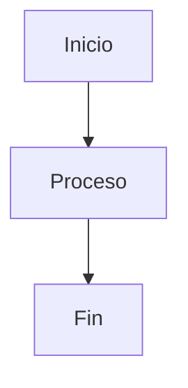

# 📚 Documentación de Keiko Latam

Este directorio contiene toda la documentación de Keiko Latam, una plataforma de colaboración educativa descentralizada que transforma el aprendizaje en capital humano verificable mediante blockchain.

## 🎯 Propósito

La documentación de Keiko Latam está diseñada para:

- **👥 Educadores**: Aprender cómo usar la plataforma para monetizar su conocimiento
- **🎓 Estudiantes**: Entender cómo construir su Pasaporte de Aprendizaje de Vida
- **🏢 Instituciones**: Integrar sus LRS existentes con Keiko
- **👨‍💻 Desarrolladores**: Contribuir al desarrollo de la plataforma

## 🏗️ Estructura de la Documentación

```
docs/
├── mkdocs.yml                    # Configuración de Material for MkDocs
├── requirements.txt              # Dependencias Python
├── index.md                      # Página principal
├── getting-started/              # Guías de inicio
│   ├── installation.md          # Instalación detallada
│   ├── quick-setup.md           # Configuración rápida
│   └── first-steps.md           # Primeros pasos
├── architecture/                 # Documentación de arquitectura
│   ├── overview.md              # Visión general
│   ├── layers.md                # Capas del sistema
│   ├── data-flow.md             # Flujo de datos
│   └── keikochain.md            # Detalles de Keikochain
├── development/                  # Guías de desarrollo
│   ├── gitflow.md               # GitFlow workflow
│   ├── local-setup.md           # Configuración local
│   ├── testing.md               # Testing
│   └── contributing.md          # Contribuir al proyecto
├── api/                          # Referencia de APIs
│   ├── graphql.md               # GraphQL API
│   ├── rest.md                  # REST endpoints
│   ├── grpc.md                  # gRPC Gateway
│   └── cairo.md                 # Contratos Cairo
├── guides/                       # Guías de usuario
│   ├── proof-of-humanity.md     # Proof of Humanity
│   ├── learning-interactions.md # Interacciones de aprendizaje
│   ├── marketplace.md           # Marketplace
│   └── governance.md            # Gobernanza
├── deployment/                   # Guías de despliegue
│   ├── ovhcloud.md              # OVHCloud Kubernetes
│   ├── cicd.md                  # CI/CD Pipeline
│   ├── monitoring.md            # Monitoreo
│   └── troubleshooting.md       # Resolución de problemas
├── specifications/               # Especificaciones técnicas
│   ├── requirements.md          # Requerimientos
│   ├── design.md                # Diseño
│   └── tasks.md                 # Tareas
├── community/                    # Información de la comunidad
│   ├── code-of-conduct.md       # Código de conducta
│   ├── contributors.md          # Contribuidores
│   └── support.md               # Soporte
├── stylesheets/                  # Estilos personalizados
│   ├── keiko-custom.css         # Estilos personalizados
│   └── keiko-theme.css          # Tema personalizado
└── javascripts/                  # JavaScript personalizado
    └── keiko-custom.js          # Funcionalidades interactivas
```

## 🚀 Características de la Documentación

### ✨ Material for MkDocs

- **🎨 Tema dinámico**: Modo claro y oscuro automático
- **📱 Responsive**: Optimizado para móviles y tablets
- **🔍 Búsqueda avanzada**: Búsqueda en tiempo real
- **📊 Diagramas**: Soporte para Mermaid y otros diagramas
- **📝 Sintaxis destacada**: Resaltado de código para múltiples lenguajes

### 🎯 Características Específicas de Keiko

- **🎓 Tema educativo**: Colores y estilos adaptados al sector educativo
- **🔐 Secciones de seguridad**: Documentación detallada de Proof-of-Humanity
- **🏗️ Arquitectura visual**: Diagramas de la arquitectura híbrida
- **⚡ Guías rápidas**: Setup en menos de 10 minutos
- **🤝 Comunidad**: Enlaces a Discord, GitHub y redes sociales

## 🛠️ Desarrollo Local de la Documentación

### Prerrequisitos

- Python 3.11+
- pip (gestor de paquetes de Python)

### Instalación

```bash
# Clonar el repositorio
git clone https://github.com/keikolatam/dapp-monorepo.git
cd dapp-monorepo

# Instalar dependencias
pip install -r docs/requirements.txt

# Servir documentación localmente
cd docs
mkdocs serve
```

### Comandos Disponibles

```bash
# Servir localmente
mkdocs serve

# Construir documentación
mkdocs build

# Desplegar a GitHub Pages
mkdocs gh-deploy

# Validar configuración
mkdocs config
```

## 🌐 Despliegue Automático

La documentación se despliega automáticamente a GitHub Pages cuando:

- **Push a `main`**: Despliegue a producción
- **Push a `develop`**: Despliegue a desarrollo
- **Pull Request**: Validación automática

### URLs de Acceso

- **Producción**: https://keikolatam.github.io/dapp-monorepo
- **Desarrollo**: https://keikolatam.github.io/dapp-monorepo/develop

## 📝 Contribuir a la Documentación

### 1. Estructura de Archivos

- **Markdown**: Todos los archivos están en formato Markdown
- **Naming**: Usar kebab-case para nombres de archivos
- **Organización**: Seguir la estructura de directorios existente

### 2. Estilo de Escritura

- **Español**: Toda la documentación está en español
- **Claro y conciso**: Evitar jerga técnica innecesaria
- **Ejemplos prácticos**: Incluir ejemplos de código cuando sea posible
- **Enlaces relevantes**: Conectar conceptos relacionados

### 3. Elementos Visuales

```markdown
# Usar admonitions para destacar información importante
!!! tip "Consejo útil"
    Este es un consejo importante para los usuarios.

!!! warning "Advertencia"
    Esta es una advertencia sobre algo crítico.

# Usar tabs para organizar contenido
=== "Opción 1"
    Contenido de la primera opción

=== "Opción 2"
    Contenido de la segunda opción

# Usar diagramas Mermaid

```

### 4. Metadatos

Cada archivo debe incluir metadatos al final:

```markdown
---

*Última actualización: {{ git_revision_date_localized }}*
```

## 🔧 Personalización

### Estilos CSS

Los estilos personalizados se encuentran en:
- `stylesheets/keiko-custom.css`: Estilos principales
- `stylesheets/keiko-theme.css`: Tema personalizado

### JavaScript

Las funcionalidades interactivas están en:
- `javascripts/keiko-custom.js`: Funcionalidades personalizadas

### Configuración

La configuración principal está en `mkdocs.yml` con:
- Tema Material personalizado
- Plugins y extensiones
- Navegación estructurada
- Variables de configuración

## 📊 Métricas y Analytics

La documentación incluye:
- **Google Analytics**: Para métricas de uso
- **Git revision dates**: Fechas de última actualización
- **Git committers**: Información de contribuidores
- **Search analytics**: Métricas de búsqueda

## 🆘 Soporte

Si tienes problemas con la documentación:

- **🐛 Issues**: [GitHub Issues](https://github.com/keikolatam/dapp-monorepo/issues)
- **💬 Discord**: [#documentation](https://discord.gg/keikolatam)
- **📧 Email**: [docs@keikolatam.app](mailto:docs@keikolatam.app)

## 📄 Licencia

La documentación está licenciada bajo **Creative Commons Attribution 4.0 International License**.

---

*Esta documentación es mantenida por la comunidad de Keiko Latam. Última actualización: {{ git_revision_date_localized }}*