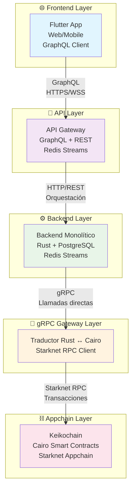
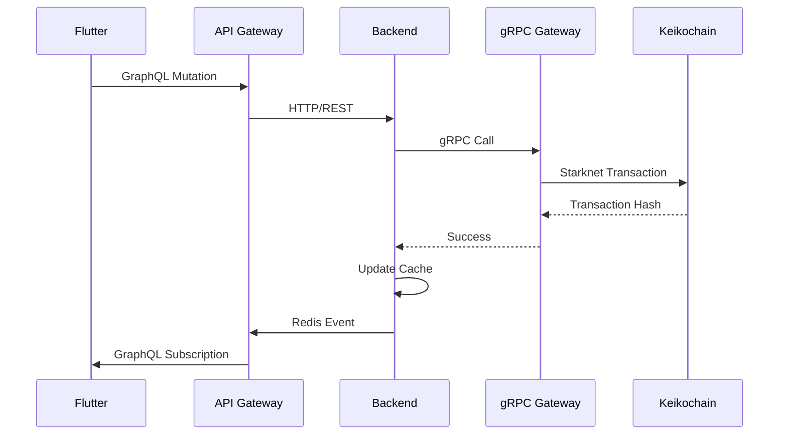
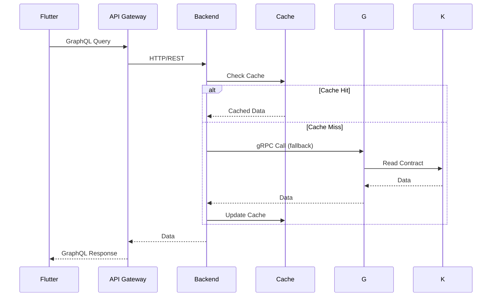
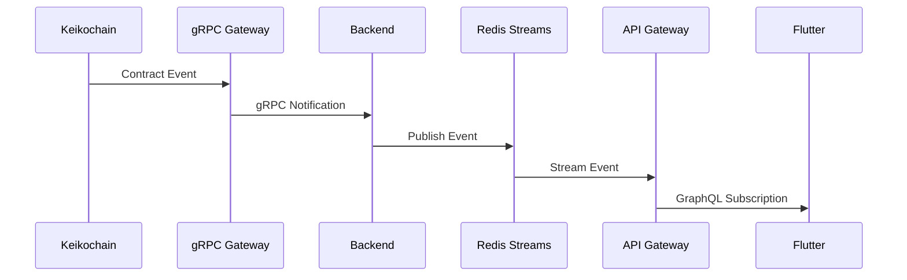
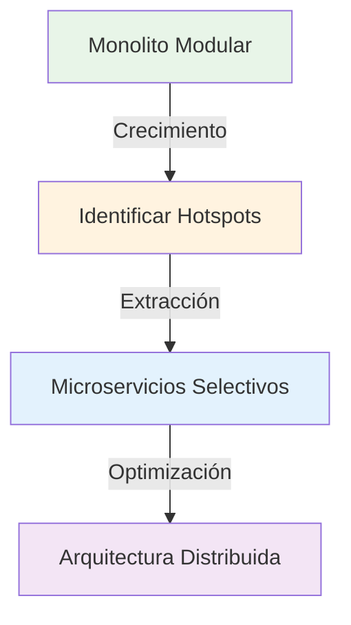

# 🏗️ Arquitectura de Keiko Latam

Esta sección explica la arquitectura híbrida de Keiko Latam, una plataforma de colaboración educativa descentralizada que combina blockchain con aplicaciones tradicionales.

## 🎯 Visión General

Keiko utiliza una **arquitectura híbrida de 5 capas** que combina las ventajas de blockchain (inmutabilidad, consenso, descentralización) con la simplicidad de una aplicación monolítica modular (desarrollo más rápido, debugging más fácil).



---

## 🏛️ Principios de Diseño

### 1. **Híbrido por Diseño**
- **Blockchain** para datos críticos (interacciones de aprendizaje, proof-of-humanity)
- **Aplicación tradicional** para funcionalidades complejas (UI, lógica de negocio, cache)

### 2. **Modular pero Monolítico**
- **Módulos independientes** por dominio de negocio
- **Aplicación monolítica** para simplicidad de desarrollo
- **Preparado para microservicios** cuando sea necesario

### 3. **Event-Driven Architecture**
- **Redis Streams** para eventos entre módulos
- **GraphQL Subscriptions** para tiempo real
- **Desacoplamiento** entre componentes

### 4. **Proof-of-Humanity**
- **Verificación criptográfica** de humanidad
- **Privacidad preservada** con zkProofs
- **Recuperación de identidad** sin pérdida de historial

---

## 🌐 Frontend Layer

### Flutter Multiplataforma

```dart
// Ejemplo de uso de GraphQL desde Flutter
final result = await client.query(
  QueryOptions(document: gql('''
    query GetUserPassport($userId: ID!) {
      user(id: $userId) {
        passport {
          interactions { id, timestamp, content }
          reputation { current, historical }
        }
      }
    }
  '''))
);
```

**Características:**
- ✅ **Multiplataforma**: Web, iOS, Android
- ✅ **GraphQL nativo**: Cliente GraphQL integrado
- ✅ **Tiempo real**: Subscriptions WebSocket
- ✅ **Offline-first**: Cache local con sincronización
- ✅ **UI nativa**: Componentes optimizados por plataforma

---

## 🔌 API Layer

### GraphQL + REST Gateway

```rust
// API Gateway orquesta llamadas HTTP al backend
async fn get_user_passport(ctx: &Context, user_id: String) -> Result<Passport> {
    let (passport_data, reputation_data) = tokio::join!(
        ctx.http_client.get(&format!("/api/passport/{}", user_id)),
        ctx.http_client.get(&format!("/api/reputation/{}", user_id))
    );

    Ok(Passport {
        data: passport_data?.json().await?,
        reputation: reputation_data?.json().await?,
    })
}
```

**Características:**
- ✅ **GraphQL unificado**: API única para frontend
- ✅ **REST endpoints**: Para integración con LRS externos
- ✅ **WebSocket Secure**: GraphQL subscriptions
- ✅ **Orquestación**: Agrega datos de múltiples módulos
- ✅ **Cache inteligente**: Invalida según eventos Redis

---

## ⚙️ Backend Layer

### Aplicación Monolítica Modular

```
backend/modules/
├── identity/           # Autenticación, usuarios, Proof-of-Humanity
├── learning/           # xAPI statements, interacciones atómicas
├── reputation/         # Sistema de calificaciones y reputación
├── passport/           # Agregación de pasaportes de aprendizaje
├── governance/         # Gobernanza comunitaria y estándares
├── marketplace/        # Tutores, espacios, transacciones
└── selfstudy_guides/  # Guías de auto-estudio adaptativas
```

**Ventajas del Monolito Modular:**
- 🚀 **Desarrollo rápido**: Una sola aplicación
- 🔧 **Debugging fácil**: Stack traces completos
- 📦 **Deploy simple**: Un solo binario
- 💰 **Recursos limitados**: Una base de datos
- 🔄 **Comunicación directa**: Llamadas de función

---

## 🌉 gRPC Gateway Layer

### Traductor Rust ↔ Cairo

```rust
// gRPC Gateway traduce llamadas Rust a transacciones Cairo
impl LearningService for GrpcGateway {
    async fn create_interaction(&self, interaction: Interaction) -> Result<String> {
        // 1. Traducir tipos Rust → Cairo
        let cairo_data = self.translator.rust_to_cairo(interaction)?;
        
        // 2. Preparar calldata para Cairo contract
        let calldata = self.prepare_calldata(cairo_data)?;
        
        // 3. Enviar transacción a Keikochain
        let tx_hash = self.starknet_client
            .invoke_contract(
                self.learning_contract_address,
                "create_interaction",
                calldata
            )
            .await?;
            
        Ok(tx_hash)
    }
}
```

**Características:**
- ✅ **Traducción automática**: Tipos Rust ↔ Cairo
- ✅ **Batching**: Agrupa transacciones para eficiencia
- ✅ **Retry logic**: Manejo de errores transitorios
- ✅ **Circuit breakers**: Protección contra fallos

---

## ⛓️ Appchain Layer

### Keikochain (Starknet Appchain)

```cairo
// Contrato Cairo para interacciones de aprendizaje
#[contract]
mod learning_interactions {
    use starknet::ContractAddress;
    use starknet::get_caller_address;
    
    #[storage]
    struct Storage {
        interactions: Map<(felt252, felt252), Interaction>,
        humanity_proofs: Map<felt252, felt252>,
    }
    
    #[external(v0)]
    fn create_interaction(
        ref self: ContractState,
        interaction: Interaction,
        humanity_signature: felt252
    ) -> bool {
        // Verificar proof-of-humanity
        let caller = get_caller_address();
        assert(self.humanity_proofs.read(caller) == humanity_signature);
        
        // Almacenar interacción
        self.interactions.write(caller, interaction.timestamp, interaction);
        
        true
    }
}
```

**Características:**
- ✅ **Cairo nativo**: Optimizado para Starknet
- ✅ **Pruebas STARK**: Verificación de humanidad
- ✅ **Inmutabilidad**: Datos verificables
- ✅ **Escalabilidad**: L2 de Ethereum

---

## 📊 Flujos de Datos

### 1. **Escritura de Datos Críticos**



### 2. **Lectura de Datos**



### 3. **Tiempo Real**



---

## 🔐 Seguridad y Privacidad

### Proof-of-Humanity con zkProofs

```mermaid
graph LR
    A[Usuario] -->|Datos Biométricos| B[Procesamiento Off-chain]
    B -->|iris_hash + genome_hash + salt| C[humanity_proof_key]
    C -->|SHA-256| D[Composite Key]
    D -->|Prueba STARK| E[Verificación en Blockchain]
    E -->|Firma Ed25519| F[Interacciones Firmadas]
    
    style A fill:#e3f2fd
    style B fill:#fff3e0
    style C fill:#e8f5e8
    style D fill:#fce4ec
    style E fill:#f3e5f5
    style F fill:#e1f5fe
```



**Características de Seguridad:**
- 🔒 **Datos biométricos off-chain**: Nunca se almacenan en blockchain
- 🔑 **humanity_proof_key única**: Derivada de iris + genoma + salt
- ✅ **Pruebas STARK**: Verificación sin exponer datos
- 🔄 **Recuperación de identidad**: Sin pérdida de historial
- 🛡️ **Anti-Sybil**: Previene múltiples identidades

---

## 📈 Escalabilidad

### Estrategia de Escalado

| Componente | Escalado | Estrategia |
|------------|----------|------------|
| **Frontend** | Horizontal | CDN + Edge caching |
| **API Gateway** | Horizontal | Load balancer + replicas |
| **Backend** | Vertical → Horizontal | Monolito → Microservicios |
| **gRPC Gateway** | Horizontal | Múltiples instancias |
| **Keikochain** | L2 | Starknet Appchain |

### Migración Futura



---

## 🔧 Herramientas y Tecnologías

### Stack Tecnológico

| Capa | Tecnologías | Propósito |
|------|-------------|-----------|
| **Frontend** | Flutter, Dart, GraphQL | UI multiplataforma |
| **API** | Rust, Axum, GraphQL, WebSocket | Gateway unificado |
| **Backend** | Rust, PostgreSQL, Redis | Lógica de negocio |
| **Gateway** | Rust, gRPC, Starknet RPC | Traducción Rust↔Cairo |
| **Blockchain** | Cairo, Starknet, STARKs | Datos inmutables |

### Herramientas de Desarrollo

- **🐳 Podman**: Containerización (Docker también soportado)
- **☸️ Kubernetes**: Orquestación
- **🔄 GitFlow**: Flujo de trabajo
- **🚀 GitHub Actions**: CI/CD
- **📊 Prometheus**: Monitoreo
- **📈 Grafana**: Dashboards

---

## 🎯 Beneficios de la Arquitectura

### ✅ Ventajas

1. **🚀 Desarrollo Rápido**: Monolito modular acelera desarrollo
2. **🔒 Seguridad Blockchain**: Datos críticos inmutables
3. **⚡ Performance**: Cache local + blockchain cuando necesario
4. **🔧 Debugging Fácil**: Stack traces completos
5. **💰 Costo-Efectivo**: Una base de datos, recursos compartidos
6. **🔄 Flexibilidad**: Preparado para microservicios
7. **🌐 Interoperabilidad**: Estándares abiertos (xAPI, GraphQL)

### ⚠️ Consideraciones

1. **📊 Monitoreo Complejo**: Múltiples capas a observar
2. **🔧 Debugging Distribuido**: Logs en múltiples sistemas
3. **📈 Escalado Gradual**: Migración planificada a microservicios
4. **🎓 Curva de Aprendizaje**: Múltiples tecnologías

---

## 🚀 Próximos Pasos

1. **📖 Capas detalladas**: [Layers del sistema](layers.md)
2. **📊 Flujo de datos**: [Data flow](data-flow.md)
3. **⛓️ Keikochain**: [Appchain details](keikochain.md)
4. **🔧 Desarrollo**: [Configuración local](../development/local-setup.md)

---

*Última actualización: {{ git_revision_date_localized }}*
