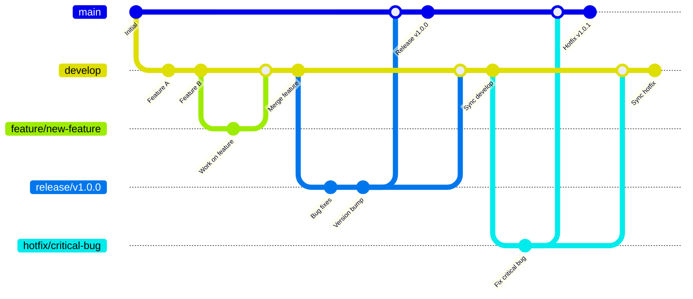

# 🔄 GitFlow para Keiko Latam

Esta guía explica cómo usar GitFlow en el proyecto Keiko Latam para un flujo de trabajo de desarrollo organizado y eficiente.

## 🎯 ¿Qué es GitFlow?

GitFlow es un modelo de ramificación que define un estricto modelo de ramas diseñado alrededor del lanzamiento del proyecto. Proporciona un marco robusto para gestionar proyectos grandes con múltiples desarrolladores.

### 🌳 Estructura de Ramas



---

## 🚀 Configuración Inicial

### 1. Instalar GitFlow

=== "🐧 Ubuntu/Debian"

    ```bash
    sudo apt install -y git-flow
    ```

=== "🍎 macOS"

    ```bash
    brew install git-flow
    ```

=== "🔧 Script Automático"

    ```bash
    # Usar el script de configuración de Keiko
    ./scripts/gitflow-setup.sh install
    ```

### 2. Configurar GitFlow en el Repositorio

```bash
# Ejecutar desde la raíz del proyecto
./scripts/gitflow-setup.sh configure
```

Esto configurará:
- ✅ Rama `develop` desde `main`
- ✅ Configuración de nombres de ramas personalizados
- ✅ Estructura GitFlow completa

---

## 📋 Flujo de Trabajo por Tipo de Branch

### 🌟 Feature Branches

Para desarrollar nuevas funcionalidades:

```bash
# Iniciar nueva feature
git flow feature start nueva-funcionalidad

# Trabajar en la feature
echo "Nueva funcionalidad" >> archivo.txt
git add .
git commit -m "feat: agregar nueva funcionalidad"

# Finalizar feature (merge a develop)
git flow feature finish nueva-funcionalidad
```

**Convenciones de naming:**
- `feature/auth-system`
- `feature/marketplace-ui`
- `feature/proof-of-humanity`

### 🚀 Release Branches

Para preparar releases:

```bash
# Iniciar release
git flow release start 1.0.0

# Hacer ajustes finales
echo "v1.0.0" > VERSION
git add VERSION
git commit -m "chore: bump version to 1.0.0"

# Finalizar release (merge a main y develop)
git flow release finish 1.0.0
```

**Convenciones de naming:**
- `release/1.0.0`
- `release/2.1.0`
- `release/v1.2.3`

### 🚨 Hotfix Branches

Para correcciones urgentes en producción:

```bash
# Iniciar hotfix
git flow hotfix start 1.0.1

# Corregir el problema
echo "Fix critical bug" >> archivo.txt
git add .
git commit -m "fix: corregir bug crítico en autenticación"

# Finalizar hotfix (merge a main y develop)
git flow hotfix finish 1.0.1
```

**Convenciones de naming:**
- `hotfix/critical-security-fix`
- `hotfix/database-connection`
- `hotfix/1.0.1`

---

## 🔄 Mapeo de Branches a Entornos

| Branch | Entorno | Propósito |
|--------|---------|-----------|
| `main` | **production** | Código estable en producción |
| `develop` | **development** | Desarrollo activo |
| `qa` | **qa** | Testing de calidad |
| `staging` | **staging** | Preparación para producción |
| `release/*` | **staging** | Testing de release candidate |
| `hotfix/*` | **production** | Correcciones urgentes |

---

## 🤖 Automatización CI/CD

### GitHub Actions Workflow

El proyecto incluye un workflow automatizado que se ejecuta según el tipo de branch:

=== "Feature Branch"

    ```yaml
    # .github/workflows/gitflow.yml
    feature-test:
      if: startsWith(github.ref, 'refs/heads/feature/')
      runs-on: ubuntu-latest
      steps:
        - name: Ejecutar tests
          run: cargo test --workspace
        - name: Linting
          run: cargo clippy -- -D warnings
    ```

=== "Develop Branch"

    ```yaml
    develop-deploy:
      if: github.ref == 'refs/heads/develop'
      runs-on: ubuntu-latest
      environment: development
      steps:
        - name: Deploy a desarrollo
          run: kubectl apply -f k8s/dev/
    ```

=== "Release Branch"

    ```yaml
    release-test:
      if: startsWith(github.ref, 'refs/heads/release/')
      runs-on: ubuntu-latest
      environment: staging
      steps:
        - name: Tests de integración
          run: cargo test --workspace --release
        - name: Deploy a staging
          run: kubectl apply -f k8s/staging/
    ```

=== "Main Branch"

    ```yaml
    production-deploy:
      if: github.ref == 'refs/heads/main'
      runs-on: ubuntu-latest
      environment: production
      steps:
        - name: Deploy a producción
          run: kubectl apply -f k8s/prod/
    ```

---

## 📝 Convenciones de Commits

### Estructura de Commits

```
<tipo>(<alcance>): <descripción>

[body opcional]

[footer opcional]
```

### Tipos de Commits

| Tipo | Descripción | Ejemplo |
|------|-------------|---------|
| `feat` | Nueva funcionalidad | `feat(auth): agregar autenticación FIDO2` |
| `fix` | Corrección de bug | `fix(db): corregir conexión PostgreSQL` |
| `docs` | Documentación | `docs(api): actualizar documentación GraphQL` |
| `style` | Formato, espacios | `style(frontend): aplicar prettier` |
| `refactor` | Refactorización | `refactor(backend): optimizar módulo identity` |
| `test` | Tests | `test(contracts): agregar tests Cairo` |
| `chore` | Tareas de mantenimiento | `chore(deps): actualizar dependencias` |

### Ejemplos de Commits

```bash
# Feature
git commit -m "feat(marketplace): implementar sistema de reputación bidireccional"

# Fix
git commit -m "fix(auth): corregir validación de humanity_proof_key"

# Breaking change
git commit -m "feat(api)!: cambiar endpoint GraphQL de /graphql a /api/graphql

BREAKING CHANGE: El endpoint GraphQL ahora requiere autenticación JWT"

# Multi-línea
git commit -m "feat(blockchain): implementar contrato LifeLearningPassport

- Agregar storage para interacciones de aprendizaje
- Implementar verificación de firma Ed25519
- Añadir eventos para auditoría

Closes #123"
```

---

## 🏷️ Versionado Semántico

### Formato de Versiones

```
MAJOR.MINOR.PATCH
```

- **MAJOR**: Cambios incompatibles en la API
- **MINOR**: Nueva funcionalidad compatible
- **PATCH**: Correcciones de bugs compatibles

### Ejemplos

```
1.0.0  # Primera versión estable
1.1.0  # Nueva funcionalidad
1.1.1  # Corrección de bug
2.0.0  # Cambio mayor (breaking change)
```

### Automatización de Versionado

```bash
# En release branch
git flow release start 1.2.0

# El CI/CD automáticamente:
# 1. Actualiza VERSION
# 2. Genera CHANGELOG.md
# 3. Crea tag v1.2.0
# 4. Despliega a staging

git flow release finish 1.2.0
```

---

## 🔧 Scripts de Utilidad

### Scripts Disponibles

```bash
# Configuración
./scripts/gitflow-setup.sh install     # Instalar git-flow
./scripts/gitflow-setup.sh configure   # Configurar GitFlow
./scripts/gitflow-setup.sh status      # Ver estado actual

# Utilidades
./scripts/create-release.sh 1.2.0      # Crear release
./scripts/create-hotfix.sh critical    # Crear hotfix
./scripts/sync-branches.sh             # Sincronizar ramas
```

### Comandos Make

```bash
# GitFlow
make gitflow-setup                     # Configurar GitFlow
make gitflow-status                    # Ver estado
make create-release VERSION=1.2.0     # Crear release
make create-hotfix NAME=critical       # Crear hotfix

# Desarrollo
make dev-setup                         # Setup completo
make test-all                          # Ejecutar todos los tests
make lint-all                          # Linting completo
```

---

## 🚨 Mejores Prácticas

### ✅ Hacer

- **Usar nombres descriptivos** para branches
- **Hacer commits pequeños y frecuentes**
- **Escribir mensajes de commit claros**
- **Hacer merge requests para review**
- **Mantener `main` siempre estable**
- **Sincronizar `develop` regularmente**

### ❌ Evitar

- **Commits directos a `main`**
- **Merge sin review de código**
- **Branches largos sin merge**
- **Commits sin mensaje descriptivo**
- **Saltarse tests en CI/CD**

---

## 🔍 Troubleshooting

### Problemas Comunes

=== "❌ Error: 'git-flow' no encontrado"

    ```bash
    # Instalar git-flow
    ./scripts/gitflow-setup.sh install
    
    # Verificar instalación
    git flow version
    ```

=== "❌ Error: Branch 'develop' no existe"

    ```bash
    # Crear branch develop
    git checkout -b develop
    git push -u origin develop
    
    # Reconfigurar GitFlow
    ./scripts/gitflow-setup.sh configure
    ```

=== "❌ Error: Merge conflicts"

    ```bash
    # Resolver conflictos
    git status
    # Editar archivos con conflictos
    git add .
    git commit -m "resolve: merge conflicts"
    
    # Continuar con GitFlow
    git flow feature finish feature-name
    ```

=== "❌ Error: Branch protection rules"

    ```bash
    # Verificar reglas en GitHub
    # Usar Pull Requests en lugar de push directo
    git push origin feature/nueva-funcionalidad
    # Crear PR desde GitHub UI
    ```

---

## 📚 Recursos Adicionales

- 📖 **Documentación oficial**: [GitFlow Workflow](https://www.atlassian.com/es/git/tutorials/comparing-workflows/gitflow-workflow)
- 🎥 **Video tutorial**: [GitFlow Explained](https://www.youtube.com/watch?v=1SXpE08hvGs)
- 📝 **Conventional Commits**: [conventionalcommits.org](https://www.conventionalcommits.org/)
- 🏷️ **Semantic Versioning**: [semver.org](https://semver.org/)

---

## 🆘 Soporte

Si tienes problemas con GitFlow:

- 📖 **Documentación**: Revisa esta guía
- 🐛 **Issues**: Reporta en [GitHub Issues](https://github.com/keikolatam/dapp-monorepo/issues)
- 💬 **Discord**: Pregunta en [#gitflow](https://discord.gg/keikolatam)
- 📧 **Email**: [dev@keikolatam.app](mailto:dev@keikolatam.app)

---

*Última actualización: {{ git_revision_date_localized }}*
