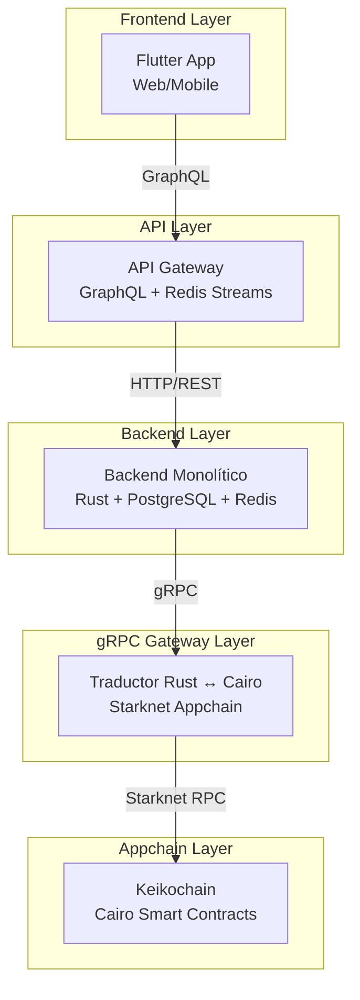

# 🎓 Keiko Latam - Plataforma de Colaboración Educativa Descentralizada

<div class="grid cards" markdown>

-   :material-account-group:{ .lg .middle } **Para Educadores**

    ---

    Libera tu potencial educativo sin intermediarios. Monetiza sesiones individuales o grupales y construye tu reputación verificable en blockchain.

    [:octicons-arrow-right-24: Guía para Educadores](guides/educators.md)

-   :material-school:{ .lg .middle } **Para Estudiantes**

    ---

    Construye tu Pasaporte de Aprendizaje de Vida inmutable. Demuestra tu conocimiento con evidencia verificable e infalsificable.

    [:octicons-arrow-right-24: Guía para Estudiantes](guides/students.md)

-   :material-domain:{ .lg .middle } **Para Instituciones**

    ---

    Integra tu LRS existente con Keiko. Transfiere automáticamente registros de aprendizaje al ecosistema blockchain.

    [:octicons-arrow-right-24: Guía de Integración](guides/integration.md)

-   :material-code-tags:{ .lg .middle } **Para Desarrolladores**

    ---

    Contribuye al futuro de la educación descentralizada. Arquitectura modular en Rust, contratos Cairo y frontend Flutter.

    [:octicons-arrow-right-24: Guía de Desarrollo](development/contributing.md)

</div>

---

## 🌟 ¿Qué es Keiko?

**Keiko** es una plataforma de colaboración educativa descentralizada (DApp) que transforma el aprendizaje en capital humano verificable mediante blockchain. La plataforma permite a cualquier individuo construir y demostrar su **Pasaporte de Aprendizaje de Vida (LifeLearningPassport)** en blockchain, mediante una sucesión de **interacciones de aprendizaje atómicas (LearningInteractions)** compatibles con el estándar [xAPI (Tin Can)](https://xapi.com/).

### 🎯 Propósito y Objetivo

**El propósito de Keiko** es estandarizar el mecanismo de verificación de adquisición de conocimientos a escala Latinoamérica, sin importar el país de origen ni la condición socioeconómica de cada estudiante, para poder dejar obsoletas las certificaciones tradicionales y **priorizar el encadenamiento de las evidencias de aprendizaje** sobre la ***confianza ciega*** en actores educativos.

**El objetivo principal** es lograr que sea imposible adulterar cualquier evidencia de los estudios de cualquier ser humano a través de su vida, para esto se requiere que las interacciones de aprendizaje sean:

- ✅ **Almacenadas de forma descentralizada**
- ✅ **Públicamente verificables** por múltiples actores
- ✅ **Inmutables e infalsificables**

### 🏛️ Los Cuatro Pilares de Keiko

<div class="grid cards" markdown>

-   :material-currency-usd:{ .lg .middle } **Libertad Económica**

    Los educadores pueden escoger monetizar sesiones individuales o grupales sin intermediarios.

-   :material-vote:{ .lg .middle } **Democracia Participativa**

    Los aprendices califican la calidad del conocimiento adquirido y de sus pares.

-   :material-share-variant:{ .lg .middle } **Descentralización**

    Las comunidades regulan sus propios estándares y métodos de validación.

-   :material-cog:{ .lg .middle } **Auto-determinación**

    Cada red o nodo puede establecer su propia gobernanza educativa.

</div>

---

## 🏗️ Arquitectura Híbrida

Keiko utiliza una arquitectura híbrida de 5 capas que combina las ventajas de blockchain con la simplicidad de una aplicación monolítica modular:



### 📊 Flujos de Datos

- **📝 Escritura**: Flutter → GraphQL → HTTP/REST → Backend → gRPC Gateway → Keikochain Contract → Evento Redis → GraphQL Subscription
- **📖 Lectura**: Flutter → GraphQL → HTTP/REST → Backend → Cache PostgreSQL → (fallback) gRPC Gateway → Keikochain Contract
- **⚡ Tiempo Real**: Keikochain Contract → gRPC Gateway → Backend → Redis Streams → API Gateway → GraphQL Subscription → Flutter
- **📥 Importación**: LRS Externos → REST Webhooks → API Gateway → HTTP/REST → Backend → gRPC Gateway → Keikochain Contract

---

## 🔐 Proof-of-Humanity con zkProofs

Keiko implementa un sistema único de **Proof-of-Humanity** que garantiza que cada interacción de aprendizaje proviene de una persona humana real, sin comprometer la privacidad de los datos biométricos:

### 🛡️ Características de Seguridad

- **🔒 Autenticación Biométrica Off-Chain**: Procesamiento de iris (Gabor filters) y genoma (SNPs en VCF/FASTA)
- **🔑 Composite Key**: `sha256(iris_hash || genoma_hash || salt)` generada off-chain
- **🔐 Privacidad**: Los datos biométricos originales nunca se almacenan en blockchain
- **✅ Verificación con Pruebas STARK**: STARKs para verificar humanidad sin exponer datos
- **🔄 Recuperación de Identidad**: Los usuarios pueden recuperar su identidad de aprendizaje con la misma humanity_proof_key

---

## 🚀 Empezar Ahora

!!! tip "¿Nuevo en Keiko?"
    
    Si es tu primera vez con Keiko, te recomendamos seguir nuestra guía de [**Instalación rápida**](getting-started/quick-setup.md) para tener todo funcionando en menos de 10 minutos.

### Opciones de Instalación

=== "🐧 Linux / WSL2"

    ```bash
    # Clonar el repositorio
    git clone https://github.com/keikolatam/dapp-monorepo.git
    cd dapp-monorepo
    
    # Configuración rápida
    make dev-setup
    ```

=== "🍎 macOS"

    ```bash
    # Instalar dependencias con Homebrew
    brew install rust cairo flutter docker
    
    # Configuración rápida
    make dev-setup
    ```

=== "🐳 Docker"

    ```bash
    # Usar Docker Compose para desarrollo
    docker-compose up -d
    ```

---

## 📈 Estado del Desarrollo

<div class="grid cards" markdown>

-   :material-blockchain:{ .lg .middle } **Keikochain Layer**

    ---

    **🔄 Reiniciando** - Contratos Cairo en Starknet Appchain

    - [ ] Configuración base Cairo/Starknet
    - [ ] Contrato Proof-of-Humanity
    - [ ] Contrato Learning Interactions
    - [ ] Contrato Life Learning Passport

    [:octicons-arrow-right-24: Ver progreso](architecture/keikochain.md)

-   :material-server:{ .lg .middle } **Backend Layer**

    ---

    **🚧 En Desarrollo** - Aplicación monolítica modular en Rust

    - [ ] Módulo de Identidad
    - [ ] Módulo Proof-of-Humanity
    - [ ] Módulo de Aprendizaje
    - [ ] Módulo de Reputación

    [:octicons-arrow-right-24: Ver progreso](architecture/layers.md)

-   :material-api:{ .lg .middle } **API Gateway**

    ---

    **📋 Pendiente** - GraphQL + REST endpoints

    - [ ] Servidor GraphQL
    - [ ] Panel Admin Leptos
    - [ ] Integración LRS

    [:octicons-arrow-right-24: Ver progreso](api/graphql.md)

-   :material-cellphone:{ .lg .middle } **Frontend**

    ---

    **📋 Pendiente** - Aplicación Flutter multiplataforma

    - [ ] Aplicación Flutter
    - [ ] Visualización cronológica
    - [ ] Marketplace móvil

    [:octicons-arrow-right-24: Ver progreso](development/contributing.md)

</div>

---

## 🤝 Únete a la Comunidad

<div class="grid cards" markdown>

-   :material-github:{ .lg .middle } **GitHub**

    ---

    Código fuente, issues y contribuciones

    [:octicons-arrow-right-24: Visitar GitHub](https://github.com/keikolatam/dapp-monorepo)

-   :material-discord:{ .lg .middle } **Discord**

    ---

    Comunidad activa de desarrolladores y educadores

    [:octicons-arrow-right-24: Unirse a Discord](https://discord.gg/keikolatam)

-   :material-twitter:{ .lg .middle } **Twitter**

    ---

    Últimas noticias y actualizaciones del proyecto

    [:octicons-arrow-right-24: Seguir en Twitter](https://twitter.com/keikolatam)

-   :material-linkedin:{ .lg .middle } **LinkedIn**

    ---

    Red profesional y oportunidades de colaboración

    [:octicons-arrow-right-24: Conectar en LinkedIn](https://linkedin.com/company/keikolatam)

</div>

---

## 📄 Licencia

Este proyecto está licenciado bajo **Business Source License 1.1**. Ver [LICENSE](https://github.com/keikolatam/dapp-monorepo/blob/main/LICENSE) para más detalles.

---

<div class="grid cards" markdown>

-   :material-home:{ .lg .middle } **Homepage**

    ---

    [http://keiko-dapp.xyz/](http://keiko-dapp.xyz/)

-   :material-book-open:{ .lg .middle } **Documentación**

    ---

    [docs/](https://github.com/keikolatam/dapp-monorepo/tree/main/docs)

-   :material-file-document:{ .lg .middle } **Especificaciones**

    ---

    [.kiro/specs/](https://github.com/keikolatam/dapp-monorepo/tree/main/.kiro/specs)

-   :material-link:{ .lg .middle } **Enlaces Útiles**

    ---

    - [Starknet](https://starknet.io/)
    - [Cairo](https://cairo-lang.org/)
    - [xAPI](https://xapi.com/)

</div>

---

*Última actualización: {{ git_revision_date_localized }}*
